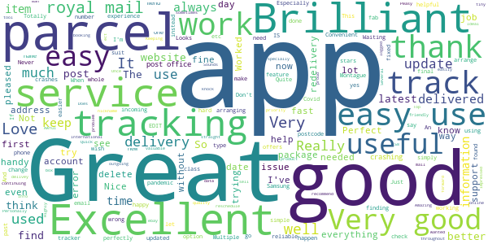
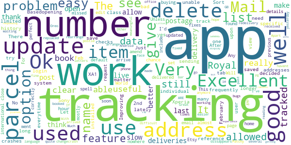
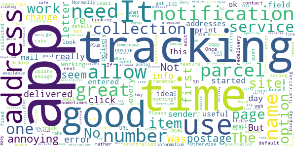
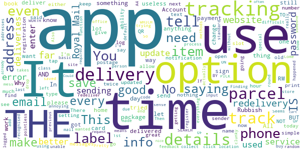
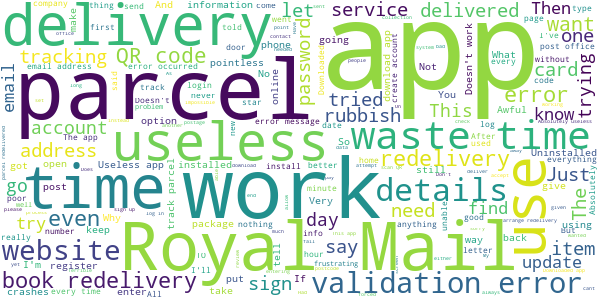

# Royal Mail - Tracking, redelivery, prices
App version ``7.1.1``

Analyzed with [covid-apps-observer](http://github.com/covid-apps-observer) project, version ``0.1``

## App overview
| | |
|-------------------------|-------------------------| 
| **Name**&nbsp;&nbsp;&nbsp;&nbsp;&nbsp;&nbsp;&nbsp;&nbsp;&nbsp;&nbsp;&nbsp;&nbsp;&nbsp;&nbsp;&nbsp;&nbsp;&nbsp;&nbsp;&nbsp;&nbsp;&nbsp;&nbsp;&nbsp;&nbsp;&nbsp;&nbsp;&nbsp;&nbsp;&nbsp;&nbsp;&nbsp;&nbsp;&nbsp;&nbsp;&nbsp;&nbsp;&nbsp;&nbsp;&nbsp;&nbsp;  | Royal Mail - Tracking, redelivery, prices |
| **Unique identifier** | com.royalmail.app.droid |
| **Link to Google Play** | [https://play.google.com/store/apps/details?id=com.royalmail.app.droid](https://play.google.com/store/apps/details?id=com.royalmail.app.droid) |
| **Summary**  | Easily manage your items and track your deliveries |
| **Privacy policy** | [https://www.royalmail.com/privacy-notice](https://www.royalmail.com/privacy-notice) |
| **Latest version** | 7.1.1 |
| **Last update** | 2021-02-26 13:23:20 |
| **Recent changes** | The latest version includes performance updates and improvements to features such as finding Royal Mail locations and services near you more easily. |
| **Installs**  | 1,000,000+ |
| **Category** | Lifestyle |
| **First release** | Sep 4, 2018 |
| **Size**  | 56M |
| **Supported Android version**  | 8.0 and up |

### Description
> 📦📦📦 With the Royal Mail App, you can:
 • Send an item - quickly and easily buy postage in just a few steps. You can print your labels at home or take the QR code on the app to a Royal Mail Customer Service Point/Delivery Office and we’ll print the label for you when you drop off your item.
 • Find your nearest drop off location - Postbox, Parcel Postbox, Post Office branch or Royal Mail Customer Service Point.
 • Track your items – just enter your tracking ID number or scan the barcode to check the progress of your deliveries (available with Royal Mail Tracked and Royal Mail Special Delivery Guaranteed items)
 • Find the size and format of your parcel using the Augmented Reality Parcel Sizer guide. Available with AR supported devices.
 •	Change your delivery options to suit you – You can now change where your parcel is delivered, to a Safeplace or neighbour after it has been sent. (available with Royal Mail Tracked items)
 •	Get proof of postage sent straight to your phone – get that extra peace of mind when dropping of at any of our locations (including our 24/7 Parcel Postboxes)
 • Postcode and address finder – if you’re not sure of a full address, or want to check a postcode, just enter part of the address and we’ll fill in the blanks
 • Find any Post Office locations or Customer Service Point/Delivery Office to print your label or drop off your item, with opening hours, address, map, available services and directions
 • Receive push notifications on your deliveries - never miss a delivery update
 • Save items you are tracking, and add an alias name making them easier to identify 
 • See a photograph of the signature if someone has signed for it, or the Safeplace an item has been delivered to
 • Book a Redelivery – if you’ve missed an item you can easily book a Redelivery to your address, your neighbour’s address or a local Post Office – and specify a delivery day
 • Save postage receipts – simply take a photo of your receipt and store it to the app
 • Track an item on the go - if you have Alexa, you can track your delivery by saying an alias name you have previously assigned to an item

### User interface
The developers of the app provide the following screenshots in the Google play store.
| | | |
|:-------------------------:|:-------------------------:|:-------------------------:|
 |   |   |   | 
 |   |   |   | 
 |  

## Development team
In the following we report the main information provided by the development team in the Google play store.

| | |
|-------------------------|-------------------------|
| **Developer**  | Royal Mail Group |
| **Website**  | [https://www.royalmail.com](https://www.royalmail.com) |
| **Email** | appfeedback@royalmail.com |
| **Physical address**  | - |
| **Other developed apps**  | [https://play.google.com/store/apps/developer?id=Royal+Mail+Group](https://play.google.com/store/apps/developer?id=Royal+Mail+Group) |

## Android support

| | |
|-------------------------|-------------------------|
| **Declared target Android version**  | - |
| **Effective target Android version**  | - |
| **Minimum supported Android version**  | Oreo, version 8.0.0 (API level 26) |
| **Maximum target Android version**  | - |

The larger the difference between the minimum and maximum supported Android versions, the better. A larger difference means a wider audience. For example, old phones have a very low Android version, so a high minimum supported Android version means that the app cannot be used by users with old phones, thus leading to accessibility problems. 

## Requested permissions

In the following we report the complete list of the permissions requested by the app. 

| **Permission** | **Protection level** | **Description** | 
|-------------------------|-------------------------|-------------------------|
 **android.permission ACCESS_FINE_LOCATION** | :warning:**Dangerous** | Allows an app to access precise location. 
 **android.permission ACCESS_NETWORK_STATE** | Normal | Allows applications to access information about networks. 
 **android.permission CAMERA** | :warning:**Dangerous** | Required to be able to access the camera device. 
 **android.permission INTERNET** | Normal | Allows applications to open network sockets. 
 **android.permission WAKE_LOCK** | Normal | Allows using PowerManager WakeLocks to keep processor from sleeping or screen from dimming. 
 **android.permission WRITE_EXTERNAL_STORAGE** | :warning:**Dangerous** | Allows an application to write to external storage. 
 **com.google.android.c2dm.permission RECEIVE** | - | - 
 **com.royalmail.app.droid.permission MAPS_RECEIVE** | - | - 

## Mentioned servers

| **Server** | **Registrant** | **Registrant country** | **Creation date** | 
|-------------------------|-------------------------|-------------------------|-------------------------|
 | google.com | Google LLC | :us: US | 1997-09-15 04:00:00 |
 | microsoft.com | Microsoft Corporation | :us: US | 1991-05-02 04:00:00 |
 | tealiumiq.com | Whois Privacy Service | :us: US | 2011-02-09 18:33:06 |
 | tiqcdn.com | Whois Privacy Service | :us: US | 2012-07-11 23:06:45 |
 | googleapis.com | Google LLC | :us: US | 2005-01-25 17:52:26 |

## Security analysis 

Below we report the main security warnings raised by our execution of the [Androwarn](https://github.com/maaaaz/androwarn) security analysis tool.

**Telephony identifiers leakage**
> - This application reads the ISO country code equivalent of the current registered operator's MCC (Mobile Country Code) 
> - This application reads the numeric name (MCC+MNC) of current registered operator 
> - This application reads the operator name 

**Connection interfaces exfiltration**
> - This application reads details about the currently active data network 
> - This application tries to find out if the currently active data network is metered 

**Suspicious connection establishment**
> - This application opens a Socket and connects it to the remote address '' on the 'N/A' port  
> - This application opens a Socket and connects it to the remote address 'Ljava/lang/StringBuilder;->toString()Ljava/lang/String;' on the 'N/A' port  
> - This application opens a Socket and connects it to the remote address 'Ljava/net/Proxy;->type()Ljava/net/Proxy$Type;' on the 'N/A' port  
> - This application opens a Socket and connects it to the remote address 'timeout' on the 'N/A' port  

**Code execution**
> - This application loads a native library: 'Ljava/lang/String;->valueOf(Ljava/lang/Object;)Ljava/lang/String;' 
> - This application loads a native library: 'arcore_sdk_jni' 
> - This application loads a native library: 'arsceneview_jni' 
> - This application loads a native library: 'filament-jni' 
> - This application loads a native library: 'mono-native' 
> - This application loads a native library: 'monodroid' 
> - This application loads a native library: 'monosgen-2.0' 
> - This application loads a native library: 'xamarin-app' 
> - This application loads a native library: 'xamarin-debug-app-helper' 

## User ratings and reviews

Below we provide information about how end users are reacting to the app in terms of ratings and reviews in the Google Play store.

### Ratings

The Royal Mail - Tracking, redelivery, prices app has been installed by more than **1000000** times. At this time, **3394** rated the app and its average score is **3.1812866**. Below we show the distribution of the ratings across the usual star-based rating of Google Play

:star::star::star::star::star:: 1420

:star::star::star::star:: 387

:star::star::star:: 168

:star::star:: 228

:star:: 1191

### Reviews 

#### 5-star reviews

> Never had a problem with them  :date: __2021-03-14 11:00:01__

> Amazing app for you sell on ebay ect and you track the items you can nickname the parcels  :date: __2021-03-13 10:05:47__

> Easy to use.  :date: __2021-03-12 18:53:48__

> Very good can keep track.  :date: __2021-03-10 11:02:52__

> Nice experience  :date: __2021-03-09 14:41:05__

> Very good quality 👌  :date: __2021-03-08 17:13:04__

> Very good app and so easy to use. Keeping track of outgoing/incoming parcels is very handy  :date: __2021-03-06 10:55:20__

> The royal mail is fab thank very good  :date: __2021-03-06 08:44:29__

> I think this app is great. I can track my packages easily and change delivery address if needed. Good for finding a Post Office or a priority post box.  :date: __2021-03-05 23:00:37__

> Brilliant tracking app, really impressed, like that it keeps all your past tracking data.  :date: __2021-03-05 19:01:47__

#### 4-star reviews

> There is no option to delete tracking numbers on the tracking tab. The app need a feature where the user can delete individual or all track history!  :date: __2021-02-26 15:35:12__

> Based on tracking only (haven't used it for sending) and address checks (one is allowed 50). 4 * because lately the reference number for 2nd class parcels and some 48 hour tracked mail (which used to give very limited data) no longer give any data (yes, this is more of a Royal Mail system problem than an app-specific problem).  :date: __2021-02-17 11:33:01__

> No matter how many updates this app has, it still doesn't work, crashes upon opening everytime. I have been unable to use the app since February 2020 on a Sony Xperia XA1. Sort it out Royal Mail. Update, 13 Feb 2021 decided to try this app again and installed it again, it now works, opens, can login, and view my saved tracking numbers. Let's see how long it works.  :date: __2021-02-13 20:14:54__

> OK..  :date: __2021-02-09 20:35:17__

> Ok  :date: __2021-02-01 14:04:05__

> Improving thanks  :date: __2021-01-23 21:31:53__

> It's not a bad app for tracking parcels. Just would really like to be able to delete them from my list once they've been delivered. Any chance?  :date: __2021-01-19 16:25:38__

> World's be useful if it allowed you to delete previous tracked items  :date: __2021-01-12 10:14:01__

> This app is useful for tracking when your parcel will arrive.  :date: __2021-01-04 15:45:28__

> Excellent.  :date: __2021-01-03 10:46:40__

#### 3-star reviews

> Will not let me do change of address or any other services.  :date: __2021-02-12 14:46:46__

> Claims tubes that meet medium parcel dimensions are too big.  :date: __2021-02-11 22:00:00__

> Everytime I go on the app my session has expired and have to log in quite frustrating  :date: __2021-02-08 08:48:09__

> I use primarily for tracking incoming and outgoing parcels. Cannot edit description when inputting data which leaves me with columns of meaningless numbers until I am eventually allowed to manually edit once RM have clocked the item in system which is very slow and tedious. Unedited numbers are also duplicated in list and shuffled around making even more work! And whatever happened to push notifications? More and more I am having to use third party apps to help with tracking and sanity. 🚛🆘☯️  :date: __2021-02-07 15:31:01__

> When you click on a URL to the tracking number on another app suck as a email, it directs to this app instead of a web page which would be great but it doesn't phase the URL and extract the tracking number then take you directly there.  :date: __2021-02-03 09:34:29__

> Tracking Don't Update most of the time  :date: __2021-01-21 16:07:13__

> Sorry, an error occurred, can't install it, done the redelivery through site, just uninstalled.....  :date: __2021-01-18 19:42:45__

> Dates incorrectly read as US. Your item was delivered 01 August 2021... When it was delivered 20210108, not 20210801....  :date: __2021-01-08 10:24:06__

> Looking for cost of posting to Europe (Ireland). Can't find on this site!  :date: __2021-01-04 12:19:33__

> Tracking nos are alpha-num and long and I can't copy from my sources. Info seems sketchy. Update... uninstalled as won't accept my password, LIKE SO MANY APPS IT JUST DEFEATS ITSELF. Bah humbug.  :date: __2020-12-25 13:09:29__

#### 2-star reviews

> Useful to store your sending history, that's about it. No way to save my details or edit addresses, and I can't use card info saved to my phone when paying for postage. Even hermes can do better...  :date: __2021-03-11 02:21:32__

> So much room for improvement. I have to enter all my details every time I use the app, why can't it remember my name and address???? A list of favourite destination addresses would save loads of time as well. Tracking means where is it now, not we'll tell you after we have tried to deliver!! Also, why not attach the label to the email I receive to save me having to fiddle about downloading the label from the app before I can print it? Come on Royal Mail, a few teaks would make this a genuine alternative to your competitors.  :date: __2021-03-08 13:09:13__

> Good to track your delivery but changing deliveries to another location its useless. I update 2 deliveries for other location (post office) and when i got home i got the something for you card... don't make sense!  :date: __2021-02-19 12:23:27__

> It won't even let me print the label I've paid for  :date: __2021-02-15 19:36:11__

> A GOOD APP,BUT NOT THIS ONE, THE ROYAL MAIL ,TRACK AND TRACE,IS INFALLIBLE,BUT HAS TO BE LOCATED BY GOOGLE SEARCH,WHICH IS LUDICROUS ,AS ROYALMAIL 'TRACK AND TRACE' IS THE BEST OF ALL-. -. --THIS APP IS,MOST DEFINATELY, NOT WORTH A LIGHT, IT'S EASIER TO SIMPLY PICK UP A PHONE,AND RING THE 'LOST PROPERTY' .WHY ON EARTH YOU WOULD PUT THIS APP ,IN THE MOBILE,IS BEYOND ME! YOU CAN'T EVEN GET RID OF THE THING FROM THE PHONE!!! SINCERELY,MARKUSBRUTUS.  :date: __2021-02-15 02:44:11__

> Finding it difficult to use  :date: __2021-02-10 12:14:09__

> Got there eventually but not a straight forward process. Like something from 2010.  :date: __2021-01-29 08:08:07__

> Useless they delivered to my house every day but don't have my address in the app therefore cant even log on or do anything  :date: __2021-01-26 21:24:17__

> Difficult to track things  :date: __2021-01-25 16:16:27__

> Needs quite a bit of work to make it worth having on the phone. It tells you you've had an attempted delivery, but with the same notification you cannot book a redelivery. Makes no sense.  :date: __2021-01-24 11:49:15__

#### 1-star reviews

> I'm giving it one star because its not acruite when tracking your parcel terrible  :date: __2021-03-12 09:23:40__

> Utter rubbish. Had to download the app to find the location of parcel postboxes. Told me there was a parcel postbox in Constitution Street, Edinburgh, but it doesn't exist. Complete waste of time and a long walk for nothing, horrible if you are disabled. In the end I got a friend to post parcel, he handed it to a post person on their round!  :date: __2021-03-11 11:34:04__

> This app is pure drivel. What's all this zebra crossing and squares business. And furthermore the app does not function.  :date: __2021-03-11 01:54:38__

> Horrible  :date: __2021-03-10 17:43:12__

> Couldn't tell you if the app works or not, it won't even let me log in even though I can log in fine on the PC.  :date: __2021-03-09 18:18:17__

> Worst app world wide makes you touch on squares with no traffic lights & no bicycle's least 5 times every time you want to check tracking had to do it 7:30 this morning 3 diff occasion's meant so i touched at least 30-40 squares to be told no updates available 😆  :date: __2021-03-09 10:45:11__

> Pointless app. They decided to leave an expensive Xmas present behind the wheelie bin, despite NO instructions from me to do so. Family heirloom stolen. Compensation £0  :date: __2021-03-08 18:17:52__

> Same as other comments. On my tablet It won't accept password, it will not let me create an account using a different email and I can't change the password. But on my phone I don't need to log in, it goes right to the home page and I haven't clicked on keep me signed in.  :date: __2021-03-06 11:27:06__

> Won't open!  :date: __2021-03-05 15:57:16__

> Like the royal mail staff this is absolutely useless. Doesn't show what I am looking for despite claiming it does.  :date: __2021-03-05 01:17:30__

