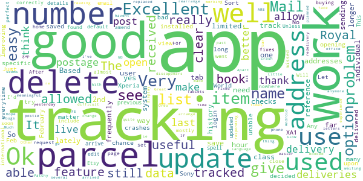
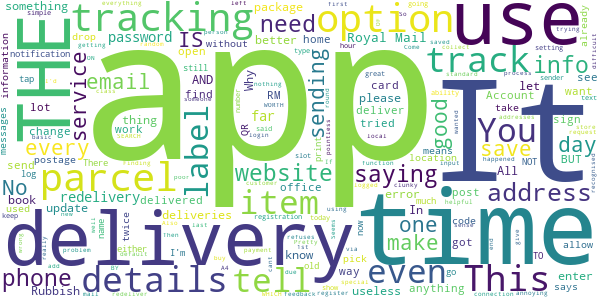

# Royal Mail - Tracking, redelivery, prices
App version ``7.2.5``

Analyzed with [covid-apps-observer](http://github.com/covid-apps-observer) project, version ``0.1``

## App overview
| | |
|-------------------------|-------------------------| 
| **Name**&nbsp;&nbsp;&nbsp;&nbsp;&nbsp;&nbsp;&nbsp;&nbsp;&nbsp;&nbsp;&nbsp;&nbsp;&nbsp;&nbsp;&nbsp;&nbsp;&nbsp;&nbsp;&nbsp;&nbsp;&nbsp;&nbsp;&nbsp;&nbsp;&nbsp;&nbsp;&nbsp;&nbsp;&nbsp;&nbsp;&nbsp;&nbsp;&nbsp;&nbsp;&nbsp;&nbsp;&nbsp;&nbsp;&nbsp;&nbsp;  | Royal Mail - Tracking, redelivery, prices |
| **Unique identifier** | com.royalmail.app.droid |
| **Link to Google Play** | [https://play.google.com/store/apps/details?id=com.royalmail.app.droid](https://play.google.com/store/apps/details?id=com.royalmail.app.droid) |
| **Summary**  | Easily manage your items and track your deliveries |
| **Privacy policy** | [https://www.royalmail.com/privacy-notice](https://www.royalmail.com/privacy-notice) |
| **Latest version** | 7.2.5 |
| **Last update** | 2021-03-29 14:37:07 |
| **Recent changes** | The latest version delivers new features including, in-app rating and GPS map view of delivered Tracked items. |
| **Installs**  | 1,000,000+ |
| **Category** | Lifestyle |
| **First release** | Sep 4, 2018 |
| **Size**  | 57M |
| **Supported Android version**  | 8.0 and up |

### Description
> 📦📦📦 With the Royal Mail App, you can:
 • Send an item - quickly and easily buy postage in just a few steps. You can print your labels at home or take the QR code on the app to a Royal Mail Customer Service Point/Delivery Office and we’ll print the label for you when you drop off your item.
 • Find your nearest drop off location - Postbox, Parcel Postbox, Post Office branch or Royal Mail Customer Service Point.
 • Track your items – just enter your tracking ID number or scan the barcode to check the progress of your deliveries (available with Royal Mail Tracked and Royal Mail Special Delivery Guaranteed items)
 • Find the size and format of your parcel using the Augmented Reality Parcel Sizer guide. Available with AR supported devices.
 •	Change your delivery options to suit you – You can now change where your parcel is delivered, to a Safeplace or neighbour after it has been sent. (available with Royal Mail Tracked items)
 •	Get proof of postage sent straight to your phone – get that extra peace of mind when dropping of at any of our locations (including our 24/7 Parcel Postboxes)
 • Postcode and address finder – if you’re not sure of a full address, or want to check a postcode, just enter part of the address and we’ll fill in the blanks
 • Find any Post Office locations or Customer Service Point/Delivery Office to print your label or drop off your item, with opening hours, address, map, available services and directions
 • Receive push notifications on your deliveries - never miss a delivery update
 • Save items you are tracking, and add an alias name making them easier to identify 
 • See a photograph of the signature if someone has signed for it, or the Safeplace an item has been delivered to
 • Book a Redelivery – if you’ve missed an item you can easily book a Redelivery to your address, your neighbour’s address or a local Post Office – and specify a delivery day
 • Save postage receipts – simply take a photo of your receipt and store it to the app
 • Track an item on the go - if you have Alexa, you can track your delivery by saying an alias name you have previously assigned to an item

### User interface
The developers of the app provide the following screenshots in the Google play store.
| | | |
|:-------------------------:|:-------------------------:|:-------------------------:|
 |   |   |   | 
 |   |   |   | 
 |  

## Development team
In the following we report the main information provided by the development team in the Google play store.

| | |
|-------------------------|-------------------------|
| **Developer**  | Royal Mail Group |
| **Website**  | [https://www.royalmail.com](https://www.royalmail.com) |
| **Email** | appfeedback@royalmail.com |
| **Physical address**  | - |
| **Other developed apps**  | [https://play.google.com/store/apps/developer?id=Royal+Mail+Group](https://play.google.com/store/apps/developer?id=Royal+Mail+Group) |

## Android support

| | |
|-------------------------|-------------------------|
| **Declared target Android version**  | - |
| **Effective target Android version**  | - |
| **Minimum supported Android version**  | Oreo, version 8.0.0 (API level 26) |
| **Maximum target Android version**  | - |

The larger the difference between the minimum and maximum supported Android versions, the better. A larger difference means a wider audience. For example, old phones have a very low Android version, so a high minimum supported Android version means that the app cannot be used by users with old phones, thus leading to accessibility problems. 

## Requested permissions

In the following we report the complete list of the permissions requested by the app. 

| **Permission** | **Protection level** | **Description** | 
|-------------------------|-------------------------|-------------------------|
 **android.permission ACCESS_FINE_LOCATION** | :warning:**Dangerous** | Allows an app to access precise location. 
 **android.permission ACCESS_NETWORK_STATE** | Normal | Allows applications to access information about networks. 
 **android.permission CAMERA** | :warning:**Dangerous** | Required to be able to access the camera device. 
 **android.permission FOREGROUND_SERVICE** | Normal | Allows a regular application to use Service.startForeground. 
 **android.permission INTERNET** | Normal | Allows applications to open network sockets. 
 **android.permission WAKE_LOCK** | Normal | Allows using PowerManager WakeLocks to keep processor from sleeping or screen from dimming. 
 **android.permission WRITE_EXTERNAL_STORAGE** | :warning:**Dangerous** | Allows an application to write to external storage. 
 **com.google.android.c2dm.permission RECEIVE** | - | - 
 **com.royalmail.app.droid.permission MAPS_RECEIVE** | - | - 

## Mentioned servers

| **Server** | **Registrant** | **Registrant country** | **Creation date** | 
|-------------------------|-------------------------|-------------------------|-------------------------|
 | google.com | Google LLC | :us: US | 1997-09-15 04:00:00 |
 | microsoft.com | Microsoft Corporation | :us: US | 1991-05-02 04:00:00 |
 | tealiumiq.com | Whois Privacy Service | :us: US | 2011-02-09 18:33:06 |
 | tiqcdn.com | Whois Privacy Service | :us: US | 2012-07-11 23:06:45 |
 | googleapis.com | Google LLC | :us: US | 2005-01-25 17:52:26 |

## Security analysis 

Below we report the main security warnings raised by our execution of the [Androwarn](https://github.com/maaaaz/androwarn) security analysis tool.

**Telephony identifiers leakage**
> - This application reads the ISO country code equivalent of the current registered operator's MCC (Mobile Country Code) 
> - This application reads the numeric name (MCC+MNC) of current registered operator 
> - This application reads the operator name 

**Connection interfaces exfiltration**
> - This application reads details about the currently active data network 
> - This application tries to find out if the currently active data network is metered 

**Suspicious connection establishment**
> - This application opens a Socket and connects it to the remote address '' on the 'N/A' port  
> - This application opens a Socket and connects it to the remote address 'Ljava/lang/StringBuilder;->toString()Ljava/lang/String;' on the 'N/A' port  
> - This application opens a Socket and connects it to the remote address 'Ljava/net/Proxy;->type()Ljava/net/Proxy$Type;' on the 'N/A' port  
> - This application opens a Socket and connects it to the remote address 'timeout' on the 'N/A' port  

**Code execution**
> - This application loads a native library 
> - This application loads a native library: 'Ljava/lang/String;->valueOf(Ljava/lang/Object;)Ljava/lang/String;' 
> - This application loads a native library: 'arcore_sdk_jni' 
> - This application loads a native library: 'arsceneview_jni' 
> - This application loads a native library: 'filament-jni' 
> - This application loads a native library: 'mono-native' 
> - This application loads a native library: 'monodroid' 
> - This application loads a native library: 'monosgen-2.0' 
> - This application loads a native library: 'xamarin-app' 
> - This application loads a native library: 'xamarin-debug-app-helper' 

## User ratings and reviews

Below we provide information about how end users are reacting to the app in terms of ratings and reviews in the Google Play store.

### Ratings

The Royal Mail - Tracking, redelivery, prices app has been installed by more than **1000000** times. At this time, **3616** rated the app and its average score is **3.3884296**. Below we show the distribution of the ratings across the usual star-based rating of Google Play

:star::star::star::star::star:: 1714

:star::star::star::star:: 388

:star::star::star:: 219

:star::star:: 179

:star:: 1116

### Reviews 

#### 5-star reviews

> Very useful for labelling deliveries, so that you can distinguish between them.  :date: __2021-04-03 10:06:52__

> Does what it says, THIS IS THE MOST IMPORTANT app that everyone should have who use royal mail  :date: __2021-04-01 12:59:46__

> Absolutely brilliant for sending parcels keeping track of parcels by royal mail very handy app to have 🌟🌟🌟🌟🌟 PS would be very nice if you can add in settings fingerprint scan to secure app apart from that so easy to use it's got everything there you need  :date: __2021-03-31 13:17:48__

> Really Good. I don't know what these reviews are on about. The app saves my address fine.  :date: __2021-03-30 15:09:56__

> Excellent service of this application  :date: __2021-03-29 11:15:55__

> Brilliant app! Really great for tracking parcels etc. Highly recommend 👌  :date: __2021-03-27 15:59:30__

> If you use the royal mail a lot then this is a valuable tool to have  :date: __2021-03-27 12:00:49__

> Personally I think it is a good app an yes good at finding parcels. Brilliant app. Don't knock until u try it  :date: __2021-03-26 09:32:56__

> Excellent app  :date: __2021-03-26 09:31:47__

> Excellent  :date: __2021-03-24 13:48:10__

#### 4-star reviews

> So far so good, however,there should be a way to delete parcels once you've received them.  :date: __2021-04-03 12:47:22__

> I would like it if the app could save addresses that I frequently use.  :date: __2021-03-27 14:52:11__

> There is no option to delete tracking numbers on the tracking tab. The app need a feature where the user can delete individual or all track history!  :date: __2021-02-26 15:35:12__

> Based on tracking only (haven't used it for sending) and address checks (one is allowed 50). 4 * because lately the reference number for 2nd class parcels and some 48 hour tracked mail (which used to give very limited data) no longer give any data (yes, this is more of a Royal Mail system problem than an app-specific problem).  :date: __2021-02-17 11:33:01__

> No matter how many updates this app has, it still doesn't work, crashes upon opening everytime. I have been unable to use the app since February 2020 on a Sony Xperia XA1. Sort it out Royal Mail. Update, 13 Feb 2021 decided to try this app again and installed it again, it now works, opens, can login, and view my saved tracking numbers. Let's see how long it works.  :date: __2021-02-13 20:14:54__

> OK..  :date: __2021-02-09 20:35:17__

> Ok  :date: __2021-02-01 14:04:05__

> Improving thanks  :date: __2021-01-23 21:31:53__

> It's not a bad app for tracking parcels. Just would really like to be able to delete them from my list once they've been delivered. Any chance?  :date: __2021-01-19 16:25:38__

> World's be useful if it allowed you to delete previous tracked items  :date: __2021-01-12 10:14:01__

#### 3-star reviews

> It says there's an error try again at the end of redelivery after putting your details in  :date: __2021-03-30 10:25:00__

> Normally a fantastic app. But all it seems to be doing is crashing ATM  :date: __2021-03-23 09:03:44__

> Will not let me do change of address or any other services.  :date: __2021-02-12 14:46:46__

> Claims tubes that meet medium parcel dimensions are too big.  :date: __2021-02-11 22:00:00__

> Everytime I go on the app my session has expired and have to log in quite frustrating  :date: __2021-02-08 08:48:09__

> I use primarily for tracking incoming and outgoing parcels. Cannot edit description when inputting data which leaves me with columns of meaningless numbers until I am eventually allowed to manually edit once RM have clocked the item in system which is very slow and tedious. Unedited numbers are also duplicated in list and shuffled around making even more work! And whatever happened to push notifications? More and more I am having to use third party apps to help with tracking and sanity. 🚛🆘☯️  :date: __2021-02-07 15:31:01__

> When you click on a URL to the tracking number on another app suck as a email, it directs to this app instead of a web page which would be great but it doesn't phase the URL and extract the tracking number then take you directly there.  :date: __2021-02-03 09:34:29__

> Tracking Don't Update most of the time  :date: __2021-01-21 16:07:13__

> Sorry, an error occurred, can't install it, done the redelivery through site, just uninstalled.....  :date: __2021-01-18 19:42:45__

> Dates incorrectly read as US. Your item was delivered 01 August 2021... When it was delivered 20210108, not 20210801....  :date: __2021-01-08 10:24:06__

#### 2-star reviews

> login accepted on website but fails on app ... get this fixed please  :date: __2021-04-03 22:18:16__

> Unfortunately when you book more than one pick up, the post man shows up and says he can only see one item for the day. This is useless. He refuses to take the extra parcels, which means I have to walk down to the customer service centre and drop them off. This is wrong in all honesty.  :date: __2021-04-03 18:45:09__

> This app is complicated and doesn't even include our local Delivery Office. You cant move your location without first having a post code for somewhere else. It claims that the local post office within our Coop is open until 10pm! It is helpful to confirm information you already have but not to find out anything new. I haven't tried sending a parcel via it, maybe it works well for that  :date: __2021-04-03 11:07:57__

> Navigation is poor, and it infuriates me that the developers blame the users' 'weak' internet connection for their own network failures. Funny how no other app or browser has a problem connecting.  :date: __2021-04-03 00:53:37__

> Used this app twice now to buy postage and both tines had to input info numerous times then when ptint your label at home constant error messages, it will allow me to pront a qr click and drop A4 label but that's not what I want so now I have to drive 10+ miles to the nearest mail drop office. I will be removing the RM option from my selling site.  :date: __2021-03-15 09:21:07__

> App won't open. comes up with a notification saying that it's unable to open and I'm left to tap either app info, close app or send feedback. If I tap send feedback it tells me my phone isn't connected to a data service. Seems a lot of hassle to report a problem 😕  :date: __2021-03-15 09:17:09__

> Useful to store your sending history, that's about it. No way to save my details or edit addresses, and I can't use card info saved to my phone when paying for postage. Even hermes can do better...  :date: __2021-03-11 02:21:32__

> So much room for improvement. I have to enter all my details every time I use the app, why can't it remember my name and address???? A list of favourite destination addresses would save loads of time as well. Tracking means where is it now, not we'll tell you after we have tried to deliver!! Also, why not attach the label to the email I receive to save me having to fiddle about downloading the label from the app before I can print it? Come on Royal Mail, a few teaks would make this a genuine alternative to your competitors.  :date: __2021-03-08 13:09:13__

> Good to track your delivery but changing deliveries to another location its useless. I update 2 deliveries for other location (post office) and when i got home i got the something for you card... don't make sense!  :date: __2021-02-19 12:23:27__

> It won't even let me print the label I've paid for  :date: __2021-02-15 19:36:11__

#### 1-star reviews

> Keeps crashing after latest update! Useless  :date: __2021-04-03 18:56:49__

> People at Royal Mail really need to work on their handwriting.  :date: __2021-04-03 15:55:04__

> Keeps crashing and cannot book redelivery  :date: __2021-04-02 13:46:04__

> Saying online open ,but place closed, not put reference no. On card and app saying redelivery not working on the app doesn't sound help being bank holiday but redeliver on Tuesday which is no good when I finish at 5 all week so just miss it again soon be amazon mail not royal mail more convenient and deliver late etc, so all good 🤣  :date: __2021-04-02 11:50:46__

> Horrible app. By default it chooses redeliver when trying to add a safe place!! Tried to add a safe place and it changed my delivery date by 5 days!!!  :date: __2021-04-02 09:05:52__

> Don't even bother!! Typical Royal mail.....nothing works properly!!!!!!  :date: __2021-04-01 19:03:37__

> Rubbish. Every time I scan the qr code on the slip shoved through my door it returns me to the install app option. No settings in the app for scanning qr. Pointless  :date: __2021-04-01 15:09:41__

> Not flexible on passwords so you have to make something unique to these guys  :date: __2021-03-31 13:09:34__

> Tried to book a redelivery just said error at the end. Went via the website that worked. How can you get away producing an app that doesn't work. I suppose it's free but I'm uninstalling as it is of no use so why spend the money making it?  :date: __2021-03-31 12:28:15__

> Utterly broken. I can't even sign up.  :date: __2021-03-31 01:17:41__

