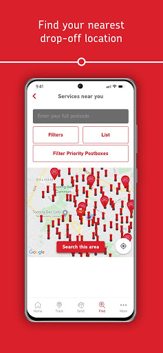
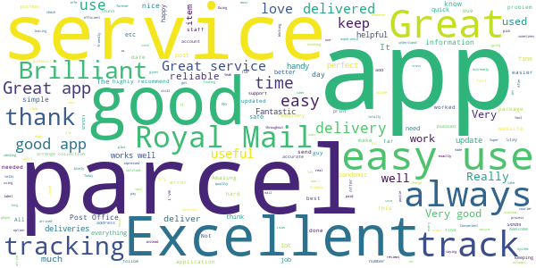
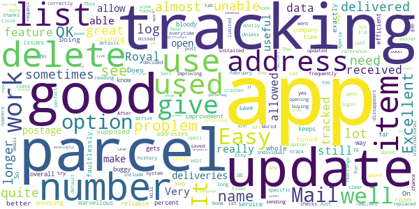
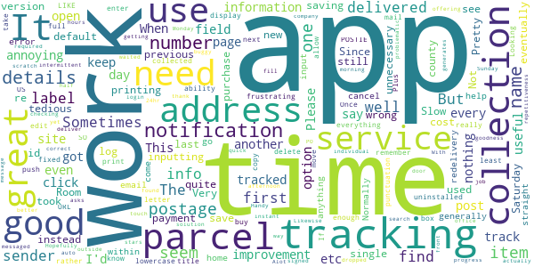
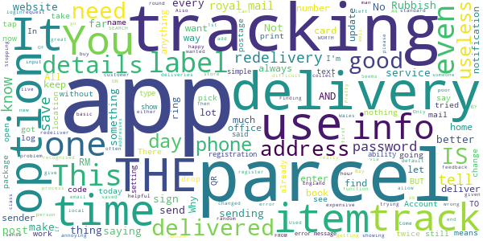
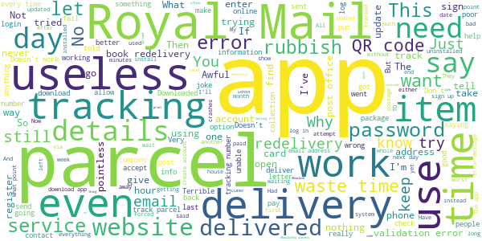

# Royal Mail - Tracking, redelivery, prices
App version ``7.3.1``

Analyzed with [covid-apps-observer](http://github.com/covid-apps-observer) project, version ``0.1``

## App overview
| | |
|-------------------------|-------------------------| 
| **Name**&nbsp;&nbsp;&nbsp;&nbsp;&nbsp;&nbsp;&nbsp;&nbsp;&nbsp;&nbsp;&nbsp;&nbsp;&nbsp;&nbsp;&nbsp;&nbsp;&nbsp;&nbsp;&nbsp;&nbsp;&nbsp;&nbsp;&nbsp;&nbsp;&nbsp;&nbsp;&nbsp;&nbsp;&nbsp;&nbsp;&nbsp;&nbsp;&nbsp;&nbsp;&nbsp;&nbsp;&nbsp;&nbsp;&nbsp;&nbsp;  | Royal Mail - Tracking, redelivery, prices |
| **Unique identifier** | com.royalmail.app.droid |
| **Link to Google Play** | [https://play.google.com/store/apps/details?id=com.royalmail.app.droid](https://play.google.com/store/apps/details?id=com.royalmail.app.droid) |
| **Summary**  | Easily manage your items and track your deliveries |
| **Privacy policy** | [https://www.royalmail.com/privacy-notice](https://www.royalmail.com/privacy-notice) |
| **Latest version** | 7.3.1 |
| **Last update** | 2021-04-15 13:50:09 |
| **Recent changes** | The latest version delivers a great, new feature enabling the ability to log in to your Royal Mail account using Biometrics. |
| **Installs**  | 1,000,000+ |
| **Category** | Lifestyle |
| **First release** | Sep 4, 2018 |
| **Size**  | 57M |
| **Supported Android version**  | 8.0 and up |

### Description
> 📦📦📦 With the Royal Mail App, you can:
 • Send an item - quickly and easily buy postage in just a few steps. You can print your labels at home or take the QR code on the app to a Royal Mail Customer Service Point/Delivery Office and we’ll print the label for you when you drop off your item.
 • Find your nearest drop off location - Postbox, Parcel Postbox, Post Office branch or Royal Mail Customer Service Point.
 • Track your items – just enter your tracking ID number or scan the barcode to check the progress of your deliveries (available with Royal Mail Tracked and Royal Mail Special Delivery Guaranteed items)
 • Find the size and format of your parcel using the Augmented Reality Parcel Sizer guide. Available with AR supported devices.
 •	Change your delivery options to suit you – You can now change where your parcel is delivered, to a Safeplace or neighbour after it has been sent. (available with Royal Mail Tracked items)
 •	Get proof of postage sent straight to your phone – get that extra peace of mind when dropping of at any of our locations (including our 24/7 Parcel Postboxes)
 • Postcode and address finder – if you’re not sure of a full address, or want to check a postcode, just enter part of the address and we’ll fill in the blanks
 • Find any Post Office locations or Customer Service Point/Delivery Office to print your label or drop off your item, with opening hours, address, map, available services and directions
 • Receive push notifications on your deliveries - never miss a delivery update
 • Save items you are tracking, and add an alias name making them easier to identify 
 • See a photograph of the signature if someone has signed for it, or the Safeplace an item has been delivered to
 • Book a Redelivery – if you’ve missed an item you can easily book a Redelivery to your address, your neighbour’s address or a local Post Office – and specify a delivery day
 • Save postage receipts – simply take a photo of your receipt and store it to the app
 • Track an item on the go - if you have Alexa, you can track your delivery by saying an alias name you have previously assigned to an item

### User interface
The developers of the app provide the following screenshots in the Google play store.
| | | |
|:-------------------------:|:-------------------------:|:-------------------------:|
 |   |   |   | 
 |   |   |   | 
 |  

## Development team
In the following we report the main information provided by the development team in the Google play store.

| | |
|-------------------------|-------------------------|
| **Developer**  | Royal Mail Group |
| **Website**  | [https://www.royalmail.com](https://www.royalmail.com) |
| **Email** | appfeedback@royalmail.com |
| **Physical address**  | - |
| **Other developed apps**  | [https://play.google.com/store/apps/developer?id=Royal+Mail+Group](https://play.google.com/store/apps/developer?id=Royal+Mail+Group) |

## Android support

| | |
|-------------------------|-------------------------|
| **Declared target Android version**  | - |
| **Effective target Android version**  | - |
| **Minimum supported Android version**  | Oreo, version 8.0.0 (API level 26) |
| **Maximum target Android version**  | - |

The larger the difference between the minimum and maximum supported Android versions, the better. A larger difference means a wider audience. For example, old phones have a very low Android version, so a high minimum supported Android version means that the app cannot be used by users with old phones, thus leading to accessibility problems. 

## Requested permissions

In the following we report the complete list of the permissions requested by the app. 

| **Permission** | **Protection level** | **Description** | 
|-------------------------|-------------------------|-------------------------|
 **android.permission ACCESS_FINE_LOCATION** | :warning:**Dangerous** | Allows an app to access precise location. 
 **android.permission ACCESS_NETWORK_STATE** | Normal | Allows applications to access information about networks. 
 **android.permission CAMERA** | :warning:**Dangerous** | Required to be able to access the camera device. 
 **android.permission FOREGROUND_SERVICE** | Normal | Allows a regular application to use Service.startForeground. 
 **android.permission INTERNET** | Normal | Allows applications to open network sockets. 
 **android.permission WAKE_LOCK** | Normal | Allows using PowerManager WakeLocks to keep processor from sleeping or screen from dimming. 
 **android.permission WRITE_EXTERNAL_STORAGE** | :warning:**Dangerous** | Allows an application to write to external storage. 
 **com.google.android.c2dm.permission RECEIVE** | - | - 
 **com.royalmail.app.droid.permission MAPS_RECEIVE** | - | - 

## Mentioned servers

| **Server** | **Registrant** | **Registrant country** | **Creation date** | 
|-------------------------|-------------------------|-------------------------|-------------------------|
 | google.com | Google LLC | :us: US | 1997-09-15 04:00:00 |
 | microsoft.com | Microsoft Corporation | :us: US | 1991-05-02 04:00:00 |
 | tealiumiq.com | Whois Privacy Service | :us: US | 2011-02-09 18:33:06 |
 | tiqcdn.com | Whois Privacy Service | :us: US | 2012-07-11 23:06:45 |
 | googleapis.com | Google LLC | :us: US | 2005-01-25 17:52:26 |

## Security analysis 

Below we report the main security warnings raised by our execution of the [Androwarn](https://github.com/maaaaz/androwarn) security analysis tool.

**Telephony identifiers leakage**
> - This application reads the ISO country code equivalent of the current registered operator's MCC (Mobile Country Code) 
> - This application reads the numeric name (MCC+MNC) of current registered operator 
> - This application reads the operator name 

**Connection interfaces exfiltration**
> - This application reads details about the currently active data network 
> - This application tries to find out if the currently active data network is metered 

**Suspicious connection establishment**
> - This application opens a Socket and connects it to the remote address '' on the 'N/A' port  
> - This application opens a Socket and connects it to the remote address 'Ljava/lang/StringBuilder;->toString()Ljava/lang/String;' on the 'N/A' port  
> - This application opens a Socket and connects it to the remote address 'Ljava/net/Proxy;->type()Ljava/net/Proxy$Type;' on the 'N/A' port  
> - This application opens a Socket and connects it to the remote address 'timeout' on the 'N/A' port  

**Code execution**
> - This application loads a native library 
> - This application loads a native library: 'Ljava/lang/String;->valueOf(Ljava/lang/Object;)Ljava/lang/String;' 
> - This application loads a native library: 'arcore_sdk_jni' 
> - This application loads a native library: 'arsceneview_jni' 
> - This application loads a native library: 'filament-jni' 
> - This application loads a native library: 'mono-native' 
> - This application loads a native library: 'monodroid' 
> - This application loads a native library: 'monosgen-2.0' 
> - This application loads a native library: 'xamarin-app' 
> - This application loads a native library: 'xamarin-debug-app-helper' 

## User ratings and reviews

Below we provide information about how end users are reacting to the app in terms of ratings and reviews in the Google Play store.

### Ratings

The Royal Mail - Tracking, redelivery, prices app has been installed by more than **1000000** times. At this time, **3680** rated the app and its average score is **3.401084**. Below we show the distribution of the ratings across the usual star-based rating of Google Play

:star::star::star::star::star:: 1786

:star::star::star::star:: 359

:star::star::star:: 229

:star::star:: 159

:star:: 1147

### Reviews 

#### 5-star reviews

> excellent  :date: __2021-05-01 13:44:58__

> Excellent app & service!  :date: __2021-05-01 11:51:19__

> great app, very useful, I use it all the time. just need to add the ability to remove consignments from your tracked parcels history from the app. currently I have to do it from the website if I accidentally enter an incorrect tracking number or it stays there forever!  :date: __2021-05-01 07:27:43__

> Great little app.  :date: __2021-05-01 05:32:47__

> Love the app easy to use and overall impressed with all the qualities  :date: __2021-05-01 03:09:39__

> Great service  :date: __2021-05-01 01:02:57__

> Great delivery service.  :date: __2021-04-30 19:36:05__

> always reliable  :date: __2021-04-30 19:05:14__

> Accurate delivery, recommended to anyone 👌🏽  :date: __2021-04-30 17:54:51__

> its so easy and simple to use the app  :date: __2021-04-30 14:37:28__

#### 4-star reviews

> little later than estimated but overall good service  :date: __2021-05-01 12:18:57__

> It's a useful app, it would be nice if you could sync it with a desktop version for easier copy and pasting if you have a lot of business delivery. However for consumers it's perfect.  :date: __2021-04-30 05:58:37__

> generally good, does most things you would want it to, my only complaint would be that it's annoying that it keeps logging itself out.  :date: __2021-04-30 01:15:54__

> On the whole a well tuned app.  :date: __2021-04-28 11:04:42__

> Does exactly what it's supposed to and does almost faultlessly.  :date: __2021-04-28 10:40:30__

> Doing better but with a lot of room for improvement.  :date: __2021-04-24 19:34:26__

> very good. bloody marvellous  :date: __2021-04-23 16:23:17__

> Since update keeps crashing, can't log in at all  :date: __2021-04-22 11:13:46__

> It's quite buggy sometimes but overall great app.  :date: __2021-04-22 09:41:21__

> Easy to use efficient service.  :date: __2021-04-22 09:20:52__

#### 3-star reviews

> So the app is working well this time but unfortunately shows clearly that my tracked parcel was delivered to somewhere in Bexhill-on-Sea and not to us here in Wakefield Yorks.!!  :date: __2021-05-01 15:06:51__

> generally easy to use, but some further options for streamlining would be helpful. linking in to click and drop account and previous collections from our address booked online would also be helpful.  :date: __2021-04-29 22:08:14__

> everytime I try to book a redelivery there is some error that stops the booking and some deliveries are not updated to say they have been delivered. some updates come after delivery stating your item has cleared customs and will update you when it will arrive. doesn't inspire confidence in the accuracy of the app  :date: __2021-04-29 15:28:35__

> It mostly works. Not sure why I need to skip the "take a look at your new app!" screen every other time I open it though.  :date: __2021-04-29 14:23:46__

> it works  :date: __2021-04-28 21:15:39__

> intermittent info  :date: __2021-04-28 14:51:12__

> It asks the sender's address etc. from scratch instead of offering the default it has. Hopefully a work in progress - only half way there yet  :date: __2021-04-28 11:40:25__

> Room for improvement - Handy app, saves time at the PO. 1 - When printing more than 1 postage label it sometimes re-generates the previous label for printing, you have to keep checking it's actually the correct label. 2 - Since this is an app used by 1 single individual or company I don't see the need to keep inputting sender's details, auto fill would be a better solution. 3 - Likewise save payment details. Alot of unnecessary repetitiveness inputs required.  :date: __2021-04-27 14:31:37__

> annoying that I have to login every time...thank goodness for touch id  :date: __2021-04-27 12:05:44__

> was messaged to say they would deliver on Saturday morning, waited in all day to find it wasn't even in the county on Saturday, got another message Sunday afternoon to say it was now in the county and would be delivered Monday. was on 24hr tracked parcel and should have been signed for. found it outside the front door.  :date: __2021-04-26 13:36:35__

#### 2-star reviews

> need more info when tracking a parcel from overseas otherwise I would of gave 5 🌟  :date: __2021-05-01 01:57:02__

> don't get why you can't save contacts to send repeat parcels quickly, otherwise acceptable  :date: __2021-04-30 15:12:18__

> saying have been delivery but can't find and no one knows we're is?  :date: __2021-04-28 20:19:32__

> it's ok when it's synchronized with sender and tracking. I have a number of delivery notifications on here that tell me nothing but 'seller has despatched to royal mail'. meaning what? from whom?  :date: __2021-04-23 11:58:28__

> Not given tracking number then after being given one with today 9.30 to 1.30 it's changed and is now in a Wales that's Scotland England Wales and I live 8n England and woke up to being home after covid19 lockdown with no tracking again  :date: __2021-04-23 11:46:51__

> App Keeps Stopping.  :date: __2021-04-21 19:52:13__

> Always crashing or showing error message!  :date: __2021-04-21 15:55:40__

> Tracking keeps stopping  :date: __2021-04-09 19:19:16__

> Awful  :date: __2021-04-05 21:24:51__

> login accepted on website but fails on app ... get this fixed please  :date: __2021-04-03 22:18:16__

#### 1-star reviews

> you need a password to get to biometrics. idiots.  :date: __2021-05-01 14:39:48__

> WHY do I have to type all my details in every time I send an item?! It's just stupid that none of name, address, phone number, email & card number has an option to save and use as default next time. Also, confirmation email doesn't contain a link to the postage label so you can print it easily! Aaargh. Although helpfully, the app does at least remember tracking numbers I've searched on previously  :date: __2021-05-01 13:46:19__

> Useless. Doesn't recognise the tracking number on the "something for you" note and won't allow scanning of the QR code  :date: __2021-05-01 12:37:32__

> Requested it to be delivered to neighbour however they told me I wasnt in....I know thats why I requested neighbour. So requested local post office, emailed me meridian, then random depot....just want my parcel  :date: __2021-05-01 11:01:27__

> Delivered a to somebody else's address And now I've got to wait over 10 days before they can let me know if it's going to be delivered Meanwhile I'm without a car, not good  :date: __2021-05-01 10:00:19__

> the app doesnt have the same tracking info as the website does, disappointing  :date: __2021-05-01 07:33:17__

> Only occasionally does it concur with whether they have an item. Rare. It usually says we haven't got the item or we can't update until we try to deliver etc..The track and trace system just does not work.. Even when I have received an item if I put the tracking number in it to test even that, it still says sorry we haven't tried to deliver it yet!! Joke. It's just like a sandwich with nothing in it. What's the point? I cannot track anything. Get a grip Royal Mail. Numbers that cant be traced?!  :date: __2021-04-30 19:40:11__

> we have been waiting since the 16th April for our parcel to be delivered. it has been at the redditch depot Since then. we have had no response from royal mail even after several attempts. even promising to call us back. very very poor service  :date: __2021-04-30 19:37:18__

> terrible tracking app. missed delivery even though I was waiting in all day. I don't have transport so I have to walk to the sorting office. thanks  :date: __2021-04-30 19:19:09__

> Keeps stopping  :date: __2021-04-30 11:28:39__

