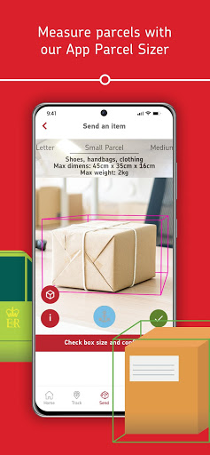
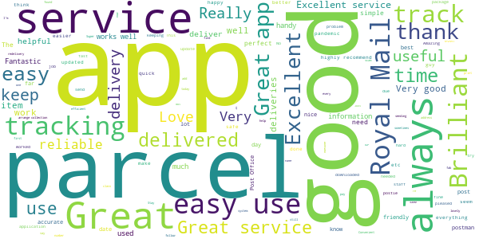
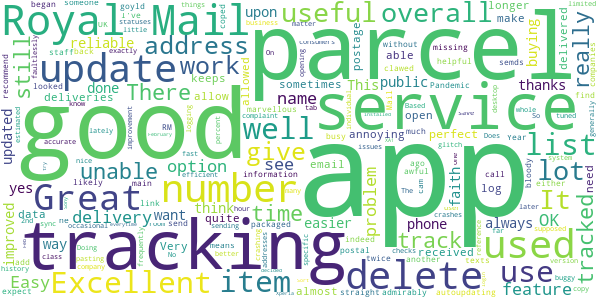

# Royal Mail - Tracking, redelivery, prices
App version ``7.3.1``

Analyzed with [covid-apps-observer](http://github.com/covid-apps-observer) project, version ``0.1``

## App overview
| | |
|-------------------------|-------------------------| 
| **Name**&nbsp;&nbsp;&nbsp;&nbsp;&nbsp;&nbsp;&nbsp;&nbsp;&nbsp;&nbsp;&nbsp;&nbsp;&nbsp;&nbsp;&nbsp;&nbsp;&nbsp;&nbsp;&nbsp;&nbsp;&nbsp;&nbsp;&nbsp;&nbsp;&nbsp;&nbsp;&nbsp;&nbsp;&nbsp;&nbsp;&nbsp;&nbsp;&nbsp;&nbsp;&nbsp;&nbsp;&nbsp;&nbsp;&nbsp;&nbsp;  | Royal Mail - Tracking, redelivery, prices |
| **Unique identifier** | com.royalmail.app.droid |
| **Link to Google Play** | [https://play.google.com/store/apps/details?id=com.royalmail.app.droid](https://play.google.com/store/apps/details?id=com.royalmail.app.droid) |
| **Summary**  | Easily manage your items and track your deliveries |
| **Privacy policy** | [https://www.royalmail.com/privacy-notice](https://www.royalmail.com/privacy-notice) |
| **Latest version** | 7.3.1 |
| **Last update** | 2021-04-15 13:50:09 |
| **Recent changes** | The latest version delivers a great, new feature enabling the ability to log in to your Royal Mail account using Biometrics. |
| **Installs**  | 1,000,000+ |
| **Category** | Lifestyle |
| **First release** | Sep 4, 2018 |
| **Size**  | 57M |
| **Supported Android version**  | 8.0 and up |

### Description
> 📦📦📦 With the Royal Mail App, you can:
 • Send an item - quickly and easily buy postage in just a few steps. You can print your labels at home or take the QR code on the app to a Royal Mail Customer Service Point/Delivery Office and we’ll print the label for you when you drop off your item.
 • Find your nearest drop off location - Postbox, Parcel Postbox, Post Office branch or Royal Mail Customer Service Point.
 • Track your items – just enter your tracking ID number or scan the barcode to check the progress of your deliveries (available with Royal Mail Tracked and Royal Mail Special Delivery Guaranteed items)
 • Find the size and format of your parcel using the Augmented Reality Parcel Sizer guide. Available with AR supported devices.
 •	Change your delivery options to suit you – You can now change where your parcel is delivered, to a Safeplace or neighbour after it has been sent. (available with Royal Mail Tracked items)
 •	Get proof of postage sent straight to your phone – get that extra peace of mind when dropping of at any of our locations (including our 24/7 Parcel Postboxes)
 • Postcode and address finder – if you’re not sure of a full address, or want to check a postcode, just enter part of the address and we’ll fill in the blanks
 • Find any Post Office locations or Customer Service Point/Delivery Office to print your label or drop off your item, with opening hours, address, map, available services and directions
 • Receive push notifications on your deliveries - never miss a delivery update
 • Save items you are tracking, and add an alias name making them easier to identify 
 • See a photograph of the signature if someone has signed for it, or the Safeplace an item has been delivered to
 • Book a Redelivery – if you’ve missed an item you can easily book a Redelivery to your address, your neighbour’s address or a local Post Office – and specify a delivery day
 • Save postage receipts – simply take a photo of your receipt and store it to the app
 • Track an item on the go - if you have Alexa, you can track your delivery by saying an alias name you have previously assigned to an item

### User interface
The developers of the app provide the following screenshots in the Google play store.
| | | |
|:-------------------------:|:-------------------------:|:-------------------------:|
 |   |   |   | 
 |   |   |   | 
 |  

## Development team
In the following we report the main information provided by the development team in the Google play store.

| | |
|-------------------------|-------------------------|
| **Developer**  | Royal Mail Group |
| **Website**  | [https://www.royalmail.com](https://www.royalmail.com) |
| **Email** | appfeedback@royalmail.com |
| **Physical address**  | - |
| **Other developed apps**  | [https://play.google.com/store/apps/developer?id=Royal+Mail+Group](https://play.google.com/store/apps/developer?id=Royal+Mail+Group) |

## Android support

| | |
|-------------------------|-------------------------|
| **Declared target Android version**  | - |
| **Effective target Android version**  | - |
| **Minimum supported Android version**  | Oreo, version 8.0.0 (API level 26) |
| **Maximum target Android version**  | - |

The larger the difference between the minimum and maximum supported Android versions, the better. A larger difference means a wider audience. For example, old phones have a very low Android version, so a high minimum supported Android version means that the app cannot be used by users with old phones, thus leading to accessibility problems. 

## Requested permissions

In the following we report the complete list of the permissions requested by the app. 

| **Permission** | **Protection level** | **Description** | 
|-------------------------|-------------------------|-------------------------|
 **android.permission ACCESS_FINE_LOCATION** | :warning:**Dangerous** | Allows an app to access precise location. 
 **android.permission ACCESS_NETWORK_STATE** | Normal | Allows applications to access information about networks. 
 **android.permission CAMERA** | :warning:**Dangerous** | Required to be able to access the camera device. 
 **android.permission FOREGROUND_SERVICE** | Normal | Allows a regular application to use Service.startForeground. 
 **android.permission INTERNET** | Normal | Allows applications to open network sockets. 
 **android.permission WAKE_LOCK** | Normal | Allows using PowerManager WakeLocks to keep processor from sleeping or screen from dimming. 
 **android.permission WRITE_EXTERNAL_STORAGE** | :warning:**Dangerous** | Allows an application to write to external storage. 
 **com.google.android.c2dm.permission RECEIVE** | - | - 
 **com.royalmail.app.droid.permission MAPS_RECEIVE** | - | - 

## Mentioned servers

| **Server** | **Registrant** | **Registrant country** | **Creation date** | 
|-------------------------|-------------------------|-------------------------|-------------------------|
 | google.com | Google LLC | :us: US | 1997-09-15 04:00:00 |
 | microsoft.com | Microsoft Corporation | :us: US | 1991-05-02 04:00:00 |
 | tealiumiq.com | Whois Privacy Service | :us: US | 2011-02-09 18:33:06 |
 | tiqcdn.com | Whois Privacy Service | :us: US | 2012-07-11 23:06:45 |
 | googleapis.com | Google LLC | :us: US | 2005-01-25 17:52:26 |

## Security analysis 

Below we report the main security warnings raised by our execution of the [Androwarn](https://github.com/maaaaz/androwarn) security analysis tool.

**Telephony identifiers leakage**
> - This application reads the ISO country code equivalent of the current registered operator's MCC (Mobile Country Code) 
> - This application reads the numeric name (MCC+MNC) of current registered operator 
> - This application reads the operator name 

**Connection interfaces exfiltration**
> - This application reads details about the currently active data network 
> - This application tries to find out if the currently active data network is metered 

**Suspicious connection establishment**
> - This application opens a Socket and connects it to the remote address '' on the 'N/A' port  
> - This application opens a Socket and connects it to the remote address 'Ljava/lang/StringBuilder;->toString()Ljava/lang/String;' on the 'N/A' port  
> - This application opens a Socket and connects it to the remote address 'Ljava/net/Proxy;->type()Ljava/net/Proxy$Type;' on the 'N/A' port  
> - This application opens a Socket and connects it to the remote address 'timeout' on the 'N/A' port  

**Code execution**
> - This application loads a native library 
> - This application loads a native library: 'Ljava/lang/String;->valueOf(Ljava/lang/Object;)Ljava/lang/String;' 
> - This application loads a native library: 'arcore_sdk_jni' 
> - This application loads a native library: 'arsceneview_jni' 
> - This application loads a native library: 'filament-jni' 
> - This application loads a native library: 'mono-native' 
> - This application loads a native library: 'monodroid' 
> - This application loads a native library: 'monosgen-2.0' 
> - This application loads a native library: 'xamarin-app' 
> - This application loads a native library: 'xamarin-debug-app-helper' 

## User ratings and reviews

Below we provide information about how end users are reacting to the app in terms of ratings and reviews in the Google Play store.

### Ratings

The Royal Mail - Tracking, redelivery, prices app has been installed by more than **1000000** times. At this time, **3680** rated the app and its average score is **3.401084**. Below we show the distribution of the ratings across the usual star-based rating of Google Play

:star::star::star::star::star:: 1786

:star::star::star::star:: 359

:star::star::star:: 229

:star::star:: 159

:star:: 1147

### Reviews 

#### 5-star reviews

> our postman is an absolute poppet  :date: __2021-05-22 13:47:09__

> great app. really useful especially with all the scams about  :date: __2021-05-21 15:30:07__

> very easy to navigate and convenient.  :date: __2021-05-21 12:30:50__

> The app works well for updating tracking information, you can now re-name the parcels individually making multiple items easier too track through the system.  :date: __2021-05-21 12:15:59__

> great  :date: __2021-05-21 11:49:57__

> Brilliant  :date: __2021-05-21 06:44:55__

> Great service..all posties...are very cheerful and helpful...thx  :date: __2021-05-20 19:39:39__

> Royal Mail are very good & our postmen & women are very friendly. Love the tracking app fab.  :date: __2021-05-20 12:08:07__

> so easy 😁😁  :date: __2021-05-20 11:10:20__

> Always an efficient and friendly service.  :date: __2021-05-20 09:30:36__

#### 4-star reviews

> very good. bloody marvellous  :date: __2021-05-21 22:16:15__

> Great service, excellent staff. well done royal mail ❤️  :date: __2021-05-21 14:28:48__

> Royal mail have been the main UK postal service since Time began! and have always been reliable! l don't think they have the public faith that they used to have Year's ago! but they've coped admirably during this Pandemic and most likely clawed back some of that missing public faith! Well done Royal Mail!  :date: __2021-05-21 01:17:02__

> Overall it does what you'd expect. it goyld ne improved by autoupdating when someone semds you packaged as other such apps do  :date: __2021-05-18 18:42:57__

> Unable to get into the app  :date: __2021-05-18 10:12:10__

> I've used this app twice, and it is good.  :date: __2021-05-15 11:57:46__

> Great, a few of the features could be improved upon. There is an awful lot of information which is really helpful. This means I can find out how much a parcel is to send or track my own, without having to call RM, who are always busy. I like how I can link texts & emails from either Royal Mail or, indeed, the companies I am buying from, straight to the app, it cam all be looked at & tracked with my phone. very useful app & service. I would recommend. I want to add my thanks for their service  :date: __2021-05-14 20:39:41__

> yes another good service by Royal Mail. 👏  :date: __2021-05-12 17:55:11__

> great app  :date: __2021-05-11 07:33:56__

> Still has the occasional glitch  :date: __2021-05-09 21:37:29__

#### 3-star reviews

> Useful app but it needs the ability to clearly define a safe delivery location, extra star when this feature is provided in the app  :date: __2021-05-22 10:54:22__

> parcels being delivered to me are not automatically visible on app unless it's tracking number is physicaly typed in other companies do this automatically  :date: __2021-05-21 10:04:01__

> good app gives bit more clarity but could maybe do more to track a parcel  :date: __2021-05-21 02:51:21__

> As with most delivery apps it this relies on accurate info input. Parcels showing as 'Due for delivery on....' and then not updating even when the due date passes make these apps incredibly frustrating. This is no exception.  :date: __2021-05-20 03:42:07__

> It would be nice to be updated on tracked parcels. Sometimes you get updates others you cant track until its delivered.  :date: __2021-05-19 13:51:05__

> ok but a bit of info before delivery would be nice,, you only get information after delivery,,pretty pointless  :date: __2021-05-18 23:52:47__

> slow and unreliable  :date: __2021-05-17 17:12:41__

> Confusing as items are lodged with Post Office, to be delivered by Royal Mail. Therefore the number issued by Post Office, for tracking may not work in Royal Mail App.  :date: __2021-05-16 15:26:25__

> Takes a wee while to get into it, but it works.  :date: __2021-05-14 08:17:17__

> Doesn't really work for international packages. Wish I could delete recently tracked after they've been delivered.  :date: __2021-05-12 10:37:15__

#### 2-star reviews

> It's usable, but normally takes a lot of input to get anything done. I'd probably rate it 3 or 4 stars, but it's just so far off the dpd app.  :date: __2021-05-20 12:29:47__

> Why is it that with the Dominos app I can literally watch as my pizza travels along the roads but the best Royal Mail can do is narrow it down to half a day, and, it's in the town you live in?  :date: __2021-05-15 10:43:48__

> Not with enough info:as to redirecting parcel when tracking a parcel not helpful no telephone num:or chatline parcel far away from my home. In this NHS 2U part of this issues could only leave a short message feedback and chat useless. Had id known about parcel being dispatched and incorrect forwarding address could had acted much quicker.  :date: __2021-05-15 05:17:12__

> Constantly having to log back in with the app giving a pop up of my log in has expired  :date: __2021-05-13 09:42:23__

> Unable to confirm the status of your item We have not attempted to deliver your item yet please try again later. So it only tracks deliveries made? Sssuuuupppppeeeerrrrr useful  :date: __2021-05-11 19:23:54__

> PayPal payment no longer working. Logging out removes your sending history. (So you can't access labels or get proof of postage on items sent). No reply yet to my support requests by email. Have to fill in my details every time I send items.  :date: __2021-05-10 12:48:29__

> Can't sign up can't get my parcel redelivered no use I had to ring up a expensive phone number in order to get mail delivered the lazy post man yet again didn't ring my door bell  :date: __2021-05-07 23:36:05__

> postie didn't ring my buzzer, i have been in all day, not happy at all  :date: __2021-05-07 15:36:10__

> just had a text to say my parcel will be delivered on May 4th, which was yesterday, royal mail still the useless clowns they have always been  :date: __2021-05-05 11:50:31__

> not always upto date with tracking.  :date: __2021-05-05 08:22:42__

#### 1-star reviews

> Hopeless. Doesn't tell you where your parcel is until day of delivery or after it has bern delivered!  :date: __2021-05-21 09:25:42__

> the app tells me they were delivering yesterday by 2.14pm and I still don't have it the next day and no update on app  :date: __2021-05-20 08:11:46__

> All I want to do is track an item I'm due to receive. So why force me to register? No thanks  :date: __2021-05-18 19:42:17__

> I did not recieve my parcel on the day specified and waited in all day for it to be delivered . Disappointed  :date: __2021-05-15 21:32:03__

> Rubbish app you have to repeat all of your own address and contact details details several times to book a redelivery must have been designed by an idiot. Why couldn't they make it so that you can just scan a barcode like any other decent parcel company and arrange your redelivery from that ever likely Royal Mail struggling  :date: __2021-05-15 19:38:29__

> always late  :date: __2021-05-15 11:34:23__

> Waste of time just like the royal mail and post service customer care is stupid royal mail is a joke to the British public and country  :date: __2021-05-15 10:41:16__

> Doesn't work. Nothing but errors  :date: __2021-05-15 09:10:26__

> awful service. left calling card but no sorting office times for collection of parcel. redelivery is 2 days! take no notice of where to leave my parcels.  :date: __2021-05-14 10:45:14__

> Items are never delivered on the day the app says they are coming!  :date: __2021-05-13 15:33:54__

