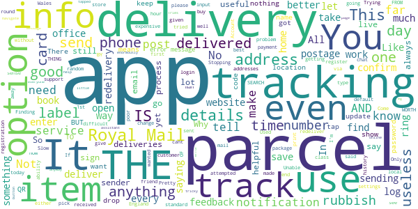

# Royal Mail - Tracking, redelivery, prices
App version ``8.0.7``

Analyzed with [covid-apps-observer](http://github.com/covid-apps-observer) project, version ``0.1``

## App overview
| | |
|-------------------------|-------------------------| 
| **Name**&nbsp;&nbsp;&nbsp;&nbsp;&nbsp;&nbsp;&nbsp;&nbsp;&nbsp;&nbsp;&nbsp;&nbsp;&nbsp;&nbsp;&nbsp;&nbsp;&nbsp;&nbsp;&nbsp;&nbsp;&nbsp;&nbsp;&nbsp;&nbsp;&nbsp;&nbsp;&nbsp;&nbsp;&nbsp;&nbsp;&nbsp;&nbsp;&nbsp;&nbsp;&nbsp;&nbsp;&nbsp;&nbsp;&nbsp;&nbsp;  | Royal Mail - Tracking, redelivery, prices |
| **Unique identifier** | com.royalmail.app.droid |
| **Link to Google Play** | [https://play.google.com/store/apps/details?id=com.royalmail.app.droid](https://play.google.com/store/apps/details?id=com.royalmail.app.droid) |
| **Summary**  | Easily manage your items and track your deliveries |
| **Privacy policy** | [https://www.royalmail.com/privacy-notice](https://www.royalmail.com/privacy-notice) |
| **Latest version** | 8.0.7 |
| **Last update** | 2021-05-24 13:26:34 |
| **Recent changes** | We’ve made the Royal Mail App even better. In this latest update, you can now track up to five items per day without logging in. It’s as simple as open, tap and track! |
| **Installs**  | 1,000,000+ |
| **Category** | Lifestyle |
| **First release** | Sep 4, 2018 |
| **Size**  | 58M |
| **Supported Android version**  | 8.0 and up |

### Description
> 📦📦📦 With the Royal Mail App, you can:
 • Send an item - quickly and easily buy postage in just a few steps. You can print your labels at home or take the QR code on the app to a Royal Mail Customer Service Point/Delivery Office and we’ll print the label for you when you drop off your item.
 • Find your nearest drop off location - Postbox, Parcel Postbox, Post Office branch or Royal Mail Customer Service Point.
 • Track your items – just enter your tracking ID number or scan the barcode to check the progress of your deliveries (available with Royal Mail Tracked and Royal Mail Special Delivery Guaranteed items)
 • Find the size and format of your parcel using the Augmented Reality Parcel Sizer guide. Available with AR supported devices.
 •	Change your delivery options to suit you – You can now change where your parcel is delivered, to a Safeplace or neighbour after it has been sent. (available with Royal Mail Tracked items)
 •	Get proof of postage sent straight to your phone – get that extra peace of mind when dropping of at any of our locations (including our 24/7 Parcel Postboxes)
 • Postcode and address finder – if you’re not sure of a full address, or want to check a postcode, just enter part of the address and we’ll fill in the blanks
 • Find any Post Office locations or Customer Service Point/Delivery Office to print your label or drop off your item, with opening hours, address, map, available services and directions
 • Receive push notifications on your deliveries - never miss a delivery update
 • Save items you are tracking, and add an alias name making them easier to identify 
 • See a photograph of the signature if someone has signed for it, or the Safeplace an item has been delivered to
 • Book a Redelivery – if you’ve missed an item you can easily book a Redelivery to your address, your neighbour’s address or a local Post Office – and specify a delivery day
 • Save postage receipts – simply take a photo of your receipt and store it to the app
 • Track an item on the go - if you have Alexa, you can track your delivery by saying an alias name you have previously assigned to an item

### User interface
The developers of the app provide the following screenshots in the Google play store.
| | | |
|:-------------------------:|:-------------------------:|:-------------------------:|
 |   |   |   | 
 |   |   |   | 
 |  

## Development team
In the following we report the main information provided by the development team in the Google play store.

| | |
|-------------------------|-------------------------|
| **Developer**  | Royal Mail Group |
| **Website**  | [https://www.royalmail.com](https://www.royalmail.com) |
| **Email** | appfeedback@royalmail.com |
| **Physical address**  | - |
| **Other developed apps**  | [https://play.google.com/store/apps/developer?id=Royal+Mail+Group](https://play.google.com/store/apps/developer?id=Royal+Mail+Group) |

## Android support

| | |
|-------------------------|-------------------------|
| **Declared target Android version**  | - |
| **Effective target Android version**  | - |
| **Minimum supported Android version**  | Oreo, version 8.0.0 (API level 26) |
| **Maximum target Android version**  | - |

The larger the difference between the minimum and maximum supported Android versions, the better. A larger difference means a wider audience. For example, old phones have a very low Android version, so a high minimum supported Android version means that the app cannot be used by users with old phones, thus leading to accessibility problems. 

## Requested permissions

In the following we report the complete list of the permissions requested by the app. 

| **Permission** | **Protection level** | **Description** | 
|-------------------------|-------------------------|-------------------------|
 **android.permission ACCESS_FINE_LOCATION** | :warning:**Dangerous** | Allows an app to access precise location. 
 **android.permission ACCESS_NETWORK_STATE** | Normal | Allows applications to access information about networks. 
 **android.permission CAMERA** | :warning:**Dangerous** | Required to be able to access the camera device. 
 **android.permission FOREGROUND_SERVICE** | Normal | Allows a regular application to use Service.startForeground. 
 **android.permission INTERNET** | Normal | Allows applications to open network sockets. 
 **android.permission USE_BIOMETRIC** | Normal | Allows an app to use device supported biometric modalities. 
 **android.permission USE_FINGERPRINT** | Normal | This constant was deprecated in API level 28. Applications should request USE_BIOMETRIC instead 
 **android.permission WAKE_LOCK** | Normal | Allows using PowerManager WakeLocks to keep processor from sleeping or screen from dimming. 
 **android.permission WRITE_EXTERNAL_STORAGE** | :warning:**Dangerous** | Allows an application to write to external storage. 
 **com.google.android.c2dm.permission RECEIVE** | - | - 
 **com.royalmail.app.droid.permission MAPS_RECEIVE** | - | - 

## Mentioned servers

| **Server** | **Registrant** | **Registrant country** | **Creation date** | 
|-------------------------|-------------------------|-------------------------|-------------------------|
 | google.com | Google LLC | :us: US | 1997-09-15 04:00:00 |
 | microsoft.com | Microsoft Corporation | :us: US | 1991-05-02 04:00:00 |
 | tealiumiq.com | Whois Privacy Service | :us: US | 2011-02-09 18:33:06 |
 | tiqcdn.com | Whois Privacy Service | :us: US | 2012-07-11 23:06:45 |
 | googleapis.com | Google LLC | :us: US | 2005-01-25 17:52:26 |

## Security analysis 

Below we report the main security warnings raised by our execution of the [Androwarn](https://github.com/maaaaz/androwarn) security analysis tool.

**Telephony identifiers leakage**
> - This application reads the ISO country code equivalent of the current registered operator's MCC (Mobile Country Code) 
> - This application reads the numeric name (MCC+MNC) of current registered operator 
> - This application reads the operator name 

**Connection interfaces exfiltration**
> - This application reads details about the currently active data network 
> - This application tries to find out if the currently active data network is metered 

**Suspicious connection establishment**
> - This application opens a Socket and connects it to the remote address '' on the 'N/A' port  
> - This application opens a Socket and connects it to the remote address 'Ljava/lang/StringBuilder;->toString()Ljava/lang/String;' on the 'N/A' port  
> - This application opens a Socket and connects it to the remote address 'Ljava/net/Proxy;->type()Ljava/net/Proxy$Type;' on the 'N/A' port  
> - This application opens a Socket and connects it to the remote address 'timeout' on the 'N/A' port  

**Code execution**
> - This application loads a native library 
> - This application loads a native library: 'Ljava/lang/String;->valueOf(Ljava/lang/Object;)Ljava/lang/String;' 
> - This application loads a native library: 'arcore_sdk_jni' 
> - This application loads a native library: 'arsceneview_jni' 
> - This application loads a native library: 'filament-jni' 
> - This application loads a native library: 'mono-native' 
> - This application loads a native library: 'monodroid' 
> - This application loads a native library: 'monosgen-2.0' 
> - This application loads a native library: 'xamarin-app' 
> - This application loads a native library: 'xamarin-debug-app-helper' 

## User ratings and reviews

Below we provide information about how end users are reacting to the app in terms of ratings and reviews in the Google Play store.

### Ratings

The Royal Mail - Tracking, redelivery, prices app has been installed by more than **1000000** times. At this time, **8515** rated the app and its average score is **4.5960913**. Below we show the distribution of the ratings across the usual star-based rating of Google Play

:star::star::star::star::star:: 6752

:star::star::star::star:: 961

:star::star::star:: 295

:star::star:: 147

:star:: 360

### Reviews 

#### 5-star reviews

> Tells me what I need to know when sending or receiving recorded deliveries.  :date: __2021-06-21 11:37:47__

> reliable  :date: __2021-06-21 01:43:01__

> nice  :date: __2021-06-20 20:31:51__

> Does exactly what it says on the tin...  :date: __2021-06-19 14:14:56__

> freindly delivery guy..knocked hard enough for me to hear him and waited long enough for me to answer..top job  :date: __2021-06-19 12:16:19__

> So far, I love everything about this app. It's even more simple than going onto the website. I love that it stores previous searches so I don't need to put the tracking details in every time. Thanks Royal Mail  :date: __2021-06-19 09:24:52__

> Great app. I just discovered royal mail has an app. works well. no complaints here. providing location to priority postbox also a great help  :date: __2021-06-19 02:06:12__

> Does what it states on the tin!  :date: __2021-06-18 11:09:24__

> The Royal male app is easy to use, incoming and outgoing tracked mail is visible. Giving a healthy dose of reassurance.  :date: __2021-06-18 10:24:08__

> Great App, no issues with it. Does exactly what it says on a tin lol.  :date: __2021-06-18 09:47:46__

#### 4-star reviews

> Great! Gives all info and enables you to add preferences. Only issue is no redelivery history, and no option to add picture of alternative safe drop-off space. Cheerrss  :date: __2021-06-19 22:12:07__

> No alternate delivery instructions permitted  :date: __2021-06-15 19:28:08__

> Clear,but box to write to chat in is so small,yet the not so important information is highlighted.  :date: __2021-06-12 07:20:16__

> Was working fine. The new app however just crashes when I go to the track packages tab which was the the main reason I used the app  :date: __2021-06-10 16:28:17__

> Seems good for UK postage and would like it to extend to be able to buy stamps for overseas delivery  :date: __2021-06-04 16:33:04__

> Good as Gold  :date: __2021-06-02 18:52:29__

> really usefull  :date: __2021-05-28 07:36:02__

> Nicely functional app. Well done 👏  :date: __2021-05-27 08:21:35__

> Pretty good!  :date: __2021-05-26 13:43:46__

> Great app to use  :date: __2021-05-26 11:48:39__

#### 3-star reviews

> Good. ..  :date: __2021-06-18 00:29:05__

> Keeps saying sorry you've logged out on start up. Just simply ask for log in  :date: __2021-06-15 10:53:58__

> OK, but not live tracking like many other delivery companies.  :date: __2021-06-05 09:58:56__

> It's a shame they don't read instructions on where to deliver your parcel if you are not at home  :date: __2021-06-03 10:27:49__

> App is useful. However, I wish that you could delete parcels at any time, even if it hasn't been delivered yet.  :date: __2021-06-02 20:12:17__

> It is OK, but sometimes the tracking isn't updated and when booking a redelivery it says it is still pending  :date: __2021-05-29 14:24:40__

> please sync across all device for undelivered "recorded mail" search history  :date: __2021-05-28 18:22:04__

> was sending a valuable item to Ireland on Special Delivery guaranteed by 13:00 next day - Didn't arrive until about 14:00 the day after. Much stress involved!!! Not the service I normally expect or get!  :date: __2021-05-23 08:37:45__

> Useful app but it needs the ability to clearly define a safe delivery location, extra star when this feature is provided in the app  :date: __2021-05-22 10:54:22__

> parcels being delivered to me are not automatically visible on app unless it's tracking number is physicaly typed in other companies do this automatically  :date: __2021-05-21 10:04:01__

#### 2-star reviews

> Slow  :date: __2021-06-17 15:34:16__

> A little tricky to navigate, card received for a parcel but with no tracking number, nor anyway of getting feedback eg:with an online help assistant, which would be enormously useful.  :date: __2021-06-16 14:41:16__

> Trying to re book a delivery and when you have to confirm at the end all I get is an error message. The app is rubbish it doesn't work  :date: __2021-06-12 12:11:28__

> Tries to go through send process but everyone I tapped confirm button it would open the same page again  :date: __2021-06-03 12:07:13__

> Royal mail is rubbish especially when delivering anything from Moonpig for family and friends. Get notification saying delivered on 22nd, luckily I checked with my friend today as card I sent was not received by her. Your service is utter rubbish  :date: __2021-05-23 09:44:37__

> It's usable, but normally takes a lot of input to get anything done. I'd probably rate it 3 or 4 stars, but it's just so far off the dpd app.  :date: __2021-05-20 12:29:47__

> Why is it that with the Dominos app I can literally watch as my pizza travels along the roads but the best Royal Mail can do is narrow it down to half a day, and, it's in the town you live in?  :date: __2021-05-15 10:43:48__

> Not with enough info:as to redirecting parcel when tracking a parcel not helpful no telephone num:or chatline parcel far away from my home. In this NHS 2U part of this issues could only leave a short message feedback and chat useless. Had id known about parcel being dispatched and incorrect forwarding address could had acted much quicker.  :date: __2021-05-15 05:17:12__

> Constantly having to log back in with the app giving a pop up of my log in has expired  :date: __2021-05-13 09:42:23__

> Unable to confirm the status of your item We have not attempted to deliver your item yet please try again later. So it only tracks deliveries made? Sssuuuupppppeeeerrrrr useful  :date: __2021-05-11 19:23:54__

#### 1-star reviews

> New update keeps crashing when using the tracking option. Come on Royal Mail, this app is a Train Wreck, no longer fit for purpose. Edit, so Royal Mail, any update in the offing? As it's utterly useless to me at the mo, come on finger out!! Its not working again as of 20/06/21  :date: __2021-06-21 11:26:26__

> absolutely useless app, useless royal mail, 100% dog\*\*\*\*  :date: __2021-06-20 14:21:48__

> Unable to track an item I requested to be redelivered to my local post office. For days it has been saying "unable to track, try again tomorrow" has not yet been delivered as I have checked every other day!  :date: __2021-06-20 11:07:13__

> Received God forsaken other person mail at my Registered ® Address, for a different 'Post Code' on same road. THANK YOU 'ROYAL MAIL_UK' FOR DELIVERING MY PERSONAL LETTER TO SAME ROAD, DIFFERENT POST CODE, NOW THEY HAVE MY PERSONAL DETAILS!! 😳 F........ 😞  :date: __2021-06-19 21:13:21__

> Royal mail app is rubbish. Royal mail are rubbish. If I see that a sell is going to use royal mail, I will order from someone else. The app keeps telling me I am going to have a delivery but they never arrives on the day or time it says.  :date: __2021-06-19 12:38:39__

> limited description.... rubbish  :date: __2021-06-19 02:21:14__

> Awful app for sending mail. Get to payment page, and if you stop for 2 minutes to answer the door because a delivery has arrived, it makes you start again from the beginning! Happened twice for different interruptions so I gave up and used a stamp.  :date: __2021-06-18 13:14:37__

> Constant we are unable to track please try tomorrow ...really usefull  :date: __2021-06-18 13:03:26__

> Royal mail lied about delivery of my parcel  :date: __2021-06-17 09:23:59__

> Because its not letting me close it so I can see my emails  :date: __2021-06-16 20:04:27__

