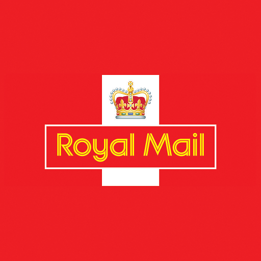
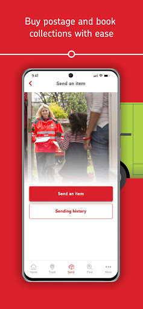
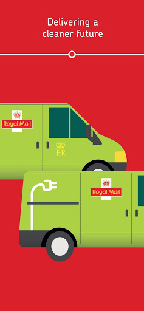
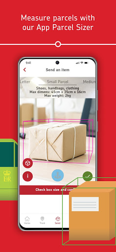
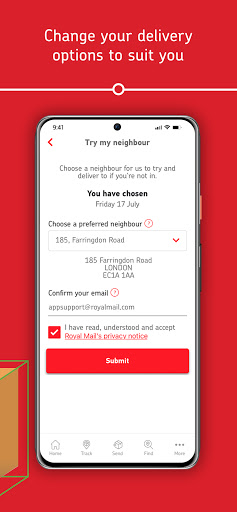
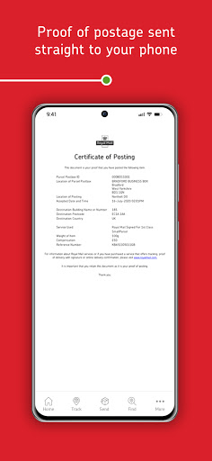
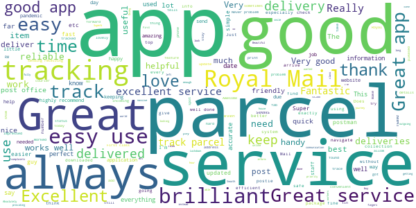
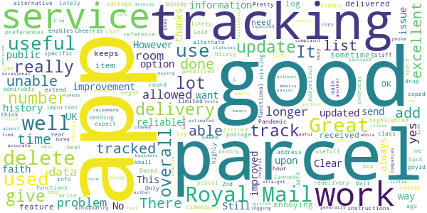
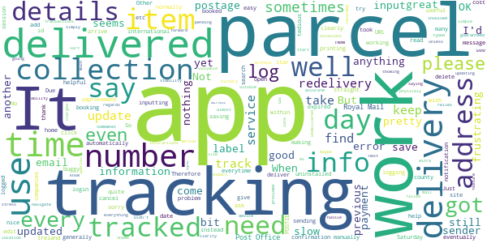

# Royal Mail - Tracking, redelivery, prices
App version ``9.0.4``

Analyzed with [covid-apps-observer](http://github.com/covid-apps-observer) project, version ``0.1``

## App overview
| | |
|-------------------------|-------------------------| 
| **Name**&nbsp;&nbsp;&nbsp;&nbsp;&nbsp;&nbsp;&nbsp;&nbsp;&nbsp;&nbsp;&nbsp;&nbsp;&nbsp;&nbsp;&nbsp;&nbsp;&nbsp;&nbsp;&nbsp;&nbsp;&nbsp;&nbsp;&nbsp;&nbsp;&nbsp;&nbsp;&nbsp;&nbsp;&nbsp;&nbsp;&nbsp;&nbsp;&nbsp;&nbsp;&nbsp;&nbsp;&nbsp;&nbsp;&nbsp;&nbsp;  | Royal Mail - Tracking, redelivery, prices |
| **Unique identifier** | com.royalmail.app.droid |
| **Link to Google Play** | [https://play.google.com/store/apps/details?id=com.royalmail.app.droid](https://play.google.com/store/apps/details?id=com.royalmail.app.droid) |
| **Summary**  | Easily manage your items and track your deliveries |
| **Privacy policy** | [https://www.royalmail.com/privacy-notice](https://www.royalmail.com/privacy-notice) |
| **Latest version** | 9.0.4 |
| **Last update** | 2021-06-30 16:07:50 |
| **Recent changes** | In this latest update of the Royal Mail App, we’ve improved our Redelivery journey which makes booking a new delivery date for missed items even easier. We’ve also refreshed our home screen, adding in a scrolling carousel to take you to your favourite journeys including Services Near You where you will now find Parcelforce Worldwide locations |
| **Installs**  | 1,000,000+ |
| **Category** | Lifestyle |
| **First release** | Sep 4, 2018 |
| **Size**  | 61M |
| **Supported Android version**  | 8.0 and up |

### Description
> The Royal Mail App 📮 Track and send parcels, book collections and find your local Postboxes and other Royal Mail services with ease. Royal Mail at your fingertips.
 Track an Item: 
 •	Simply enter your Royal Mail tracking ID or scan the barcode and we’ll notify you on the progress of your delivery.
 Send an Item:
 •	Quickly and easily buy postage in just a few steps. You can either print your own labels at home or take the QR code on the app to one of our Delivery Office Customer Service Points and have your label printed for free.
 Book a Collection:
 •	We’re making sending parcels even easier! Book our new Parcel Collect service with the Royal Mail App or online with Click & Drop, then simply choose a date and we’ll come to you.
 Services Near You:
 •	We can help you find your nearest drop-off location - Postbox, Parcel Postbox (available 24/7), Royal Mail Delivery Office or Post Office branch including collection times and opening hours.
 Book a Redelivery:
 •	Missed a delivery? Using the Royal Mail App, you can easily book a Redelivery to your address, your neighbour’s address or a local Post Office – and you pick the delivery day! 
 Change Your Delivery Options to Suit You:
 •	You can now change where your parcel is delivered, to a Safeplace or neighbour after it has been sent.
 Many More Great Features:
 •	Find the size and format of your parcel using our Augmented Reality Parcel Sizer;
 •	See a photograph of the signature if someone has signed for it, or the Safeplace an item has been delivered to;
 •	Get proof of postage sent straight to your phone – get that extra peace of mind when dropping off at any of our locations including Parcel Postboxes;
 •	Save items you are tracking and add an alias name making them easier to identify;
 •	Save postage receipts – simply take a photo of your receipt and store it to the app;
 •	Postcode and address finder – if you’re not sure of a full address, or want to check a postcode, just enter part of the address and we’ll fill in the blanks.
 •	Click & Drop – the Royal Mail App and Click & Drop work hand in hand, making your interactions more seamless with one login.
 •	Alexa integration – if you have an Alexa, you can track your item using a nickname you have previously assigned to an item.

### User interface
The developers of the app provide the following screenshots in the Google play store.
| | | |
|:-------------------------:|:-------------------------:|:-------------------------:|
 |   |   |   | 
 |   |   |   | 
 |   |  

## Development team
In the following we report the main information provided by the development team in the Google play store.

| | |
|-------------------------|-------------------------|
| **Developer**  | Royal Mail Group |
| **Website**  | [https://www.royalmail.com](https://www.royalmail.com) |
| **Email** | appfeedback@royalmail.com |
| **Physical address**  | - |
| **Other developed apps**  | [https://play.google.com/store/apps/developer?id=Royal+Mail+Group](https://play.google.com/store/apps/developer?id=Royal+Mail+Group) |

## Android support

| | |
|-------------------------|-------------------------|
| **Declared target Android version**  | Android10, version 10 (API level 29) |
| **Effective target Android version**  | Android10, version 10 (API level 29) |
| **Minimum supported Android version**  | Lollipop, version 5.0 (API level 21) |
| **Maximum target Android version**  | - |

The larger the difference between the minimum and maximum supported Android versions, the better. A larger difference means a wider audience. For example, old phones have a very low Android version, so a high minimum supported Android version means that the app cannot be used by users with old phones, thus leading to accessibility problems. 

## Requested permissions

In the following we report the complete list of the permissions requested by the app. 

| **Permission** | **Protection level** | **Description** | 
|-------------------------|-------------------------|-------------------------|
 **android.permission ACCESS_FINE_LOCATION** | :warning:**Dangerous** | Allows an app to access precise location. 
 **android.permission ACCESS_NETWORK_STATE** | Normal | Allows applications to access information about networks. 
 **android.permission CAMERA** | :warning:**Dangerous** | Required to be able to access the camera device. 
 **android.permission INTERNET** | Normal | Allows applications to open network sockets. 
 **android.permission RECEIVE_BOOT_COMPLETED** | Normal | Allows an application to receive the Intent.ACTION_BOOT_COMPLETED that is broadcast after the system finishes booting. 
 **android.permission WAKE_LOCK** | Normal | Allows using PowerManager WakeLocks to keep processor from sleeping or screen from dimming. 
 **android.permission WRITE_EXTERNAL_STORAGE** | :warning:**Dangerous** | Allows an application to write to external storage. 
 **com.google.android.c2dm.permission RECEIVE** | - | - 
 **com.royalmail.app.droid.permission MAPS_RECEIVE** | - | - 

## Mentioned servers

| **Server** | **Registrant** | **Registrant country** | **Creation date** | 
|-------------------------|-------------------------|-------------------------|-------------------------|
 | google.com | Google LLC | :us: US | 1997-09-15 04:00:00 |
 | microsoft.com | Microsoft Corporation | :us: US | 1991-05-02 04:00:00 |
 | tealiumiq.com | Whois Privacy Service | :us: US | 2011-02-09 18:33:06 |
 | googleapis.com | Google LLC | :us: US | 2005-01-25 17:52:26 |

## Security analysis 

Below we report the main security warnings raised by our execution of the [Androwarn](https://github.com/maaaaz/androwarn) security analysis tool.

**Telephony identifiers leakage**
> - This application reads the ISO country code equivalent of the current registered operator's MCC (Mobile Country Code) 
> - This application reads the numeric name (MCC+MNC) of current registered operator 
> - This application reads the operator name 

**Connection interfaces exfiltration**
> - This application reads details about the currently active data network 
> - This application tries to find out if the currently active data network is metered 

**Suspicious connection establishment**
> - This application opens a Socket and connects it to the remote address '' on the 'N/A' port  
> - This application opens a Socket and connects it to the remote address 'Ljava/lang/StringBuilder;->toString()Ljava/lang/String;' on the 'N/A' port  
> - This application opens a Socket and connects it to the remote address 'Ljava/net/Proxy;->type()Ljava/net/Proxy$Type;' on the 'N/A' port  
> - This application opens a Socket and connects it to the remote address 'timeout' on the 'N/A' port  

**Code execution**
> - This application loads a native library 
> - This application loads a native library: 'ar-runtime-jni' 
> - This application loads a native library: 'arcore_sdk_jni' 
> - This application loads a native library: 'arsceneview_jni' 
> - This application loads a native library: 'filament-jni' 
> - This application loads a native library: 'monodroid' 
> - This application loads a native library: 'monosgen-2.0' 
> - This application loads a native library: 'xamarin-app' 
> - This application loads a native library: 'xamarin-debug-app-helper' 

## User ratings and reviews

Below we provide information about how end users are reacting to the app in terms of ratings and reviews in the Google Play store.

### Ratings

The Royal Mail - Tracking, redelivery, prices app has been installed by more than **1000000** times. At this time, **10755** rated the app and its average score is **4.522172**. Below we show the distribution of the ratings across the usual star-based rating of Google Play

:star::star::star::star::star:: 8265

:star::star::star::star:: 1294

:star::star::star:: 389

:star::star:: 165

:star:: 642

### Reviews 

#### 5-star reviews

> Great as always  :date: __2021-07-03 16:29:22__

> Awesome.  :date: __2021-07-03 12:32:31__

> Super little app, easy access to tracking details and much more. I like that you can assign nick names to your tracking details. instead of looking for VU65784889GB, you just look for, say... Levi's or John Lewis. Great for ebayers who have lots of delivery info....  :date: __2021-07-03 03:56:40__

> Absolutely brilliant app. Track your parcel is easy.  :date: __2021-07-02 14:40:12__

> excellent service  :date: __2021-07-02 11:37:16__

> Always positive and straightforward  :date: __2021-07-02 09:44:26__

> just works.  :date: __2021-07-02 00:57:37__

> I love our Beautiful Queen, I love all of the workers out there and I Love our beautiful Royal Family and I love this app. Thank you to the very royal designers and creators of this app 😀 I am in Love with it. Thank you so much your amazing  :date: __2021-07-01 21:43:18__

> I'm house bound and this is my first time using - so fingers crossed 🙂  :date: __2021-07-01 20:47:39__

> Always gets here, always trustable  :date: __2021-07-01 08:51:21__

#### 4-star reviews

> Cannot be beat  :date: __2021-07-04 12:43:28__

> It works for me, for the functions I use.  :date: __2021-06-30 09:55:35__

> Based on tracking only (haven't used it for sending) and address checks (one is allowed 50). 4 * because lately the reference number for 2nd class parcels and some 48 hour tracked mail (which used to give very limited data) no longer give any data (yes, this is more of a Royal Mail system problem than an app-specific problem).  :date: __2021-06-27 10:18:18__

> room for improvement but, highly useful  :date: __2021-06-26 10:51:14__

> Good service all round  :date: __2021-06-26 09:52:55__

> Used only for parcel tracking. Works fine for that  :date: __2021-06-24 15:18:44__

> it works well it's really good being able to c where your package is.  :date: __2021-06-23 08:39:17__

> Great! Gives all info and enables you to add preferences. Only issue is no redelivery history, and no option to add picture of alternative safe drop-off space. Cheerrss  :date: __2021-06-19 22:12:07__

> No alternate delivery instructions permitted  :date: __2021-06-15 19:28:08__

> Clear,but box to write to chat in is so small,yet the not so important information is highlighted.  :date: __2021-06-12 07:20:16__

#### 3-star reviews

> Logs me out almost every time which is frustrating, on a few occasions transactions have failed yet I still got charged for postage. No email confirmations or anything. It is easy to use and navigate through but its somewhat buggy and needs a bit more stability in regards to making payments and logging in.  :date: __2021-07-01 01:56:41__

> Simple and straight forward, however having to manually add your sending address for every parcel is more hassle than it should be  :date: __2021-06-30 13:13:38__

> I don't know what is going on with this app,is give me this message.... the session expired..please login again,if you are not use the royal mail app for a while, everything else is working without any problems,please sort out this problem,thank you  :date: __2021-06-28 23:31:36__

> Good. ..  :date: __2021-06-18 00:29:05__

> Keeps saying sorry you've logged out on start up. Just simply ask for log in  :date: __2021-06-15 10:53:58__

> OK, but not live tracking like many other delivery companies.  :date: __2021-06-05 09:58:56__

> It's a shame they don't read instructions on where to deliver your parcel if you are not at home  :date: __2021-06-03 10:27:49__

> App is useful. However, I wish that you could delete parcels at any time, even if it hasn't been delivered yet.  :date: __2021-06-02 20:12:17__

> It is OK, but sometimes the tracking isn't updated and when booking a redelivery it says it is still pending  :date: __2021-05-29 14:24:40__

> please sync across all device for undelivered "recorded mail" search history  :date: __2021-05-28 18:22:04__

#### 2-star reviews

> Had a parcel redirected to local post office on Thursday so I could collect Saturday . Got an email saying that it would be their , so went do at 10 o'clock an the reference on the email is not recognised by post office .  :date: __2021-07-03 12:19:24__

> Tracking never works! only ever tells me that an item has been delivered. Also now have to login everytime which is extremely annoying.  :date: __2021-07-02 10:35:05__

> Does not work on my Samsung  :date: __2021-06-30 08:55:33__

> Very poor app I have had parcels delivered but the app says sorry we have no information on this delivery try again tomorrow? I've also tried tracking a new delivery only to get the same message I've used this app for a very long time now but since the latest update everything has gone down hill. What good is a tracking app that doesn't track.  :date: __2021-06-28 11:59:08__

> Slow  :date: __2021-06-17 15:34:16__

> A little tricky to navigate, card received for a parcel but with no tracking number, nor anyway of getting feedback eg:with an online help assistant, which would be enormously useful.  :date: __2021-06-16 14:41:16__

> Trying to re book a delivery and when you have to confirm at the end all I get is an error message. The app is rubbish it doesn't work  :date: __2021-06-12 12:11:28__

> Tries to go through send process but everyone I tapped confirm button it would open the same page again  :date: __2021-06-03 12:07:13__

> Royal mail is rubbish especially when delivering anything from Moonpig for family and friends. Get notification saying delivered on 22nd, luckily I checked with my friend today as card I sent was not received by her. Your service is utter rubbish  :date: __2021-05-23 09:44:37__

> It's usable, but normally takes a lot of input to get anything done. I'd probably rate it 3 or 4 stars, but it's just so far off the dpd app.  :date: __2021-05-20 12:29:47__

#### 1-star reviews

> Forcing you to register to track items. You can only track 2 items without registering. Completely annoying. 1 star I would give 0 if I could.  :date: __2021-07-02 11:16:32__

> "An update will be provided only when we deliver your item". Tracking - we've heard of that...  :date: __2021-07-01 23:52:33__

> Absolutely useless  :date: __2021-07-01 18:46:49__

> cant deliver on time  :date: __2021-07-01 16:51:51__

> Garbage. Tryed to register account. Says my email is already registered. Okay so i request to change password to my email address but no email arrives to change it. Useless from the get go just like the postal service. Had no mail all week. Numerous items paid for are in limbo somewhere within the service.  :date: __2021-07-01 16:03:36__

> Will not let you log out  :date: __2021-06-30 14:32:32__

> Unable to even log in... useless  :date: __2021-06-30 14:26:56__

> Does not work with QR code as instructed  :date: __2021-06-29 16:58:24__

> Very poor,doesn't track your parcel always saying the same thing no information on this item until we try to deliver,after delivery it still says the same thing complete pointless app  :date: __2021-06-29 09:04:42__

> What a total waste of time this is! I wouldn't trust these developer's to knock up a pot noodle.  :date: __2021-06-29 00:06:49__

