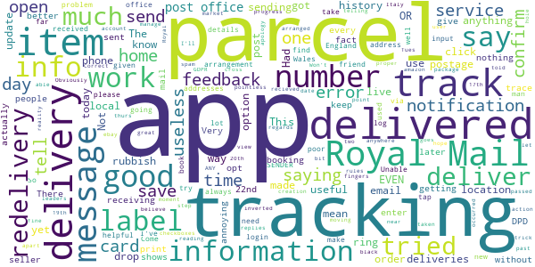

# Royal Mail - Tracking, redelivery, prices
App version ``9.1.1``

Analyzed with [covid-apps-observer](http://github.com/covid-apps-observer) project, version ``0.1``

## App overview
| | |
|-------------------------|-------------------------| 
| **Name**&nbsp;&nbsp;&nbsp;&nbsp;&nbsp;&nbsp;&nbsp;&nbsp;&nbsp;&nbsp;&nbsp;&nbsp;&nbsp;&nbsp;&nbsp;&nbsp;&nbsp;&nbsp;&nbsp;&nbsp;&nbsp;&nbsp;&nbsp;&nbsp;&nbsp;&nbsp;&nbsp;&nbsp;&nbsp;&nbsp;&nbsp;&nbsp;&nbsp;&nbsp;&nbsp;&nbsp;&nbsp;&nbsp;&nbsp;&nbsp;  | Royal Mail - Tracking, redelivery, prices |
| **Unique identifier** | com.royalmail.app.droid |
| **Link to Google Play** | [https://play.google.com/store/apps/details?id=com.royalmail.app.droid](https://play.google.com/store/apps/details?id=com.royalmail.app.droid) |
| **Summary**  | Easily manage your items and track your deliveries |
| **Privacy policy** | [https://www.royalmail.com/privacy-notice](https://www.royalmail.com/privacy-notice) |
| **Latest version** | 9.1.1 |
| **Last update** | 2021-07-08 15:47:46 |
| **Recent changes** | We’ve made changes to our opening hours, now making us even more accessible at times that better suit you. Please check out Services Near You for our new opening hours. |
| **Installs**  | 1,000,000+ |
| **Category** | Lifestyle |
| **First release** | Sep 4, 2018 |
| **Size**  | 61M |
| **Supported Android version**  | 8.0 and up |

### Description
> The Royal Mail App 📮 Track and send parcels, book collections and find your local Postboxes and other Royal Mail services with ease. Royal Mail at your fingertips.
 Track an Item: 
 •	Simply enter your Royal Mail tracking ID or scan the barcode and we’ll notify you on the progress of your delivery.
 Send an Item:
 •	Quickly and easily buy postage in just a few steps. You can either print your own labels at home or take the QR code on the app to one of our Delivery Office Customer Service Points and have your label printed for free.
 Book a Collection:
 •	We’re making sending parcels even easier! Book our new Parcel Collect service with the Royal Mail App or online with Click & Drop, then simply choose a date and we’ll come to you.
 Services Near You:
 •	We can help you find your nearest drop-off location - Postbox, Parcel Postbox (available 24/7), Royal Mail Delivery Office or Post Office branch including collection times and opening hours.
 Book a Redelivery:
 •	Missed a delivery? Using the Royal Mail App, you can easily book a Redelivery to your address, your neighbour’s address or a local Post Office – and you pick the delivery day! 
 Change Your Delivery Options to Suit You:
 •	You can now change where your parcel is delivered, to a Safeplace or neighbour after it has been sent.
 Many More Great Features:
 •	Find the size and format of your parcel using our Augmented Reality Parcel Sizer;
 •	See a photograph of the signature if someone has signed for it, or the Safeplace an item has been delivered to;
 •	Get proof of postage sent straight to your phone – get that extra peace of mind when dropping off at any of our locations including Parcel Postboxes;
 •	Save items you are tracking and add an alias name making them easier to identify;
 •	Save postage receipts – simply take a photo of your receipt and store it to the app;
 •	Postcode and address finder – if you’re not sure of a full address, or want to check a postcode, just enter part of the address and we’ll fill in the blanks.
 •	Click & Drop – the Royal Mail App and Click & Drop work hand in hand, making your interactions more seamless with one login.
 •	Alexa integration – if you have an Alexa, you can track your item using a nickname you have previously assigned to an item.

### User interface
The developers of the app provide the following screenshots in the Google play store.
| | | |
|:-------------------------:|:-------------------------:|:-------------------------:|
 |   |   |   | 
 |   |   |   | 
 |   |  

## Development team
In the following we report the main information provided by the development team in the Google play store.

| | |
|-------------------------|-------------------------|
| **Developer**  | Royal Mail Group |
| **Website**  | [https://www.royalmail.com](https://www.royalmail.com) |
| **Email** | appfeedback@royalmail.com |
| **Physical address**  | - |
| **Other developed apps**  | [https://play.google.com/store/apps/developer?id=Royal+Mail+Group](https://play.google.com/store/apps/developer?id=Royal+Mail+Group) |

## Android support

| | |
|-------------------------|-------------------------|
| **Declared target Android version**  | - |
| **Effective target Android version**  | - |
| **Minimum supported Android version**  | Oreo, version 8.0.0 (API level 26) |
| **Maximum target Android version**  | - |

The larger the difference between the minimum and maximum supported Android versions, the better. A larger difference means a wider audience. For example, old phones have a very low Android version, so a high minimum supported Android version means that the app cannot be used by users with old phones, thus leading to accessibility problems. 

## Requested permissions

In the following we report the complete list of the permissions requested by the app. 

| **Permission** | **Protection level** | **Description** | 
|-------------------------|-------------------------|-------------------------|
 **android.permission ACCESS_FINE_LOCATION** | :warning:**Dangerous** | Allows an app to access precise location. 
 **android.permission ACCESS_NETWORK_STATE** | Normal | Allows applications to access information about networks. 
 **android.permission CAMERA** | :warning:**Dangerous** | Required to be able to access the camera device. 
 **android.permission FOREGROUND_SERVICE** | Normal | Allows a regular application to use Service.startForeground. 
 **android.permission INTERNET** | Normal | Allows applications to open network sockets. 
 **android.permission USE_BIOMETRIC** | Normal | Allows an app to use device supported biometric modalities. 
 **android.permission USE_FINGERPRINT** | Normal | This constant was deprecated in API level 28. Applications should request USE_BIOMETRIC instead 
 **android.permission WAKE_LOCK** | Normal | Allows using PowerManager WakeLocks to keep processor from sleeping or screen from dimming. 
 **android.permission WRITE_EXTERNAL_STORAGE** | :warning:**Dangerous** | Allows an application to write to external storage. 
 **com.google.android.c2dm.permission RECEIVE** | - | - 
 **com.royalmail.app.droid.permission MAPS_RECEIVE** | - | - 

## Mentioned servers

| **Server** | **Registrant** | **Registrant country** | **Creation date** | 
|-------------------------|-------------------------|-------------------------|-------------------------|
 | google.com | Google LLC | :us: US | 1997-09-15 04:00:00 |
 | microsoft.com | Microsoft Corporation | :us: US | 1991-05-02 04:00:00 |
 | tealiumiq.com | Whois Privacy Service | :us: US | 2011-02-09 18:33:06 |
 | tiqcdn.com | Whois Privacy Service | :us: US | 2012-07-11 23:06:45 |
 | googleapis.com | Google LLC | :us: US | 2005-01-25 17:52:26 |

## Security analysis 

Below we report the main security warnings raised by our execution of the [Androwarn](https://github.com/maaaaz/androwarn) security analysis tool.

**Telephony identifiers leakage**
> - This application reads the ISO country code equivalent of the current registered operator's MCC (Mobile Country Code) 
> - This application reads the MCC+MNC of the provider of the SIM 
> - This application reads the numeric name (MCC+MNC) of current registered operator 
> - This application reads the operator name 

**Connection interfaces exfiltration**
> - This application reads details about the currently active data network 
> - This application tries to find out if the currently active data network is metered 

**Suspicious connection establishment**
> - This application opens a Socket and connects it to the remote address '' on the 'N/A' port  
> - This application opens a Socket and connects it to the remote address 'Ljava/lang/StringBuilder;->toString()Ljava/lang/String;' on the 'N/A' port  
> - This application opens a Socket and connects it to the remote address 'Ljava/net/Proxy;->type()Ljava/net/Proxy$Type;' on the 'N/A' port  
> - This application opens a Socket and connects it to the remote address 'timeout' on the 'N/A' port  

**Code execution**
> - This application loads a native library 
> - This application loads a native library: 'Ljava/lang/String;->valueOf(Ljava/lang/Object;)Ljava/lang/String;' 
> - This application loads a native library: 'arcore_sdk_jni' 
> - This application loads a native library: 'arsceneview_jni' 
> - This application loads a native library: 'filament-jni' 
> - This application loads a native library: 'mono-native' 
> - This application loads a native library: 'monodroid' 
> - This application loads a native library: 'monosgen-2.0' 
> - This application loads a native library: 'xamarin-app' 
> - This application loads a native library: 'xamarin-debug-app-helper' 

## User ratings and reviews

Below we provide information about how end users are reacting to the app in terms of ratings and reviews in the Google Play store.

### Ratings

The Royal Mail - Tracking, redelivery, prices app has been installed by more than **1000000** times. At this time, **11230** rated the app and its average score is **4.4338174**. Below we show the distribution of the ratings across the usual star-based rating of Google Play

:star::star::star::star::star:: 8479

:star::star::star::star:: 1266

:star::star::star:: 364

:star::star:: 124

:star:: 997

### Reviews 

#### 5-star reviews

> fast delivery great postie thanks  :date: __2021-07-23 14:29:12__

> Awesome  :date: __2021-07-23 13:39:14__

> tracking system very easy to use and follow  :date: __2021-07-23 10:51:57__

> very useful and saves me so much hassle 🙂  :date: __2021-07-22 21:30:54__

> Love Royal mail  :date: __2021-07-22 16:03:47__

> Royal Mail are the best and the app has all the information you need.  :date: __2021-07-22 13:11:17__

> Great App  :date: __2021-07-22 07:56:20__

> This is a great app for taking care of all my deliveries.  :date: __2021-07-21 01:22:28__

> great  :date: __2021-07-20 13:04:08__

> has been great for tracking my parcels and redelivery if needed. quick easy and also gives option to receive notifications.  :date: __2021-07-20 12:54:24__

#### 4-star reviews

> it's a very good service and helpful indeed  :date: __2021-07-23 13:54:38__

> Working OK now  :date: __2021-07-22 13:59:45__

> Great app. Does what it says on the tin. No issues for me as I'm not expecting it to do something it's not designed to do. Im amazed people are moaning about covid postboxes being closed and them having to walk 40 mins! It's hardly a marathon and if you read the instructions on the home kit correctly you can arrange a free courier collection from anywhere in the country. Also why order a home kit if you know the post box has been closed nine years!!  :date: __2021-07-21 04:06:54__

> Does job  :date: __2021-07-16 10:20:04__

> Good service for keeping your eye 👁 on a delivery  :date: __2021-07-16 08:05:05__

> Its been good for me not perfect but worth 4stars in my experience.  :date: __2021-07-14 18:22:57__

> Based on tracking only (haven't used it for sending) and address checks (one is allowed 50). 4 * because sometimes the numbers for 2nd class parcels and some 48 hour tracked mail (which used to give very limited data) no longer give any data (this is more of a Royal Mail system problem than an app-specific problem, but it reduces the usefulness of the tracking app if one can't use it to track common classes of mail; note that 2nd class parcels don't have tracking numbers, but reference numbers).  :date: __2021-07-13 18:39:20__

> Great app. can track and trace my packages very quickly and easily !!  :date: __2021-07-10 11:49:46__

> quick and easy to track a package  :date: __2021-07-08 08:29:38__

> filling in details and getting the app to accept ie took 12 attempts to get telephone number acceptd before continuing to next line. Total frustration when the objective is to SAVE TIME.  :date: __2021-07-07 12:59:57__

#### 3-star reviews

> Delivery card contained delivery officer initial and duty# but no reference #. The system isn't joined up as it didn't allow me to provide that info. It got me to install the app and grab my personal info of course... ? App simply indicated an error when I tried to schedule a redelivery date but gave no reason. Update: useful to find priority post boxes for Covid tests. Even then it's a GUI screwup as it's ambiguously under "find a drop off location" from which PO collects - like a postbox.  :date: __2021-07-22 15:42:40__

> Gets the job done, but annoying that you need to type your OWN address in and pay individually (even when logged in) EVERY TIME. Also be nice if you could do international postage.  :date: __2021-07-21 10:22:13__

> Wuuzz  :date: __2021-07-17 15:58:04__

> Very slow on updating the tracking side of things.  :date: __2021-07-14 09:57:35__

> Fix error when looking at send history. Every item shows message 'Sorry, an error occurred while processing your request'  :date: __2021-07-13 12:05:06__

> The proof of postage section is no longer working. I get an error when accessing it. Please fix as soon as possible as I need to supply proof to a customer.  :date: __2021-07-12 22:49:04__

> It was good but now I cant even open the app now, checked if it needs to be updated but all updated and still nothing  :date: __2021-07-12 17:26:03__

> Already had a Royal Mail account from having bought stamps some years back and so it was fairly easy installing and setting up. setting up a redelivery was fairly easy and a tracking number in a text message opens seamlessly in the app. Great thus far.  :date: __2021-07-11 10:27:47__

> quite buggy at times  :date: __2021-07-06 13:17:00__

> Logs me out almost every time which is frustrating, on a few occasions transactions have failed yet I still got charged for postage. No email confirmations or anything. It is easy to use and navigate through but its somewhat buggy and needs a bit more stability in regards to making payments and logging in.  :date: __2021-07-01 01:56:41__

#### 2-star reviews

> I was able to track progress every step of the way from Italy until the item was passed to Royal Mail, then apart from an apology, nothing. I'll have to cross my fingers and hope it gets delivered.  :date: __2021-07-23 10:12:20__

> I was told the parcel was to be delivered on Tues 20th and made arrangements to be in, when in fact it was actually delivered on thurs 22nd.  :date: __2021-07-22 16:15:22__

> track and trace is pointless. when you enter your track and trace number , it just replies, we haven't tried to deliver your item yet so we can't track it...🤣🤣🤣🤣  :date: __2021-07-22 10:44:32__

> Had first requested redelivery.Found difficult to find without app.And in Covid mode extremely lengthy process arranging services like redelivery for inform aged real pergatory!Does not ever update at all basically ap is a shambles.  :date: __2021-07-19 14:21:24__

> live tracking (like amazon) would be great. also I recieved a notification today (19th) to say my package has been delivered .... on the 17th. Correct date but what's the point telling me two days later!  :date: __2021-07-19 11:32:59__

> Won't let me view past orders in sending history to print off postage labels just says an error has occurred  :date: __2021-07-14 15:41:06__

> I don't like the fact that you give the seller a tracking number on ebay that ROYAL MAIL CAN'T EVEN TRACK OR GIVE ANY INFORMATION OR SERVICE.  :date: __2021-07-13 13:19:57__

> Had arranged redirection to PO but an attempt was made to deliver to house. The app shows the instruction clearly. Very annoying. Don't dare risk Nother arrangement. Would be good to know when ordering if it is going via Royal Mail so we could order elsewhere.  :date: __2021-07-12 14:49:31__

> Had a parcel redirected to local post office on Thursday so I could collect Saturday . Got an email saying that it would be their , so went do at 10 o'clock an the reference on the email is not recognised by post office .  :date: __2021-07-03 12:19:24__

> Tracking never works! only ever tells me that an item has been delivered. Also now have to login everytime which is extremely annoying.  :date: __2021-07-02 10:35:05__

#### 1-star reviews

> This item has been sat in the local delivery office (less than 1.5 miles away!!!) for 3 days . It's not a big parcel and I have now received 3 different alerts that it's due for delivery. This is fairly typical of this service. Not impressed (which is also fairly typical). Private delivery services do much better - perhaps there is something to be learned from them ...???  :date: __2021-07-23 07:42:04__

> Track something nah just an excuse why updates may not be available disappointing for a delivery service  :date: __2021-07-22 08:21:03__

> Hardly a tracking app, when you can't track a parcel until its been delivered!  :date: __2021-07-21 18:19:19__

> Bad cannot even get my name inputted !  :date: __2021-07-21 16:48:36__

> says number not valid  :date: __2021-07-21 15:33:43__

> no information on tracked parcel  :date: __2021-07-20 21:30:24__

> Less functionality than the website if you don't have an account  :date: __2021-07-19 16:30:28__

> Next to useless.  :date: __2021-07-19 16:24:55__

> never deliver on time always losing the parcels or letters the company don't deserve the name Royal Mail  :date: __2021-07-19 14:06:37__

> I have click and drop on my pc which work's fine. After installing app it refuses to recognise my log in details. If I try to re-register it says my email address is already registered!!?? Have tried changing password, re-installing app etc. Useless! Have given up and deleted app. A few months on and the app still doesn't recognise my login details so have deleted it again!!!  :date: __2021-07-19 12:26:07__

