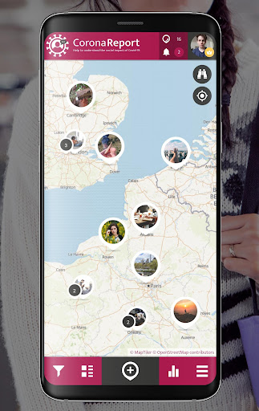
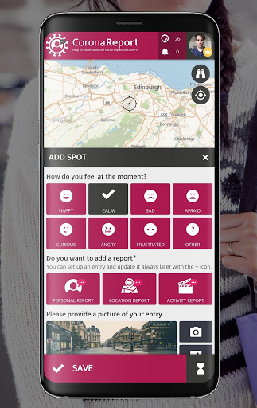
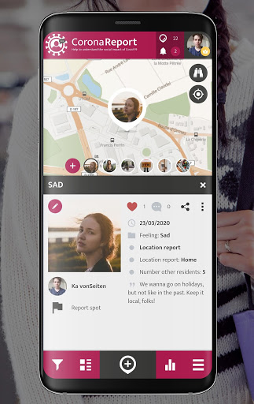
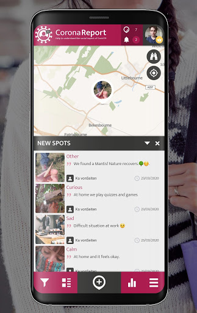
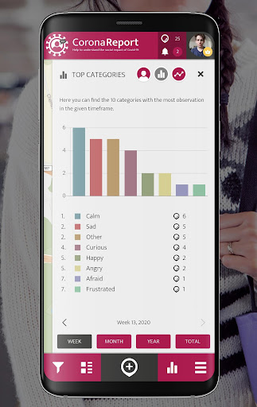
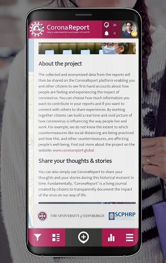
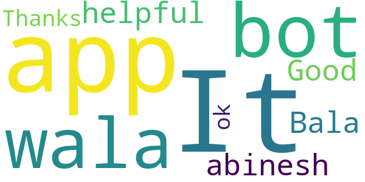
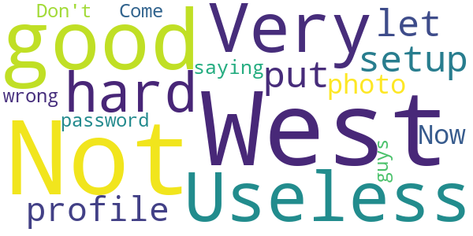

# CoronaReport - COVID-19 reports for Social Science
App version ``2.9.6``

Analyzed with [covid-apps-observer](http://github.com/covid-apps-observer) project, version ``0.1``

## App overview
| | |
|-------------------------|-------------------------| 
| **Name**&nbsp;&nbsp;&nbsp;&nbsp;&nbsp;&nbsp;&nbsp;&nbsp;&nbsp;&nbsp;&nbsp;&nbsp;&nbsp;&nbsp;&nbsp;&nbsp;&nbsp;&nbsp;&nbsp;&nbsp;&nbsp;&nbsp;&nbsp;&nbsp;&nbsp;&nbsp;&nbsp;&nbsp;&nbsp;&nbsp;&nbsp;&nbsp;&nbsp;&nbsp;&nbsp;&nbsp;&nbsp;&nbsp;&nbsp;&nbsp;  | CoronaReport - COVID-19 reports for Social Science |
| **Unique identifier** | com.spotteron.coronareport |
| **Link to Google Play** | [https://play.google.com/store/apps/details?id=com.spotteron.coronareport](https://play.google.com/store/apps/details?id=com.spotteron.coronareport) |
| **Summary**  | Citizen-led democratic reporting on the Coronavirus. Share your story. |
| **Privacy policy** | [https://www.spotteron.net/terms-of-use](https://www.spotteron.net/terms-of-use) |
| **Latest version** | 2.9.6 |
| **Last update** | 2020-06-11 03:36:19 |
| **Recent changes** | Minor change in imprint: Data Protection Officer Name updated |
| **Installs**  | 5,000+ |
| **Category** | Health & Fitness |
| **First release** | Mar 23, 2020 |
| **Size**  | 17M |
| **Supported Android version**  | 4.4 and up |

### Description
> CoronaReport is a citizen science project developed by the Scottish Collaboration for Public Health Research and Policy (SCPHRP), and the University of Edinburgh. Citizens can record their experiences of the disease, and the effects on their lives. The app is not intended to be used for/in emergencies or for diagnostics/medical purposes.
 Coronavirus (COVID-19) is the viral pandemic affecting communities worldwide. The pandemic’s impacts are varied and substantial. CoronaReport is a citizen science project which democratizes the reporting on the Coronavirus, and makes these reports accessible to other citizens. You can create public reports about your experiences, including how the virus is affecting your area and the way your community functions (e.g., schools, nursing homes, and businesses).
 About the project
 The collected and anonymized data from the reports will then be shared on the CoronaReport platform enabling you and other citizens to see first-hand accounts about how people are feeling and experiencing the impact of coronavirus. You can choose how much information you want to contribute to your reports and if you want to connect with others to share experiences. By working together citizens can build a real-time and vivid picture of how coronavirus is influencing the way people live and work. For example, we do not know the extent to which countermeasures like social distancing are being practised and how this, and other countermeasures, are affecting people’s well-being. Find out more about the project on the website: www.coronareport.global
 The project is running on the SPOTTERON Citizen Science Platform.

### User interface
The developers of the app provide the following screenshots in the Google play store.
| | | |
|:-------------------------:|:-------------------------:|:-------------------------:|
 |   |   |   | 
 |   |   |   | 
 |  

## Development team
In the following we report the main information provided by the development team in the Google play store.

| | |
|-------------------------|-------------------------|
| **Developer**  | SPOTTERON |
| **Website**  | [https://www.spotteron.net](https://www.spotteron.net) |
| **Email** | office@spotteron.net |
| **Physical address**  | [Faßziehergasse 5, 1070 Wien](https://www.google.com/maps/search/Faßziehergasse%205,%201070%20Wien) (Google Maps) |
| **Other developed apps**  | [https://play.google.com/store/apps/developer?id=6074809323558115618](https://play.google.com/store/apps/developer?id=6074809323558115618) |

## Android support

| | |
|-------------------------|-------------------------|
| **Declared target Android version**  | Pie, version 9 (API level 28) |
| **Effective target Android version**  | Pie, version 9 (API level 28) |
| **Minimum supported Android version**  | KitKat, version 4.4 - 4.4.4 (API level 19) |
| **Maximum target Android version**  | - |

The larger the difference between the minimum and maximum supported Android versions, the better. A larger difference means a wider audience. For example, old phones have a very low Android version, so a high minimum supported Android version means that the app cannot be used by users with old phones, thus leading to accessibility problems. 

## Requested permissions

In the following we report the complete list of the permissions requested by the app. 

| **Permission** | **Protection level** | **Description** | 
|-------------------------|-------------------------|-------------------------|
 **android.permission ACCESS_COARSE_LOCATION** | :warning:**Dangerous** | Allows an app to access approximate location. 
 **android.permission ACCESS_FINE_LOCATION** | :warning:**Dangerous** | Allows an app to access precise location. 
 **android.permission ACCESS_NETWORK_STATE** | Normal | Allows applications to access information about networks. 
 **android.permission INTERNET** | Normal | Allows applications to open network sockets. 
 **android.permission READ_APP_BADGE** | - | - 
 **android.permission VIBRATE** | Normal | Allows access to the vibrator. 
 **android.permission WAKE_LOCK** | Normal | Allows using PowerManager WakeLocks to keep processor from sleeping or screen from dimming. 
 **android.permission WRITE_EXTERNAL_STORAGE** | :warning:**Dangerous** | Allows an application to write to external storage. 
 **com.anddoes.launcher.permission UPDATE_COUNT** | - | - 
 **com.google.android.c2dm.permission RECEIVE** | - | - 
 **com.htc.launcher.permission READ_SETTINGS** | - | - 
 **com.htc.launcher.permission UPDATE_SHORTCUT** | - | - 
 **com.huawei.android.launcher.permission CHANGE_BADGE** | - | - 
 **com.huawei.android.launcher.permission READ_SETTINGS** | - | - 
 **com.huawei.android.launcher.permission WRITE_SETTINGS** | - | - 
 **com.majeur.launcher.permission UPDATE_BADGE** | - | - 
 **com.oppo.launcher.permission READ_SETTINGS** | - | - 
 **com.oppo.launcher.permission WRITE_SETTINGS** | - | - 
 **com.sec.android.provider.badge.permission READ** | - | - 
 **com.sec.android.provider.badge.permission WRITE** | - | - 
 **com.sonyericsson.home.permission BROADCAST_BADGE** | - | - 
 **com.sonymobile.home.permission PROVIDER_INSERT_BADGE** | - | - 
 **com.spotteron.coronareport.permission C2D_MESSAGE** | - | - 
 **me.everything.badger.permission BADGE_COUNT_READ** | - | - 
 **me.everything.badger.permission BADGE_COUNT_WRITE** | - | - 

## Mentioned servers

| **Server** | **Registrant** | **Registrant country** | **Creation date** | 
|-------------------------|-------------------------|-------------------------|-------------------------|
 | google.com | Google LLC | :us: US | 1997-09-15 04:00:00 |
 | gstatic.com | Google LLC | :us: US | 2008-02-11 15:31:25 |
 | whatsapp.com | Whatsapp Inc. | :us: US | 2008-09-04 12:39:12 |
 | googleapis.com | Google LLC | :us: US | 2005-01-25 17:52:26 |

## Security analysis 

Below we report the main security warnings raised by our execution of the [Androwarn](https://github.com/maaaaz/androwarn) security analysis tool.

**Connection interfaces exfiltration**
> - This application reads details about the currently active data network 
> - This application tries to find out if the currently active data network is metered 

**Telephony services abuse**
> - This application makes phone calls 

**Pim data leakage**
> - This application accesses the downloads folder 
> - This application accesses data stored in the clipboard 

**Code execution**
> - This application loads a native library: 'sqlc-evcore-native-driver' 
> - This application executes a UNIX command containing this argument: 'Ljava/lang/StringBuilder;->toString()Ljava/lang/String;' 

## User ratings and reviews

Below we provide information about how end users are reacting to the app in terms of ratings and reviews in the Google Play store.

### Ratings

The CoronaReport - COVID-19 reports for Social Science app has been installed by more than **5000** times. At this time, **11** rated the app and its average score is **4.6363635**. Below we show the distribution of the ratings across the usual star-based rating of Google Play

:star::star::star::star::star:: 10

:star::star::star::star:: 0

:star::star::star:: 0

:star::star:: 0

:star:: 1

### Reviews 

#### 5-star reviews

> Bala abinesh  :date: __2020-11-08 05:04:51__

> Good  :date: __2020-10-24 10:16:07__

> Thanks ok  :date: __2020-07-19 14:13:24__

#### 4-star reviews

No recent reviews available with 4 stars.

#### 3-star reviews

No recent reviews available with 3 stars.

#### 2-star reviews

No recent reviews available with 2 stars.

#### 1-star reviews

> Don't like  :date: __2020-05-07 23:16:32__

