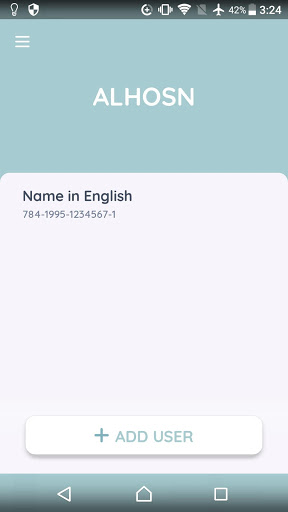
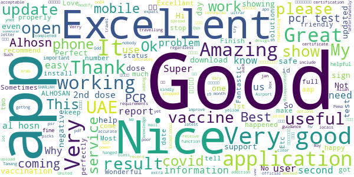

# ALHOSN UAE
App version ``1.44.248``

Analyzed with [covid-apps-observer](http://github.com/covid-apps-observer) project, version ``0.1``

## App overview
| | |
|-------------------------|-------------------------| 
| **Name**&nbsp;&nbsp;&nbsp;&nbsp;&nbsp;&nbsp;&nbsp;&nbsp;&nbsp;&nbsp;&nbsp;&nbsp;&nbsp;&nbsp;&nbsp;&nbsp;&nbsp;&nbsp;&nbsp;&nbsp;&nbsp;&nbsp;&nbsp;&nbsp;&nbsp;&nbsp;&nbsp;&nbsp;&nbsp;&nbsp;&nbsp;&nbsp;&nbsp;&nbsp;&nbsp;&nbsp;&nbsp;&nbsp;&nbsp;&nbsp;  | ALHOSN UAE |
| **Unique identifier** | doh.health.shield |
| **Link to Google Play** | [https://play.google.com/store/apps/details?id=doh.health.shield](https://play.google.com/store/apps/details?id=doh.health.shield) |
| **Summary**  | ALHOSN UAE allows you to keep your COVID-19 results on your mobile device |
| **Privacy policy** | [https://alhosnapp.ae/en/privacy-policy/](https://alhosnapp.ae/en/privacy-policy/) |
| **Latest version** | 1.44.248 |
| **Last update** | 2020-11-10 11:38:29 |
| **Recent changes** | - Improved user experience - App stability |
| **Installs**  | 1,000,000+ |
| **Category** | Medical |
| **First release** | Apr 7, 2020 |
| **Size**  | 12M |
| **Supported Android version**  | 5.0 and up |

### Description
> The ALHOSN UAE app is the official COVID-19 testing channel for health authorities in the United Arab Emirates, by the Ministry of Health and Prevention.
 By using the app, everyone can help stop the spread of COVID-19 and keep their family and friends safe.
  
 You can receive your COVID-19 test results directly on your phone with a unique QR code that is proof of your status and that of everyone else around you who also have the app, giving you peace of mind that you can safely interact.
 The app can also help trace people who may have come within close proximity to confirmed COVID-19 cases for an extended period of time. It uses short-distance Bluetooth signals to determine when your phone is near another phone that also has the app installed.  Both phones exchange anonymized IDs which are then stored in encrypted form on your phone. Using the anonymized IDs, health authorities can quickly identify and contact people at risk of infection so they can be retested.
  
 Put your health in your hands with 3 easy steps:
 1.      Download the ALHOSN UAE app
 2.      Authenticate with your Emirates ID and phone number
 3.      Turn on Bluetooth and push notifications on your smartphone
  
 Download the ALHOSN UAE app today and share it with your family and friends.
 Together, we can stop the spread of COVID-19
 Safer Together.

### User interface
The developers of the app provide the following screenshots in the Google play store.
| | | |
|:-------------------------:|:-------------------------:|:-------------------------:|
 |   |  

## Development team
In the following we report the main information provided by the development team in the Google play store.

| | |
|-------------------------|-------------------------|
| **Developer**  | Ministry of Health and Prevention - UAE |
| **Website**  | [https://alhosnapp.ae/en/contact-us/](https://alhosnapp.ae/en/contact-us/) |
| **Email** | info@alhosnapp.ae |
| **Physical address**  | - |
| **Other developed apps**  | [https://play.google.com/store/apps/developer?id=Ministry+of+Health+and+Prevention+-+UAE](https://play.google.com/store/apps/developer?id=Ministry+of+Health+and+Prevention+-+UAE) |

## Android support

| | |
|-------------------------|-------------------------|
| **Declared target Android version**  | Android10, version 10 (API level 29) |
| **Effective target Android version**  | Android10, version 10 (API level 29) |
| **Minimum supported Android version**  | Lollipop, version 5.0 (API level 21) |
| **Maximum target Android version**  | - |

The larger the difference between the minimum and maximum supported Android versions, the better. A larger difference means a wider audience. For example, old phones have a very low Android version, so a high minimum supported Android version means that the app cannot be used by users with old phones, thus leading to accessibility problems. 

## Requested permissions

In the following we report the complete list of the permissions requested by the app. 

| **Permission** | **Protection level** | **Description** | 
|-------------------------|-------------------------|-------------------------|
 **android.permission ACCESS_BACKGROUND_LOCATION** | :warning:**Dangerous** | Allows an app to access location in the background. 
 **android.permission ACCESS_FINE_LOCATION** | :warning:**Dangerous** | Allows an app to access precise location. 
 **android.permission ACCESS_NETWORK_STATE** | Normal | Allows applications to access information about networks. 
 **android.permission BLUETOOTH** | Normal | Allows applications to connect to paired bluetooth devices. 
 **android.permission BLUETOOTH_ADMIN** | Normal | Allows applications to discover and pair bluetooth devices. 
 **android.permission CAMERA** | :warning:**Dangerous** | Required to be able to access the camera device. 
 **android.permission FOREGROUND_SERVICE** | Normal | Allows a regular application to use Service.startForeground. 
 **android.permission INTERNET** | Normal | Allows applications to open network sockets. 
 **android.permission QUICKBOOT_POWERON** | - | - 
 **android.permission RECEIVE_BOOT_COMPLETED** | Normal | Allows an application to receive the Intent.ACTION_BOOT_COMPLETED that is broadcast after the system finishes booting. 
 **android.permission REQUEST_IGNORE_BATTERY_OPTIMIZATIONS** | Normal | Permission an application must hold in order to use Settings.ACTION_REQUEST_IGNORE_BATTERY_OPTIMIZATIONS. 
 **android.permission WAKE_LOCK** | Normal | Allows using PowerManager WakeLocks to keep processor from sleeping or screen from dimming. 
 **android.permission WRITE_EXTERNAL_STORAGE** | :warning:**Dangerous** | Allows an application to write to external storage. 
 **com.google.android.c2dm.permission RECEIVE** | - | - 

## Mentioned servers

| **Server** | **Registrant** | **Registrant country** | **Creation date** | 
|-------------------------|-------------------------|-------------------------|-------------------------|
 | adobe.com | Adobe Inc. | :us: US | 1986-11-17 05:00:00 |
 | google.com | Google LLC | :us: US | 1997-09-15 04:00:00 |
 | healthshielduae.com | Domains By Proxy, LLC | :us: US | 2020-03-31 19:30:02 |

## Security analysis 

Below we report the main security warnings raised by our execution of the [Androwarn](https://github.com/maaaaz/androwarn) security analysis tool.

**Connection interfaces exfiltration**
> - This application reads details about the currently active data network 
> - This application tries to find out if the currently active data network is metered 

**Suspicious connection establishment**
> - This application opens a Socket and connects it to the remote address 'Li/b/a/a/a;->f(Ljava/lang/String;)Ljava/lang/StringBuilder;' on the 'N/A' port  
> - This application opens a Socket and connects it to the remote address 'Ljava/net/Proxy;->type()Ljava/net/Proxy$Type;' on the 'N/A' port  
> - This application opens a Socket and connects it to the remote address 'hostname == null ' on the 'N/A' port  
> - This application opens a Socket and connects it to the remote address 'timeout' on the 'N/A' port  

**Code execution**
> - This application loads a native library 
> - This application loads a native library: 'tool-checker' 
> - This application executes a UNIX command 
> - This application executes a UNIX command containing this argument: 'getprop' 
> - This application executes a UNIX command containing this argument: 'mount' 

## User ratings and reviews

Below we provide information about how end users are reacting to the app in terms of ratings and reviews in the Google Play store.

### Ratings

The ALHOSN UAE app has been installed by more than **1000000** times. At this time, **6085** rated the app and its average score is **4.3555193**. Below we show the distribution of the ratings across the usual star-based rating of Google Play

:star::star::star::star::star:: 4545

:star::star::star::star:: 543

:star::star::star:: 266

:star::star:: 79

:star:: 652

### Reviews 

#### 5-star reviews

> Help full app  :date: __2021-02-06 19:07:33__

> Good  :date: __2021-02-06 17:19:54__

> Most important apps for uae  :date: __2021-02-06 16:30:33__

> Nice apps  :date: __2021-02-06 16:24:18__

> Most helpful in covid 19 tracking  :date: __2021-02-06 12:04:05__

> Good  :date: __2021-02-06 11:12:28__

> problem not open this application  :date: __2021-02-06 09:40:28__

> Nice app of UAE  :date: __2021-02-06 07:30:37__

> Good  :date: __2021-02-06 05:07:19__

> Nice application...  :date: __2021-02-05 19:08:54__

#### 4-star reviews

> Good  :date: __2021-02-05 07:02:27__

> this app helpful  :date: __2021-02-02 14:57:27__

> I like it 🙂😊  :date: __2021-02-02 04:02:02__

> Excellent  :date: __2021-02-01 05:34:27__

> Why today not working please can you fix  :date: __2021-01-31 10:42:51__

> It's proving difficult to activate the E on the Alhosn app. Some PCR tests are not getting updated without an explanation. Last negative PCR test done with Medcare DUBAI Mirdif city center and UNILABS was not reflecred on AlHosn app.  :date: __2021-01-31 09:23:54__

> How to check vaccine risult  :date: __2021-01-29 12:31:43__

> Good aff  :date: __2021-01-25 05:54:36__

> Help full  :date: __2021-01-25 01:23:01__

> Awesome  :date: __2021-01-24 20:37:12__

#### 3-star reviews

> 2 doses of Vaccination is done. But more than 10 days finished but still not updated in alhosn app. message also come to my mobile regarding vaccination finish. Kindly update  :date: __2021-02-04 19:59:44__

> I don't have an ID card, I'm coming to travel, how do I drive?  :date: __2021-02-04 07:49:26__

> When i take the pcr test its not showing anymore. Now that i have covid19 still not showing.  :date: __2021-02-03 04:42:27__

> Fair  :date: __2021-02-02 12:22:13__

> Too much massage notifications pop up irritating  :date: __2021-01-31 23:15:02__

> First of all nice app very well created app no bug issues amazing, but I don't think Bluetooth and background service is required I mean it makes me feel insecure lol, would give 5 stars if background permission was removed.  :date: __2021-01-31 13:11:49__

> App is continuously loading cannot use the app at the moment.  :date: __2021-01-31 08:35:25__

> The app forces stop when tapping on results .. please fix the issue  :date: __2021-01-31 02:51:54__

> Good  :date: __2021-01-29 04:38:09__

> When i want to view invoice, pdf file is protected and it is asking for password, but nowhere it is mentioned what should i enter, tried with EID no, but doesnt work.  :date: __2021-01-27 09:42:57__

#### 2-star reviews

> Very nice  :date: __2021-02-06 18:08:25__

> The App is battery intensive  :date: __2021-02-06 17:10:02__

> The app doesn't open, just showing the logo  :date: __2021-02-05 00:06:32__

> App used to work but not anymore. I tried setting up my account with no luck and tried sending the error message to the developer email but i bounced back saying the inbox is full. Let me know how to resolve it. Thanks  :date: __2021-01-31 11:15:07__

> I can't opened my Alhons i want the result from here  :date: __2021-01-31 06:18:12__

> Hopeful  :date: __2021-01-29 18:06:23__

> After one month it is not opening  :date: __2021-01-26 11:47:55__

> Battery drain very fast and report didn't get from 12 Jan 2021  :date: __2021-01-26 07:53:12__

> I have had a test with a negative result, and 3 times the hospital asked to update the app, but it is still not updated. There is no way to contact anyone about this problem.  :date: __2021-01-25 08:42:00__

> Sometimes the result not showing accurately  :date: __2021-01-24 15:29:49__

#### 1-star reviews

> not working  :date: __2021-02-06 18:18:39__

> Why don't support Android 11? Please update .i installed 2 time but this apps don't open..  :date: __2021-02-06 18:08:39__

> App doesn't go beyond logo  :date: __2021-02-06 17:52:50__

> My frist report positive update after 2 negative not update  :date: __2021-02-06 17:50:15__

> Stipid app.. keeps showing welcome screen forever 😑 UAE seriously needs to move on from cheap app developers  :date: __2021-02-06 15:30:53__

> Worst customer service ever!!  :date: __2021-02-06 13:56:30__

> التطبيق يتوق٠كثيرا ويستمر التوق٠ساعات او ايام وهذا ÙŠÙقده قيمته واهميته  :date: __2021-02-06 13:41:56__

> تطبيق سيئ جدا جدا ، الحالة لا تحدث وارقام التواصل لا تعمل والبريد الالكتروني ممتلئ !!!  :date: __2021-02-06 12:51:42__

> Slow  :date: __2021-02-06 12:49:11__

> I can't login many times i tried  :date: __2021-02-06 12:38:26__

