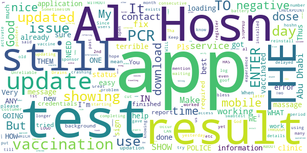

# ALHOSN UAE
App version ``1.44.248``

Analyzed with [covid-apps-observer](http://github.com/covid-apps-observer) project, version ``0.1``

## App overview
| | |
|-------------------------|-------------------------| 
| **Name**&nbsp;&nbsp;&nbsp;&nbsp;&nbsp;&nbsp;&nbsp;&nbsp;&nbsp;&nbsp;&nbsp;&nbsp;&nbsp;&nbsp;&nbsp;&nbsp;&nbsp;&nbsp;&nbsp;&nbsp;&nbsp;&nbsp;&nbsp;&nbsp;&nbsp;&nbsp;&nbsp;&nbsp;&nbsp;&nbsp;&nbsp;&nbsp;&nbsp;&nbsp;&nbsp;&nbsp;&nbsp;&nbsp;&nbsp;&nbsp;  | ALHOSN UAE |
| **Unique identifier** | doh.health.shield |
| **Link to Google Play** | [https://play.google.com/store/apps/details?id=doh.health.shield](https://play.google.com/store/apps/details?id=doh.health.shield) |
| **Summary**  | ALHOSN UAE allows you to keep your COVID-19 results on your mobile device |
| **Privacy policy** | [https://alhosnapp.ae/en/privacy-policy/](https://alhosnapp.ae/en/privacy-policy/) |
| **Latest version** | 1.44.248 |
| **Last update** | 2020-11-10 11:38:29 |
| **Recent changes** | - Improved user experience - App stability |
| **Installs**  | 1,000,000+ |
| **Category** | Medical |
| **First release** | Apr 7, 2020 |
| **Size**  | 12M |
| **Supported Android version**  | 5.0 and up |

### Description
> The ALHOSN UAE app is the official COVID-19 testing channel for health authorities in the United Arab Emirates, by the Ministry of Health and Prevention.
 By using the app, everyone can help stop the spread of COVID-19 and keep their family and friends safe.
  
 You can receive your COVID-19 test results directly on your phone with a unique QR code that is proof of your status and that of everyone else around you who also have the app, giving you peace of mind that you can safely interact.
 The app can also help trace people who may have come within close proximity to confirmed COVID-19 cases for an extended period of time. It uses short-distance Bluetooth signals to determine when your phone is near another phone that also has the app installed.  Both phones exchange anonymized IDs which are then stored in encrypted form on your phone. Using the anonymized IDs, health authorities can quickly identify and contact people at risk of infection so they can be retested.
  
 Put your health in your hands with 3 easy steps:
 1.      Download the ALHOSN UAE app
 2.      Authenticate with your Emirates ID and phone number
 3.      Turn on Bluetooth and push notifications on your smartphone
  
 Download the ALHOSN UAE app today and share it with your family and friends.
 Together, we can stop the spread of COVID-19
 Safer Together.

### User interface
The developers of the app provide the following screenshots in the Google play store.
| | | |
|:-------------------------:|:-------------------------:|:-------------------------:|
 |   |  

## Development team
In the following we report the main information provided by the development team in the Google play store.

| | |
|-------------------------|-------------------------|
| **Developer**  | Ministry of Health and Prevention - UAE |
| **Website**  | [https://alhosnapp.ae/en/contact-us/](https://alhosnapp.ae/en/contact-us/) |
| **Email** | info@alhosnapp.ae |
| **Physical address**  | - |
| **Other developed apps**  | [https://play.google.com/store/apps/developer?id=Ministry+of+Health+and+Prevention+-+UAE](https://play.google.com/store/apps/developer?id=Ministry+of+Health+and+Prevention+-+UAE) |

## Android support

| | |
|-------------------------|-------------------------|
| **Declared target Android version**  | Android10, version 10 (API level 29) |
| **Effective target Android version**  | Android10, version 10 (API level 29) |
| **Minimum supported Android version**  | Lollipop, version 5.0 (API level 21) |
| **Maximum target Android version**  | - |

The larger the difference between the minimum and maximum supported Android versions, the better. A larger difference means a wider audience. For example, old phones have a very low Android version, so a high minimum supported Android version means that the app cannot be used by users with old phones, thus leading to accessibility problems. 

## Requested permissions

In the following we report the complete list of the permissions requested by the app. 

| **Permission** | **Protection level** | **Description** | 
|-------------------------|-------------------------|-------------------------|
 **android.permission ACCESS_BACKGROUND_LOCATION** | :warning:**Dangerous** | Allows an app to access location in the background. 
 **android.permission ACCESS_FINE_LOCATION** | :warning:**Dangerous** | Allows an app to access precise location. 
 **android.permission ACCESS_NETWORK_STATE** | Normal | Allows applications to access information about networks. 
 **android.permission BLUETOOTH** | Normal | Allows applications to connect to paired bluetooth devices. 
 **android.permission BLUETOOTH_ADMIN** | Normal | Allows applications to discover and pair bluetooth devices. 
 **android.permission CAMERA** | :warning:**Dangerous** | Required to be able to access the camera device. 
 **android.permission FOREGROUND_SERVICE** | Normal | Allows a regular application to use Service.startForeground. 
 **android.permission INTERNET** | Normal | Allows applications to open network sockets. 
 **android.permission QUICKBOOT_POWERON** | - | - 
 **android.permission RECEIVE_BOOT_COMPLETED** | Normal | Allows an application to receive the Intent.ACTION_BOOT_COMPLETED that is broadcast after the system finishes booting. 
 **android.permission REQUEST_IGNORE_BATTERY_OPTIMIZATIONS** | Normal | Permission an application must hold in order to use Settings.ACTION_REQUEST_IGNORE_BATTERY_OPTIMIZATIONS. 
 **android.permission WAKE_LOCK** | Normal | Allows using PowerManager WakeLocks to keep processor from sleeping or screen from dimming. 
 **android.permission WRITE_EXTERNAL_STORAGE** | :warning:**Dangerous** | Allows an application to write to external storage. 
 **com.google.android.c2dm.permission RECEIVE** | - | - 

## Mentioned servers

| **Server** | **Registrant** | **Registrant country** | **Creation date** | 
|-------------------------|-------------------------|-------------------------|-------------------------|
 | adobe.com | Adobe Inc. | :us: US | 1986-11-17 05:00:00 |
 | google.com | Google LLC | :us: US | 1997-09-15 04:00:00 |
 | healthshielduae.com | Domains By Proxy, LLC | :us: US | 2020-03-31 19:30:02 |

## Security analysis 

Below we report the main security warnings raised by our execution of the [Androwarn](https://github.com/maaaaz/androwarn) security analysis tool.

**Connection interfaces exfiltration**
> - This application reads details about the currently active data network 
> - This application tries to find out if the currently active data network is metered 

**Suspicious connection establishment**
> - This application opens a Socket and connects it to the remote address 'Li/b/a/a/a;->f(Ljava/lang/String;)Ljava/lang/StringBuilder;' on the 'N/A' port  
> - This application opens a Socket and connects it to the remote address 'Ljava/net/Proxy;->type()Ljava/net/Proxy$Type;' on the 'N/A' port  
> - This application opens a Socket and connects it to the remote address 'hostname == null ' on the 'N/A' port  
> - This application opens a Socket and connects it to the remote address 'timeout' on the 'N/A' port  

**Code execution**
> - This application loads a native library 
> - This application loads a native library: 'tool-checker' 
> - This application executes a UNIX command 
> - This application executes a UNIX command containing this argument: 'getprop' 
> - This application executes a UNIX command containing this argument: 'mount' 

## User ratings and reviews

Below we provide information about how end users are reacting to the app in terms of ratings and reviews in the Google Play store.

### Ratings

The ALHOSN UAE app has been installed by more than **1000000** times. At this time, **6085** rated the app and its average score is **4.3555193**. Below we show the distribution of the ratings across the usual star-based rating of Google Play

:star::star::star::star::star:: 4545

:star::star::star::star:: 543

:star::star::star:: 266

:star::star:: 79

:star:: 652

### Reviews 

#### 5-star reviews

> Very usefull  :date: __2020-12-28 10:02:34__

> Good apps 👍  :date: __2020-12-28 07:30:32__

> Why not open app  :date: __2020-12-28 06:50:44__

> Good  :date: __2020-12-28 05:00:07__

> 👍excellent  :date: __2020-12-27 21:00:37__

> This app worked fine in UAE,Not working inside Pakistan.  :date: __2020-12-27 20:43:32__

> Very nice  :date: __2020-12-27 19:14:23__

> good soon update  :date: __2020-12-27 18:21:27__

> Not opne  :date: __2020-12-27 16:12:46__

> We can be confident and we are always safe,thanks to all  :date: __2020-12-27 11:49:37__

#### 4-star reviews

> Good app  :date: __2020-12-26 14:50:44__

> The result is taking more time to get updated  :date: __2020-12-25 06:09:32__

> Very good app.  :date: __2020-12-23 11:23:08__

> Best way  :date: __2020-12-20 06:55:11__

> Very good  :date: __2020-12-19 08:33:26__

> Good  :date: __2020-12-16 11:33:48__

> good 👍  :date: __2020-12-16 06:27:52__

> Good  :date: __2020-12-14 19:42:45__

> very good app  :date: __2020-12-13 08:31:28__

> UAE always good  :date: __2020-12-13 05:55:28__

#### 3-star reviews

> Nice...  :date: __2020-12-25 02:24:19__

> The updated version is getting hanging..  :date: __2020-12-24 14:17:27__

> Excellent..  :date: __2020-12-21 05:19:25__

> Super  :date: __2020-12-18 11:45:39__

> Hi. I have a problem with the app. I have installed it on my phone but the app stays on home screen only and I am supposed to fly to UAE in a couple of days . What will happen if the app doesn't work on my phone? Do I have to buy a new phone in order to be allowed entry into the country? Can someone please give me some answers. I don't know who to contact about this . Thank you  :date: __2020-12-13 14:12:12__

> Good  :date: __2020-12-11 12:55:07__

> Why my photo won't appear in the app?  :date: __2020-12-10 19:45:41__

> Good  :date: __2020-12-10 09:05:54__

> Did covid test at al zahra hospital sharjah but it was not registered on the alhosn app even though it was negative it should have been shown in app. Please instruct al zahra hosp sharjah esp Nmc group hospitals to register all covid tests or this app will soon become useless  :date: __2020-11-30 05:37:08__

> It's very frustrating that you cannot register with your number from day one. it always tell me to register with the number which I never use.. even calling several times to customer support they says check after sometime but no result..  :date: __2020-11-29 17:05:27__

#### 2-star reviews

> Hi After installing this app, I can't proceed as it does not show the Yes / No option in the pre-conditions survey. So I can't move forward and do the submit. I tried the uninstallng of app and again installed the same. But still the same. Please rectify the issue. Thanks  :date: __2020-12-27 05:36:27__

> Hi I have Problem i ts not working with me  :date: __2020-12-24 05:44:16__

> Not working properly  :date: __2020-12-23 12:45:38__

> It's not work  :date: __2020-12-21 12:48:51__

> Every time asking update why  :date: __2020-12-20 17:16:51__

> حسنه  :date: __2020-12-17 21:45:18__

> وجود خلل في تحديث البيانات المستحدثة  :date: __2020-12-17 06:58:04__

> Some times take long time to have the result  :date: __2020-12-16 23:00:00__

> raju hain.  :date: __2020-12-16 20:45:18__

> Why not working after no options come when singn id nd Number nd code  :date: __2020-12-01 14:02:54__

#### 1-star reviews

> Keeps identifying me as someone completely else. There is also no button to contact support to solve this issue.  :date: __2020-12-27 16:10:03__

> Can't get it to work at all  :date: __2020-12-27 15:23:25__

> This app forces u to turn Bluetooth and GPS on And when u turn these on The battery of your smartphone gets affected  :date: __2020-12-27 14:19:42__

> It crashes before I add my personal info  :date: __2020-12-26 22:25:42__

> nice applications  :date: __2020-12-26 08:05:15__

> this app does not show the latest covid test report and i do not now how this app will know if a person from negative will be positive or will require another test ?  :date: __2020-12-26 06:44:08__

> I have checked my covid test on 24/12/2020;(12:15) and my result came on 24/12/2020:(16:41) - negative ,through SMS on my phone number . Till now I am not getting the PCR result on this app. Kindly help me as soon as possible  :date: __2020-12-26 05:53:07__

> Worst app for getting report my freind done covid-19 test last 2 days but this app not sending any password just waste of time almost continuously try to get password but nothing received worst app please try to improve or give any alternative to get report..  :date: __2020-12-25 19:10:11__

> Downloaded the app but kept frozen on initial screen. Cannot even register. Installed deinstalled reinstalled several times but same scenario remain: frozen initially screen with no login of other menu. Dxb smart app from dubai in comparison works fine.  :date: __2020-12-25 14:59:35__

> Message for negative report came on 23rd but in app, its yet not updated.  :date: __2020-12-25 09:52:49__

