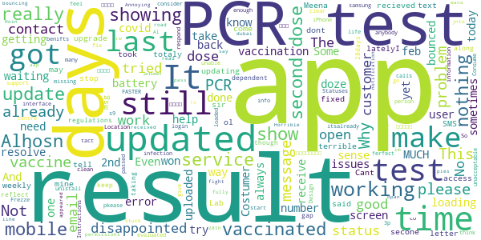
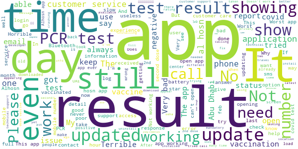

# ALHOSN UAE
App version ``1.44.248``

Analyzed with [covid-apps-observer](http://github.com/covid-apps-observer) project, version ``0.1``

## App overview
| | |
|-------------------------|-------------------------| 
| **Name**&nbsp;&nbsp;&nbsp;&nbsp;&nbsp;&nbsp;&nbsp;&nbsp;&nbsp;&nbsp;&nbsp;&nbsp;&nbsp;&nbsp;&nbsp;&nbsp;&nbsp;&nbsp;&nbsp;&nbsp;&nbsp;&nbsp;&nbsp;&nbsp;&nbsp;&nbsp;&nbsp;&nbsp;&nbsp;&nbsp;&nbsp;&nbsp;&nbsp;&nbsp;&nbsp;&nbsp;&nbsp;&nbsp;&nbsp;&nbsp;  | ALHOSN UAE |
| **Unique identifier** | doh.health.shield |
| **Link to Google Play** | [https://play.google.com/store/apps/details?id=doh.health.shield](https://play.google.com/store/apps/details?id=doh.health.shield) |
| **Summary**  | ALHOSN UAE allows you to keep your COVID-19 results on your mobile device |
| **Privacy policy** | [https://alhosnapp.ae/en/privacy-policy/](https://alhosnapp.ae/en/privacy-policy/) |
| **Latest version** | 1.44.248 |
| **Last update** | 2020-11-10 11:38:29 |
| **Recent changes** | - Improved user experience - App stability |
| **Installs**  | 1,000,000+ |
| **Category** | Medical |
| **First release** | Apr 7, 2020 |
| **Size**  | 12M |
| **Supported Android version**  | 5.0 and up |

### Description
> The ALHOSN UAE app is the official COVID-19 testing channel for health authorities in the United Arab Emirates, by the Ministry of Health and Prevention.
 By using the app, everyone can help stop the spread of COVID-19 and keep their family and friends safe.
  
 You can receive your COVID-19 test results directly on your phone with a unique QR code that is proof of your status and that of everyone else around you who also have the app, giving you peace of mind that you can safely interact.
 The app can also help trace people who may have come within close proximity to confirmed COVID-19 cases for an extended period of time. It uses short-distance Bluetooth signals to determine when your phone is near another phone that also has the app installed.  Both phones exchange anonymized IDs which are then stored in encrypted form on your phone. Using the anonymized IDs, health authorities can quickly identify and contact people at risk of infection so they can be retested.
  
 Put your health in your hands with 3 easy steps:
 1.      Download the ALHOSN UAE app
 2.      Authenticate with your Emirates ID and phone number
 3.      Turn on Bluetooth and push notifications on your smartphone
  
 Download the ALHOSN UAE app today and share it with your family and friends.
 Together, we can stop the spread of COVID-19
 Safer Together.

### User interface
The developers of the app provide the following screenshots in the Google play store.
| | | |
|:-------------------------:|:-------------------------:|:-------------------------:|
 |   |  

## Development team
In the following we report the main information provided by the development team in the Google play store.

| | |
|-------------------------|-------------------------|
| **Developer**  | Ministry of Health and Prevention - UAE |
| **Website**  | [https://alhosnapp.ae/en/contact-us/](https://alhosnapp.ae/en/contact-us/) |
| **Email** | info@alhosnapp.ae |
| **Physical address**  | - |
| **Other developed apps**  | [https://play.google.com/store/apps/developer?id=Ministry+of+Health+and+Prevention+-+UAE](https://play.google.com/store/apps/developer?id=Ministry+of+Health+and+Prevention+-+UAE) |

## Android support

| | |
|-------------------------|-------------------------|
| **Declared target Android version**  | Android10, version 10 (API level 29) |
| **Effective target Android version**  | Android10, version 10 (API level 29) |
| **Minimum supported Android version**  | Lollipop, version 5.0 (API level 21) |
| **Maximum target Android version**  | - |

The larger the difference between the minimum and maximum supported Android versions, the better. A larger difference means a wider audience. For example, old phones have a very low Android version, so a high minimum supported Android version means that the app cannot be used by users with old phones, thus leading to accessibility problems. 

## Requested permissions

In the following we report the complete list of the permissions requested by the app. 

| **Permission** | **Protection level** | **Description** | 
|-------------------------|-------------------------|-------------------------|
 **android.permission ACCESS_BACKGROUND_LOCATION** | :warning:**Dangerous** | Allows an app to access location in the background. 
 **android.permission ACCESS_FINE_LOCATION** | :warning:**Dangerous** | Allows an app to access precise location. 
 **android.permission ACCESS_NETWORK_STATE** | Normal | Allows applications to access information about networks. 
 **android.permission BLUETOOTH** | Normal | Allows applications to connect to paired bluetooth devices. 
 **android.permission BLUETOOTH_ADMIN** | Normal | Allows applications to discover and pair bluetooth devices. 
 **android.permission CAMERA** | :warning:**Dangerous** | Required to be able to access the camera device. 
 **android.permission FOREGROUND_SERVICE** | Normal | Allows a regular application to use Service.startForeground. 
 **android.permission INTERNET** | Normal | Allows applications to open network sockets. 
 **android.permission QUICKBOOT_POWERON** | - | - 
 **android.permission RECEIVE_BOOT_COMPLETED** | Normal | Allows an application to receive the Intent.ACTION_BOOT_COMPLETED that is broadcast after the system finishes booting. 
 **android.permission REQUEST_IGNORE_BATTERY_OPTIMIZATIONS** | Normal | Permission an application must hold in order to use Settings.ACTION_REQUEST_IGNORE_BATTERY_OPTIMIZATIONS. 
 **android.permission WAKE_LOCK** | Normal | Allows using PowerManager WakeLocks to keep processor from sleeping or screen from dimming. 
 **android.permission WRITE_EXTERNAL_STORAGE** | :warning:**Dangerous** | Allows an application to write to external storage. 
 **com.google.android.c2dm.permission RECEIVE** | - | - 

## Mentioned servers

| **Server** | **Registrant** | **Registrant country** | **Creation date** | 
|-------------------------|-------------------------|-------------------------|-------------------------|
 | adobe.com | Adobe Inc. | :us: US | 1986-11-17 05:00:00 |
 | google.com | Google LLC | :us: US | 1997-09-15 04:00:00 |
 | healthshielduae.com | Domains By Proxy, LLC | :us: US | 2020-03-31 19:30:02 |

## Security analysis 

Below we report the main security warnings raised by our execution of the [Androwarn](https://github.com/maaaaz/androwarn) security analysis tool.

**Connection interfaces exfiltration**
> - This application reads details about the currently active data network 
> - This application tries to find out if the currently active data network is metered 

**Suspicious connection establishment**
> - This application opens a Socket and connects it to the remote address 'Li/b/a/a/a;->f(Ljava/lang/String;)Ljava/lang/StringBuilder;' on the 'N/A' port  
> - This application opens a Socket and connects it to the remote address 'Ljava/net/Proxy;->type()Ljava/net/Proxy$Type;' on the 'N/A' port  
> - This application opens a Socket and connects it to the remote address 'hostname == null ' on the 'N/A' port  
> - This application opens a Socket and connects it to the remote address 'timeout' on the 'N/A' port  

**Code execution**
> - This application loads a native library 
> - This application loads a native library: 'tool-checker' 
> - This application executes a UNIX command 
> - This application executes a UNIX command containing this argument: 'getprop' 
> - This application executes a UNIX command containing this argument: 'mount' 

## User ratings and reviews

Below we provide information about how end users are reacting to the app in terms of ratings and reviews in the Google Play store.

### Ratings

The ALHOSN UAE app has been installed by more than **1000000** times. At this time, **6085** rated the app and its average score is **4.3555193**. Below we show the distribution of the ratings across the usual star-based rating of Google Play

:star::star::star::star::star:: 4545

:star::star::star::star:: 543

:star::star::star:: 266

:star::star:: 79

:star:: 652

### Reviews 

#### 5-star reviews

> Etisalat  :date: __2021-02-27 11:25:44__

> my mub this apps not working this whats happen  :date: __2021-02-27 10:41:43__

> Simplest to protect yourself and others  :date: __2021-02-27 09:02:13__

> Hh  :date: __2021-02-27 08:25:39__

> Very gud app  :date: __2021-02-27 06:16:06__

> Very nice  :date: __2021-02-26 20:47:35__

> I like it.very good app for uae  :date: __2021-02-26 17:51:03__

> Good  :date: __2021-02-26 15:54:18__

> Good  :date: __2021-02-26 15:48:38__

> Super Apps  :date: __2021-02-26 14:29:26__

#### 4-star reviews

> My registered mobile number is expired... how can I login with another number  :date: __2021-02-25 16:33:16__

> Good  :date: __2021-02-25 15:57:37__

> Good aap  :date: __2021-02-24 15:17:08__

> Excellent  :date: __2021-02-23 08:08:48__

> Good  :date: __2021-02-21 20:19:20__

> فحصت بتاريخ 16/1 في خمية صحة الكورنيش ابوظبي والى تاريخ اليوم لم نظهر النتيجة ونزلت علي مخالفة 5000 درهم وقدمت تظلم للأسف هذه المرة الثانية لا تظهر النتيجة علما بأن صحة أرسلت لي رسالة بالنتيجة.  :date: __2021-02-20 09:45:18__

> tth  :date: __2021-02-18 15:47:02__

> Good  :date: __2021-02-18 04:38:05__

> Working well  :date: __2021-02-12 07:47:56__

> Good  :date: __2021-02-09 17:47:36__

#### 3-star reviews

> Nice app  :date: __2021-02-26 14:20:05__

> Hello how can my app get updated after the covid vaccine already finished 2 does and also pcr test after 28 days  :date: __2021-02-24 20:25:03__

> Its terrible  :date: __2021-02-24 10:54:01__

> I can't open the apps  :date: __2021-02-23 20:45:18__

> Very nice and easy to us  :date: __2021-02-20 13:23:48__

> It's not easy to access  :date: __2021-02-19 07:53:06__

> It worked but now it's not even loading  :date: __2021-02-18 11:46:09__

> My old no. is not longer in service it means my sponsor cut it.. I reinstall my al hosn to put my new number that already exists to my pcr test clinic.. The problem now I can't sign in it said try again later or contact etc.. I did many times to sign in and contact the costumer services but the same.. Pls help me what should I do to activate my al hosn.. God bless to all  :date: __2021-02-18 11:35:57__

> AL HOSN APP HAS STOPPED WORKING IN MY MOBILE. WHATS GOING ON ANY UPDATES. I NEED TO ENTER ABU DHABI. HOW I WILL ENTER WITHOUT AL HOSN APP. ANY ONE GOING THROUGH THE SAME. WHAT ABOUT THE CHECKPOINT POLICE. HOW WE CAN SHOW THEM THE E LOGO WHICH WE USE TO SHOW THEM IN AL HOSN APP  :date: __2021-02-18 11:24:58__

> I download this app but not working I don't know why,  :date: __2021-02-17 21:20:20__

#### 2-star reviews

> Good  :date: __2021-02-27 02:47:16__

> i down loaded on 22 feb and i try many times but unable to login because its showing error so i think no benifts for this app.or fix it pkease  :date: __2021-02-26 15:56:54__

> Consume too much battery life  :date: __2021-02-23 15:39:55__

> No customer support  :date: __2021-02-19 07:55:05__

> Instructions are not clear, no contact number for a help centre, interface is clean but doesn't give enough info to the user. Design of the app makes a person feel that they have to go for a test but doesn't consider the time passed since last infection. Statuses should be re-evaluated. Location permissions has to be always on but doesn't say why. Annoying notification to fight COVID which you cannot fully read.  :date: __2021-02-19 06:06:07__

> I vaccinated second dose, already pass 28 days, i done PCR test on 28th days, i received PCR Test results, Al Hosn Apps updated PCR test results on mobile, but status E not appeared on mobile.  :date: __2021-02-19 04:13:20__

> Stuck in loading  :date: __2021-02-18 13:53:34__

> Some times not working  :date: __2021-02-18 11:55:37__

> Why not opan this aap today im in dubai road ples wana help  :date: __2021-02-18 11:17:29__

> Some times my results uploaded jnto app, sometimes no. Costumer service line not working. Email bouncing back. Horrible.  :date: __2021-02-18 10:00:00__

#### 1-star reviews

> Very bad app we just stuck here on dessert like this worst  :date: __2021-02-27 11:08:22__

> Id  :date: __2021-02-27 06:39:14__

> Slow  :date: __2021-02-27 03:34:14__

> This application is not working in my Samsung note 8 when I install and open it show me a message App info and uninstall can't be open properly  :date: __2021-02-26 18:25:39__

> Terrible experience. No support if something goes wrong.  :date: __2021-02-26 16:39:56__

> It doesnt work. Customer service also doesnt work.  :date: __2021-02-26 13:21:26__

> Worst Customer care ever. Bunch of fools are handling the customer service, no reply no assistance no knowledge. Mandatory to use the app to cross the border however.  :date: __2021-02-26 12:23:10__

> Doesn't even open  :date: __2021-02-26 12:23:08__

> Not reliable app  :date: __2021-02-26 12:19:44__

> I've been trying to use the app but it doesn't move beyond welcome page. The page just stucks. Previously it'd ask permissions but no more. I'm traveling worried how I am gona get the result. Anybody any clue?  :date: __2021-02-26 09:38:38__

