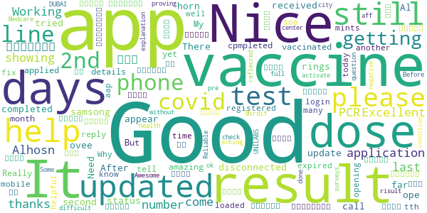

# ALHOSN UAE
App version ``1.44.248``

Analyzed with [covid-apps-observer](http://github.com/covid-apps-observer) project, version ``0.1``

## App overview
| | |
|-------------------------|-------------------------| 
| **Name**&nbsp;&nbsp;&nbsp;&nbsp;&nbsp;&nbsp;&nbsp;&nbsp;&nbsp;&nbsp;&nbsp;&nbsp;&nbsp;&nbsp;&nbsp;&nbsp;&nbsp;&nbsp;&nbsp;&nbsp;&nbsp;&nbsp;&nbsp;&nbsp;&nbsp;&nbsp;&nbsp;&nbsp;&nbsp;&nbsp;&nbsp;&nbsp;&nbsp;&nbsp;&nbsp;&nbsp;&nbsp;&nbsp;&nbsp;&nbsp;  | ALHOSN UAE |
| **Unique identifier** | doh.health.shield |
| **Link to Google Play** | [https://play.google.com/store/apps/details?id=doh.health.shield](https://play.google.com/store/apps/details?id=doh.health.shield) |
| **Summary**  | ALHOSN UAE allows you to keep your COVID-19 results on your mobile device |
| **Privacy policy** | [https://alhosnapp.ae/en/privacy-policy/](https://alhosnapp.ae/en/privacy-policy/) |
| **Latest version** | 1.44.248 |
| **Last update** | 2020-11-10 11:38:29 |
| **Recent changes** | - Improved user experience - App stability |
| **Installs**  | 1,000,000+ |
| **Category** | Medical |
| **First release** | Apr 7, 2020 |
| **Size**  | 12M |
| **Supported Android version**  | 5.0 and up |

### Description
> The ALHOSN UAE app is the official COVID-19 testing channel for health authorities in the United Arab Emirates, by the Ministry of Health and Prevention.
 By using the app, everyone can help stop the spread of COVID-19 and keep their family and friends safe.
  
 You can receive your COVID-19 test results directly on your phone with a unique QR code that is proof of your status and that of everyone else around you who also have the app, giving you peace of mind that you can safely interact.
 The app can also help trace people who may have come within close proximity to confirmed COVID-19 cases for an extended period of time. It uses short-distance Bluetooth signals to determine when your phone is near another phone that also has the app installed.  Both phones exchange anonymized IDs which are then stored in encrypted form on your phone. Using the anonymized IDs, health authorities can quickly identify and contact people at risk of infection so they can be retested.
  
 Put your health in your hands with 3 easy steps:
 1.      Download the ALHOSN UAE app
 2.      Authenticate with your Emirates ID and phone number
 3.      Turn on Bluetooth and push notifications on your smartphone
  
 Download the ALHOSN UAE app today and share it with your family and friends.
 Together, we can stop the spread of COVID-19
 Safer Together.

### User interface
The developers of the app provide the following screenshots in the Google play store.
| | | |
|:-------------------------:|:-------------------------:|:-------------------------:|
 |   |  

## Development team
In the following we report the main information provided by the development team in the Google play store.

| | |
|-------------------------|-------------------------|
| **Developer**  | Ministry of Health and Prevention - UAE |
| **Website**  | [https://alhosnapp.ae/en/contact-us/](https://alhosnapp.ae/en/contact-us/) |
| **Email** | info@alhosnapp.ae |
| **Physical address**  | - |
| **Other developed apps**  | [https://play.google.com/store/apps/developer?id=Ministry+of+Health+and+Prevention+-+UAE](https://play.google.com/store/apps/developer?id=Ministry+of+Health+and+Prevention+-+UAE) |

## Android support

| | |
|-------------------------|-------------------------|
| **Declared target Android version**  | Android10, version 10 (API level 29) |
| **Effective target Android version**  | Android10, version 10 (API level 29) |
| **Minimum supported Android version**  | Lollipop, version 5.0 (API level 21) |
| **Maximum target Android version**  | - |

The larger the difference between the minimum and maximum supported Android versions, the better. A larger difference means a wider audience. For example, old phones have a very low Android version, so a high minimum supported Android version means that the app cannot be used by users with old phones, thus leading to accessibility problems. 

## Requested permissions

In the following we report the complete list of the permissions requested by the app. 

| **Permission** | **Protection level** | **Description** | 
|-------------------------|-------------------------|-------------------------|
 **android.permission ACCESS_BACKGROUND_LOCATION** | :warning:**Dangerous** | Allows an app to access location in the background. 
 **android.permission ACCESS_FINE_LOCATION** | :warning:**Dangerous** | Allows an app to access precise location. 
 **android.permission ACCESS_NETWORK_STATE** | Normal | Allows applications to access information about networks. 
 **android.permission BLUETOOTH** | Normal | Allows applications to connect to paired bluetooth devices. 
 **android.permission BLUETOOTH_ADMIN** | Normal | Allows applications to discover and pair bluetooth devices. 
 **android.permission CAMERA** | :warning:**Dangerous** | Required to be able to access the camera device. 
 **android.permission FOREGROUND_SERVICE** | Normal | Allows a regular application to use Service.startForeground. 
 **android.permission INTERNET** | Normal | Allows applications to open network sockets. 
 **android.permission QUICKBOOT_POWERON** | - | - 
 **android.permission RECEIVE_BOOT_COMPLETED** | Normal | Allows an application to receive the Intent.ACTION_BOOT_COMPLETED that is broadcast after the system finishes booting. 
 **android.permission REQUEST_IGNORE_BATTERY_OPTIMIZATIONS** | Normal | Permission an application must hold in order to use Settings.ACTION_REQUEST_IGNORE_BATTERY_OPTIMIZATIONS. 
 **android.permission WAKE_LOCK** | Normal | Allows using PowerManager WakeLocks to keep processor from sleeping or screen from dimming. 
 **android.permission WRITE_EXTERNAL_STORAGE** | :warning:**Dangerous** | Allows an application to write to external storage. 
 **com.google.android.c2dm.permission RECEIVE** | - | - 

## Mentioned servers

| **Server** | **Registrant** | **Registrant country** | **Creation date** | 
|-------------------------|-------------------------|-------------------------|-------------------------|
 | adobe.com | Adobe Inc. | :us: US | 1986-11-17 05:00:00 |
 | google.com | Google LLC | :us: US | 1997-09-15 04:00:00 |
 | healthshielduae.com | Domains By Proxy, LLC | :us: US | 2020-03-31 19:30:02 |

## Security analysis 

Below we report the main security warnings raised by our execution of the [Androwarn](https://github.com/maaaaz/androwarn) security analysis tool.

**Connection interfaces exfiltration**
> - This application reads details about the currently active data network 
> - This application tries to find out if the currently active data network is metered 

**Suspicious connection establishment**
> - This application opens a Socket and connects it to the remote address 'Li/b/a/a/a;->f(Ljava/lang/String;)Ljava/lang/StringBuilder;' on the 'N/A' port  
> - This application opens a Socket and connects it to the remote address 'Ljava/net/Proxy;->type()Ljava/net/Proxy$Type;' on the 'N/A' port  
> - This application opens a Socket and connects it to the remote address 'hostname == null ' on the 'N/A' port  
> - This application opens a Socket and connects it to the remote address 'timeout' on the 'N/A' port  

**Code execution**
> - This application loads a native library 
> - This application loads a native library: 'tool-checker' 
> - This application executes a UNIX command 
> - This application executes a UNIX command containing this argument: 'getprop' 
> - This application executes a UNIX command containing this argument: 'mount' 

## User ratings and reviews

Below we provide information about how end users are reacting to the app in terms of ratings and reviews in the Google Play store.

### Ratings

The ALHOSN UAE app has been installed by more than **1000000** times. At this time, **6085** rated the app and its average score is **4.3555193**. Below we show the distribution of the ratings across the usual star-based rating of Google Play

:star::star::star::star::star:: 4545

:star::star::star::star:: 543

:star::star::star:: 266

:star::star:: 79

:star:: 652

### Reviews 

#### 5-star reviews

> Good  :date: __2021-01-29 03:35:17__

> Good  :date: __2021-01-28 22:40:45__

> Install but not open for id card and mobile no  :date: __2021-01-28 16:54:45__

> Tell us more  :date: __2021-01-28 06:56:50__

> My app is not working  :date: __2021-01-28 05:24:47__

> ما شاء الله تبارك الرحمن  :date: __2021-01-28 00:38:06__

> Good  :date: __2021-01-27 21:25:17__

> Very good 👍  :date: __2021-01-27 17:08:41__

> Good service  :date: __2021-01-27 13:38:53__

> Its not working  :date: __2021-01-27 10:33:43__

#### 4-star reviews

> How to check vaccine risult  :date: __2021-01-29 12:31:43__

> Good aff  :date: __2021-01-25 05:54:36__

> Help full  :date: __2021-01-25 01:23:01__

> Awesome  :date: __2021-01-24 20:37:12__

> Reliable in health apps...  :date: __2021-01-24 17:34:58__

> Before this was ok but now it is not showing my results it is asking pre condition surveys question?  :date: __2021-01-22 10:42:17__

> Good  :date: __2021-01-21 06:26:39__

> Keep improving as there are bugs. Thank you.  :date: __2021-01-19 18:54:51__

> Very good  :date: __2021-01-19 18:45:29__

> Good  :date: __2021-01-19 18:30:25__

#### 3-star reviews

> Good  :date: __2021-01-29 04:38:09__

> When i want to view invoice, pdf file is protected and it is asking for password, but nowhere it is mentioned what should i enter, tried with EID no, but doesnt work.  :date: __2021-01-27 09:42:57__

> Greetings and more, my PCR test result and phase III trials volunteer star is not being updated.Kindly advice.  :date: __2021-01-21 12:18:50__

> Good  :date: __2021-01-19 18:25:21__

> User details not available  :date: __2021-01-16 19:03:03__

> its showing wrong credentials error while am trying login the app. since i am using same number from the beginning and I have registered with the same number, but now its showing that logout and login with another number ending with 748 which is not under my name. i have already send the mail but still there is no response. kindly advise me  :date: __2021-01-16 11:41:13__

> Due to some reson I change my mobile num now i want to cheak my covid19 test result on alhosan uae app but i unable to cheak my result i already change my num at scraning center  :date: __2021-01-16 04:20:29__

> Hi can you please tell me how i can get e letter on al hosn app , just today i got covid 19 first shot , please guide me  :date: __2021-01-15 20:16:00__

> How can I change the associated mobile number?  :date: __2021-01-14 09:28:14__

> Ok  :date: __2021-01-06 22:19:14__

#### 2-star reviews

> Hopeful  :date: __2021-01-29 18:06:23__

> After one month it is not opening  :date: __2021-01-26 11:47:55__

> Battery drain very fast and report didn't get from 12 Jan 2021  :date: __2021-01-26 07:53:12__

> I have had a test with a negative result, and 3 times the hospital asked to update the app, but it is still not updated. There is no way to contact anyone about this problem.  :date: __2021-01-25 08:42:00__

> Sometimes the result not showing accurately  :date: __2021-01-24 15:29:49__

> My covid result is coming but al hosn app says some time not result yet, some time mobile no. Is not register why  :date: __2021-01-19 18:44:18__

> There is no feedback from call center  :date: __2021-01-17 07:43:42__

> First 4 months this application works very smoothly.But last December I did one covid test but still I didn't get report on alhosn.i registered 3 times complaints. But nothing happened. Finally one customer service madam provide me a watsapp no and informed me to send Emirates I'd,my covid report and screenshot of alhosan app.i send all details.But still no progress. Seriously worried about this application  :date: __2021-01-14 07:00:37__

> Tests are not always showing and difficult to get contact with al hosn people. No one answering the phone or email.  :date: __2021-01-11 16:17:01__

> How long this apps took to update covid- 19 vaccine status ???? Or star  :date: __2021-01-11 04:00:14__

#### 1-star reviews

> Bad app  :date: __2021-01-29 20:02:27__

> this app does not open. it doesn't work at all.  :date: __2021-01-29 06:44:18__

> Bluetooth open all the time for what? Location on all the time for what? App closing by itself. Uninstalled.  :date: __2021-01-28 18:25:41__

> So unfortunate the app isn't working on my phone, I don't really know what the issue might be. Please I need help.  :date: __2021-01-28 18:19:33__

> The app is asking for way too much access just to see your result, make sure you install it on a separate phone.  :date: __2021-01-28 15:48:55__

> Doesnt work cant log in at all asks for an ICA mobile number which I've never heard of and just freezes when I put in my own mobile number.  :date: __2021-01-28 11:13:35__

> Not recognizing my mobile no. Kept telling me wrong no. From 2020 till now almost end of January 2021...been calling al hosn number...no reply  :date: __2021-01-28 10:37:42__

> No results since 14/01.  :date: __2021-01-28 08:37:56__

> This app is not working as mentioned. It shows loading. I have taken 2 doses of covid vaccine then taken 3 PCR tests and past 30 days . But still it is not updated in the AlHosn app  :date: __2021-01-28 07:19:31__

> need to improve, worse experience  :date: __2021-01-27 22:02:03__

