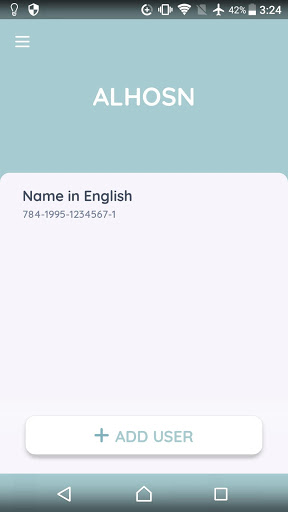
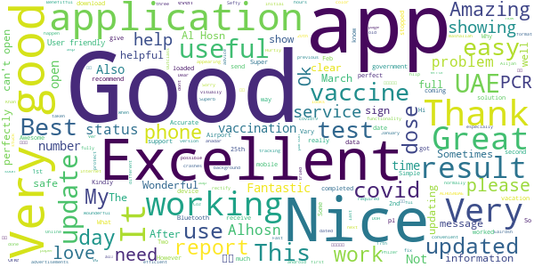
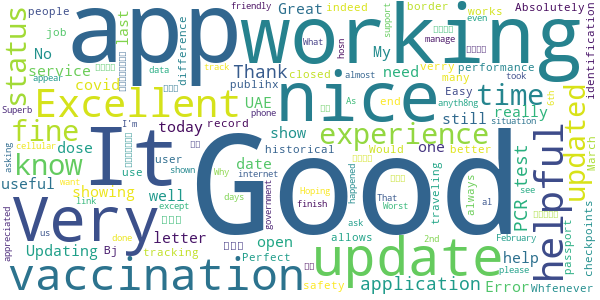
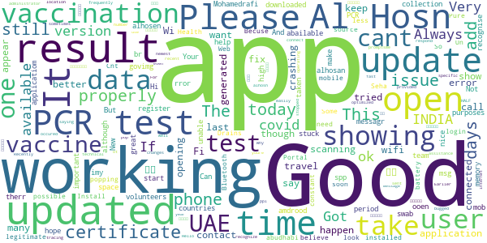
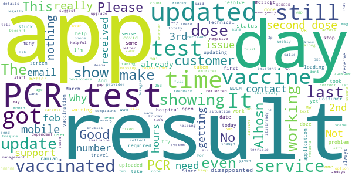
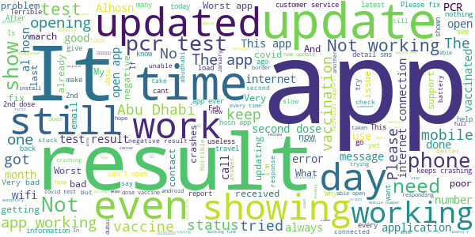

# ALHOSN UAE
App version ``1.46.526``

Analyzed with [covid-apps-observer](http://github.com/covid-apps-observer) project, version ``0.1``

## App overview
| | |
|-------------------------|-------------------------| 
| **Name**&nbsp;&nbsp;&nbsp;&nbsp;&nbsp;&nbsp;&nbsp;&nbsp;&nbsp;&nbsp;&nbsp;&nbsp;&nbsp;&nbsp;&nbsp;&nbsp;&nbsp;&nbsp;&nbsp;&nbsp;&nbsp;&nbsp;&nbsp;&nbsp;&nbsp;&nbsp;&nbsp;&nbsp;&nbsp;&nbsp;&nbsp;&nbsp;&nbsp;&nbsp;&nbsp;&nbsp;&nbsp;&nbsp;&nbsp;&nbsp;  | ALHOSN UAE |
| **Unique identifier** | doh.health.shield |
| **Link to Google Play** | [https://play.google.com/store/apps/details?id=doh.health.shield](https://play.google.com/store/apps/details?id=doh.health.shield) |
| **Summary**  | ALHOSN UAE allows you to keep your COVID-19 results on your mobile device |
| **Privacy policy** | [https://alhosnapp.ae/en/privacy-policy/](https://alhosnapp.ae/en/privacy-policy/) |
| **Latest version** | 1.46.526 |
| **Last update** | 2021-03-14 14:13:19 |
| **Recent changes** | - Vaccination details are provided for medical use - Vaccine certificate report can be generated from the app - Removed Battery saving mode  - Removed Contact trace feature - removed Bluetooth permission - Improved user experience  - App stability |
| **Installs**  | 1,000,000+ |
| **Category** | Medical |
| **First release** | Apr 7, 2020 |
| **Size**  | 12M |
| **Supported Android version**  | 5.0 and up |

### Description
> The ALHOSN UAE app is the official COVID-19 testing channel for health authorities in the United Arab Emirates, by the Ministry of Health and Prevention.
 By using the app, everyone can help stop the spread of COVID-19 and keep their family and friends safe.
  
 You can receive your COVID-19 test results directly on your phone with a unique QR code that is proof of your status and that of everyone else around you who also have the app, giving you peace of mind that you can safely interact.
 The app can also help trace people who may have come within close proximity to confirmed COVID-19 cases for an extended period of time. It uses short-distance Bluetooth signals to determine when your phone is near another phone that also has the app installed.  Both phones exchange anonymized IDs which are then stored in encrypted form on your phone. Using the anonymized IDs, health authorities can quickly identify and contact people at risk of infection so they can be retested.
  
 Put your health in your hands with 3 easy steps:
 1.      Download the ALHOSN UAE app
 2.      Authenticate with your Emirates ID and phone number
 3.      Turn on Bluetooth and push notifications on your smartphone
  
 Download the ALHOSN UAE app today and share it with your family and friends.
 Together, we can stop the spread of COVID-19
 Safer Together.

### User interface
The developers of the app provide the following screenshots in the Google play store.
| | | |
|:-------------------------:|:-------------------------:|:-------------------------:|
 |   |  

## Development team
In the following we report the main information provided by the development team in the Google play store.

| | |
|-------------------------|-------------------------|
| **Developer**  | Ministry of Health and Prevention - UAE |
| **Website**  | [https://alhosnapp.ae/en/contact-us/](https://alhosnapp.ae/en/contact-us/) |
| **Email** | info@alhosnapp.ae |
| **Physical address**  | - |
| **Other developed apps**  | [https://play.google.com/store/apps/developer?id=Ministry+of+Health+and+Prevention+-+UAE](https://play.google.com/store/apps/developer?id=Ministry+of+Health+and+Prevention+-+UAE) |

## Android support

| | |
|-------------------------|-------------------------|
| **Declared target Android version**  | Android10, version 10 (API level 29) |
| **Effective target Android version**  | Android10, version 10 (API level 29) |
| **Minimum supported Android version**  | Lollipop, version 5.0 (API level 21) |
| **Maximum target Android version**  | - |

The larger the difference between the minimum and maximum supported Android versions, the better. A larger difference means a wider audience. For example, old phones have a very low Android version, so a high minimum supported Android version means that the app cannot be used by users with old phones, thus leading to accessibility problems. 

## Requested permissions

In the following we report the complete list of the permissions requested by the app. 

| **Permission** | **Protection level** | **Description** | 
|-------------------------|-------------------------|-------------------------|
 **android.permission ACCESS_NETWORK_STATE** | Normal | Allows applications to access information about networks. 
 **android.permission CAMERA** | :warning:**Dangerous** | Required to be able to access the camera device. 
 **android.permission FOREGROUND_SERVICE** | Normal | Allows a regular application to use Service.startForeground. 
 **android.permission INTERNET** | Normal | Allows applications to open network sockets. 
 **android.permission QUICKBOOT_POWERON** | - | - 
 **android.permission RECEIVE_BOOT_COMPLETED** | Normal | Allows an application to receive the Intent.ACTION_BOOT_COMPLETED that is broadcast after the system finishes booting. 
 **android.permission REQUEST_IGNORE_BATTERY_OPTIMIZATIONS** | Normal | Permission an application must hold in order to use Settings.ACTION_REQUEST_IGNORE_BATTERY_OPTIMIZATIONS. 
 **android.permission WAKE_LOCK** | Normal | Allows using PowerManager WakeLocks to keep processor from sleeping or screen from dimming. 
 **android.permission WRITE_EXTERNAL_STORAGE** | :warning:**Dangerous** | Allows an application to write to external storage. 
 **com.google.android.c2dm.permission RECEIVE** | - | - 

## Mentioned servers

| **Server** | **Registrant** | **Registrant country** | **Creation date** | 
|-------------------------|-------------------------|-------------------------|-------------------------|
 | adobe.com | Adobe Inc. | :us: US | 1986-11-17 05:00:00 |
 | google.com | Google LLC | :us: US | 1997-09-15 04:00:00 |
 | healthshielduae.com | Domains By Proxy, LLC | :us: US | 2020-03-31 19:30:02 |

## Security analysis 

Below we report the main security warnings raised by our execution of the [Androwarn](https://github.com/maaaaz/androwarn) security analysis tool.

**Connection interfaces exfiltration**
> - This application reads details about the currently active data network 
> - This application tries to find out if the currently active data network is metered 

**Suspicious connection establishment**
> - This application opens a Socket and connects it to the remote address 'Li/b/a/a/a;->f(Ljava/lang/String;)Ljava/lang/StringBuilder;' on the 'N/A' port  
> - This application opens a Socket and connects it to the remote address 'Ljava/net/Proxy;->type()Ljava/net/Proxy$Type;' on the 'N/A' port  
> - This application opens a Socket and connects it to the remote address 'hostname == null ' on the 'N/A' port  
> - This application opens a Socket and connects it to the remote address 'timeout' on the 'N/A' port  

**Code execution**
> - This application loads a native library 
> - This application loads a native library: 'tool-checker' 
> - This application executes a UNIX command 
> - This application executes a UNIX command containing this argument: 'getprop' 
> - This application executes a UNIX command containing this argument: 'mount' 

## User ratings and reviews

Below we provide information about how end users are reacting to the app in terms of ratings and reviews in the Google Play store.

### Ratings

The ALHOSN UAE app has been installed by more than **1000000** times. At this time, **13572** rated the app and its average score is **4.1284075**. Below we show the distribution of the ratings across the usual star-based rating of Google Play

:star::star::star::star::star:: 9455

:star::star::star::star:: 1012

:star::star::star:: 613

:star::star:: 379

:star:: 2113

### Reviews 

#### 5-star reviews

> Excelent  :date: __2021-03-21 15:56:40__

> 💐🌻🌾  :date: __2021-03-21 15:49:30__

> Vary good  :date: __2021-03-21 14:19:22__

> please open this app  :date: __2021-03-21 12:08:44__

> Just now I used this apps  :date: __2021-03-21 12:03:29__

> Excellent  :date: __2021-03-21 11:47:23__

> هههه  :date: __2021-03-21 09:44:47__

> Fantastic thanks for UAE government  :date: __2021-03-21 09:37:45__

> Great  :date: __2021-03-21 09:34:34__

> Good app  :date: __2021-03-21 09:33:37__

#### 4-star reviews

> Superb  :date: __2021-03-21 10:31:18__

> Very nice  :date: __2021-03-20 05:36:40__

> البرنامج زين بس كل شوي يحول انجليزي... يرفع الضغط😒  :date: __2021-03-18 11:57:43__

> Great  :date: __2021-03-18 10:29:18__

> Useful  :date: __2021-03-18 08:28:32__

> Its good.. it stops showing the icon in my upper left mobile screen  :date: __2021-03-16 18:59:17__

> Not working  :date: __2021-03-16 14:14:36__

> Good  :date: __2021-03-16 13:30:26__

> Good  :date: __2021-03-16 09:42:16__

> Super  :date: __2021-03-16 06:19:33__

#### 3-star reviews

> Covid vaccination report not showing , please update this app for i phone users its available.  :date: __2021-03-21 05:22:19__

> I add more people but they don't appear in the main page and when I try to add them again the app say the user is already add.  :date: __2021-03-21 04:45:45__

> Does not work when outside UAE telecom network.  :date: __2021-03-19 22:10:49__

> My last week PCR test received negative result but not updated on the app and i have completed my vaccine my E status did not appear on the app, if user can download the results on the app it woul be usefull and hoping you can still improve the app for a better user experience.  :date: __2021-03-19 04:15:27__

> I take first dose vaccine but I can't see my results Al hosn app  :date: __2021-03-18 18:46:51__

> I got my PCR test result by SMS on 17th and another PCR test result on 18th but still not updated in AL Hosn app  :date: __2021-03-18 10:51:09__

> I'm vaccinated and yet it doesn't show on the app that I'm vaccinated. I've uninstalled and installed the app logged in with my details but yet it doesn't show vaccinated. Only shows my 1st dose and 2nd dose date.  :date: __2021-03-17 17:22:41__

> Nice app  :date: __2021-03-17 13:09:53__

> Why my last covid test didn't show in this app?  :date: __2021-03-17 01:18:36__

> App is great initiative. But tests done doesn't reflect fast. I had my second dose done on 5/feb/21, which still doesnt show. Test done by Lab onn11/3/21 also doesnt show. Customer support numbers are notb responsive  :date: __2021-03-16 13:32:37__

#### 2-star reviews

> Technical support is not available, whether by phone or an e-mail.  :date: __2021-03-21 07:34:56__

> I'm did PCR test in Iranian hospital, got result after 20 hours and 58 hours left, but still not update my PCR test, and so many times I'm asked from Iranian hospital staff, but not helping and even there no contact number in the app to solve your issue, even last time showing result until 25 days negative, That means not helpful and trust full app  :date: __2021-03-21 02:46:29__

> Dear developers, Since 3rd March my app is not updating after 3rd March I given 4 test but still not received any results on this application. Kindly suggest to resolve this.  :date: __2021-03-20 20:18:15__

> I took the two vaccines, and made PCR but note updated ,  :date: __2021-03-20 16:57:48__

> It has not updated my vaccine details. I have taken both dosages. 2nd dose was on 3rd Feb. For my parents it is showing vaccinated but the date is wrong and it does not show 1sf dose and 2bd dose.  :date: __2021-03-19 19:21:30__

> There is no option for complaint or even send feedback. I did my PCR test on WED and got the result on Friday. The system shall count the first day of the RESULT DAY not the TEST DAY. ???????????? The 48 hours OR the 2 days is on the service provider not the customer, why to be reflected as I received the result???  :date: __2021-03-18 10:51:03__

> Doesn't get updated on time. The support through 8004676 and email is absolutely non existent. Need better management and service for such crucial App which is legally required to travel between emirates. Imagine someone having emergency situation and because of this App, getting stuck and cannot travel. Please better the service.  :date: __2021-03-18 10:18:52__

> Good  :date: __2021-03-17 07:28:41__

> My vaccine date is not correct update and not showing vaccinated .  :date: __2021-03-16 16:40:48__

> Slow and after update stop working  :date: __2021-03-15 21:43:50__

#### 1-star reviews

> I'm opening the App but it's not responding just giving me The home page background  :date: __2021-03-21 16:32:36__

> POOR App results not updated all the time we have to delete amd install to get the result update then also not sure weather it will update or not  :date: __2021-03-21 15:29:29__

> The app keep crashing down I took my second dose vaccine and 1 month already past but the E letter still does not appear. I even took my PCR two days ago but still showing old result. Tried calling the call center several times but no answer, even no respond from email. This is very annoying and I lost hope chasing them.  :date: __2021-03-21 15:23:35__

> The latest update of the Application keep on frozen. Unable to contact the support for this Application.  :date: __2021-03-21 15:13:41__

> The App has no support team. No replay to telephone calls or emails. Vaccination info not updated. Not able to fix the issue and don't know whom to contact else  :date: __2021-03-21 13:57:20__

> I did my last vaccination on the 24/01/21 but up to today I've never received the latter E on my app and it's becoming costly doing a PCR every week . Can someone tell me we're the problem could be coming from or it's with the application.  :date: __2021-03-21 13:10:09__

> Not open  :date: __2021-03-21 12:26:39__

> I have a Samsung S20 that it won't run on now but it will on my cheap iBrit phone. It looks like I'm not the only one having problems with the app after the last update.  :date: __2021-03-21 11:32:06__

> Not even open  :date: __2021-03-21 10:53:35__

> This app is so annoying. I have been waiting for ages now for my vaccine results to be updated but still nothing happened. Am seriously tired of waiting. Please someone should attend and update my results to enable me travel to Abu Dhabi for my passport renewal. Is very urgent, I have only 10 days left  :date: __2021-03-21 10:05:13__

