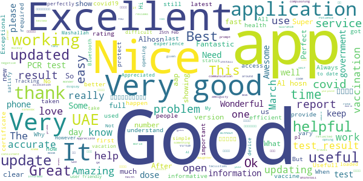

# ALHOSN UAE
App version ``1.46.526``

Analyzed with [covid-apps-observer](http://github.com/covid-apps-observer) project, version ``0.1``

## App overview
| | |
|-------------------------|-------------------------| 
| **Name**&nbsp;&nbsp;&nbsp;&nbsp;&nbsp;&nbsp;&nbsp;&nbsp;&nbsp;&nbsp;&nbsp;&nbsp;&nbsp;&nbsp;&nbsp;&nbsp;&nbsp;&nbsp;&nbsp;&nbsp;&nbsp;&nbsp;&nbsp;&nbsp;&nbsp;&nbsp;&nbsp;&nbsp;&nbsp;&nbsp;&nbsp;&nbsp;&nbsp;&nbsp;&nbsp;&nbsp;&nbsp;&nbsp;&nbsp;&nbsp;  | ALHOSN UAE |
| **Unique identifier** | doh.health.shield |
| **Link to Google Play** | [https://play.google.com/store/apps/details?id=doh.health.shield](https://play.google.com/store/apps/details?id=doh.health.shield) |
| **Summary**  | ALHOSN UAE allows you to keep your COVID-19 results on your mobile device |
| **Privacy policy** | [https://alhosnapp.ae/en/privacy-policy/](https://alhosnapp.ae/en/privacy-policy/) |
| **Latest version** | 1.46.526 |
| **Last update** | 2021-03-14 14:13:19 |
| **Recent changes** | - Vaccination details are provided for medical use - Vaccine certificate report can be generated from the app - Removed Battery saving mode  - Removed Contact trace feature - removed Bluetooth permission - Improved user experience  - App stability |
| **Installs**  | 1,000,000+ |
| **Category** | Medical |
| **First release** | Apr 7, 2020 |
| **Size**  | 12M |
| **Supported Android version**  | 5.0 and up |

### Description
> The ALHOSN UAE app is the official COVID-19 testing channel for health authorities in the United Arab Emirates, by the Ministry of Health and Prevention.
 By using the app, everyone can help stop the spread of COVID-19 and keep their family and friends safe.
  
 You can receive your COVID-19 test results directly on your phone with a unique QR code that is proof of your status and that of everyone else around you who also have the app, giving you peace of mind that you can safely interact.
 The app can also help trace people who may have come within close proximity to confirmed COVID-19 cases for an extended period of time. It uses short-distance Bluetooth signals to determine when your phone is near another phone that also has the app installed.  Both phones exchange anonymized IDs which are then stored in encrypted form on your phone. Using the anonymized IDs, health authorities can quickly identify and contact people at risk of infection so they can be retested.
  
 Put your health in your hands with 3 easy steps:
 1.      Download the ALHOSN UAE app
 2.      Authenticate with your Emirates ID and phone number
 3.      Turn on Bluetooth and push notifications on your smartphone
  
 Download the ALHOSN UAE app today and share it with your family and friends.
 Together, we can stop the spread of COVID-19
 Safer Together.

### User interface
The developers of the app provide the following screenshots in the Google play store.
| | | |
|:-------------------------:|:-------------------------:|:-------------------------:|
 |   |  

## Development team
In the following we report the main information provided by the development team in the Google play store.

| | |
|-------------------------|-------------------------|
| **Developer**  | Ministry of Health and Prevention - UAE |
| **Website**  | [https://alhosnapp.ae/en/contact-us/](https://alhosnapp.ae/en/contact-us/) |
| **Email** | info@alhosnapp.ae |
| **Physical address**  | - |
| **Other developed apps**  | [https://play.google.com/store/apps/developer?id=Ministry+of+Health+and+Prevention+-+UAE](https://play.google.com/store/apps/developer?id=Ministry+of+Health+and+Prevention+-+UAE) |

## Android support

| | |
|-------------------------|-------------------------|
| **Declared target Android version**  | Android10, version 10 (API level 29) |
| **Effective target Android version**  | Android10, version 10 (API level 29) |
| **Minimum supported Android version**  | Lollipop, version 5.0 (API level 21) |
| **Maximum target Android version**  | - |

The larger the difference between the minimum and maximum supported Android versions, the better. A larger difference means a wider audience. For example, old phones have a very low Android version, so a high minimum supported Android version means that the app cannot be used by users with old phones, thus leading to accessibility problems. 

## Requested permissions

In the following we report the complete list of the permissions requested by the app. 

| **Permission** | **Protection level** | **Description** | 
|-------------------------|-------------------------|-------------------------|
 **android.permission ACCESS_NETWORK_STATE** | Normal | Allows applications to access information about networks. 
 **android.permission CAMERA** | :warning:**Dangerous** | Required to be able to access the camera device. 
 **android.permission FOREGROUND_SERVICE** | Normal | Allows a regular application to use Service.startForeground. 
 **android.permission INTERNET** | Normal | Allows applications to open network sockets. 
 **android.permission QUICKBOOT_POWERON** | - | - 
 **android.permission RECEIVE_BOOT_COMPLETED** | Normal | Allows an application to receive the Intent.ACTION_BOOT_COMPLETED that is broadcast after the system finishes booting. 
 **android.permission REQUEST_IGNORE_BATTERY_OPTIMIZATIONS** | Normal | Permission an application must hold in order to use Settings.ACTION_REQUEST_IGNORE_BATTERY_OPTIMIZATIONS. 
 **android.permission WAKE_LOCK** | Normal | Allows using PowerManager WakeLocks to keep processor from sleeping or screen from dimming. 
 **android.permission WRITE_EXTERNAL_STORAGE** | :warning:**Dangerous** | Allows an application to write to external storage. 
 **com.google.android.c2dm.permission RECEIVE** | - | - 

## Mentioned servers

| **Server** | **Registrant** | **Registrant country** | **Creation date** | 
|-------------------------|-------------------------|-------------------------|-------------------------|
 | adobe.com | Adobe Inc. | :us: US | 1986-11-17 05:00:00 |
 | google.com | Google LLC | :us: US | 1997-09-15 04:00:00 |
 | healthshielduae.com | Domains By Proxy, LLC | :us: US | 2020-03-31 19:30:02 |

## Security analysis 

Below we report the main security warnings raised by our execution of the [Androwarn](https://github.com/maaaaz/androwarn) security analysis tool.

**Connection interfaces exfiltration**
> - This application reads details about the currently active data network 
> - This application tries to find out if the currently active data network is metered 

**Suspicious connection establishment**
> - This application opens a Socket and connects it to the remote address 'Li/b/a/a/a;->f(Ljava/lang/String;)Ljava/lang/StringBuilder;' on the 'N/A' port  
> - This application opens a Socket and connects it to the remote address 'Ljava/net/Proxy;->type()Ljava/net/Proxy$Type;' on the 'N/A' port  
> - This application opens a Socket and connects it to the remote address 'hostname == null ' on the 'N/A' port  
> - This application opens a Socket and connects it to the remote address 'timeout' on the 'N/A' port  

**Code execution**
> - This application loads a native library 
> - This application loads a native library: 'tool-checker' 
> - This application executes a UNIX command 
> - This application executes a UNIX command containing this argument: 'getprop' 
> - This application executes a UNIX command containing this argument: 'mount' 

## User ratings and reviews

Below we provide information about how end users are reacting to the app in terms of ratings and reviews in the Google Play store.

### Ratings

The ALHOSN UAE app has been installed by more than **1000000** times. At this time, **13572** rated the app and its average score is **4.1284075**. Below we show the distribution of the ratings across the usual star-based rating of Google Play

:star::star::star::star::star:: 9455

:star::star::star::star:: 1012

:star::star::star:: 613

:star::star:: 379

:star:: 2113

### Reviews 

#### 5-star reviews

> Nice app!it helps us to travel around the world i had no problem after even the update too  :date: __2021-04-04 13:25:21__

> Good  :date: __2021-04-04 12:07:13__

> Good  :date: __2021-04-04 11:23:09__

> Great  :date: __2021-04-04 11:20:02__

> Excellent  :date: __2021-04-04 09:34:10__

> Good information & communication  :date: __2021-04-04 09:10:19__

> Wonder app. All over rating shows 5 *. But only poor ratings are reflected in the reviews. Awesome app I rate this app 5*.  :date: __2021-04-04 08:42:29__

> Too much good  :date: __2021-04-04 07:08:52__

> This is very useful  :date: __2021-04-04 02:44:20__

> Excellent  :date: __2021-04-04 02:38:37__

#### 4-star reviews

> Good  :date: __2021-04-04 02:54:09__

> جيد جدا  :date: __2021-04-04 02:12:58__

> It's really very helpful  :date: __2021-04-03 11:12:28__

> Excellent  :date: __2021-04-02 08:10:07__

> Good  :date: __2021-04-01 17:05:15__

> Very good service  :date: __2021-04-01 14:38:33__

> App is very very useful.  :date: __2021-04-01 13:05:39__

> Good performance  :date: __2021-04-01 11:29:00__

> Good historical record  :date: __2021-04-01 10:08:30__

> Good experience  :date: __2021-04-01 05:29:24__

#### 3-star reviews

> Good  :date: __2021-04-03 21:21:37__

> Can we register covid vaccination from INDIA in this app? If I did vaccination in INDIA do I have to do in UAE again since it's not showing in alhosan app?  :date: __2021-04-03 13:07:33__

> Good  :date: __2021-04-03 11:55:50__

> Got test msg.. Time to take update in alhosen uae  :date: __2021-04-02 20:23:29__

> E on this spp for more period  :date: __2021-04-01 18:08:33__

> It cant br downloaded imy other amdrood mob although therr is high memory space abailable, govimg an rror messagr and can not ooen the applicatiom  :date: __2021-04-01 15:03:03__

> Good one  :date: __2021-04-01 14:27:16__

> Good  :date: __2021-03-31 17:28:36__

> Good  :date: __2021-03-31 12:04:39__

> Mohamedrafi  :date: __2021-03-30 05:01:33__

#### 2-star reviews

> Good but sometimes not working  :date: __2021-04-04 11:22:14__

> Not working right now  :date: __2021-04-03 23:51:15__

> Not updating and the results come after I delete then install again  :date: __2021-04-02 11:10:03__

> I can't install al hosn apps  :date: __2021-03-31 18:56:46__

> Good  :date: __2021-03-31 09:25:37__

> its imposing  :date: __2021-03-30 11:44:48__

> It took 3 months for my second dose of vaccination to be updated  :date: __2021-03-29 15:11:00__

> Not at all updating...  :date: __2021-03-29 13:06:35__

> The app crashes most of the time and doesn't open.  :date: __2021-03-23 21:06:15__

> My Al Hassan application is not opening  :date: __2021-03-23 20:50:33__

#### 1-star reviews

> Has any 1 had any luck with he new update it does not update amd show my recent negative covid test  :date: __2021-04-04 09:22:47__

> For me still not get updated.already 2 days finished. Worst app  :date: __2021-04-04 09:09:19__

> The app doesnt open  :date: __2021-04-04 07:03:53__

> The app doesn't update with the latest Covid results. I've had two tests and they don't show up and then causes problems when I need to go to abu dhabi  :date: __2021-04-04 06:49:33__

> Not working  :date: __2021-04-04 03:14:07__

> The app is not working, it doesnot open. Needs to be fixed as it is the only app which the security will accept at the checkpoint.  :date: __2021-04-04 02:28:56__

> After having my second dose this 1st of April the app stopped working showing couldn't load users information. Good I have the vaccination card with me. What if I don't? What about those who don't have it? Please fix it ASAP you don't know the frustration and hassle this will bring to those who's relying on this app.  :date: __2021-04-04 02:10:10__

> The app is not working anymore ... What is meaning... Couldn't load user's 🤔 information  :date: __2021-04-04 01:42:31__

> Not as expected. Unable to load user information, try again , and shuts down .After reinstalling the app the same issue persists How can i get my lap result ?  :date: __2021-04-04 01:26:35__

> Always lagged  :date: __2021-04-04 00:55:57__

