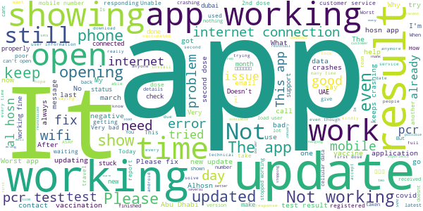

# ALHOSN UAE
App version ``1.46.526``

Analyzed with [covid-apps-observer](http://github.com/covid-apps-observer) project, version ``0.1``

## App overview
| | |
|-------------------------|-------------------------| 
| **Name**&nbsp;&nbsp;&nbsp;&nbsp;&nbsp;&nbsp;&nbsp;&nbsp;&nbsp;&nbsp;&nbsp;&nbsp;&nbsp;&nbsp;&nbsp;&nbsp;&nbsp;&nbsp;&nbsp;&nbsp;&nbsp;&nbsp;&nbsp;&nbsp;&nbsp;&nbsp;&nbsp;&nbsp;&nbsp;&nbsp;&nbsp;&nbsp;&nbsp;&nbsp;&nbsp;&nbsp;&nbsp;&nbsp;&nbsp;&nbsp;  | ALHOSN UAE |
| **Unique identifier** | doh.health.shield |
| **Link to Google Play** | [https://play.google.com/store/apps/details?id=doh.health.shield](https://play.google.com/store/apps/details?id=doh.health.shield) |
| **Summary**  | ALHOSN UAE allows you to keep your COVID-19 results on your mobile device |
| **Privacy policy** | [https://alhosnapp.ae/en/privacy-policy/](https://alhosnapp.ae/en/privacy-policy/) |
| **Latest version** | 1.46.526 |
| **Last update** | 2021-03-14 14:13:19 |
| **Recent changes** | - Vaccination details are provided for medical use - Vaccine certificate report can be generated from the app - Removed Battery saving mode  - Removed Contact trace feature - removed Bluetooth permission - Improved user experience  - App stability |
| **Installs**  | 1,000,000+ |
| **Category** | Medical |
| **First release** | Apr 7, 2020 |
| **Size**  | 12M |
| **Supported Android version**  | 5.0 and up |

### Description
> The ALHOSN UAE app is the official COVID-19 testing channel for health authorities in the United Arab Emirates, by the Ministry of Health and Prevention.
 By using the app, everyone can help stop the spread of COVID-19 and keep their family and friends safe.
  
 You can receive your COVID-19 test results directly on your phone with a unique QR code that is proof of your status and that of everyone else around you who also have the app, giving you peace of mind that you can safely interact.
 The app can also help trace people who may have come within close proximity to confirmed COVID-19 cases for an extended period of time. It uses short-distance Bluetooth signals to determine when your phone is near another phone that also has the app installed.  Both phones exchange anonymized IDs which are then stored in encrypted form on your phone. Using the anonymized IDs, health authorities can quickly identify and contact people at risk of infection so they can be retested.
  
 Put your health in your hands with 3 easy steps:
 1.      Download the ALHOSN UAE app
 2.      Authenticate with your Emirates ID and phone number
 3.      Turn on Bluetooth and push notifications on your smartphone
  
 Download the ALHOSN UAE app today and share it with your family and friends.
 Together, we can stop the spread of COVID-19
 Safer Together.

### User interface
The developers of the app provide the following screenshots in the Google play store.
| | | |
|:-------------------------:|:-------------------------:|:-------------------------:|
 |   |  

## Development team
In the following we report the main information provided by the development team in the Google play store.

| | |
|-------------------------|-------------------------|
| **Developer**  | Ministry of Health and Prevention - UAE |
| **Website**  | [https://alhosnapp.ae/en/contact-us/](https://alhosnapp.ae/en/contact-us/) |
| **Email** | info@alhosnapp.ae |
| **Physical address**  | - |
| **Other developed apps**  | [https://play.google.com/store/apps/developer?id=Ministry+of+Health+and+Prevention+-+UAE](https://play.google.com/store/apps/developer?id=Ministry+of+Health+and+Prevention+-+UAE) |

## Android support

| | |
|-------------------------|-------------------------|
| **Declared target Android version**  | Android10, version 10 (API level 29) |
| **Effective target Android version**  | Android10, version 10 (API level 29) |
| **Minimum supported Android version**  | Lollipop, version 5.0 (API level 21) |
| **Maximum target Android version**  | - |

The larger the difference between the minimum and maximum supported Android versions, the better. A larger difference means a wider audience. For example, old phones have a very low Android version, so a high minimum supported Android version means that the app cannot be used by users with old phones, thus leading to accessibility problems. 

## Requested permissions

In the following we report the complete list of the permissions requested by the app. 

| **Permission** | **Protection level** | **Description** | 
|-------------------------|-------------------------|-------------------------|
 **android.permission ACCESS_NETWORK_STATE** | Normal | Allows applications to access information about networks. 
 **android.permission CAMERA** | :warning:**Dangerous** | Required to be able to access the camera device. 
 **android.permission FOREGROUND_SERVICE** | Normal | Allows a regular application to use Service.startForeground. 
 **android.permission INTERNET** | Normal | Allows applications to open network sockets. 
 **android.permission QUICKBOOT_POWERON** | - | - 
 **android.permission RECEIVE_BOOT_COMPLETED** | Normal | Allows an application to receive the Intent.ACTION_BOOT_COMPLETED that is broadcast after the system finishes booting. 
 **android.permission REQUEST_IGNORE_BATTERY_OPTIMIZATIONS** | Normal | Permission an application must hold in order to use Settings.ACTION_REQUEST_IGNORE_BATTERY_OPTIMIZATIONS. 
 **android.permission WAKE_LOCK** | Normal | Allows using PowerManager WakeLocks to keep processor from sleeping or screen from dimming. 
 **android.permission WRITE_EXTERNAL_STORAGE** | :warning:**Dangerous** | Allows an application to write to external storage. 
 **com.google.android.c2dm.permission RECEIVE** | - | - 

## Mentioned servers

| **Server** | **Registrant** | **Registrant country** | **Creation date** | 
|-------------------------|-------------------------|-------------------------|-------------------------|
 | adobe.com | Adobe Inc. | :us: US | 1986-11-17 05:00:00 |
 | google.com | Google LLC | :us: US | 1997-09-15 04:00:00 |
 | healthshielduae.com | Domains By Proxy, LLC | :us: US | 2020-03-31 19:30:02 |

## Security analysis 

Below we report the main security warnings raised by our execution of the [Androwarn](https://github.com/maaaaz/androwarn) security analysis tool.

**Connection interfaces exfiltration**
> - This application reads details about the currently active data network 
> - This application tries to find out if the currently active data network is metered 

**Suspicious connection establishment**
> - This application opens a Socket and connects it to the remote address 'Li/b/a/a/a;->f(Ljava/lang/String;)Ljava/lang/StringBuilder;' on the 'N/A' port  
> - This application opens a Socket and connects it to the remote address 'Ljava/net/Proxy;->type()Ljava/net/Proxy$Type;' on the 'N/A' port  
> - This application opens a Socket and connects it to the remote address 'hostname == null ' on the 'N/A' port  
> - This application opens a Socket and connects it to the remote address 'timeout' on the 'N/A' port  

**Code execution**
> - This application loads a native library 
> - This application loads a native library: 'tool-checker' 
> - This application executes a UNIX command 
> - This application executes a UNIX command containing this argument: 'getprop' 
> - This application executes a UNIX command containing this argument: 'mount' 

## User ratings and reviews

Below we provide information about how end users are reacting to the app in terms of ratings and reviews in the Google Play store.

### Ratings

The ALHOSN UAE app has been installed by more than **1000000** times. At this time, **13572** rated the app and its average score is **4.1284075**. Below we show the distribution of the ratings across the usual star-based rating of Google Play

:star::star::star::star::star:: 9455

:star::star::star::star:: 1012

:star::star::star:: 613

:star::star:: 379

:star:: 2113

### Reviews 

#### 5-star reviews

> Nice application  :date: __2021-03-28 14:20:05__

> Good  :date: __2021-03-28 09:42:45__

> Alijan Khan  :date: __2021-03-28 09:22:22__

> Great,its easy to number your days for the next PCR test  :date: __2021-03-28 06:20:58__

> very useful app. very convenient to use  :date: __2021-03-28 05:11:30__

> Two  :date: __2021-03-27 21:48:25__

> Good  :date: __2021-03-27 16:34:07__

> The app is not working since I updated it so fix the error asp so day we can use it  :date: __2021-03-27 16:31:06__

> ALHOSNUAE  :date: __2021-03-27 13:16:31__

> Good  :date: __2021-03-27 12:08:38__

#### 4-star reviews

> Excellent ☺️  :date: __2021-03-25 04:48:06__

> My 2nd dose vaccination date still not showing even I'm done it last 6th February 2021. That is why up to now I cannot experience the letter E on this application. As to when it will be updated, I don't know. Hoping to see and appear the update. Thank you.  :date: __2021-03-25 02:19:11__

> اكثر من رائع  :date: __2021-03-24 15:08:22__

> its good one but my vaccination is not updated still almost 21 days finish i took 1 dose of vaccination  :date: __2021-03-24 04:26:18__

> Worst! I open al hosn app but it did not shown anyth8ng. What happened to this? I want to know my PCR test.  :date: __2021-03-23 19:54:14__

> Its very helpful  :date: __2021-03-23 18:17:31__

> Why its not working today  :date: __2021-03-23 17:43:19__

> Good apps  :date: __2021-03-23 17:36:56__

> Good  :date: __2021-03-23 17:18:29__

> It's working fine but today ask for update since that not working asking Error No internet no cellular data error, please support.thanks  :date: __2021-03-23 17:10:33__

#### 3-star reviews

> Hi,  Your application is great.  But test collection/swab taken time is very important for travel purposes on the PCR certificates generated by Al Hosn App. If your team could make that happen many countries would recognise Al Hosn as legitimate source of PCR test result.  Please take a look at the test certificate Generated by Seha App/Pure Health Web Portal  :date: __2021-03-28 09:01:27__

> I cant open the app. Please fix the issues. Becuse of this issue i cant travel to abudhabi. So please fix this issue as soon as possible.  :date: __2021-03-27 09:13:27__

> Some times it's not working in mobile data..  :date: __2021-03-27 02:53:27__

> The app does not show my vaccination.  :date: __2021-03-26 05:11:48__

> App is crashing so many time not working properly from last few days  :date: __2021-03-23 20:56:54__

> The app is not working today  :date: __2021-03-23 20:27:28__

> I updated it today, when I want to show my pcr test it's says I need to open wifi or data though wifi is open same as data. I Un installed it and Install now Cnt login because error always popping out  :date: __2021-03-23 20:18:44__

> Drains the battery with constant Bluetooth scanning. I believe scanning should happen less frequently or when location changes.  :date: __2021-03-23 20:06:57__

> Hello I can't open my alhosn app  :date: __2021-03-23 19:19:00__

> 👌 🆗️ Good  :date: __2021-03-23 18:31:58__

#### 2-star reviews

> The app crashes most of the time and doesn't open.  :date: __2021-03-23 21:06:15__

> My Al Hassan application is not opening  :date: __2021-03-23 20:50:33__

> I made a mistake and updated the app and its now not working. Please fix for S8  :date: __2021-03-23 20:38:47__

> App crashing now a days, if this the way then what is the use of this App.  :date: __2021-03-23 19:25:00__

> No Internet connection problem 😕 please resolve it  :date: __2021-03-23 19:10:53__

> The app is updated and its not working only.... its showing an error has been occured... i have to go to abu dhabi tomorrow ... now how can i show the appp  :date: __2021-03-23 19:03:26__

> The App was working fine until today. But now it is saying "No Internet" even if wifi is on. I have uninstalled and re-installed. But still facing the same problem. Appreciate your support to address the above issue. Thanks  :date: __2021-03-23 18:48:30__

> After the update the application dose not work it keep asking me for internet connection even though my data is on or connected to Wi-Fi  :date: __2021-03-23 18:43:13__

> Dear developers, The app is showing no internet connection since today, 23 Mar 2021. It was a hustle while traveling back to Abu Dubai today. I got lucky cause I had the screenshot of my test in advance but alot of people were declined to enter due to no proof. Please fix this at the earliest...  :date: __2021-03-23 17:56:53__

> Dear development team, The app is trying to find connection even though the phone is connected to Internet. It keeps crashing and i cannot see my result. Thanks  :date: __2021-03-23 17:50:12__

#### 1-star reviews

> App not working after the installation. Please do needful to make it useful.  :date: __2021-03-28 14:06:58__

> poor app not responding  :date: __2021-03-28 12:19:50__

> Vaccination status still not shown after more than 2 months of my second dose. Only the fist dose is shown in the app. Regular follow up is difficult as the customer care is always busy.  :date: __2021-03-28 11:28:11__

> App fails to load. Very frustrating since I have to show my status at security at work.  :date: __2021-03-28 10:14:02__

> This is not working, even after updating the app. It says first dose was on Jan 20th and secon dose on Jan 21st. Doesnt make any sense. Not sure how to travel relying the E emblem now, sorry.  :date: __2021-03-28 09:43:33__

> It doesn't open at all. Stuck on splash screen.  :date: __2021-03-28 09:05:57__

> Very bad. It doesn't open when you launch it. I tried to remove it and install it again but it doesn't work.  :date: __2021-03-28 07:03:41__

> Every time this app crash  :date: __2021-03-27 20:54:05__

> Bad app everytime I download it keep stopping  :date: __2021-03-27 19:27:44__

> The app is not working at all after the update.  :date: __2021-03-27 18:54:12__

