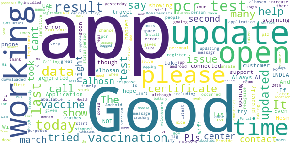

# ALHOSN UAE
App version ``1.46.610``

Analyzed with [covid-apps-observer](http://github.com/covid-apps-observer) project, version ``0.1``

## App overview
| | |
|-------------------------|-------------------------| 
| **Name**&nbsp;&nbsp;&nbsp;&nbsp;&nbsp;&nbsp;&nbsp;&nbsp;&nbsp;&nbsp;&nbsp;&nbsp;&nbsp;&nbsp;&nbsp;&nbsp;&nbsp;&nbsp;&nbsp;&nbsp;&nbsp;&nbsp;&nbsp;&nbsp;&nbsp;&nbsp;&nbsp;&nbsp;&nbsp;&nbsp;&nbsp;&nbsp;&nbsp;&nbsp;&nbsp;&nbsp;&nbsp;&nbsp;&nbsp;&nbsp;  | ALHOSN UAE |
| **Unique identifier** | doh.health.shield |
| **Link to Google Play** | [https://play.google.com/store/apps/details?id=doh.health.shield](https://play.google.com/store/apps/details?id=doh.health.shield) |
| **Summary**  | ALHOSN UAE allows you to keep your COVID-19 results on your mobile device |
| **Privacy policy** | [https://alhosnapp.ae/en/privacy-policy/](https://alhosnapp.ae/en/privacy-policy/) |
| **Latest version** | 1.46.610 |
| **Last update** | 2021-04-08 16:26:26 |
| **Recent changes** | - Improved user experience  - App stability |
| **Installs**  | 1,000,000+ |
| **Category** | Medical |
| **First release** | Apr 7, 2020 |
| **Size**  | 12M |
| **Supported Android version**  | 5.0 and up |

### Description
> The ALHOSN UAE app is the official COVID-19 testing channel for health authorities in the United Arab Emirates, by the Ministry of Health and Prevention.
 By using the app, everyone can help stop the spread of COVID-19 and keep their family and friends safe.
  
 You can receive your COVID-19 test results directly on your phone with a unique QR code that is proof of your status and that of everyone else around you who also have the app, giving you peace of mind that you can safely interact.
 The app can also help trace people who may have come within close proximity to confirmed COVID-19 cases for an extended period of time. It uses short-distance Bluetooth signals to determine when your phone is near another phone that also has the app installed.  Both phones exchange anonymized IDs which are then stored in encrypted form on your phone. Using the anonymized IDs, health authorities can quickly identify and contact people at risk of infection so they can be retested.
  
 Put your health in your hands with 3 easy steps:
 1.      Download the ALHOSN UAE app
 2.      Authenticate with your Emirates ID and phone number
 3.      Turn on Bluetooth and push notifications on your smartphone
  
 Download the ALHOSN UAE app today and share it with your family and friends.
 Together, we can stop the spread of COVID-19
 Safer Together.

### User interface
The developers of the app provide the following screenshots in the Google play store.
| | | |
|:-------------------------:|:-------------------------:|:-------------------------:|
 |   |  

## Development team
In the following we report the main information provided by the development team in the Google play store.

| | |
|-------------------------|-------------------------|
| **Developer**  | Ministry of Health and Prevention - UAE |
| **Website**  | [https://alhosnapp.ae/en/contact-us/](https://alhosnapp.ae/en/contact-us/) |
| **Email** | info@alhosnapp.ae |
| **Physical address**  | - |
| **Other developed apps**  | [https://play.google.com/store/apps/developer?id=Ministry+of+Health+and+Prevention+-+UAE](https://play.google.com/store/apps/developer?id=Ministry+of+Health+and+Prevention+-+UAE) |

## Android support

| | |
|-------------------------|-------------------------|
| **Declared target Android version**  | Android10, version 10 (API level 29) |
| **Effective target Android version**  | Android10, version 10 (API level 29) |
| **Minimum supported Android version**  | Lollipop, version 5.0 (API level 21) |
| **Maximum target Android version**  | - |

The larger the difference between the minimum and maximum supported Android versions, the better. A larger difference means a wider audience. For example, old phones have a very low Android version, so a high minimum supported Android version means that the app cannot be used by users with old phones, thus leading to accessibility problems. 

## Requested permissions

In the following we report the complete list of the permissions requested by the app. 

| **Permission** | **Protection level** | **Description** | 
|-------------------------|-------------------------|-------------------------|
 **android.permission ACCESS_NETWORK_STATE** | Normal | Allows applications to access information about networks. 
 **android.permission CAMERA** | :warning:**Dangerous** | Required to be able to access the camera device. 
 **android.permission FOREGROUND_SERVICE** | Normal | Allows a regular application to use Service.startForeground. 
 **android.permission INTERNET** | Normal | Allows applications to open network sockets. 
 **android.permission QUICKBOOT_POWERON** | - | - 
 **android.permission RECEIVE_BOOT_COMPLETED** | Normal | Allows an application to receive the Intent.ACTION_BOOT_COMPLETED that is broadcast after the system finishes booting. 
 **android.permission REQUEST_IGNORE_BATTERY_OPTIMIZATIONS** | Normal | Permission an application must hold in order to use Settings.ACTION_REQUEST_IGNORE_BATTERY_OPTIMIZATIONS. 
 **android.permission WAKE_LOCK** | Normal | Allows using PowerManager WakeLocks to keep processor from sleeping or screen from dimming. 
 **android.permission WRITE_EXTERNAL_STORAGE** | :warning:**Dangerous** | Allows an application to write to external storage. 
 **com.google.android.c2dm.permission RECEIVE** | - | - 

## Mentioned servers

| **Server** | **Registrant** | **Registrant country** | **Creation date** | 
|-------------------------|-------------------------|-------------------------|-------------------------|
 | adobe.com | Adobe Inc. | :us: US | 1986-11-17 05:00:00 |
 | google.com | Google LLC | :us: US | 1997-09-15 04:00:00 |
 | healthshielduae.com | Domains By Proxy, LLC | :us: US | 2020-03-31 19:30:02 |

## Security analysis 

Below we report the main security warnings raised by our execution of the [Androwarn](https://github.com/maaaaz/androwarn) security analysis tool.

**Connection interfaces exfiltration**
> - This application reads details about the currently active data network 
> - This application tries to find out if the currently active data network is metered 

**Suspicious connection establishment**
> - This application opens a Socket and connects it to the remote address 'Lh/b/a/a/a;->f(Ljava/lang/String;)Ljava/lang/StringBuilder;' on the 'N/A' port  
> - This application opens a Socket and connects it to the remote address 'Ljava/net/Proxy;->type()Ljava/net/Proxy$Type;' on the 'N/A' port  
> - This application opens a Socket and connects it to the remote address 'hostname == null ' on the 'N/A' port  
> - This application opens a Socket and connects it to the remote address 'timeout' on the 'N/A' port  

**Code execution**
> - This application loads a native library 
> - This application loads a native library: 'tool-checker' 
> - This application executes a UNIX command 
> - This application executes a UNIX command containing this argument: 'getprop' 
> - This application executes a UNIX command containing this argument: 'mount' 

## User ratings and reviews

Below we provide information about how end users are reacting to the app in terms of ratings and reviews in the Google Play store.

### Ratings

The ALHOSN UAE app has been installed by more than **1000000** times. At this time, **18475** rated the app and its average score is **4.2978005**. Below we show the distribution of the ratings across the usual star-based rating of Google Play

:star::star::star::star::star:: 13717

:star::star::star::star:: 1508

:star::star::star:: 601

:star::star:: 336

:star:: 2313

### Reviews 

#### 5-star reviews

> Excellent  :date: __2021-04-18 10:00:04__

> Good to c the ALHOSN  :date: __2021-04-18 09:49:41__

> it’s Doesn't work at all  :date: __2021-04-18 08:02:45__

> Good  :date: __2021-04-18 03:10:20__

> No working in my hend sit mobile sumsung s9+  :date: __2021-04-18 03:00:36__

> Super App  :date: __2021-04-17 21:08:17__

> Excellent  :date: __2021-04-17 18:36:37__

> Easy  :date: __2021-04-17 16:00:34__

> Satisfactory  :date: __2021-04-17 14:21:30__

> Hello alhosn good app  :date: __2021-04-17 13:05:47__

#### 4-star reviews

> User friendly app. New update on vaccination details are very handy for traveling. Thank you for the team behind the app.  :date: __2021-04-17 21:29:24__

> My 1 negative 11 April 2021  :date: __2021-04-17 12:54:56__

> Wating for installation  :date: __2021-04-16 07:55:30__

> Awesome and very convenient.👍  :date: __2021-04-15 16:24:15__

> Nice aaps  :date: __2021-04-13 13:54:50__

> Good  :date: __2021-04-12 11:11:07__

> I am unable to open this app  :date: __2021-04-12 09:23:16__

> Very good app  :date: __2021-04-11 18:46:40__

> Nice app  :date: __2021-04-11 12:24:40__

> Im a first timer  :date: __2021-04-10 18:20:46__

#### 3-star reviews

> Does not have updating on personal PRC & Vaccination data.. Pls. Provide timely Updates as this is very sensitive to people.  :date: __2021-04-17 18:08:55__

> Good  :date: __2021-04-17 09:59:29__

> Good  :date: __2021-04-17 01:56:41__

> Calling the call center from last night no response and no update on this app of my latest results including my second vaccine updates,please increase call center call taking reps  :date: __2021-04-15 09:23:53__

> Good  :date: __2021-04-13 18:06:39__

> Isn't it suppose to say when the person took the first and second dose of the vaccine? How do I contact to say I should have the E status.  :date: __2021-04-09 22:46:56__

> Is not updated i have my result of pcr test today from sms but in alhosn app still in march 22,,,update pls..thank u..  :date: __2021-04-09 21:48:31__

> Application crashes while opening after the update on Android.  :date: __2021-04-08 13:40:04__

> Good  :date: __2021-04-07 11:36:49__

> NOT update last pcr test result  :date: __2021-04-05 18:03:30__

#### 2-star reviews

> On this App, it's just showing my 2nd dose as my 1st dose. It's not showing that I'm Vaccinated already.  :date: __2021-04-14 20:32:33__

> My app is not working, it only show results of the DPI. I have called, emailed, deleted and re-installed the app and nothing works. Government needs the app to cross the checkpoint and its placing unnecessary stress on me as I fear I will not be able to go to work. My colleagues apps is working fine. It looks like I have excuses to go to work. Please help 🙏  :date: __2021-04-10 12:44:25__

> Good  :date: __2021-04-08 14:44:41__

> Hi, Is there any rule that the details in the app doesn't get updated, if have recently travelled and stayed for less than 14 days in dubai?  :date: __2021-04-08 13:58:38__

> I can't register my App because even though it shows my correct name and UID number, it isn't recognizing my cell and says it's not the correct number on file. What "file"??? Of course you can't get anyone from Al Hosn to answer phone or return messages to help me with this change. So I am basically out of luck crossing the border until it's fixed. Ridiculous to just register with your cell number and not having the option for also registering with email, when cell numbers can change.  :date: __2021-04-07 14:37:26__

> Super  :date: __2021-04-05 20:44:45__

> Application is not working after update  :date: __2021-04-05 12:23:13__

> Good apps  :date: __2021-04-05 11:50:08__

> Good but sometimes not working  :date: __2021-04-04 11:22:14__

> Not working right now  :date: __2021-04-03 23:51:15__

#### 1-star reviews

> i give them my personal phone no but they add old no when i get 2nd dose then the ask me my no i give him my personal no i recive message of 2nd dose when i loging with my personal no they show this no is not register put your other numbers how i put other no for my report witch numbers i dont know  :date: __2021-04-18 09:41:13__

> Wrost app ever i see  :date: __2021-04-18 06:26:28__

> My status was not updated in ALHOSN even after 3 days passed of PCR test. I called ALHOSN several times but update wasn't taken place. I received the negative result of PCR through sms which shown to Abu Dhabi-Dubai border where police didn't allow enter to Abu Dhabi.  :date: __2021-04-18 05:13:00__

> Stupid app I can't change my phone number  :date: __2021-04-18 04:11:04__

> Bad  :date: __2021-04-18 04:02:18__

> It's not even opening. I already uninstalled and reinstalled but same thing happened. Please fix this.  :date: __2021-04-17 23:52:02__

> I tried all the way to get the OTP but I didn't receive it, I update my ID Data but same situation. There is any way to solve it??!!  :date: __2021-04-17 23:14:51__

> nice  :date: __2021-04-17 19:49:22__

> Its a bit bad because whenever i tried to add other user it responded an error occurred 😒😔  :date: __2021-04-17 18:51:03__

> The App itself not working in andriod's phone.. it only works for iPhone... Very frustrating 😕 ... Am not the only one whoz facing the problem ... My friend's and relatives have the same issues... Kindly focus on this ...😷... Revert back to this message....  :date: __2021-04-17 18:21:28__

