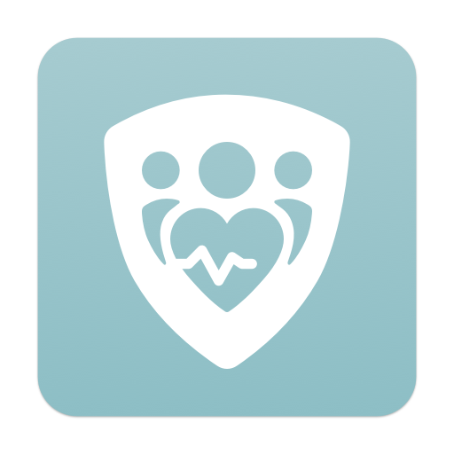
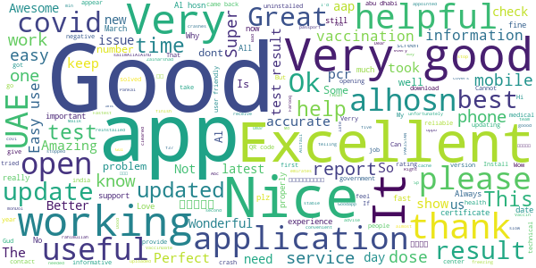
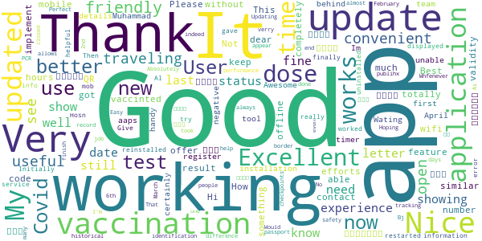
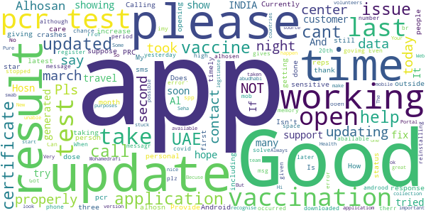
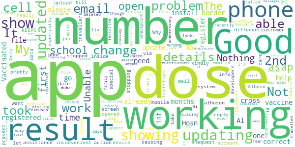
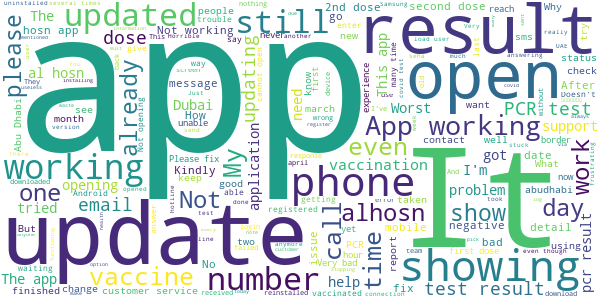

# ALHOSN UAE
App version ``1.46.646``

Analyzed with [covid-apps-observer](http://github.com/covid-apps-observer) project, version ``0.1``

## App overview
| | |
|-------------------------|-------------------------| 
| **Name**&nbsp;&nbsp;&nbsp;&nbsp;&nbsp;&nbsp;&nbsp;&nbsp;&nbsp;&nbsp;&nbsp;&nbsp;&nbsp;&nbsp;&nbsp;&nbsp;&nbsp;&nbsp;&nbsp;&nbsp;&nbsp;&nbsp;&nbsp;&nbsp;&nbsp;&nbsp;&nbsp;&nbsp;&nbsp;&nbsp;&nbsp;&nbsp;&nbsp;&nbsp;&nbsp;&nbsp;&nbsp;&nbsp;&nbsp;&nbsp;  | ALHOSN UAE |
| **Unique identifier** | doh.health.shield |
| **Link to Google Play** | [https://play.google.com/store/apps/details?id=doh.health.shield](https://play.google.com/store/apps/details?id=doh.health.shield) |
| **Summary**  | ALHOSN UAE allows you to keep your COVID-19 results on your mobile device |
| **Privacy policy** | [https://alhosnapp.ae/en/privacy-policy/](https://alhosnapp.ae/en/privacy-policy/) |
| **Latest version** | 1.46.646 |
| **Last update** | 2021-04-26 10:42:44 |
| **Recent changes** | - Improved user experience  - App stability |
| **Installs**  | 1,000,000+ |
| **Category** | Medical |
| **First release** | Apr 7, 2020 |
| **Size**  | 12M |
| **Supported Android version**  | 5.0 and up |

### Description
> The ALHOSN UAE app is the official COVID-19 testing channel for health authorities in the United Arab Emirates, by the Ministry of Health and Prevention.
 By using the app, everyone can help stop the spread of COVID-19 and keep their family and friends safe.
  
 You can receive your COVID-19 test results directly on your phone with a unique QR code that is proof of your status and that of everyone else around you who also have the app, giving you peace of mind that you can safely interact.
 The app can also help trace people who may have come within close proximity to confirmed COVID-19 cases for an extended period of time. It uses short-distance Bluetooth signals to determine when your phone is near another phone that also has the app installed.  Both phones exchange anonymized IDs which are then stored in encrypted form on your phone. Using the anonymized IDs, health authorities can quickly identify and contact people at risk of infection so they can be retested.
  
 Put your health in your hands with 3 easy steps:
 1.      Download the ALHOSN UAE app
 2.      Authenticate with your Emirates ID and phone number
 3.      Turn on Bluetooth and push notifications on your smartphone
  
 Download the ALHOSN UAE app today and share it with your family and friends.
 Together, we can stop the spread of COVID-19
 Safer Together.

### User interface
The developers of the app provide the following screenshots in the Google play store.
| | | |
|:-------------------------:|:-------------------------:|:-------------------------:|
 |   |  

## Development team
In the following we report the main information provided by the development team in the Google play store.

| | |
|-------------------------|-------------------------|
| **Developer**  | Ministry of Health and Prevention - UAE |
| **Website**  | [https://alhosnapp.ae/en/contact-us/](https://alhosnapp.ae/en/contact-us/) |
| **Email** | info@alhosnapp.ae |
| **Physical address**  | - |
| **Other developed apps**  | [https://play.google.com/store/apps/developer?id=Ministry+of+Health+and+Prevention+-+UAE](https://play.google.com/store/apps/developer?id=Ministry+of+Health+and+Prevention+-+UAE) |

## Android support

| | |
|-------------------------|-------------------------|
| **Declared target Android version**  | Android10, version 10 (API level 29) |
| **Effective target Android version**  | Android10, version 10 (API level 29) |
| **Minimum supported Android version**  | Lollipop, version 5.0 (API level 21) |
| **Maximum target Android version**  | - |

The larger the difference between the minimum and maximum supported Android versions, the better. A larger difference means a wider audience. For example, old phones have a very low Android version, so a high minimum supported Android version means that the app cannot be used by users with old phones, thus leading to accessibility problems. 

## Requested permissions

In the following we report the complete list of the permissions requested by the app. 

| **Permission** | **Protection level** | **Description** | 
|-------------------------|-------------------------|-------------------------|
 **android.permission ACCESS_NETWORK_STATE** | Normal | Allows applications to access information about networks. 
 **android.permission CAMERA** | :warning:**Dangerous** | Required to be able to access the camera device. 
 **android.permission FOREGROUND_SERVICE** | Normal | Allows a regular application to use Service.startForeground. 
 **android.permission INTERNET** | Normal | Allows applications to open network sockets. 
 **android.permission QUICKBOOT_POWERON** | - | - 
 **android.permission RECEIVE_BOOT_COMPLETED** | Normal | Allows an application to receive the Intent.ACTION_BOOT_COMPLETED that is broadcast after the system finishes booting. 
 **android.permission REQUEST_IGNORE_BATTERY_OPTIMIZATIONS** | Normal | Permission an application must hold in order to use Settings.ACTION_REQUEST_IGNORE_BATTERY_OPTIMIZATIONS. 
 **android.permission WAKE_LOCK** | Normal | Allows using PowerManager WakeLocks to keep processor from sleeping or screen from dimming. 
 **android.permission WRITE_EXTERNAL_STORAGE** | :warning:**Dangerous** | Allows an application to write to external storage. 
 **com.google.android.c2dm.permission RECEIVE** | - | - 

## Mentioned servers

| **Server** | **Registrant** | **Registrant country** | **Creation date** | 
|-------------------------|-------------------------|-------------------------|-------------------------|
 | adobe.com | Adobe Inc. | :us: US | 1986-11-17 05:00:00 |
 | google.com | Google LLC | :us: US | 1997-09-15 04:00:00 |
 | healthshielduae.com | Domains By Proxy, LLC | :us: US | 2020-03-31 19:30:02 |

## Security analysis 

Below we report the main security warnings raised by our execution of the [Androwarn](https://github.com/maaaaz/androwarn) security analysis tool.

**Connection interfaces exfiltration**
> - This application reads details about the currently active data network 
> - This application tries to find out if the currently active data network is metered 

**Suspicious connection establishment**
> - This application opens a Socket and connects it to the remote address 'Lh/b/a/a/a;->f(Ljava/lang/String;)Ljava/lang/StringBuilder;' on the 'N/A' port  
> - This application opens a Socket and connects it to the remote address 'Ljava/net/Proxy;->type()Ljava/net/Proxy$Type;' on the 'N/A' port  
> - This application opens a Socket and connects it to the remote address 'hostname == null ' on the 'N/A' port  
> - This application opens a Socket and connects it to the remote address 'timeout' on the 'N/A' port  

**Code execution**
> - This application loads a native library 
> - This application loads a native library: 'tool-checker' 
> - This application executes a UNIX command 
> - This application executes a UNIX command containing this argument: 'getprop' 
> - This application executes a UNIX command containing this argument: 'mount' 

## User ratings and reviews

Below we provide information about how end users are reacting to the app in terms of ratings and reviews in the Google Play store.

### Ratings

The ALHOSN UAE app has been installed by more than **1000000** times. At this time, **19582** rated the app and its average score is **3.9661672**. Below we show the distribution of the ratings across the usual star-based rating of Google Play

:star::star::star::star::star:: 13053

:star::star::star::star:: 1344

:star::star::star:: 700

:star::star:: 444

:star:: 4041

### Reviews 

#### 5-star reviews

> Pankai monDol  :date: __2021-05-01 13:03:49__

> it's nice  :date: __2021-05-01 10:38:09__

> Nice  :date: __2021-05-01 10:17:47__

> Good  :date: __2021-05-01 05:31:34__

> Good  :date: __2021-05-01 00:31:39__

> Excellent  :date: __2021-05-01 00:23:59__

> Bad  :date: __2021-04-30 20:28:36__

> Very good  :date: __2021-04-30 19:57:15__

> Good app  :date: __2021-04-30 18:18:05__

> Good app  :date: __2021-04-30 18:03:08__

#### 4-star reviews

> This app totally not working  :date: __2021-04-29 05:34:03__

> Not working I cannot use  :date: __2021-04-28 15:33:38__

> شكرا لكم..لكن التطبيق عندي احيانا بعد فتحه يغلق لوحده  :date: __2021-04-28 11:07:28__

> Thank you so much for your efforts.  :date: __2021-04-28 08:18:06__

> Application is good but is my mobile not able to update  :date: __2021-04-26 22:07:48__

> Good apps  :date: __2021-04-26 18:54:25__

> Very good  :date: __2021-04-26 18:13:10__

> Very good app  :date: __2021-04-24 20:47:08__

> It is working better now. Thank you. Please implement an offline feature with "vaccinted" QR code validity for 24 hours , or something similar, as app not working completely without wifi. Thanks.  :date: __2021-04-22 21:25:49__

> 👍  :date: __2021-04-22 06:52:32__

#### 3-star reviews

> Hi i downloaded the app but unable to open .  :date: __2021-04-30 02:41:12__

> After login with my emirates id it shows the result. But failing to show my photo.  :date: __2021-04-30 02:36:48__

> I am giving three star, not updating properly, so please to take care this application.  :date: __2021-04-25 15:50:57__

> Test results are not getting updated on time.  :date: __2021-04-22 07:25:02__

> Currently outside of UAE...app not working.  :date: __2021-04-18 11:47:37__

> Does not have updating on personal PRC & Vaccination data.. Pls. Provide timely Updates as this is very sensitive to people.  :date: __2021-04-17 18:08:55__

> Good  :date: __2021-04-17 09:59:29__

> Good  :date: __2021-04-17 01:56:41__

> Calling the call center from last night no response and no update on this app of my latest results including my second vaccine updates,please increase call center call taking reps  :date: __2021-04-15 09:23:53__

> Good  :date: __2021-04-13 18:06:39__

#### 2-star reviews

> I took 2 dose of Vaccine but it shows only one .......when i took 2nd dose it shows 1st dose on that date......Why it's showing wrong .my app is already updated.so please solve my problem..and reply me....  :date: __2021-04-29 07:43:43__

> No more details poor  :date: __2021-04-29 02:22:21__

> Only first dose sinopharm was registered missing the 2nd dose dated april 11 2021.  :date: __2021-04-24 23:27:33__

> Cannot update a family emirates id details  :date: __2021-04-24 17:50:31__

> No support call or email entertained. Vaccinated status not updated.  :date: __2021-04-21 10:36:17__

> On this App, it's just showing my 2nd dose as my 1st dose. It's not showing that I'm Vaccinated already.  :date: __2021-04-14 20:32:33__

> My app is not working, it only show results of the DPI. I have called, emailed, deleted and re-installed the app and nothing works. Government needs the app to cross the checkpoint and its placing unnecessary stress on me as I fear I will not be able to go to work. My colleagues apps is working fine. It looks like I have excuses to go to work. Please help 🙏  :date: __2021-04-10 12:44:25__

> Good  :date: __2021-04-08 14:44:41__

> Hi, Is there any rule that the details in the app doesn't get updated, if have recently travelled and stayed for less than 14 days in dubai?  :date: __2021-04-08 13:58:38__

> I can't register my App because even though it shows my correct name and UID number, it isn't recognizing my cell and says it's not the correct number on file. What "file"??? Of course you can't get anyone from Al Hosn to answer phone or return messages to help me with this change. So I am basically out of luck crossing the border until it's fixed. Ridiculous to just register with your cell number and not having the option for also registering with email, when cell numbers can change.  :date: __2021-04-07 14:37:26__

#### 1-star reviews

> I am vaccinated...but my first vaccinated date was showing wrongly in app what can i do  :date: __2021-05-01 16:48:35__

> I cannot open it even after just installing it. it goes back to my phone home as i press it  :date: __2021-05-01 15:19:04__

> Your app does not have an option to check the result using passport No. It is making a confusion to the people who are on visiting visa who made the test using passport  :date: __2021-04-30 22:48:30__

> Horrible.. The worst app I have ever tried to use. First, it doesn't open for ages , then if it does, it is hard to use. Worse, I have done my vaccination, been 28 days but can't see it, tried contacting through whatsapp but no answer and no help, this is very frustrating. Not at par with Dubai standards at all  :date: __2021-04-30 21:14:59__

> App are not working on my (Samsung note8 ) why?  :date: __2021-04-30 19:46:42__

> Freezing and show no information  :date: __2021-04-30 15:43:08__

> This is very bad app not updated covid 19 test and customer service close the phone on my face and I try to call them again then I'm waiting for more than 30 minutes and they didn't respond  :date: __2021-04-30 13:36:54__

> I have tested RTPCR in seha and report has been got thorugh email.still Alhosn app doest updated my PCR negative result.so i decide to contact them and there is clearly no way to reach them.email failed because its showing full ,on phone call its not reachable.I have to go abudhabi already waited for 10days.now its 13days .48hours already finished still result not updated.what a shamefull app which actually not helping rather bringing trouble to people.wastingmoney,time,energy in every manner😑  :date: __2021-04-30 10:57:21__

> App is not updating even after 48hrs of testing. Very bad experience  :date: __2021-04-30 07:49:49__

> do not open thies app  :date: __2021-04-30 05:46:15__

