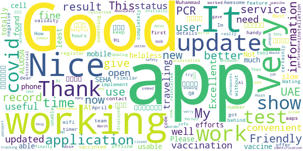
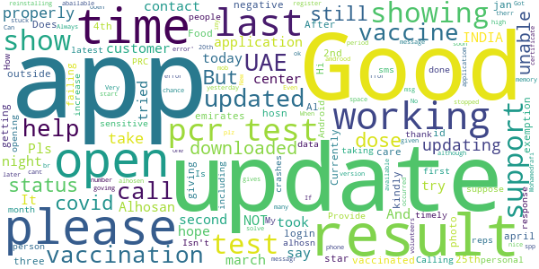

# ALHOSN UAE
App version ``1.46.646``

Analyzed with [covid-apps-observer](http://github.com/covid-apps-observer) project, version ``0.1``

## App overview
| | |
|-------------------------|-------------------------| 
| **Name**&nbsp;&nbsp;&nbsp;&nbsp;&nbsp;&nbsp;&nbsp;&nbsp;&nbsp;&nbsp;&nbsp;&nbsp;&nbsp;&nbsp;&nbsp;&nbsp;&nbsp;&nbsp;&nbsp;&nbsp;&nbsp;&nbsp;&nbsp;&nbsp;&nbsp;&nbsp;&nbsp;&nbsp;&nbsp;&nbsp;&nbsp;&nbsp;&nbsp;&nbsp;&nbsp;&nbsp;&nbsp;&nbsp;&nbsp;&nbsp;  | ALHOSN UAE |
| **Unique identifier** | doh.health.shield |
| **Link to Google Play** | [https://play.google.com/store/apps/details?id=doh.health.shield](https://play.google.com/store/apps/details?id=doh.health.shield) |
| **Summary**  | ALHOSN UAE allows you to keep your COVID-19 results on your mobile device |
| **Privacy policy** | [https://alhosnapp.ae/en/privacy-policy/](https://alhosnapp.ae/en/privacy-policy/) |
| **Latest version** | 1.46.646 |
| **Last update** | 2021-04-26 10:42:44 |
| **Recent changes** | - Improved user experience  - App stability |
| **Installs**  | 1,000,000+ |
| **Category** | Medical |
| **First release** | Apr 7, 2020 |
| **Size**  | 12M |
| **Supported Android version**  | 5.0 and up |

### Description
> The ALHOSN UAE app is the official COVID-19 testing channel for health authorities in the United Arab Emirates, by the Ministry of Health and Prevention.
 By using the app, everyone can help stop the spread of COVID-19 and keep their family and friends safe.
  
 You can receive your COVID-19 test results directly on your phone with a unique QR code that is proof of your status and that of everyone else around you who also have the app, giving you peace of mind that you can safely interact.
 The app can also help trace people who may have come within close proximity to confirmed COVID-19 cases for an extended period of time. It uses short-distance Bluetooth signals to determine when your phone is near another phone that also has the app installed.  Both phones exchange anonymized IDs which are then stored in encrypted form on your phone. Using the anonymized IDs, health authorities can quickly identify and contact people at risk of infection so they can be retested.
  
 Put your health in your hands with 3 easy steps:
 1.      Download the ALHOSN UAE app
 2.      Authenticate with your Emirates ID and phone number
 3.      Turn on Bluetooth and push notifications on your smartphone
  
 Download the ALHOSN UAE app today and share it with your family and friends.
 Together, we can stop the spread of COVID-19
 Safer Together.

### User interface
The developers of the app provide the following screenshots in the Google play store.
| | | |
|:-------------------------:|:-------------------------:|:-------------------------:|
 |   |  

## Development team
In the following we report the main information provided by the development team in the Google play store.

| | |
|-------------------------|-------------------------|
| **Developer**  | Ministry of Health and Prevention - UAE |
| **Website**  | [https://alhosnapp.ae/en/contact-us/](https://alhosnapp.ae/en/contact-us/) |
| **Email** | info@alhosnapp.ae |
| **Physical address**  | - |
| **Other developed apps**  | [https://play.google.com/store/apps/developer?id=Ministry+of+Health+and+Prevention+-+UAE](https://play.google.com/store/apps/developer?id=Ministry+of+Health+and+Prevention+-+UAE) |

## Android support

| | |
|-------------------------|-------------------------|
| **Declared target Android version**  | Android10, version 10 (API level 29) |
| **Effective target Android version**  | Android10, version 10 (API level 29) |
| **Minimum supported Android version**  | Lollipop, version 5.0 (API level 21) |
| **Maximum target Android version**  | - |

The larger the difference between the minimum and maximum supported Android versions, the better. A larger difference means a wider audience. For example, old phones have a very low Android version, so a high minimum supported Android version means that the app cannot be used by users with old phones, thus leading to accessibility problems. 

## Requested permissions

In the following we report the complete list of the permissions requested by the app. 

| **Permission** | **Protection level** | **Description** | 
|-------------------------|-------------------------|-------------------------|
 **android.permission ACCESS_NETWORK_STATE** | Normal | Allows applications to access information about networks. 
 **android.permission CAMERA** | :warning:**Dangerous** | Required to be able to access the camera device. 
 **android.permission FOREGROUND_SERVICE** | Normal | Allows a regular application to use Service.startForeground. 
 **android.permission INTERNET** | Normal | Allows applications to open network sockets. 
 **android.permission QUICKBOOT_POWERON** | - | - 
 **android.permission RECEIVE_BOOT_COMPLETED** | Normal | Allows an application to receive the Intent.ACTION_BOOT_COMPLETED that is broadcast after the system finishes booting. 
 **android.permission REQUEST_IGNORE_BATTERY_OPTIMIZATIONS** | Normal | Permission an application must hold in order to use Settings.ACTION_REQUEST_IGNORE_BATTERY_OPTIMIZATIONS. 
 **android.permission WAKE_LOCK** | Normal | Allows using PowerManager WakeLocks to keep processor from sleeping or screen from dimming. 
 **android.permission WRITE_EXTERNAL_STORAGE** | :warning:**Dangerous** | Allows an application to write to external storage. 
 **com.google.android.c2dm.permission RECEIVE** | - | - 

## Mentioned servers

| **Server** | **Registrant** | **Registrant country** | **Creation date** | 
|-------------------------|-------------------------|-------------------------|-------------------------|
 | adobe.com | Adobe Inc. | :us: US | 1986-11-17 05:00:00 |
 | google.com | Google LLC | :us: US | 1997-09-15 04:00:00 |
 | healthshielduae.com | Domains By Proxy, LLC | :us: US | 2020-03-31 19:30:02 |

## Security analysis 

Below we report the main security warnings raised by our execution of the [Androwarn](https://github.com/maaaaz/androwarn) security analysis tool.

**Connection interfaces exfiltration**
> - This application reads details about the currently active data network 
> - This application tries to find out if the currently active data network is metered 

**Suspicious connection establishment**
> - This application opens a Socket and connects it to the remote address 'Lh/b/a/a/a;->f(Ljava/lang/String;)Ljava/lang/StringBuilder;' on the 'N/A' port  
> - This application opens a Socket and connects it to the remote address 'Ljava/net/Proxy;->type()Ljava/net/Proxy$Type;' on the 'N/A' port  
> - This application opens a Socket and connects it to the remote address 'hostname == null ' on the 'N/A' port  
> - This application opens a Socket and connects it to the remote address 'timeout' on the 'N/A' port  

**Code execution**
> - This application loads a native library 
> - This application loads a native library: 'tool-checker' 
> - This application executes a UNIX command 
> - This application executes a UNIX command containing this argument: 'getprop' 
> - This application executes a UNIX command containing this argument: 'mount' 

## User ratings and reviews

Below we provide information about how end users are reacting to the app in terms of ratings and reviews in the Google Play store.

### Ratings

The ALHOSN UAE app has been installed by more than **1000000** times. At this time, **19582** rated the app and its average score is **3.9661672**. Below we show the distribution of the ratings across the usual star-based rating of Google Play

:star::star::star::star::star:: 13053

:star::star::star::star:: 1344

:star::star::star:: 700

:star::star:: 444

:star:: 4041

### Reviews 

#### 5-star reviews

> Nice & Useful App  :date: __2021-05-09 14:15:57__

> Dood  :date: __2021-05-09 03:13:08__

> Is best app  :date: __2021-05-08 14:57:50__

> Not working oppo f37 please solved my problem  :date: __2021-05-08 02:57:17__

> Nice and well appointed  :date: __2021-05-08 02:45:46__

> V good  :date: __2021-05-07 20:10:37__

> Gud  :date: __2021-05-07 19:51:24__

> Very good  :date: __2021-05-07 18:47:19__

> Good  :date: __2021-05-07 14:28:52__

> Alhosn is good application  :date: __2021-05-07 11:13:09__

#### 4-star reviews

> This app is not working in my cell phone I am very helpless  :date: __2021-05-08 21:47:15__

> Nice  :date: __2021-05-07 17:30:10__

> Friendly user...  :date: __2021-05-07 15:47:50__

> At least I found ALUOSN UAE app that can work and show my vaccine record and PCR test result, other apps like covid 19 UAE and SEHA are not usable and can't give any information or service.  :date: __2021-05-06 11:11:25__

> Very good app  :date: __2021-05-06 00:15:17__

> Very slow updates  :date: __2021-05-04 02:29:51__

> Good  :date: __2021-05-03 08:00:18__

> This app totally not working  :date: __2021-04-29 05:34:03__

> Not working I cannot use  :date: __2021-04-28 15:33:38__

> شكرا لكم..لكن التطبيق عندي احيانا بعد فتحه يغلق لوحده  :date: __2021-04-28 11:07:28__

#### 3-star reviews

> I am vaccinated with 2nd dose on 25th jan 2021 and had covid test also on 4th april 21 which was negative . But still exemption (E) is not showing in Al hosn app kindly support to update the status E  :date: __2021-05-06 13:02:55__

> Food  :date: __2021-05-01 20:57:25__

> Hi i downloaded the app but unable to open .  :date: __2021-04-30 02:41:12__

> After login with my emirates id it shows the result. But failing to show my photo.  :date: __2021-04-30 02:36:48__

> I am giving three star, not updating properly, so please to take care this application.  :date: __2021-04-25 15:50:57__

> Test results are not getting updated on time.  :date: __2021-04-22 07:25:02__

> Currently outside of UAE...app not working.  :date: __2021-04-18 11:47:37__

> Does not have updating on personal PRC & Vaccination data.. Pls. Provide timely Updates as this is very sensitive to people.  :date: __2021-04-17 18:08:55__

> Good  :date: __2021-04-17 09:59:29__

> Good  :date: __2021-04-17 01:56:41__

#### 2-star reviews

> The phone number is different, i can open my account.  :date: __2021-05-09 10:20:40__

> The app was pretty good but now it has stopped updating the pcr result,this is really inconvenient as schools only want alhoson results.kindly fix this problem asap as this is causing me a lot of problems in school.  :date: __2021-05-08 08:29:08__

> Nothing special  :date: __2021-05-08 07:02:36__

> App not working my device every time ALHOSAN KEEPS stopping  :date: __2021-05-05 20:35:24__

> not able to open the app, only 2 times the first screen opened to put my data inside but not able to upload any info to the system. no way to get any assistance via email or phone till now  :date: __2021-05-05 17:18:02__

> Unable to contact customer care by mail and phone number. Result not updating in Alhosn App. Unable to change registered mobile number. Request developers to take action ASAP to prevent further hardships especially for travellers who need to cross borders. Thanks.  :date: __2021-05-02 19:47:20__

> I get both the vaccine's doses before 2.5 months but you app is showing only one dose in your app  :date: __2021-05-02 06:28:23__

> I took 2 dose of Vaccine but it shows only one .......when i took 2nd dose it shows 1st dose on that date......Why it's showing wrong .my app is already updated.so please solve my problem..and reply me....  :date: __2021-04-29 07:43:43__

> No more details poor  :date: __2021-04-29 02:22:21__

> Only first dose sinopharm was registered missing the 2nd dose dated april 11 2021.  :date: __2021-04-24 23:27:33__

#### 1-star reviews

> Need to improve  :date: __2021-05-09 12:44:15__

> this app doesn't work on my phone. doesn't open, nothing to do with this app  :date: __2021-05-08 23:00:55__

> 48 hr already why don't any update ????  :date: __2021-05-08 20:45:15__

> Very bad app and never loads the data, It's very slow and not useful. They need to fix the app.  :date: __2021-05-08 20:44:38__

> Reports aren't getting updated. Not just on my Mobile, but on my parents' mobile phone as well. How am I supposed to enter Abu Dhabi?  :date: __2021-05-08 15:57:12__

> No E mark yet. Called many time to Customer service no response...  :date: __2021-05-08 12:34:48__

> This app isn't opening please kindly attend to me. I need it now  :date: __2021-05-08 08:38:37__

> This app. Not updating my pcr result negative from 3 days and still not show and no way to contact with them email reject and call no one answer, someone have idea how to contact al hosn ?  :date: __2021-05-08 08:21:48__

> Really bad app.. with 0 support... i must go to abudhabi today and the app is bugged but i received the negative test already by sms...  :date: __2021-05-08 07:51:30__

> Downloaded the app but it has failed to open, its two days now and am very frustrated with it.  :date: __2021-05-08 06:39:03__

