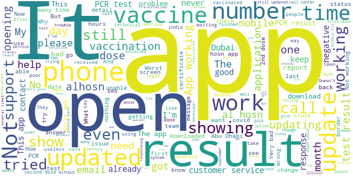

# ALHOSN UAE
App version ``1.47.669``

Analyzed with [covid-apps-observer](http://github.com/covid-apps-observer) project, version ``0.1``

## App overview
| | |
|-------------------------|-------------------------| 
| **Name**&nbsp;&nbsp;&nbsp;&nbsp;&nbsp;&nbsp;&nbsp;&nbsp;&nbsp;&nbsp;&nbsp;&nbsp;&nbsp;&nbsp;&nbsp;&nbsp;&nbsp;&nbsp;&nbsp;&nbsp;&nbsp;&nbsp;&nbsp;&nbsp;&nbsp;&nbsp;&nbsp;&nbsp;&nbsp;&nbsp;&nbsp;&nbsp;&nbsp;&nbsp;&nbsp;&nbsp;&nbsp;&nbsp;&nbsp;&nbsp;  | ALHOSN UAE |
| **Unique identifier** | doh.health.shield |
| **Link to Google Play** | [https://play.google.com/store/apps/details?id=doh.health.shield](https://play.google.com/store/apps/details?id=doh.health.shield) |
| **Summary**  | ALHOSN UAE allows you to keep your COVID-19 results on your mobile device |
| **Privacy policy** | [https://alhosnapp.ae/en/privacy-policy/](https://alhosnapp.ae/en/privacy-policy/) |
| **Latest version** | 1.47.669 |
| **Last update** | 2021-05-10 19:16:45 |
| **Recent changes** | - Improved user experience  - App stability |
| **Installs**  | 1,000,000+ |
| **Category** | Medical |
| **First release** | Apr 7, 2020 |
| **Size**  | 12M |
| **Supported Android version**  | 5.0 and up |

### Description
> The ALHOSN UAE app is the official COVID-19 testing channel for health authorities in the United Arab Emirates, by the Ministry of Health and Prevention.
 By using the app, everyone can help stop the spread of COVID-19 and keep their family and friends safe.
  
 You can receive your COVID-19 test results directly on your phone with a unique QR code that is proof of your status and that of everyone else around you who also have the app, giving you peace of mind that you can safely interact.
 The app can also help trace people who may have come within close proximity to confirmed COVID-19 cases for an extended period of time. It uses short-distance Bluetooth signals to determine when your phone is near another phone that also has the app installed.  Both phones exchange anonymized IDs which are then stored in encrypted form on your phone. Using the anonymized IDs, health authorities can quickly identify and contact people at risk of infection so they can be retested.
  
 Put your health in your hands with 3 easy steps:
 1.      Download the ALHOSN UAE app
 2.      Authenticate with your Emirates ID and phone number
 3.      Turn on Bluetooth and push notifications on your smartphone
  
 Download the ALHOSN UAE app today and share it with your family and friends.
 Together, we can stop the spread of COVID-19
 Safer Together.

### User interface
The developers of the app provide the following screenshots in the Google play store.
| | | |
|:-------------------------:|:-------------------------:|:-------------------------:|
 |   |  

## Development team
In the following we report the main information provided by the development team in the Google play store.

| | |
|-------------------------|-------------------------|
| **Developer**  | Ministry of Health and Prevention - UAE |
| **Website**  | [https://alhosnapp.ae/en/contact-us/](https://alhosnapp.ae/en/contact-us/) |
| **Email** | info@alhosnapp.ae |
| **Physical address**  | - |
| **Other developed apps**  | [https://play.google.com/store/apps/developer?id=Ministry+of+Health+and+Prevention+-+UAE](https://play.google.com/store/apps/developer?id=Ministry+of+Health+and+Prevention+-+UAE) |

## Android support

| | |
|-------------------------|-------------------------|
| **Declared target Android version**  | Android10, version 10 (API level 29) |
| **Effective target Android version**  | Android10, version 10 (API level 29) |
| **Minimum supported Android version**  | Lollipop, version 5.0 (API level 21) |
| **Maximum target Android version**  | - |

The larger the difference between the minimum and maximum supported Android versions, the better. A larger difference means a wider audience. For example, old phones have a very low Android version, so a high minimum supported Android version means that the app cannot be used by users with old phones, thus leading to accessibility problems. 

## Requested permissions

In the following we report the complete list of the permissions requested by the app. 

| **Permission** | **Protection level** | **Description** | 
|-------------------------|-------------------------|-------------------------|
 **android.permission ACCESS_NETWORK_STATE** | Normal | Allows applications to access information about networks. 
 **android.permission CAMERA** | :warning:**Dangerous** | Required to be able to access the camera device. 
 **android.permission FOREGROUND_SERVICE** | Normal | Allows a regular application to use Service.startForeground. 
 **android.permission INTERNET** | Normal | Allows applications to open network sockets. 
 **android.permission QUICKBOOT_POWERON** | - | - 
 **android.permission RECEIVE_BOOT_COMPLETED** | Normal | Allows an application to receive the Intent.ACTION_BOOT_COMPLETED that is broadcast after the system finishes booting. 
 **android.permission REQUEST_IGNORE_BATTERY_OPTIMIZATIONS** | Normal | Permission an application must hold in order to use Settings.ACTION_REQUEST_IGNORE_BATTERY_OPTIMIZATIONS. 
 **android.permission WAKE_LOCK** | Normal | Allows using PowerManager WakeLocks to keep processor from sleeping or screen from dimming. 
 **android.permission WRITE_EXTERNAL_STORAGE** | :warning:**Dangerous** | Allows an application to write to external storage. 
 **com.google.android.c2dm.permission RECEIVE** | - | - 

## Mentioned servers

| **Server** | **Registrant** | **Registrant country** | **Creation date** | 
|-------------------------|-------------------------|-------------------------|-------------------------|
 | adobe.com | Adobe Inc. | :us: US | 1986-11-17 05:00:00 |
 | google.com | Google LLC | :us: US | 1997-09-15 04:00:00 |
 | healthshielduae.com | Domains By Proxy, LLC | :us: US | 2020-03-31 19:30:02 |

## Security analysis 

Below we report the main security warnings raised by our execution of the [Androwarn](https://github.com/maaaaz/androwarn) security analysis tool.

**Telephony identifiers leakage**
> - This application reads the MCC+MNC of the provider of the SIM 
> - This application reads the unique device ID, i.e the IMEI for GSM and the MEID or ESN for CDMA phones 

**Connection interfaces exfiltration**
> - This application reads details about the currently active data network 
> - This application tries to find out if the currently active data network is metered 

**Suspicious connection establishment**
> - This application opens a Socket and connects it to the remote address 'Lh/b/a/a/a;->f(Ljava/lang/String;)Ljava/lang/StringBuilder;' on the 'N/A' port  
> - This application opens a Socket and connects it to the remote address 'Ljava/net/Proxy;->type()Ljava/net/Proxy$Type;' on the 'N/A' port  
> - This application opens a Socket and connects it to the remote address 'hostname == null ' on the 'N/A' port  
> - This application opens a Socket and connects it to the remote address 'timeout' on the 'N/A' port  

**Code execution**
> - This application loads a native library 
> - This application loads a native library: 'tool-checker' 
> - This application executes a UNIX command 
> - This application executes a UNIX command containing this argument: 'getprop' 
> - This application executes a UNIX command containing this argument: 'mount' 

## User ratings and reviews

Below we provide information about how end users are reacting to the app in terms of ratings and reviews in the Google Play store.

### Ratings

The ALHOSN UAE app has been installed by more than **1000000** times. At this time, **20402** rated the app and its average score is **3.8944309**. Below we show the distribution of the ratings across the usual star-based rating of Google Play

:star::star::star::star::star:: 13181

:star::star::star::star:: 1452

:star::star::star:: 760

:star::star:: 454

:star:: 4555

### Reviews 

#### 5-star reviews

> Pcr Ttest risult  :date: __2021-05-13 12:58:39__

> This so good  :date: __2021-05-13 11:41:43__

> Good.Help full App thanks .u.a.e.Al Hosn aap  :date: __2021-05-13 09:42:25__

> Good app  :date: __2021-05-13 08:38:19__

> No opening and not supporting my phone what I do  :date: __2021-05-13 08:05:49__

> নাইস অপারেটিং সিস্টেম  :date: __2021-05-13 04:16:43__

> Great experience always  :date: __2021-05-12 16:41:06__

> good  :date: __2021-05-12 14:29:58__

> Good  :date: __2021-05-12 12:28:14__

> Superb  :date: __2021-05-12 08:28:41__

#### 4-star reviews

> Can I get a medical certificate in your office?  :date: __2021-05-13 07:41:09__

> My vaccine second dose data is still not avilable. I have completed my second dose in Feb. Tried calling toll free num,couldn't connect through  :date: __2021-05-09 18:52:22__

> This app is not working in my cell phone I am very helpless  :date: __2021-05-08 21:47:15__

> Nice  :date: __2021-05-07 17:30:10__

> Friendly user...  :date: __2021-05-07 15:47:50__

> At least I found ALUOSN UAE app that can work and show my vaccine record and PCR test result, other apps like covid 19 UAE and SEHA are not usable and can't give any information or service.  :date: __2021-05-06 11:11:25__

> Very slow updates  :date: __2021-05-04 02:29:51__

> Good  :date: __2021-05-03 08:00:18__

> This app totally not working  :date: __2021-04-29 05:34:03__

> Not working I cannot use  :date: __2021-04-28 15:33:38__

#### 3-star reviews

> The application is good but not working outside UAE.  :date: __2021-05-11 03:46:27__

> I am vaccinated with 2nd dose on 25th jan 2021 and had covid test also on 4th april 21 which was negative . But still exemption (E) is not showing in Al hosn app kindly support to update the status E  :date: __2021-05-06 13:02:55__

> Food  :date: __2021-05-01 20:57:25__

> Hi i downloaded the app but unable to open .  :date: __2021-04-30 02:41:12__

> After login with my emirates id it shows the result. But failing to show my photo.  :date: __2021-04-30 02:36:48__

> I am giving three star, not updating properly, so please to take care this application.  :date: __2021-04-25 15:50:57__

> Test results are not getting updated on time.  :date: __2021-04-22 07:25:02__

> Currently outside of UAE...app not working.  :date: __2021-04-18 11:47:37__

> Does not have updating on personal PRC & Vaccination data.. Pls. Provide timely Updates as this is very sensitive to people.  :date: __2021-04-17 18:08:55__

> Good  :date: __2021-04-17 09:59:29__

#### 2-star reviews

> Not open  :date: __2021-05-12 08:07:58__

> Until the moment my vaccination is not mentioned in app Two months and more now and still nothing Hotline is not answering  :date: __2021-05-11 20:21:01__

> Needs improvements. Results for tests done in private facilities get updated faster than the ones done at any of SEHA facilities.  :date: __2021-05-11 11:25:01__

> May there is a option for offline using offline page save ll be better..  :date: __2021-05-11 06:20:17__

> The app doesn't work outside UAE. So screen shot required to show you are vaccinated and hope that screen shot would be accepted by authorities of other countries.  :date: __2021-05-10 12:30:40__

> The phone number is different, i can open my account.  :date: __2021-05-09 10:20:40__

> The app was pretty good but now it has stopped updating the pcr result,this is really inconvenient as schools only want alhoson results.kindly fix this problem asap as this is causing me a lot of problems in school.  :date: __2021-05-08 08:29:08__

> Nothing special  :date: __2021-05-08 07:02:36__

> App not working my device every time ALHOSAN KEEPS stopping  :date: __2021-05-05 20:35:24__

> not able to open the app, only 2 times the first screen opened to put my data inside but not able to upload any info to the system. no way to get any assistance via email or phone till now  :date: __2021-05-05 17:18:02__

#### 1-star reviews

> Pliz chek my alhosn acounet  :date: __2021-05-13 15:20:12__

> Test is not updating. Such a pathatic rules and app  :date: __2021-05-13 08:55:19__

> App crashes on launch. Simply can't use it  :date: __2021-05-13 08:14:02__

> Have downloaded this 3 times and tried force stop but it doesn't go beyond the first screen which doesn't have any menu options. Pretty useless!  :date: __2021-05-13 07:53:42__

> 01/01/1977s  :date: __2021-05-12 19:50:29__

> Horrible!!downloaded its not opening at all.  :date: __2021-05-12 19:28:09__

> Not at all helpful for those on Visitors visa. No proper response from Customer care people. Unable to login for past 6 days. No response at all. Though not recommended. However, you would need this for survival or else you can't travel admist cities.  :date: __2021-05-12 18:40:27__

> My test results were not updated. Tried emailing the help desk, the email bounced back as the mailbox was full. Tried WhatsApp,but just got generic messages which were unhelpful. Tried contacting the 800 HOSN number, but was unable to connect in spite of being on hold for over 45 minutes about 3 times during the day. Then tried calling the 800 WEQAYA number which was again unreachable. Then tried sending a DM on Instagram which again went unanswered. All options for support exhausted.  :date: __2021-05-12 17:31:09__

> What happens after the first screen? Its either stuck or crashed..  :date: __2021-05-12 17:01:47__

> Its Not showing ny update status i want to go Abu Dhabi what i do now i have done with corona test also  :date: __2021-05-12 13:39:03__

