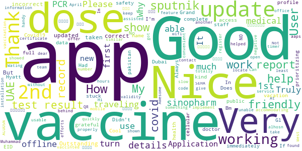

# ALHOSN UAE
App version ``1.47.669``

Analyzed with [covid-apps-observer](http://github.com/covid-apps-observer) project, version ``0.1``

## App overview
| | |
|-------------------------|-------------------------| 
| **Name**&nbsp;&nbsp;&nbsp;&nbsp;&nbsp;&nbsp;&nbsp;&nbsp;&nbsp;&nbsp;&nbsp;&nbsp;&nbsp;&nbsp;&nbsp;&nbsp;&nbsp;&nbsp;&nbsp;&nbsp;&nbsp;&nbsp;&nbsp;&nbsp;&nbsp;&nbsp;&nbsp;&nbsp;&nbsp;&nbsp;&nbsp;&nbsp;&nbsp;&nbsp;&nbsp;&nbsp;&nbsp;&nbsp;&nbsp;&nbsp;  | ALHOSN UAE |
| **Unique identifier** | doh.health.shield |
| **Link to Google Play** | [https://play.google.com/store/apps/details?id=doh.health.shield](https://play.google.com/store/apps/details?id=doh.health.shield) |
| **Summary**  | ALHOSN UAE allows you to keep your COVID-19 results on your mobile device |
| **Privacy policy** | [https://alhosnapp.ae/en/privacy-policy/](https://alhosnapp.ae/en/privacy-policy/) |
| **Latest version** | 1.47.669 |
| **Last update** | 2021-05-10 19:16:45 |
| **Recent changes** | - Improved user experience  - App stability |
| **Installs**  | 1,000,000+ |
| **Category** | Medical |
| **First release** | Apr 7, 2020 |
| **Size**  | 12M |
| **Supported Android version**  | 5.0 and up |

### Description
> The ALHOSN UAE app is the official COVID-19 testing channel for health authorities in the United Arab Emirates, by the Ministry of Health and Prevention.
 By using the app, everyone can help stop the spread of COVID-19 and keep their family and friends safe.
  
 You can receive your COVID-19 test results directly on your phone with a unique QR code that is proof of your status and that of everyone else around you who also have the app, giving you peace of mind that you can safely interact.
 The app can also help trace people who may have come within close proximity to confirmed COVID-19 cases for an extended period of time. It uses short-distance Bluetooth signals to determine when your phone is near another phone that also has the app installed.  Both phones exchange anonymized IDs which are then stored in encrypted form on your phone. Using the anonymized IDs, health authorities can quickly identify and contact people at risk of infection so they can be retested.
  
 Put your health in your hands with 3 easy steps:
 1.      Download the ALHOSN UAE app
 2.      Authenticate with your Emirates ID and phone number
 3.      Turn on Bluetooth and push notifications on your smartphone
  
 Download the ALHOSN UAE app today and share it with your family and friends.
 Together, we can stop the spread of COVID-19
 Safer Together.

### User interface
The developers of the app provide the following screenshots in the Google play store.
| | | |
|:-------------------------:|:-------------------------:|:-------------------------:|
 |   |  

## Development team
In the following we report the main information provided by the development team in the Google play store.

| | |
|-------------------------|-------------------------|
| **Developer**  | Ministry of Health and Prevention - UAE |
| **Website**  | [https://alhosnapp.ae/en/contact-us/](https://alhosnapp.ae/en/contact-us/) |
| **Email** | info@alhosnapp.ae |
| **Physical address**  | - |
| **Other developed apps**  | [https://play.google.com/store/apps/developer?id=Ministry+of+Health+and+Prevention+-+UAE](https://play.google.com/store/apps/developer?id=Ministry+of+Health+and+Prevention+-+UAE) |

## Android support

| | |
|-------------------------|-------------------------|
| **Declared target Android version**  | Android10, version 10 (API level 29) |
| **Effective target Android version**  | Android10, version 10 (API level 29) |
| **Minimum supported Android version**  | Lollipop, version 5.0 (API level 21) |
| **Maximum target Android version**  | - |

The larger the difference between the minimum and maximum supported Android versions, the better. A larger difference means a wider audience. For example, old phones have a very low Android version, so a high minimum supported Android version means that the app cannot be used by users with old phones, thus leading to accessibility problems. 

## Requested permissions

In the following we report the complete list of the permissions requested by the app. 

| **Permission** | **Protection level** | **Description** | 
|-------------------------|-------------------------|-------------------------|
 **android.permission ACCESS_NETWORK_STATE** | Normal | Allows applications to access information about networks. 
 **android.permission CAMERA** | :warning:**Dangerous** | Required to be able to access the camera device. 
 **android.permission FOREGROUND_SERVICE** | Normal | Allows a regular application to use Service.startForeground. 
 **android.permission INTERNET** | Normal | Allows applications to open network sockets. 
 **android.permission QUICKBOOT_POWERON** | - | - 
 **android.permission RECEIVE_BOOT_COMPLETED** | Normal | Allows an application to receive the Intent.ACTION_BOOT_COMPLETED that is broadcast after the system finishes booting. 
 **android.permission REQUEST_IGNORE_BATTERY_OPTIMIZATIONS** | Normal | Permission an application must hold in order to use Settings.ACTION_REQUEST_IGNORE_BATTERY_OPTIMIZATIONS. 
 **android.permission WAKE_LOCK** | Normal | Allows using PowerManager WakeLocks to keep processor from sleeping or screen from dimming. 
 **android.permission WRITE_EXTERNAL_STORAGE** | :warning:**Dangerous** | Allows an application to write to external storage. 
 **com.google.android.c2dm.permission RECEIVE** | - | - 

## Mentioned servers

| **Server** | **Registrant** | **Registrant country** | **Creation date** | 
|-------------------------|-------------------------|-------------------------|-------------------------|
 | adobe.com | Adobe Inc. | :us: US | 1986-11-17 05:00:00 |
 | google.com | Google LLC | :us: US | 1997-09-15 04:00:00 |
 | healthshielduae.com | Domains By Proxy, LLC | :us: US | 2020-03-31 19:30:02 |

## Security analysis 

Below we report the main security warnings raised by our execution of the [Androwarn](https://github.com/maaaaz/androwarn) security analysis tool.

**Telephony identifiers leakage**
> - This application reads the MCC+MNC of the provider of the SIM 
> - This application reads the unique device ID, i.e the IMEI for GSM and the MEID or ESN for CDMA phones 

**Connection interfaces exfiltration**
> - This application reads details about the currently active data network 
> - This application tries to find out if the currently active data network is metered 

**Suspicious connection establishment**
> - This application opens a Socket and connects it to the remote address 'Lh/b/a/a/a;->f(Ljava/lang/String;)Ljava/lang/StringBuilder;' on the 'N/A' port  
> - This application opens a Socket and connects it to the remote address 'Ljava/net/Proxy;->type()Ljava/net/Proxy$Type;' on the 'N/A' port  
> - This application opens a Socket and connects it to the remote address 'hostname == null ' on the 'N/A' port  
> - This application opens a Socket and connects it to the remote address 'timeout' on the 'N/A' port  

**Code execution**
> - This application loads a native library 
> - This application loads a native library: 'tool-checker' 
> - This application executes a UNIX command 
> - This application executes a UNIX command containing this argument: 'getprop' 
> - This application executes a UNIX command containing this argument: 'mount' 

## User ratings and reviews

Below we provide information about how end users are reacting to the app in terms of ratings and reviews in the Google Play store.

### Ratings

The ALHOSN UAE app has been installed by more than **1000000** times. At this time, **20402** rated the app and its average score is **3.8944309**. Below we show the distribution of the ratings across the usual star-based rating of Google Play

:star::star::star::star::star:: 13181

:star::star::star::star:: 1452

:star::star::star:: 760

:star::star:: 454

:star:: 4555

### Reviews 

#### 5-star reviews

> Good  :date: __2021-05-22 17:09:17__

> Good  :date: __2021-05-22 15:33:54__

> Good  :date: __2021-05-22 15:08:05__

> good  :date: __2021-05-22 13:24:56__

> Super  :date: __2021-05-22 12:39:06__

> Very good  :date: __2021-05-22 10:43:29__

> Good  :date: __2021-05-22 09:29:03__

> Great  :date: __2021-05-21 22:27:50__

> Perfect, doesn't hang or take a lot of ram, doesn't work in background a lot like it used to be and very light app.  :date: __2021-05-21 21:51:15__

> Good  :date: __2021-05-21 20:23:53__

#### 4-star reviews

> Good  :date: __2021-05-20 21:45:32__

> Why Didn't Show My Covid19 Vaccine Report?  :date: __2021-05-20 21:22:30__

> Bm  :date: __2021-05-20 10:44:18__

> I'm not able to access the app  :date: __2021-05-19 18:05:40__

> Nice  :date: __2021-05-19 08:37:22__

> Always use it  :date: __2021-05-19 06:50:33__

> Truly grateful to Dubai, UAE for the vaccine and for prioritizing public health and safety. Had my 2nd dose in Grand Hyatt, doctor/medical and staff were kind, accommodating and truly helped and assisted to locate my record so I can have to my 2nd dose. Thank you.  :date: __2021-05-18 05:12:44__

> My covid vaccine 1st dose showed sputnik then I take my 2nd vaccine with sputnik why it shown here in alhosn my 2nd which turn another first dose vaccine as sinopharm. How it turn out like this.??  :date: __2021-05-17 16:28:44__

> It is working properly. Please implement an offline feature with "vaccinted" QR code validity for 24 hours, or something similar, as app is not working without wifi. Thanks.  :date: __2021-05-16 11:43:16__

> Very good app to get vaccine report and test result quickly  :date: __2021-05-15 20:21:50__

#### 3-star reviews

> The app doesn't open anymore 😕  :date: __2021-05-20 19:41:10__

> Takes ages for the test results to show up in the app even though I got the results by sms  :date: __2021-05-19 16:59:40__

> Why 2st dose E we get lat after 28 ?  :date: __2021-05-18 23:53:07__

> Vaccination status still not shown after more than 2 months of my second dose. Only the fist dose is shown in the app. Regular follow up is difficult as the customer care is always busy.  :date: __2021-05-17 08:28:26__

> My vaccine second dose data is still not avilable. I have completed my second dose in Feb. Tried calling toll free num,couldn't connect through  :date: __2021-05-17 05:45:43__

> Nice  :date: __2021-05-16 14:39:00__

> Good  :date: __2021-05-15 12:05:47__

> Please let me download this app I've tried so many time still I can't download it  :date: __2021-05-14 16:22:27__

> The application is good but not working outside UAE.  :date: __2021-05-11 03:46:27__

> I am vaccinated with 2nd dose on 25th jan 2021 and had covid test also on 4th april 21 which was negative . But still exemption (E) is not showing in Al hosn app kindly support to update the status E  :date: __2021-05-06 13:02:55__

#### 2-star reviews

> The app is not opening when connected via cellular data. I only get a screen with ALHOSN written. But it opens and connects well when connected via WiFi, why?? At the health center we have to use cellular data and that where the problem starts. Tried everything but still it doesn't work via cellular data connection.  :date: __2021-05-22 09:36:24__

> Take to long to updated , and sometimes i get stopped at the boreder because of that  :date: __2021-05-21 15:30:59__

> If you're travelling as a tourist to Dubai, but you don't need/get a VISA, how to you get a Unified ID? Without one, tourists can't use this app to show they are vaccinated...  :date: __2021-05-21 09:22:12__

> its not working in my mobile  :date: __2021-05-20 10:04:35__

> The test result has not come  :date: __2021-05-18 03:26:16__

> This working very bad please check  :date: __2021-05-17 18:58:21__

> My reports are not going to the app  :date: __2021-05-14 09:12:10__

> Not open  :date: __2021-05-12 08:07:58__

> Until the moment my vaccination is not mentioned in app Two months and more now and still nothing Hotline is not answering  :date: __2021-05-11 20:21:01__

> Needs improvements. Results for tests done in private facilities get updated faster than the ones done at any of SEHA facilities.  :date: __2021-05-11 11:25:01__

#### 1-star reviews

> Not working  :date: __2021-05-22 16:54:25__

> Worst App just Stuck on Welcome Screen tried on Different Phones IOS and Android Both nothing Happened....need Vaccination Certificate Download to Travel but Its worst app made....  :date: __2021-05-22 13:33:03__

> The app doesn't open. I re-installed twice but it doesn't work  :date: __2021-05-22 12:11:02__

> this aplication is not working in my phone  :date: __2021-05-22 10:53:15__

> App is down . No updates, not customer service  :date: __2021-05-22 09:58:01__

> My vaccination report in not getting updated bcoz of that i am unable to travel. My pcr is not valid for 7 days as it e or vaccinated is not showing.  :date: __2021-05-22 09:38:55__

> doesn't work on android. tested it on 2 phones same result. only works on ios.  :date: __2021-05-22 08:27:36__

> But its app I can't open why I don't know why please checked  :date: __2021-05-22 08:25:24__

> app not working  :date: __2021-05-22 07:36:11__

> This is very bad app it doesn't work on my mobile my mobile is samsung s8 plus Pls fix this problem  :date: __2021-05-22 00:16:55__

