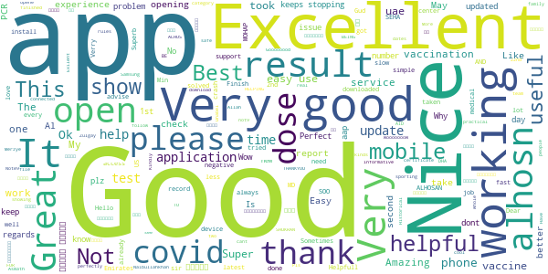
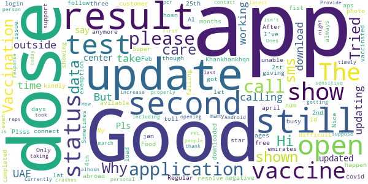

# ALHOSN UAE
App version ``1.47.669``

Analyzed with [covid-apps-observer](http://github.com/covid-apps-observer) project, version ``0.1``

## App overview
| | |
|-------------------------|-------------------------| 
| **Name**&nbsp;&nbsp;&nbsp;&nbsp;&nbsp;&nbsp;&nbsp;&nbsp;&nbsp;&nbsp;&nbsp;&nbsp;&nbsp;&nbsp;&nbsp;&nbsp;&nbsp;&nbsp;&nbsp;&nbsp;&nbsp;&nbsp;&nbsp;&nbsp;&nbsp;&nbsp;&nbsp;&nbsp;&nbsp;&nbsp;&nbsp;&nbsp;&nbsp;&nbsp;&nbsp;&nbsp;&nbsp;&nbsp;&nbsp;&nbsp;  | ALHOSN UAE |
| **Unique identifier** | doh.health.shield |
| **Link to Google Play** | [https://play.google.com/store/apps/details?id=doh.health.shield](https://play.google.com/store/apps/details?id=doh.health.shield) |
| **Summary**  | ALHOSN UAE allows you to keep your COVID-19 results on your mobile device |
| **Privacy policy** | [https://alhosnapp.ae/en/privacy-policy/](https://alhosnapp.ae/en/privacy-policy/) |
| **Latest version** | 1.47.669 |
| **Last update** | 2021-05-10 19:16:45 |
| **Recent changes** | - Improved user experience  - App stability |
| **Installs**  | 1,000,000+ |
| **Category** | Medical |
| **First release** | Apr 7, 2020 |
| **Size**  | 12M |
| **Supported Android version**  | 5.0 and up |

### Description
> The ALHOSN UAE app is the official COVID-19 testing channel for health authorities in the United Arab Emirates, by the Ministry of Health and Prevention.
 By using the app, everyone can help stop the spread of COVID-19 and keep their family and friends safe.
  
 You can receive your COVID-19 test results directly on your phone with a unique QR code that is proof of your status and that of everyone else around you who also have the app, giving you peace of mind that you can safely interact.
 The app can also help trace people who may have come within close proximity to confirmed COVID-19 cases for an extended period of time. It uses short-distance Bluetooth signals to determine when your phone is near another phone that also has the app installed.  Both phones exchange anonymized IDs which are then stored in encrypted form on your phone. Using the anonymized IDs, health authorities can quickly identify and contact people at risk of infection so they can be retested.
  
 Put your health in your hands with 3 easy steps:
 1.      Download the ALHOSN UAE app
 2.      Authenticate with your Emirates ID and phone number
 3.      Turn on Bluetooth and push notifications on your smartphone
  
 Download the ALHOSN UAE app today and share it with your family and friends.
 Together, we can stop the spread of COVID-19
 Safer Together.

### User interface
The developers of the app provide the following screenshots in the Google play store.
| | | |
|:-------------------------:|:-------------------------:|:-------------------------:|
 |   |  

## Development team
In the following we report the main information provided by the development team in the Google play store.

| | |
|-------------------------|-------------------------|
| **Developer**  | Ministry of Health and Prevention - UAE |
| **Website**  | [https://alhosnapp.ae/en/contact-us/](https://alhosnapp.ae/en/contact-us/) |
| **Email** | info@alhosnapp.ae |
| **Physical address**  | - |
| **Other developed apps**  | [https://play.google.com/store/apps/developer?id=Ministry+of+Health+and+Prevention+-+UAE](https://play.google.com/store/apps/developer?id=Ministry+of+Health+and+Prevention+-+UAE) |

## Android support

| | |
|-------------------------|-------------------------|
| **Declared target Android version**  | Android10, version 10 (API level 29) |
| **Effective target Android version**  | Android10, version 10 (API level 29) |
| **Minimum supported Android version**  | Lollipop, version 5.0 (API level 21) |
| **Maximum target Android version**  | - |

The larger the difference between the minimum and maximum supported Android versions, the better. A larger difference means a wider audience. For example, old phones have a very low Android version, so a high minimum supported Android version means that the app cannot be used by users with old phones, thus leading to accessibility problems. 

## Requested permissions

In the following we report the complete list of the permissions requested by the app. 

| **Permission** | **Protection level** | **Description** | 
|-------------------------|-------------------------|-------------------------|
 **android.permission ACCESS_NETWORK_STATE** | Normal | Allows applications to access information about networks. 
 **android.permission CAMERA** | :warning:**Dangerous** | Required to be able to access the camera device. 
 **android.permission FOREGROUND_SERVICE** | Normal | Allows a regular application to use Service.startForeground. 
 **android.permission INTERNET** | Normal | Allows applications to open network sockets. 
 **android.permission QUICKBOOT_POWERON** | - | - 
 **android.permission RECEIVE_BOOT_COMPLETED** | Normal | Allows an application to receive the Intent.ACTION_BOOT_COMPLETED that is broadcast after the system finishes booting. 
 **android.permission REQUEST_IGNORE_BATTERY_OPTIMIZATIONS** | Normal | Permission an application must hold in order to use Settings.ACTION_REQUEST_IGNORE_BATTERY_OPTIMIZATIONS. 
 **android.permission WAKE_LOCK** | Normal | Allows using PowerManager WakeLocks to keep processor from sleeping or screen from dimming. 
 **android.permission WRITE_EXTERNAL_STORAGE** | :warning:**Dangerous** | Allows an application to write to external storage. 
 **com.google.android.c2dm.permission RECEIVE** | - | - 

## Mentioned servers

| **Server** | **Registrant** | **Registrant country** | **Creation date** | 
|-------------------------|-------------------------|-------------------------|-------------------------|
 | adobe.com | Adobe Inc. | :us: US | 1986-11-17 05:00:00 |
 | google.com | Google LLC | :us: US | 1997-09-15 04:00:00 |
 | healthshielduae.com | Domains By Proxy, LLC | :us: US | 2020-03-31 19:30:02 |

## Security analysis 

Below we report the main security warnings raised by our execution of the [Androwarn](https://github.com/maaaaz/androwarn) security analysis tool.

**Telephony identifiers leakage**
> - This application reads the MCC+MNC of the provider of the SIM 
> - This application reads the unique device ID, i.e the IMEI for GSM and the MEID or ESN for CDMA phones 

**Connection interfaces exfiltration**
> - This application reads details about the currently active data network 
> - This application tries to find out if the currently active data network is metered 

**Suspicious connection establishment**
> - This application opens a Socket and connects it to the remote address 'Lh/b/a/a/a;->f(Ljava/lang/String;)Ljava/lang/StringBuilder;' on the 'N/A' port  
> - This application opens a Socket and connects it to the remote address 'Ljava/net/Proxy;->type()Ljava/net/Proxy$Type;' on the 'N/A' port  
> - This application opens a Socket and connects it to the remote address 'hostname == null ' on the 'N/A' port  
> - This application opens a Socket and connects it to the remote address 'timeout' on the 'N/A' port  

**Code execution**
> - This application loads a native library 
> - This application loads a native library: 'tool-checker' 
> - This application executes a UNIX command 
> - This application executes a UNIX command containing this argument: 'getprop' 
> - This application executes a UNIX command containing this argument: 'mount' 

## User ratings and reviews

Below we provide information about how end users are reacting to the app in terms of ratings and reviews in the Google Play store.

### Ratings

The ALHOSN UAE app has been installed by more than **1000000** times. At this time, **20402** rated the app and its average score is **3.8944309**. Below we show the distribution of the ratings across the usual star-based rating of Google Play

:star::star::star::star::star:: 13181

:star::star::star::star:: 1452

:star::star::star:: 760

:star::star:: 454

:star:: 4555

### Reviews 

#### 5-star reviews

> Excellent & fast  :date: __2021-06-06 07:50:30__

> good  :date: __2021-06-06 02:39:47__

> I love this app  :date: __2021-06-05 20:25:36__

> alhosn  :date: __2021-06-05 20:05:42__

> It is not working in Note9  :date: __2021-06-05 18:27:56__

> Excellent useful practical application.  :date: __2021-06-05 16:23:33__

> Very helpful apps  :date: __2021-06-05 15:28:32__

> Good  :date: __2021-06-05 12:05:14__

> Great app  :date: __2021-06-05 07:47:27__

> Nice app  :date: __2021-06-04 21:34:42__

#### 4-star reviews

> nice  :date: __2021-06-06 12:27:04__

> GOOD apps  :date: __2021-06-04 23:28:39__

> 1st dose Vaccine details updated in the app are incorrect. How to correct them? I have taken Sputnik. But it shows sinopharm.  :date: __2021-06-04 18:40:45__

> Outstanding  :date: __2021-06-03 13:31:56__

> User friendly app, helps in traveling. Updates PCR report immediately has complete profile record.  :date: __2021-06-02 15:32:37__

> N. O ) No Gl H t .. W . H 1.  :date: __2021-06-02 14:23:06__

> In pakistan, on vacation, app. Does not work and gets stuck on my name & EID N0.. Please help.  :date: __2021-06-02 10:08:46__

> Nice  :date: __2021-06-01 07:42:18__

> Cool  :date: __2021-05-28 18:13:18__

> If it's offline so much help full r all  :date: __2021-05-25 15:40:31__

#### 3-star reviews

> The app did not load when I was abroad  :date: __2021-06-06 10:12:58__

> Hi Sometimes this app is open but now a days its not open Why did it happen? Plsss resolve this issue  :date: __2021-06-02 12:57:38__

> Khankhankhqn  :date: __2021-05-31 20:19:31__

> good  :date: __2021-05-31 13:26:18__

> Good  :date: __2021-05-30 16:03:36__

> Super aps  :date: __2021-05-25 10:20:38__

> The app doesn't open anymore 😕  :date: __2021-05-20 19:41:10__

> Takes ages for the test results to show up in the app even though I got the results by sms  :date: __2021-05-19 16:59:40__

> Why 2st dose E we get lat after 28 ?  :date: __2021-05-18 23:53:07__

> Vaccination status still not shown after more than 2 months of my second dose. Only the fist dose is shown in the app. Regular follow up is difficult as the customer care is always busy.  :date: __2021-05-17 08:28:26__

#### 2-star reviews

> My last two covid19 result not updated  :date: __2021-06-06 15:07:53__

> my swab and vaccine is not updated  :date: __2021-06-03 17:15:04__

> It's not working in Pakistan..please check & solve the issue.  :date: __2021-06-02 16:45:19__

> There is no customer care for technical.  :date: __2021-06-01 14:36:08__

> I can't update my mobile number on app and tried to send email but it bounce back due to theire inbox was full.  :date: __2021-05-30 20:47:34__

> I'm already vaccinated,last Feb 7 2021,until now the letter E for my app still not appear,I called already the hotline,they told me after 1hour that letter E is appear,  :date: __2021-05-28 18:02:48__

> abid Hussain nomi  :date: __2021-05-27 12:51:12__

> Plz change colur sceme to make it user friendly and eseaiar to read  :date: __2021-05-24 06:57:16__

> My first dose is not updated in alhosn app.I take vaccine in 3rd February. But still not update please update my first dose.  :date: __2021-05-23 17:44:17__

> Mashallah Allah  :date: __2021-05-22 19:49:31__

#### 1-star reviews

> it doesn't work, from all sides, Waste of time  :date: __2021-06-06 12:32:06__

> i tried so many times but I'm still unable to open it  :date: __2021-06-06 09:47:10__

> I am not able to open app outside UAE. I AM VACCINATED IN DUBAI AND NOW I AM IN INDIA. BUT WHEN I DOWNLOADED THE APP IN INDIA ITS NOT GETTING LOGIN.  :date: __2021-06-06 06:41:56__

> Ever worst apps.... after installation not opening.  :date: __2021-06-05 13:58:29__

> Last PCR result not updated date(1-06-2021),showing only previously taken PCR result only date (18-05-2021)..  :date: __2021-06-05 11:10:10__

> Although I recieved the two vaccine doses with negative results, still has no E in the Application.  :date: __2021-06-05 10:18:38__

> Ever since I came to India on 9th April, the App is not working. It is stuck on the opening screen and doesn't open further  :date: __2021-06-05 09:26:44__

> Now im in india i try to open apps now but this is not working in india I want to download my covid19 vaccination certificate  :date: __2021-06-05 08:30:29__

> very poor perfomance  :date: __2021-06-05 04:06:41__

> Not working  :date: __2021-06-04 21:48:42__

