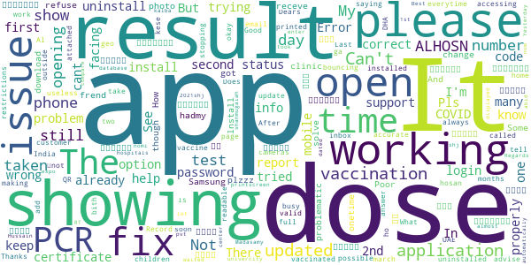

# ALHOSN UAE
App version ``1.47.709``

Analyzed with [covid-apps-observer](http://github.com/covid-apps-observer) project, version ``0.1``

## App overview
| | |
|-------------------------|-------------------------| 
| **Name**&nbsp;&nbsp;&nbsp;&nbsp;&nbsp;&nbsp;&nbsp;&nbsp;&nbsp;&nbsp;&nbsp;&nbsp;&nbsp;&nbsp;&nbsp;&nbsp;&nbsp;&nbsp;&nbsp;&nbsp;&nbsp;&nbsp;&nbsp;&nbsp;&nbsp;&nbsp;&nbsp;&nbsp;&nbsp;&nbsp;&nbsp;&nbsp;&nbsp;&nbsp;&nbsp;&nbsp;&nbsp;&nbsp;&nbsp;&nbsp;  | ALHOSN UAE |
| **Unique identifier** | doh.health.shield |
| **Link to Google Play** | [https://play.google.com/store/apps/details?id=doh.health.shield](https://play.google.com/store/apps/details?id=doh.health.shield) |
| **Summary**  | ALHOSN UAE allows you to keep your COVID-19 results on your mobile device |
| **Privacy policy** | [https://alhosnapp.ae/en/privacy-policy/](https://alhosnapp.ae/en/privacy-policy/) |
| **Latest version** | 1.47.709 |
| **Last update** | 2021-06-09 20:49:00 |
| **Recent changes** | - Improved user experience  - App stability |
| **Installs**  | 1,000,000+ |
| **Category** | Medical |
| **First release** | Apr 7, 2020 |
| **Size**  | 13M |
| **Supported Android version**  | 5.0 and up |

### Description
> The ALHOSN UAE app is the official COVID-19 testing channel for health authorities in the United Arab Emirates, by the Ministry of Health and Prevention.
 By using the app, everyone can help stop the spread of COVID-19 and keep their family and friends safe.
  
 You can receive your COVID-19 test results directly on your phone with a unique QR code that is proof of your status and that of everyone else around you who also have the app, giving you peace of mind that you can safely interact.
 The app can also help trace people who may have come within close proximity to confirmed COVID-19 cases for an extended period of time. It uses short-distance Bluetooth signals to determine when your phone is near another phone that also has the app installed.  Both phones exchange anonymized IDs which are then stored in encrypted form on your phone. Using the anonymized IDs, health authorities can quickly identify and contact people at risk of infection so they can be retested.
  
 Put your health in your hands with 3 easy steps:
 1.      Download the ALHOSN UAE app
 2.      Authenticate with your Emirates ID and phone number
 3.      Turn on Bluetooth and push notifications on your smartphone
  
 Download the ALHOSN UAE app today and share it with your family and friends.
 Together, we can stop the spread of COVID-19
 Safer Together.

### User interface
The developers of the app provide the following screenshots in the Google play store.
| | | |
|:-------------------------:|:-------------------------:|:-------------------------:|
 |   |  

## Development team
In the following we report the main information provided by the development team in the Google play store.

| | |
|-------------------------|-------------------------|
| **Developer**  | Ministry of Health and Prevention - UAE |
| **Website**  | [https://alhosnapp.ae/en/contact-us/](https://alhosnapp.ae/en/contact-us/) |
| **Email** | info@alhosnapp.ae |
| **Physical address**  | - |
| **Other developed apps**  | [https://play.google.com/store/apps/developer?id=Ministry+of+Health+and+Prevention+-+UAE](https://play.google.com/store/apps/developer?id=Ministry+of+Health+and+Prevention+-+UAE) |

## Android support

| | |
|-------------------------|-------------------------|
| **Declared target Android version**  | Android10, version 10 (API level 29) |
| **Effective target Android version**  | Android10, version 10 (API level 29) |
| **Minimum supported Android version**  | Lollipop, version 5.0 (API level 21) |
| **Maximum target Android version**  | - |

The larger the difference between the minimum and maximum supported Android versions, the better. A larger difference means a wider audience. For example, old phones have a very low Android version, so a high minimum supported Android version means that the app cannot be used by users with old phones, thus leading to accessibility problems. 

## Requested permissions

In the following we report the complete list of the permissions requested by the app. 

| **Permission** | **Protection level** | **Description** | 
|-------------------------|-------------------------|-------------------------|
 **android.permission ACCESS_NETWORK_STATE** | Normal | Allows applications to access information about networks. 
 **android.permission CAMERA** | :warning:**Dangerous** | Required to be able to access the camera device. 
 **android.permission FOREGROUND_SERVICE** | Normal | Allows a regular application to use Service.startForeground. 
 **android.permission INTERNET** | Normal | Allows applications to open network sockets. 
 **android.permission QUICKBOOT_POWERON** | - | - 
 **android.permission RECEIVE_BOOT_COMPLETED** | Normal | Allows an application to receive the Intent.ACTION_BOOT_COMPLETED that is broadcast after the system finishes booting. 
 **android.permission REQUEST_IGNORE_BATTERY_OPTIMIZATIONS** | Normal | Permission an application must hold in order to use Settings.ACTION_REQUEST_IGNORE_BATTERY_OPTIMIZATIONS. 
 **android.permission WAKE_LOCK** | Normal | Allows using PowerManager WakeLocks to keep processor from sleeping or screen from dimming. 
 **android.permission WRITE_EXTERNAL_STORAGE** | :warning:**Dangerous** | Allows an application to write to external storage. 
 **com.google.android.c2dm.permission RECEIVE** | - | - 

## Mentioned servers

| **Server** | **Registrant** | **Registrant country** | **Creation date** | 
|-------------------------|-------------------------|-------------------------|-------------------------|
 | adobe.com | Adobe Inc. | :us: US | 1986-11-17 05:00:00 |
 | google.com | Google LLC | :us: US | 1997-09-15 04:00:00 |
 | microsoft.com | Microsoft Corporation | :us: US | 1991-05-02 04:00:00 |
 | healthshielduae.com | Domains By Proxy, LLC | :us: US | 2020-03-31 19:30:02 |

## Security analysis 

Below we report the main security warnings raised by our execution of the [Androwarn](https://github.com/maaaaz/androwarn) security analysis tool.

**Telephony identifiers leakage**
> - This application reads the ISO country code equivalent of the current registered operator's MCC (Mobile Country Code) 
> - This application reads the MCC+MNC of the provider of the SIM 
> - This application reads the numeric name (MCC+MNC) of current registered operator 
> - This application reads the operator name 
> - This application reads the unique device ID, i.e the IMEI for GSM and the MEID or ESN for CDMA phones 

**Connection interfaces exfiltration**
> - This application reads details about the currently active data network 
> - This application tries to find out if the currently active data network is metered 

**Suspicious connection establishment**
> - This application opens a Socket and connects it to the remote address 'Lh/b/a/a/a;->f(Ljava/lang/String;)Ljava/lang/StringBuilder;' on the 'N/A' port  
> - This application opens a Socket and connects it to the remote address 'Ljava/net/Proxy;->type()Ljava/net/Proxy$Type;' on the 'N/A' port  
> - This application opens a Socket and connects it to the remote address 'hostname == null ' on the 'N/A' port  
> - This application opens a Socket and connects it to the remote address 'timeout' on the 'N/A' port  

**Code execution**
> - This application loads a native library 
> - This application loads a native library: 'tool-checker' 
> - This application executes a UNIX command 
> - This application executes a UNIX command containing this argument: 'getprop' 
> - This application executes a UNIX command containing this argument: 'mount' 

## User ratings and reviews

Below we provide information about how end users are reacting to the app in terms of ratings and reviews in the Google Play store.

### Ratings

The ALHOSN UAE app has been installed by more than **1000000** times. At this time, **22569** rated the app and its average score is **3.9307625**. Below we show the distribution of the ratings across the usual star-based rating of Google Play

:star::star::star::star::star:: 14649

:star::star::star::star:: 1780

:star::star::star:: 820

:star::star:: 573

:star:: 4747

### Reviews 

#### 5-star reviews

> Its good for us  :date: __2021-06-27 23:52:43__

> Why not come my resolt no come this grean I'm complate Vaccine  :date: __2021-06-27 21:14:46__

> Good  :date: __2021-06-27 21:05:30__

> Splendid  :date: __2021-06-27 20:18:14__

> Invasion of privacy... Why does it need location all the time.. If I want to know who is positive around me there should be a separate app for that, but to enter and exit Abu Dhabi, I just need to show my test results and vaccination status at the entry points + the job place. Please give us the option or make a different app. Update: Now it's much better.. Thanks 👌  :date: __2021-06-27 19:34:53__

> App is not responding how to check  :date: __2021-06-27 18:45:04__

> Why not open  :date: __2021-06-27 10:48:04__

> Shaikhzyudullah  :date: __2021-06-27 09:58:28__

> Very good  :date: __2021-06-27 08:22:00__

> Very good and useful app  :date: __2021-06-27 07:11:01__

#### 4-star reviews

> Regarding PCR report, if you can add the time of the test, it will be very helpful.  :date: __2021-06-27 12:55:18__

> Result doesn't reflect on the app No response on the phone call assist Mail box is full, can't send them any comments  :date: __2021-06-27 09:21:30__

> Ok  :date: __2021-06-27 04:54:33__

> Good  :date: __2021-06-27 02:19:50__

> Good  :date: __2021-06-26 04:02:21__

> Good  :date: __2021-06-24 13:45:42__

> Good  :date: __2021-06-24 12:01:45__

> I still haven't been able to log in even after the most recent update.  :date: __2021-06-22 11:37:31__

> Ok  :date: __2021-06-22 10:57:38__

> Nice  :date: __2021-06-21 20:06:48__

#### 3-star reviews

> This app it doesn't work on my mobile my mobile is samsung s8 plus Pls fix this problem  :date: __2021-06-26 17:23:00__

> If you are outside UAE the app wont work why?  :date: __2021-06-25 08:57:38__

> This application not open for me. I had this app in uae, that time is working normally. But now im in india. Now its not working. Please do the needful team  :date: __2021-06-25 07:18:02__

> Can't open this app in India.....why  :date: __2021-06-24 08:01:40__

> App is not showing my vaccination details, I have done vaccination in Dubai. Kindly guide  :date: __2021-06-23 12:28:43__

> Unable to access outside the UAE  :date: __2021-06-23 10:40:57__

> اخذت جرعة اللقاح الاولى شهر 1 والجرعة الثانية شهر 2، والى الان في تطبيق الحصن ما يظهر إلا الجرعة الاولى فقط، علماً اني سويت تحليل كورونا بعد اللقاح اكثر من مرة، كيف نعالج الخلل !!!!!!  :date: __2021-06-22 18:36:50__

> Why Alhosn app is not working in india?right now i'm in india.!Hope u'll advise..  :date: __2021-06-22 17:03:27__

> It's not open out side of UAE. Now I am in india &I have to download my vaccine card,but it's not opening. Please do something'  :date: __2021-06-22 13:09:21__

> App wasn't working,so I uninstalled and then reinstalled again, now I'm not receiving otp number, please fix  :date: __2021-06-21 08:33:11__

#### 2-star reviews

> Dears, The ALHOSN app is showing the wrong status of my vaccination for COVID-19. See attached printscreen from my mobile which shows wrong info about the first dose only, dated 30/03/2021. Please compare it with the vaccination certificate: 1st dose: 08/03/2021 shj expo center 2nd dose: 30/03/2021shj univercity kalba Could you please correct the info in your ALHOSN app database? Best Regards, Madasamy shanmugaiah  :date: __2021-06-24 14:42:53__

> Results from pvt hospitals are not displayed automatically  :date: __2021-06-24 13:55:56__

> abid Hussain nomi  :date: __2021-06-24 11:34:47__

> Its not showing any of my PCR results of 2021  :date: __2021-06-23 22:06:03__

> Yesterday 20/06/2021 I was took RT PCR almost one day I waited for my result until this time also didn't updated in alhosn  :date: __2021-06-21 21:59:39__

> I am facing issue...now app is not working how to fix this? Pls let me know...I have to enter abudhabi ...when I write my details it is just showing verifying and then showing errore...please help how to fix this..  :date: __2021-06-21 20:05:30__

> I uninstall the app and i install again now i cant even login because i cant receieve code on my number i tried severall times already but its still same  :date: __2021-06-21 10:34:29__

> Zakm  :date: __2021-06-21 08:57:52__

> My mobile number is correct.But I'm not getting my OTP. It's very very urgent.  :date: __2021-06-21 07:43:21__

> It's working before. But now I can't log-in to my account after numerous tries. Please fix all technical issues so that it will not cause any more inconvenience, especially it's a must requirement this time.  :date: __2021-06-19 14:25:31__

#### 1-star reviews

> Not working 😕  :date: __2021-06-27 21:59:06__

> This app not working in India, I want to download vaccination card but I am unable to open this app.  :date: __2021-06-27 21:45:58__

> Not Good, very bad app not work for all mobile.very very very Bad.  :date: __2021-06-27 21:34:34__

> I wonder if anyone is working on all the complaints listed below? The app stopped working after update, and I am, like many others, left without a proof of vaccination. And it si not clear where to raise the issue and who is responsible  :date: __2021-06-27 20:41:57__

> النتائج لا تظهر  :date: __2021-06-27 20:37:11__

> Alhosn app no updates status pcr test not update... To much problem Plz help plz plz. Alhosn costumer care call not accepting all time waiting waiting  :date: __2021-06-27 14:20:55__

> The app does not show my second dose nor my test results and there is no way to send feedback or request updates :/ how do we get assistance and fix this. Thank you  :date: __2021-06-27 12:00:48__

> App keeps on crashing it doesn't even start it immediately gives the has stopped working msg  :date: __2021-06-27 11:24:38__

> app does not load at all!!how come the govt release such an app with so much bugs  :date: __2021-06-27 10:57:47__

> Doesnt open  :date: __2021-06-27 08:33:35__

