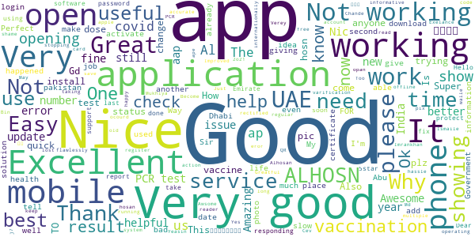
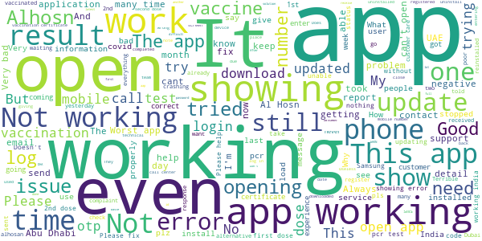

# ALHOSN UAE
App version ``1.47.709``

Analyzed with [covid-apps-observer](http://github.com/covid-apps-observer) project, version ``0.1``

## App overview
| | |
|-------------------------|-------------------------| 
| **Name**&nbsp;&nbsp;&nbsp;&nbsp;&nbsp;&nbsp;&nbsp;&nbsp;&nbsp;&nbsp;&nbsp;&nbsp;&nbsp;&nbsp;&nbsp;&nbsp;&nbsp;&nbsp;&nbsp;&nbsp;&nbsp;&nbsp;&nbsp;&nbsp;&nbsp;&nbsp;&nbsp;&nbsp;&nbsp;&nbsp;&nbsp;&nbsp;&nbsp;&nbsp;&nbsp;&nbsp;&nbsp;&nbsp;&nbsp;&nbsp;  | ALHOSN UAE |
| **Unique identifier** | doh.health.shield |
| **Link to Google Play** | [https://play.google.com/store/apps/details?id=doh.health.shield](https://play.google.com/store/apps/details?id=doh.health.shield) |
| **Summary**  | ALHOSN UAE allows you to keep your COVID-19 results on your mobile device |
| **Privacy policy** | [https://alhosnapp.ae/en/privacy-policy/](https://alhosnapp.ae/en/privacy-policy/) |
| **Latest version** | 1.47.709 |
| **Last update** | 2021-06-09 20:49:00 |
| **Recent changes** | - Improved user experience  - App stability |
| **Installs**  | 1,000,000+ |
| **Category** | Medical |
| **First release** | Apr 7, 2020 |
| **Size**  | 13M |
| **Supported Android version**  | 5.0 and up |

### Description
> The ALHOSN UAE app is the official COVID-19 testing channel for health authorities in the United Arab Emirates, by the Ministry of Health and Prevention.
 By using the app, everyone can help stop the spread of COVID-19 and keep their family and friends safe.
  
 You can receive your COVID-19 test results directly on your phone with a unique QR code that is proof of your status and that of everyone else around you who also have the app, giving you peace of mind that you can safely interact.
 The app can also help trace people who may have come within close proximity to confirmed COVID-19 cases for an extended period of time. It uses short-distance Bluetooth signals to determine when your phone is near another phone that also has the app installed.  Both phones exchange anonymized IDs which are then stored in encrypted form on your phone. Using the anonymized IDs, health authorities can quickly identify and contact people at risk of infection so they can be retested.
  
 Put your health in your hands with 3 easy steps:
 1.      Download the ALHOSN UAE app
 2.      Authenticate with your Emirates ID and phone number
 3.      Turn on Bluetooth and push notifications on your smartphone
  
 Download the ALHOSN UAE app today and share it with your family and friends.
 Together, we can stop the spread of COVID-19
 Safer Together.

### User interface
The developers of the app provide the following screenshots in the Google play store.
| | | |
|:-------------------------:|:-------------------------:|:-------------------------:|
 |   |  

## Development team
In the following we report the main information provided by the development team in the Google play store.

| | |
|-------------------------|-------------------------|
| **Developer**  | Ministry of Health and Prevention - UAE |
| **Website**  | [https://alhosnapp.ae/en/contact-us/](https://alhosnapp.ae/en/contact-us/) |
| **Email** | info@alhosnapp.ae |
| **Physical address**  | - |
| **Other developed apps**  | [https://play.google.com/store/apps/developer?id=Ministry+of+Health+and+Prevention+-+UAE](https://play.google.com/store/apps/developer?id=Ministry+of+Health+and+Prevention+-+UAE) |

## Android support

| | |
|-------------------------|-------------------------|
| **Declared target Android version**  | Android10, version 10 (API level 29) |
| **Effective target Android version**  | Android10, version 10 (API level 29) |
| **Minimum supported Android version**  | Lollipop, version 5.0 (API level 21) |
| **Maximum target Android version**  | - |

The larger the difference between the minimum and maximum supported Android versions, the better. A larger difference means a wider audience. For example, old phones have a very low Android version, so a high minimum supported Android version means that the app cannot be used by users with old phones, thus leading to accessibility problems. 

## Requested permissions

In the following we report the complete list of the permissions requested by the app. 

| **Permission** | **Protection level** | **Description** | 
|-------------------------|-------------------------|-------------------------|
 **android.permission ACCESS_NETWORK_STATE** | Normal | Allows applications to access information about networks. 
 **android.permission CAMERA** | :warning:**Dangerous** | Required to be able to access the camera device. 
 **android.permission FOREGROUND_SERVICE** | Normal | Allows a regular application to use Service.startForeground. 
 **android.permission INTERNET** | Normal | Allows applications to open network sockets. 
 **android.permission QUICKBOOT_POWERON** | - | - 
 **android.permission RECEIVE_BOOT_COMPLETED** | Normal | Allows an application to receive the Intent.ACTION_BOOT_COMPLETED that is broadcast after the system finishes booting. 
 **android.permission REQUEST_IGNORE_BATTERY_OPTIMIZATIONS** | Normal | Permission an application must hold in order to use Settings.ACTION_REQUEST_IGNORE_BATTERY_OPTIMIZATIONS. 
 **android.permission WAKE_LOCK** | Normal | Allows using PowerManager WakeLocks to keep processor from sleeping or screen from dimming. 
 **android.permission WRITE_EXTERNAL_STORAGE** | :warning:**Dangerous** | Allows an application to write to external storage. 
 **com.google.android.c2dm.permission RECEIVE** | - | - 

## Mentioned servers

| **Server** | **Registrant** | **Registrant country** | **Creation date** | 
|-------------------------|-------------------------|-------------------------|-------------------------|
 | adobe.com | Adobe Inc. | :us: US | 1986-11-17 05:00:00 |
 | google.com | Google LLC | :us: US | 1997-09-15 04:00:00 |
 | microsoft.com | Microsoft Corporation | :us: US | 1991-05-02 04:00:00 |
 | healthshielduae.com | Domains By Proxy, LLC | :us: US | 2020-03-31 19:30:02 |

## Security analysis 

Below we report the main security warnings raised by our execution of the [Androwarn](https://github.com/maaaaz/androwarn) security analysis tool.

**Telephony identifiers leakage**
> - This application reads the ISO country code equivalent of the current registered operator's MCC (Mobile Country Code) 
> - This application reads the MCC+MNC of the provider of the SIM 
> - This application reads the numeric name (MCC+MNC) of current registered operator 
> - This application reads the operator name 
> - This application reads the unique device ID, i.e the IMEI for GSM and the MEID or ESN for CDMA phones 

**Connection interfaces exfiltration**
> - This application reads details about the currently active data network 
> - This application tries to find out if the currently active data network is metered 

**Suspicious connection establishment**
> - This application opens a Socket and connects it to the remote address 'Lh/b/a/a/a;->f(Ljava/lang/String;)Ljava/lang/StringBuilder;' on the 'N/A' port  
> - This application opens a Socket and connects it to the remote address 'Ljava/net/Proxy;->type()Ljava/net/Proxy$Type;' on the 'N/A' port  
> - This application opens a Socket and connects it to the remote address 'hostname == null ' on the 'N/A' port  
> - This application opens a Socket and connects it to the remote address 'timeout' on the 'N/A' port  

**Code execution**
> - This application loads a native library 
> - This application loads a native library: 'tool-checker' 
> - This application executes a UNIX command 
> - This application executes a UNIX command containing this argument: 'getprop' 
> - This application executes a UNIX command containing this argument: 'mount' 

## User ratings and reviews

Below we provide information about how end users are reacting to the app in terms of ratings and reviews in the Google Play store.

### Ratings

The ALHOSN UAE app has been installed by more than **1000000** times. At this time, **22569** rated the app and its average score is **3.9307625**. Below we show the distribution of the ratings across the usual star-based rating of Google Play

:star::star::star::star::star:: 14649

:star::star::star::star:: 1780

:star::star::star:: 820

:star::star:: 573

:star:: 4747

### Reviews 

#### 5-star reviews

> Great walle... 👍  :date: __2021-07-23 17:46:12__

> Good  :date: __2021-07-23 15:35:22__

> Excellent  :date: __2021-07-23 12:47:35__

> good  :date: __2021-07-23 11:32:54__

> Nice  :date: __2021-07-23 04:57:44__

> Good  :date: __2021-07-22 21:14:57__

> Gd  :date: __2021-07-22 19:05:25__

> Quick action  :date: __2021-07-22 15:28:17__

> Improved services  :date: __2021-07-22 14:56:24__

> Not open  :date: __2021-07-22 09:59:19__

#### 4-star reviews

> Good app for COVID vaccination status as well as PCR test report.  :date: __2021-07-23 10:10:08__

> Excellent  :date: __2021-07-21 17:29:55__

> Good  :date: __2021-07-20 23:33:48__

> Very slow 😑😣  :date: __2021-07-14 20:49:47__

> Nice  :date: __2021-07-13 13:48:20__

> وايد زين  :date: __2021-07-12 03:58:08__

> Great  :date: __2021-07-10 18:08:59__

> Al hosn app in is not showing my vaccine  :date: __2021-07-10 15:35:41__

> Good  :date: __2021-07-08 18:31:38__

> Helpful apps 👍👍  :date: __2021-07-02 14:46:12__

#### 3-star reviews

> My Vaccination status not updated in this app. Please help.  :date: __2021-07-19 07:30:29__

> Both vaccine completed shows only the 2 date and reads as First Dose. Is not linking the completed vaccination  :date: __2021-07-18 12:04:29__

> Not updating latest covid 19 result report....  :date: __2021-07-16 12:20:38__

> Not working on samsung N8  :date: __2021-07-16 05:04:45__

> 🤭😅 h  :date: __2021-07-15 11:31:09__

> Faster and easy to use  :date: __2021-07-15 06:11:55__

> Not updating.. okay... However I tried everything : uninstall/install , Logged in /out Called 800 ( 15min listening machine) WhatsApp (no reply ) Email ( not delivered).  :date: __2021-07-09 16:43:34__

> This apps is not working in my Android mobail,,,, how can i do?  :date: __2021-07-08 22:37:41__

> Have issues with number of doses displayed in the app. Showing 3 instead of 2. Shows the date i was supposed to get vaccinated (with the 2nd dose but didn't) as the day i got it and the day i actually did the second dose (one day passed the scheduled day) as the day of the 3rd dose.  :date: __2021-07-07 11:03:26__

> Colours are not matching with results  :date: __2021-07-05 14:18:00__

#### 2-star reviews

> I hadmy pcr test and though the result is updated from the clinic, it is not being updated in the app  :date: __2021-07-18 20:15:32__

> How are you frend to  :date: __2021-07-18 12:25:25__

> فكرة ممتازة لكن طريقة تطبيقها ضعيفة، يوجد تأخير في رصد النتائج. لماذا لا يمكن النسخ واللصق لتسهيل الكتابة مثل باقي البرامج الذكية !!  :date: __2021-07-18 12:03:49__

> The app refuse to lnstall and download  :date: __2021-07-17 17:12:20__

> I have already taken both doses but it shows only one dose.. And that too taken on the day i got my 2nd dose.  :date: __2021-07-16 16:33:25__

> There is no option to report issues. Some PCR test results are not showing in this application.  :date: __2021-07-16 08:52:06__

> I had a issue of login onetime password i did not receve the password plzzz solve my issue  :date: __2021-07-13 21:32:46__

> It has change my photo on reports which could be problematic for me.  :date: __2021-07-12 19:35:25__

> I'm trying to open this application but everytime saying that Al hosan app stopping...i uninstalled and installed many times but it's same...please fix this issue as soon as possible Thanks  :date: __2021-07-12 19:32:37__

> Not showing test status for two months, support numbers are always busy, support email inbox full and keep bouncing  :date: __2021-07-11 14:52:39__

#### 1-star reviews

> Mapa putangina ka nlang talaga ng bongang bonga. Yes..  :date: __2021-07-23 17:59:50__

> Cannot proceed the installation  :date: __2021-07-23 17:54:05__

> Varee nice  :date: __2021-07-23 09:12:59__

> My pcr result is not getting updated on the app. Made so many complaints. Pls help  :date: __2021-07-22 14:30:24__

> Yb  :date: __2021-07-22 09:39:35__

> Hi Team the app is not updating my second dose its been a month now...when i try to reach thrgh call 30mins waiting and if i mail them mail is bouncing back..kindly check this mattet  :date: __2021-07-21 23:51:18__

> i download many time but its not opening and i miss the corona vacine chance by this app  :date: __2021-07-21 21:44:58__

> Good app for all peoples and easy life  :date: __2021-07-21 08:55:38__

> Alhosn is stopped working.  :date: __2021-07-21 06:33:32__

> It's very bad application sleeps very late  :date: __2021-07-20 17:45:14__

