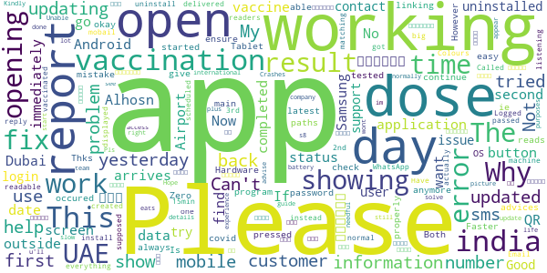

# ALHOSN UAE
App version ``1.47.709``

Analyzed with [covid-apps-observer](http://github.com/covid-apps-observer) project, version ``0.1``

## App overview
| | |
|-------------------------|-------------------------| 
| **Name**&nbsp;&nbsp;&nbsp;&nbsp;&nbsp;&nbsp;&nbsp;&nbsp;&nbsp;&nbsp;&nbsp;&nbsp;&nbsp;&nbsp;&nbsp;&nbsp;&nbsp;&nbsp;&nbsp;&nbsp;&nbsp;&nbsp;&nbsp;&nbsp;&nbsp;&nbsp;&nbsp;&nbsp;&nbsp;&nbsp;&nbsp;&nbsp;&nbsp;&nbsp;&nbsp;&nbsp;&nbsp;&nbsp;&nbsp;&nbsp;  | ALHOSN UAE |
| **Unique identifier** | doh.health.shield |
| **Link to Google Play** | [https://play.google.com/store/apps/details?id=doh.health.shield](https://play.google.com/store/apps/details?id=doh.health.shield) |
| **Summary**  | ALHOSN UAE allows you to keep your COVID-19 results on your mobile device |
| **Privacy policy** | [https://alhosnapp.ae/en/privacy-policy/](https://alhosnapp.ae/en/privacy-policy/) |
| **Latest version** | 1.47.709 |
| **Last update** | 2021-06-09 20:49:00 |
| **Recent changes** | - Improved user experience  - App stability |
| **Installs**  | 1,000,000+ |
| **Category** | Medical |
| **First release** | Apr 7, 2020 |
| **Size**  | 13M |
| **Supported Android version**  | 5.0 and up |

### Description
> The ALHOSN UAE app is the official COVID-19 testing channel for health authorities in the United Arab Emirates, by the Ministry of Health and Prevention.
 By using the app, everyone can help stop the spread of COVID-19 and keep their family and friends safe.
  
 You can receive your COVID-19 test results directly on your phone with a unique QR code that is proof of your status and that of everyone else around you who also have the app, giving you peace of mind that you can safely interact.
 The app can also help trace people who may have come within close proximity to confirmed COVID-19 cases for an extended period of time. It uses short-distance Bluetooth signals to determine when your phone is near another phone that also has the app installed.  Both phones exchange anonymized IDs which are then stored in encrypted form on your phone. Using the anonymized IDs, health authorities can quickly identify and contact people at risk of infection so they can be retested.
  
 Put your health in your hands with 3 easy steps:
 1.      Download the ALHOSN UAE app
 2.      Authenticate with your Emirates ID and phone number
 3.      Turn on Bluetooth and push notifications on your smartphone
  
 Download the ALHOSN UAE app today and share it with your family and friends.
 Together, we can stop the spread of COVID-19
 Safer Together.

### User interface
The developers of the app provide the following screenshots in the Google play store.
| | | |
|:-------------------------:|:-------------------------:|:-------------------------:|
 |   |  

## Development team
In the following we report the main information provided by the development team in the Google play store.

| | |
|-------------------------|-------------------------|
| **Developer**  | Ministry of Health and Prevention - UAE |
| **Website**  | [https://alhosnapp.ae/en/contact-us/](https://alhosnapp.ae/en/contact-us/) |
| **Email** | info@alhosnapp.ae |
| **Physical address**  | - |
| **Other developed apps**  | [https://play.google.com/store/apps/developer?id=Ministry+of+Health+and+Prevention+-+UAE](https://play.google.com/store/apps/developer?id=Ministry+of+Health+and+Prevention+-+UAE) |

## Android support

| | |
|-------------------------|-------------------------|
| **Declared target Android version**  | Android10, version 10 (API level 29) |
| **Effective target Android version**  | Android10, version 10 (API level 29) |
| **Minimum supported Android version**  | Lollipop, version 5.0 (API level 21) |
| **Maximum target Android version**  | - |

The larger the difference between the minimum and maximum supported Android versions, the better. A larger difference means a wider audience. For example, old phones have a very low Android version, so a high minimum supported Android version means that the app cannot be used by users with old phones, thus leading to accessibility problems. 

## Requested permissions

In the following we report the complete list of the permissions requested by the app. 

| **Permission** | **Protection level** | **Description** | 
|-------------------------|-------------------------|-------------------------|
 **android.permission ACCESS_NETWORK_STATE** | Normal | Allows applications to access information about networks. 
 **android.permission CAMERA** | :warning:**Dangerous** | Required to be able to access the camera device. 
 **android.permission FOREGROUND_SERVICE** | Normal | Allows a regular application to use Service.startForeground. 
 **android.permission INTERNET** | Normal | Allows applications to open network sockets. 
 **android.permission QUICKBOOT_POWERON** | - | - 
 **android.permission RECEIVE_BOOT_COMPLETED** | Normal | Allows an application to receive the Intent.ACTION_BOOT_COMPLETED that is broadcast after the system finishes booting. 
 **android.permission REQUEST_IGNORE_BATTERY_OPTIMIZATIONS** | Normal | Permission an application must hold in order to use Settings.ACTION_REQUEST_IGNORE_BATTERY_OPTIMIZATIONS. 
 **android.permission WAKE_LOCK** | Normal | Allows using PowerManager WakeLocks to keep processor from sleeping or screen from dimming. 
 **android.permission WRITE_EXTERNAL_STORAGE** | :warning:**Dangerous** | Allows an application to write to external storage. 
 **com.google.android.c2dm.permission RECEIVE** | - | - 

## Mentioned servers

| **Server** | **Registrant** | **Registrant country** | **Creation date** | 
|-------------------------|-------------------------|-------------------------|-------------------------|
 | adobe.com | Adobe Inc. | :us: US | 1986-11-17 05:00:00 |
 | google.com | Google LLC | :us: US | 1997-09-15 04:00:00 |
 | microsoft.com | Microsoft Corporation | :us: US | 1991-05-02 04:00:00 |
 | healthshielduae.com | Domains By Proxy, LLC | :us: US | 2020-03-31 19:30:02 |

## Security analysis 

Below we report the main security warnings raised by our execution of the [Androwarn](https://github.com/maaaaz/androwarn) security analysis tool.

**Telephony identifiers leakage**
> - This application reads the ISO country code equivalent of the current registered operator's MCC (Mobile Country Code) 
> - This application reads the MCC+MNC of the provider of the SIM 
> - This application reads the numeric name (MCC+MNC) of current registered operator 
> - This application reads the operator name 
> - This application reads the unique device ID, i.e the IMEI for GSM and the MEID or ESN for CDMA phones 

**Connection interfaces exfiltration**
> - This application reads details about the currently active data network 
> - This application tries to find out if the currently active data network is metered 

**Suspicious connection establishment**
> - This application opens a Socket and connects it to the remote address 'Lh/b/a/a/a;->f(Ljava/lang/String;)Ljava/lang/StringBuilder;' on the 'N/A' port  
> - This application opens a Socket and connects it to the remote address 'Ljava/net/Proxy;->type()Ljava/net/Proxy$Type;' on the 'N/A' port  
> - This application opens a Socket and connects it to the remote address 'hostname == null ' on the 'N/A' port  
> - This application opens a Socket and connects it to the remote address 'timeout' on the 'N/A' port  

**Code execution**
> - This application loads a native library 
> - This application loads a native library: 'tool-checker' 
> - This application executes a UNIX command 
> - This application executes a UNIX command containing this argument: 'getprop' 
> - This application executes a UNIX command containing this argument: 'mount' 

## User ratings and reviews

Below we provide information about how end users are reacting to the app in terms of ratings and reviews in the Google Play store.

### Ratings

The ALHOSN UAE app has been installed by more than **1000000** times. At this time, **22569** rated the app and its average score is **3.9307625**. Below we show the distribution of the ratings across the usual star-based rating of Google Play

:star::star::star::star::star:: 14649

:star::star::star::star:: 1780

:star::star::star:: 820

:star::star:: 573

:star:: 4747

### Reviews 

#### 5-star reviews

> Good  :date: __2021-06-21 11:36:42__

> 0tp password not coming  :date: __2021-06-21 11:29:01__

> Ok  :date: __2021-06-21 10:16:12__

> Not receiving One time password for intial login . Kindly check please  :date: __2021-06-21 10:13:53__

> OXXMM ❤❤👅  :date: __2021-06-21 10:11:20__

> Nic  :date: __2021-06-21 08:37:31__

> Important application  :date: __2021-06-21 08:20:27__

> Very very nice super app I like app  :date: __2021-06-21 05:15:16__

> this India not working  :date: __2021-06-21 02:56:31__

> Ok. Its easy to use a good spp  :date: __2021-06-20 23:57:08__

#### 4-star reviews

> I have taken my 2nd dose of Vaccine but i am unable to login. I am not receiving password. Could you help me someone Hlhow i can login?? I have vaccination card  :date: __2021-06-20 20:10:28__

> Fair experienced  :date: __2021-06-20 15:55:21__

> What happen it not working  :date: __2021-06-20 09:59:09__

> Good  :date: __2021-06-20 06:34:13__

> Good  :date: __2021-06-19 11:51:34__

> Hai hallo why are this alhons app not working this said last updated yesterday can u inform what huppened  :date: __2021-06-19 04:24:20__

> Nice  :date: __2021-06-18 19:32:20__

> Please help me I have a problem of log in I try to login but it seems error all the time time.  :date: __2021-06-18 14:56:46__

> Good  :date: __2021-06-18 14:25:30__

> Hi.. All This app working for all inside 🇦🇪 UAE and also outside when you travel any where. Like green passport showing your results 👍😊  :date: __2021-06-18 13:14:35__

#### 3-star reviews

> App wasn't working,so I uninstalled and then reinstalled again, now I'm not receiving otp number, please fix  :date: __2021-06-21 08:33:11__

> The app says that it has sent the sms to my number but the sms never arrives. Nor sure if this is specifically at this time on the 20th June?  :date: __2021-06-20 16:21:21__

> Please note the app is not opening. Even if I uninstalled and installed it does not opens.  :date: __2021-06-20 07:41:15__

> ok  :date: __2021-06-19 21:24:33__

> My first dose not updated and my second dose updated as first dose. I am trying to contact but no response  :date: __2021-06-19 18:07:53__

> Good  :date: __2021-06-19 04:48:16__

> App has crash and could not find the user information. And sms verification comes late  :date: __2021-06-18 23:29:36__

> Good  :date: __2021-06-18 20:24:45__

> From yesterday this app is not working i logout and try to login error coming  :date: __2021-06-18 15:43:22__

> The app has stopped working, it is showing 'an error has occurred (could not load user's information. please try again later or contact customer support). I have tried contacting customer support more than 10 times yesterday. The customer care is not responding, auto cuts the call. Could you please look into this issue and apply a fix immediately or we need an alternative option to show the green status. If the app is not working it is difficult to go anywhere.  :date: __2021-06-18 14:08:24__

#### 2-star reviews

> I uninstall the app and i install again now i cant even login because i cant receieve code on my number i tried severall times already but its still same  :date: __2021-06-21 10:34:29__

> Zakm  :date: __2021-06-21 08:57:52__

> My mobile number is correct.But I'm not getting my OTP. It's very very urgent.  :date: __2021-06-21 07:43:21__

> It's working before. But now I can't log-in to my account after numerous tries. Please fix all technical issues so that it will not cause any more inconvenience, especially it's a must requirement this time.  :date: __2021-06-19 14:25:31__

> Error not working,,, can't see information  :date: __2021-06-19 09:34:51__

> There is a problem with result sharing option, it is not working, kindly resolve it ASAP  :date: __2021-06-18 23:25:49__

> شو هالأعطال فالبرنامج.. واذا طلعنا ما يدخلنا مره ثانيه.. تخلون الشخص فحالة توتر ليش..  :date: __2021-06-18 14:37:54__

> No help line available!  :date: __2021-06-18 14:30:03__

> My covid 19 results which I have done and came negative result it's not updating in this app. I don't know how to fix this problem.  :date: __2021-06-18 13:50:59__

> Not open  :date: __2021-06-18 12:06:08__

#### 1-star reviews

> My App is still NOT working until now :(  :date: __2021-06-21 11:48:32__

> Not open or showing my alhosn app in my mobile  :date: __2021-06-21 11:46:09__

> I did not receive the OTP  :date: __2021-06-21 11:38:22__

> This app not working  :date: __2021-06-21 11:33:30__

> Not received otp, tried several times  :date: __2021-06-21 11:22:13__

> Showing wrong vaccination information and NO active customer care number and email..  :date: __2021-06-21 11:00:47__

> After re installing the apps why I cant recieved the one time passoword? Please help because ur apps is nowa mandatory in hotels, malls work  :date: __2021-06-21 10:51:51__

> Not work  :date: __2021-06-21 10:33:51__

> Not working tried re installing still not working tried to contact alhosn number sent message to weqaya tried calling them what should o do!!!!  :date: __2021-06-21 10:00:57__

> Not working new user  :date: __2021-06-21 09:22:41__

