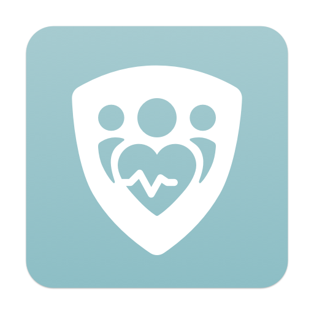

# ALHOSN UAE
App version ``1.47.709``

Analyzed with [covid-apps-observer](http://github.com/covid-apps-observer) project, version ``0.1``

## App overview
| | |
|-------------------------|-------------------------| 
| **Name**&nbsp;&nbsp;&nbsp;&nbsp;&nbsp;&nbsp;&nbsp;&nbsp;&nbsp;&nbsp;&nbsp;&nbsp;&nbsp;&nbsp;&nbsp;&nbsp;&nbsp;&nbsp;&nbsp;&nbsp;&nbsp;&nbsp;&nbsp;&nbsp;&nbsp;&nbsp;&nbsp;&nbsp;&nbsp;&nbsp;&nbsp;&nbsp;&nbsp;&nbsp;&nbsp;&nbsp;&nbsp;&nbsp;&nbsp;&nbsp;  | ALHOSN UAE |
| **Unique identifier** | doh.health.shield |
| **Link to Google Play** | [https://play.google.com/store/apps/details?id=doh.health.shield](https://play.google.com/store/apps/details?id=doh.health.shield) |
| **Summary**  | ALHOSN UAE allows you to keep your COVID-19 results on your mobile device |
| **Privacy policy** | [https://alhosnapp.ae/en/privacy-policy/](https://alhosnapp.ae/en/privacy-policy/) |
| **Latest version** | 1.47.709 |
| **Last update** | 2021-06-09 20:49:00 |
| **Recent changes** | - Improved user experience  - App stability |
| **Installs**  | 1,000,000+ |
| **Category** | Medical |
| **First release** | Apr 7, 2020 |
| **Size**  | 13M |
| **Supported Android version**  | 5.0 and up |

### Description
> The ALHOSN UAE app is the official COVID-19 testing channel for health authorities in the United Arab Emirates, by the Ministry of Health and Prevention.
 By using the app, everyone can help stop the spread of COVID-19 and keep their family and friends safe.
  
 You can receive your COVID-19 test results directly on your phone with a unique QR code that is proof of your status and that of everyone else around you who also have the app, giving you peace of mind that you can safely interact.
 The app can also help trace people who may have come within close proximity to confirmed COVID-19 cases for an extended period of time. It uses short-distance Bluetooth signals to determine when your phone is near another phone that also has the app installed.  Both phones exchange anonymized IDs which are then stored in encrypted form on your phone. Using the anonymized IDs, health authorities can quickly identify and contact people at risk of infection so they can be retested.
  
 Put your health in your hands with 3 easy steps:
 1.      Download the ALHOSN UAE app
 2.      Authenticate with your Emirates ID and phone number
 3.      Turn on Bluetooth and push notifications on your smartphone
  
 Download the ALHOSN UAE app today and share it with your family and friends.
 Together, we can stop the spread of COVID-19
 Safer Together.

### User interface
The developers of the app provide the following screenshots in the Google play store.
| | | |
|:-------------------------:|:-------------------------:|:-------------------------:|
 |   |  

## Development team
In the following we report the main information provided by the development team in the Google play store.

| | |
|-------------------------|-------------------------|
| **Developer**  | Ministry of Health and Prevention - UAE |
| **Website**  | [https://alhosnapp.ae/en/contact-us/](https://alhosnapp.ae/en/contact-us/) |
| **Email** | info@alhosnapp.ae |
| **Physical address**  | - |
| **Other developed apps**  | [https://play.google.com/store/apps/developer?id=Ministry+of+Health+and+Prevention+-+UAE](https://play.google.com/store/apps/developer?id=Ministry+of+Health+and+Prevention+-+UAE) |

## Android support

| | |
|-------------------------|-------------------------|
| **Declared target Android version**  | Android10, version 10 (API level 29) |
| **Effective target Android version**  | Android10, version 10 (API level 29) |
| **Minimum supported Android version**  | Lollipop, version 5.0 (API level 21) |
| **Maximum target Android version**  | - |

The larger the difference between the minimum and maximum supported Android versions, the better. A larger difference means a wider audience. For example, old phones have a very low Android version, so a high minimum supported Android version means that the app cannot be used by users with old phones, thus leading to accessibility problems. 

## Requested permissions

In the following we report the complete list of the permissions requested by the app. 

| **Permission** | **Protection level** | **Description** | 
|-------------------------|-------------------------|-------------------------|
 **android.permission ACCESS_NETWORK_STATE** | Normal | Allows applications to access information about networks. 
 **android.permission CAMERA** | :warning:**Dangerous** | Required to be able to access the camera device. 
 **android.permission FOREGROUND_SERVICE** | Normal | Allows a regular application to use Service.startForeground. 
 **android.permission INTERNET** | Normal | Allows applications to open network sockets. 
 **android.permission QUICKBOOT_POWERON** | - | - 
 **android.permission RECEIVE_BOOT_COMPLETED** | Normal | Allows an application to receive the Intent.ACTION_BOOT_COMPLETED that is broadcast after the system finishes booting. 
 **android.permission REQUEST_IGNORE_BATTERY_OPTIMIZATIONS** | Normal | Permission an application must hold in order to use Settings.ACTION_REQUEST_IGNORE_BATTERY_OPTIMIZATIONS. 
 **android.permission WAKE_LOCK** | Normal | Allows using PowerManager WakeLocks to keep processor from sleeping or screen from dimming. 
 **android.permission WRITE_EXTERNAL_STORAGE** | :warning:**Dangerous** | Allows an application to write to external storage. 
 **com.google.android.c2dm.permission RECEIVE** | - | - 

## Mentioned servers

| **Server** | **Registrant** | **Registrant country** | **Creation date** | 
|-------------------------|-------------------------|-------------------------|-------------------------|
 | adobe.com | Adobe Inc. | :us: US | 1986-11-17 05:00:00 |
 | google.com | Google LLC | :us: US | 1997-09-15 04:00:00 |
 | microsoft.com | Microsoft Corporation | :us: US | 1991-05-02 04:00:00 |
 | healthshielduae.com | Domains By Proxy, LLC | :us: US | 2020-03-31 19:30:02 |

## Security analysis 

Below we report the main security warnings raised by our execution of the [Androwarn](https://github.com/maaaaz/androwarn) security analysis tool.

**Telephony identifiers leakage**
> - This application reads the ISO country code equivalent of the current registered operator's MCC (Mobile Country Code) 
> - This application reads the MCC+MNC of the provider of the SIM 
> - This application reads the numeric name (MCC+MNC) of current registered operator 
> - This application reads the operator name 
> - This application reads the unique device ID, i.e the IMEI for GSM and the MEID or ESN for CDMA phones 

**Connection interfaces exfiltration**
> - This application reads details about the currently active data network 
> - This application tries to find out if the currently active data network is metered 

**Suspicious connection establishment**
> - This application opens a Socket and connects it to the remote address 'Lh/b/a/a/a;->f(Ljava/lang/String;)Ljava/lang/StringBuilder;' on the 'N/A' port  
> - This application opens a Socket and connects it to the remote address 'Ljava/net/Proxy;->type()Ljava/net/Proxy$Type;' on the 'N/A' port  
> - This application opens a Socket and connects it to the remote address 'hostname == null ' on the 'N/A' port  
> - This application opens a Socket and connects it to the remote address 'timeout' on the 'N/A' port  

**Code execution**
> - This application loads a native library 
> - This application loads a native library: 'tool-checker' 
> - This application executes a UNIX command 
> - This application executes a UNIX command containing this argument: 'getprop' 
> - This application executes a UNIX command containing this argument: 'mount' 

## User ratings and reviews

Below we provide information about how end users are reacting to the app in terms of ratings and reviews in the Google Play store.

### Ratings

The ALHOSN UAE app has been installed by more than **1000000** times. At this time, **22569** rated the app and its average score is **3.9307625**. Below we show the distribution of the ratings across the usual star-based rating of Google Play

:star::star::star::star::star:: 14649

:star::star::star::star:: 1780

:star::star::star:: 820

:star::star:: 573

:star:: 4747

### Reviews 

#### 5-star reviews

> Good  :date: __2021-07-04 17:05:43__

> Good  :date: __2021-07-04 16:16:52__

> 😷😷😷  :date: __2021-07-04 14:49:14__

> Good  :date: __2021-07-04 11:25:52__

> Good one  :date: __2021-07-04 09:22:44__

> service  :date: __2021-07-03 18:52:08__

> Very useful  :date: __2021-07-03 18:39:08__

> Exelance  :date: __2021-07-03 17:14:51__

> Very easy and quick to use and result of your pcr  :date: __2021-07-03 17:13:11__

> Awesome  :date: __2021-07-03 14:17:31__

#### 4-star reviews

> Helpful apps 👍👍  :date: __2021-07-02 14:46:12__

> Very good app, its very helpful to show the status of vaccinated for everyone  :date: __2021-07-01 08:19:10__

> ALHOSN  :date: __2021-06-30 19:21:53__

> Good  :date: __2021-06-29 19:07:03__

> Can't we not use this app outside UAE? Even when a resident of UAE travelling outside?  :date: __2021-06-29 15:24:50__

> Can you guys please tell me or help me if why my second DOS vaccination is not showing in my Alhosn app?  :date: __2021-06-29 12:31:47__

> Not opening in india why..? Pl can you explain  :date: __2021-06-29 10:47:37__

> 😇  :date: __2021-06-28 18:46:18__

> Bangladesh  :date: __2021-06-28 10:44:28__

> Good  :date: __2021-06-28 08:35:31__

#### 3-star reviews

> My experience this app not opening help me please  :date: __2021-07-04 16:26:31__

> This app was not opening  :date: __2021-07-03 10:50:07__

> Crashes a lot, slow to start and eats your battery life.  :date: __2021-07-03 09:40:28__

> Can't open  :date: __2021-06-30 17:40:38__

> Why does my picture not appear?  :date: __2021-06-29 15:06:38__

> This app not working  :date: __2021-06-29 10:38:32__

> Not update data informations  :date: __2021-06-29 08:12:18__

> I want to find my vaccination report but still not showing in my app I want to see my report for my company purposes...  :date: __2021-06-28 06:02:06__

> This app it doesn't work on my mobile my mobile is samsung s8 plus Pls fix this problem  :date: __2021-06-26 17:23:00__

> If you are outside UAE the app wont work why?  :date: __2021-06-25 08:57:38__

#### 2-star reviews

> I am vaccinated but not show on e. Last march I did vaccination. After that 4 pcr, . I called customer no answer . What should I do.?  :date: __2021-07-04 06:31:14__

> Does not work outside the UAE so useless  :date: __2021-07-03 09:41:40__

> Application is not working please update  :date: __2021-07-03 09:40:14__

> اnot working  :date: __2021-07-02 11:48:29__

> Open kese ho ga  :date: __2021-07-01 18:37:18__

> My second dose is not there here now 7 day I take  :date: __2021-07-01 14:48:39__

> Its not working on my phone please what can I do?  :date: __2021-07-01 14:31:30__

> Can't open the app  :date: __2021-06-29 19:22:00__

> It not opening the apps , please tell how to be fix it.  :date: __2021-06-29 08:09:18__

> It's okay  :date: __2021-06-28 21:39:17__

#### 1-star reviews

> App is nit working and I am stuck at Abu Dhai Dubai Border. Police are not allowing me even I have shown Hospital Printed Report as well  :date: __2021-07-04 14:40:34__

> It needs serious upgrade alot of issues and this is delaying and causing alot of inconveniences to the public.  :date: __2021-07-04 14:36:02__

> It's not working well  :date: __2021-07-04 13:27:47__

> Doesn't work. Hasn't worked for a week. How am I supposed to travel to Abu Dhabi if I can't show my test results!? Terrible.  :date: __2021-07-04 10:41:07__

> In my phone this app not working not8 has stopped  :date: __2021-07-04 08:47:38__

> The app is installed but not workingfor more than 15 days and keeps giving that there is an error  :date: __2021-07-04 07:59:52__

> I tried to get my vaccination certificate through Alhosn app but it is vain.  :date: __2021-07-04 06:31:10__

> not . working......  :date: __2021-07-03 14:39:21__

> I installed it twice but it won"t open at all  :date: __2021-07-03 12:12:58__

> Had issues with entries in the app. Showing 4 doses of vaccine instead of 2. Tried to contact all available sources but no response. The hospital from where i took the vaccine said they already sent the Alhosn team the correction updates. Almost 2 weeks, but no updates yet. My booster dosage of vaccine was rejected because of this. Someone please assist..!!!  :date: __2021-07-03 11:55:41__

