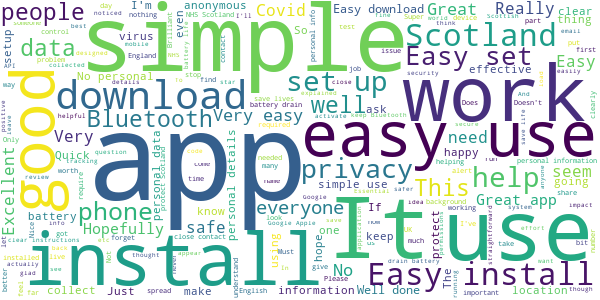
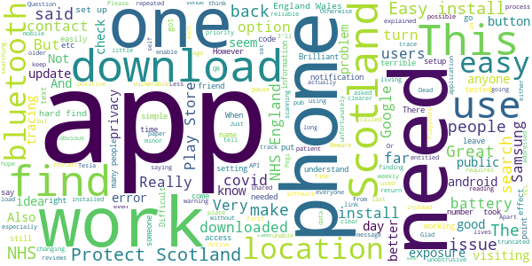
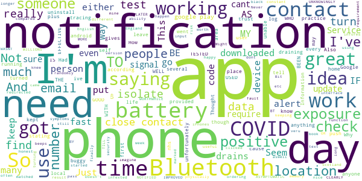

# Protect Scotland
App version ``1.0.4``

Analyzed with [covid-apps-observer](http://github.com/covid-apps-observer) project, version ``0.1``

## App overview
| | |
|-------------------------|-------------------------| 
| **Name**&nbsp;&nbsp;&nbsp;&nbsp;&nbsp;&nbsp;&nbsp;&nbsp;&nbsp;&nbsp;&nbsp;&nbsp;&nbsp;&nbsp;&nbsp;&nbsp;&nbsp;&nbsp;&nbsp;&nbsp;&nbsp;&nbsp;&nbsp;&nbsp;&nbsp;&nbsp;&nbsp;&nbsp;&nbsp;&nbsp;&nbsp;&nbsp;&nbsp;&nbsp;&nbsp;&nbsp;&nbsp;&nbsp;&nbsp;&nbsp;  | Protect Scotland |
| **Unique identifier** | gov.scot.covidtracker |
| **Link to Google Play** | [https://play.google.com/store/apps/details?id=gov.scot.covidtracker](https://play.google.com/store/apps/details?id=gov.scot.covidtracker) |
| **Summary**  | Help stop the spread of Covid-19 in Scotland by using the Protect Scotland app. |
| **Privacy policy** | [https://protect.scot/privacy-policy-app](https://protect.scot/privacy-policy-app) |
| **Latest version** | 1.0.4 |
| **Last update** | 2020-10-08 20:53:56 |
| **Recent changes** | Version status:   In-app notice to alert users when a new version of the app is ready to install Error checking:  More informative error messaging during onboarding related to date &amp; time settings (previously showing as network errors) Accessibility improvements: Amended alt text and sentence structure to better support accessibility tools |
| **Installs**  | 500,000+ |
| **Category** | Medical |
| **First release** | Sep 4, 2020 |
| **Size**  | 105M |
| **Supported Android version**  | 6.0 and up |

### Description
> Help Scotland keep the spread of coronavirus under control by downloading and using the free Protect Scotland app from NHS Scotland’s Test and Protect service. 
 Using the app is entirely voluntary.  When you use the app, you will be alerted if you have been in close contact with another app user who has tested positive for coronavirus. If you test positive and you enter the unique code sent to you into the app, it will anonymously warn other app users whom you have been in close contact with.
 Using Bluetooth, the app will search for other devices with the Protect Scotland app installed, which are within 2m of your phone. You don’t need to have a WiFi connection. The app uses a very small amount of your mobile phone data.  
 
Once you’ve downloaded the app, encourage your friends, family and colleagues to do so too. The more people who download and use the Protect Scotland app, the more likely we are to keep coronavirus under control. . The benefits of using the app are:

Speeds up the process of identifying and notifying people that have been at risk of catching coronavirus, particularly of unknown contacts
Slows the spread of the virus
Reduces the likelihood of further lockdowns
Helps protect the health service, your family and friends, yourself and the people of Scotland
 Ultimately, you can help to stop the spread of coronavirus in Scotland by downloading and using the Protect Scotland app.
 Privacy and Data
 The Protect Scotland app is designed to protect the privacy of all users. It doesn’t store or share any personally identifiable information, like your name or address. Nobody can track your location by using the app or tell who you are.
 You can remove the app from your device at any time, and all the data stored on your phone will be deleted.

### User interface
The developers of the app provide the following screenshots in the Google play store.
| | | |
|:-------------------------:|:-------------------------:|:-------------------------:|
 |   |   |   | 
 |   |  

## Development team
In the following we report the main information provided by the development team in the Google play store.

| | |
|-------------------------|-------------------------|
| **Developer**  | NHS Education for Scotland |
| **Website**  | [https://protect.scot/index.html](https://protect.scot/index.html) |
| **Email** | testandprotect@nhs.scot |
| **Physical address**  | [NHS Education for Scotland Knowledge Services 2 Central Quay 3rd Floor 89 Hydepark Street Glasgow G3 8BW ](https://www.google.com/maps/search/NHS%20Education%20for%20Scotland%20Knowledge%20Services%202%20Central%20Quay%203rd%20Floor%2089%20Hydepark%20Street%20Glasgow%20G3%208BW%20) (Google Maps) |
| **Other developed apps**  | [https://play.google.com/store/apps/developer?id=NHS+Education+for+Scotland](https://play.google.com/store/apps/developer?id=NHS+Education+for+Scotland) |

## Android support

| | |
|-------------------------|-------------------------|
| **Declared target Android version**  | Android10, version 10 (API level 29) |
| **Effective target Android version**  | Android10, version 10 (API level 29) |
| **Minimum supported Android version**  | Marshmallow, version 6.0 (API level 23) |
| **Maximum target Android version**  | - |

The larger the difference between the minimum and maximum supported Android versions, the better. A larger difference means a wider audience. For example, old phones have a very low Android version, so a high minimum supported Android version means that the app cannot be used by users with old phones, thus leading to accessibility problems. 

## Requested permissions

In the following we report the complete list of the permissions requested by the app. 

| **Permission** | **Protection level** | **Description** | 
|-------------------------|-------------------------|-------------------------|
 **android.permission ACCESS_NETWORK_STATE** | Normal | Allows applications to access information about networks. 
 **android.permission ACCESS_WIFI_STATE** | Normal | Allows applications to access information about Wi-Fi networks. 
 **android.permission BLUETOOTH** | Normal | Allows applications to connect to paired bluetooth devices. 
 **android.permission FOREGROUND_SERVICE** | Normal | Allows a regular application to use Service.startForeground. 
 **android.permission INTERNET** | Normal | Allows applications to open network sockets. 
 **android.permission RECEIVE_BOOT_COMPLETED** | Normal | Allows an application to receive the Intent.ACTION_BOOT_COMPLETED that is broadcast after the system finishes booting. 
 **android.permission VIBRATE** | Normal | Allows access to the vibrator. 

## Mentioned servers

| **Server** | **Registrant** | **Registrant country** | **Creation date** | 
|-------------------------|-------------------------|-------------------------|-------------------------|
 | android.com | Google LLC | :us: US | 1997-06-23 04:00:00 |
 | google.com | Google LLC | :us: US | 1997-09-15 04:00:00 |
 | expo.io | See PrivacyGuardian.org | :us: US | 2011-05-01 21:26:50 |

## Security analysis 

Below we report the main security warnings raised by our execution of the [Androwarn](https://github.com/maaaaz/androwarn) security analysis tool.

**Telephony identifiers leakage**
> - This application reads the numeric name (MCC+MNC) of current registered operator 
> - This application reads the operator name 

**Connection interfaces exfiltration**
> - This application reads details about the currently active data network 
> - This application tries to find out if the currently active data network is metered 

**Suspicious connection establishment**
> - This application opens a Socket and connects it to the remote address ' returned no addresses for  ; port is out of range' on the 'N/A' port  
> - This application opens a Socket and connects it to the remote address '' on the 'N/A' port  
> - This application opens a Socket and connects it to the remote address 'Ljava/lang/StringBuilder;->toString()Ljava/lang/String;' on the 'N/A' port  
> - This application opens a Socket and connects it to the remote address 'Ljava/net/Proxy;->type()Ljava/net/Proxy$Type;' on the 'N/A' port  
> - This application opens a Socket and connects it to the remote address 'timeout' on the 'N/A' port  

**Pim data leakage**
> - This application accesses data stored in the clipboard 

**Code execution**
> - This application loads a native library 
> - This application executes a UNIX command 

## User ratings and reviews

Below we provide information about how end users are reacting to the app in terms of ratings and reviews in the Google Play store.

### Ratings

The Protect Scotland app has been installed by more than **500000** times. At this time, **2052** rated the app and its average score is **3.52657**. Below we show the distribution of the ratings across the usual star-based rating of Google Play

:star::star::star::star::star:: 1062

:star::star::star::star:: 138

:star::star::star:: 178

:star::star:: 168

:star:: 506

### Reviews 

#### 5-star reviews

> Good  :date: __2020-12-13 12:31:03__

> Nearlt had a heart attack when it sent me a message to inform me that the app was working  :date: __2020-12-10 16:54:37__

> Happy to have no communication with app.  :date: __2020-12-08 16:42:58__

> Important to download - seems to work well in the background  :date: __2020-12-04 15:10:39__

> Easy go use and gives that feeling of security  :date: __2020-11-29 11:48:30__

> Easy to use, watch you don't have your VPN switched on or it doesn't take any readings, wouldn't know it was working behind the scenes to help protect Scotland  :date: __2020-11-26 23:18:59__

> Good  :date: __2020-11-24 03:47:16__

> This app gives me a feeling of security and makes me feel safe  :date: __2020-11-23 12:59:14__

> I hope others are remembering to put Bluetooth on when out so it can work. Feels safer but if only you could make it law so it was more accurate. Great Job Scotland team 👏  :date: __2020-11-23 01:55:25__

> Clear so far  :date: __2020-11-22 00:23:23__

#### 4-star reviews

> I haven't had to use it so far  :date: __2020-11-26 23:25:03__

> Just downloaded the app, some folk saying you dont need to turn on location but the app says I have to keep both location and bluetooth on. Glad we have a safe app here in Scotland! 🏴󠁧󠁢󠁳󠁣󠁴󠁿  :date: __2020-11-18 14:51:54__

> I have not, thankfully been exposed to anyone who have tested positive for covid, but I have friends who use this app who have. From listening to them and hearing their experience proves that the Scottish app works  :date: __2020-11-15 03:26:08__

> Very easily understood and concise information explained simple and clearly. I would urge anyone I know to use this app to track and trace to protect the most vulnerable in not just our community, but our own families and friends!!  :date: __2020-10-25 13:23:33__

> YES I KNOW ITS MENT TO PROTECT SCOTLAND FROM COVID BUT im 12 in secondary school and This app was recommended by google play its self it said Pegi 3 so i downloaded it yesterday i forgot about then went back into it today and it came with two options im over 16 or under i said under as I am it said you are not entitled to use this app so undownload it so i did the point to this is *what is the point of making this a pegi 3 and only 16 are entitled to use this app* Thank you goodbye.............  :date: __2020-10-22 22:52:46__

> The app is great the alerts go off all the time outside the parligment building Edinburgh so who's not telling they have it  :date: __2020-10-19 18:17:39__

> Having issues with it not doing exposure checks unless I kill and restart the app. Apart from that, the app works.  :date: __2020-10-18 19:45:35__

> Beware software updates. I have a Samsung phone onto which I downloaded this app. 2 days ago I received an android/Samsung software update message and installed it. This app was shut down in the process which I had not noticed and was therefore not working for the last 2 days. I had no warning this would happen and as a result I have either put myself or someone else at risk. BEWARE.  :date: __2020-10-10 10:00:43__

> Dead easy to instal and setup.And after reading reviews that it drained battery power, all was fine. Shame it doesn't have a venue check in tool like the England and Wales one, instead you are relying on venues to gather details via their sometimes dodgy third party sites who can cash in on signing you up for marketing data. Or worse still, paper and pen. Issue is cross-border using alongside the England & Wales one and disappointing had no reply back by email when I asked this point especially since I was encouraged to install it for a short visit. I was in Scotland up until 3rd October for three nights. Switched back to the NHS England & Wales one when I stepped off the train in Carlisle. But other than going in a couple of times a day switching the Exposure Notifications to the Protect Scotland App I won't know if I get any app notification. And again if I get tested in England and unfortunately it's a positive, I would really like to do my bit and notify Protect Scotland app users I may have been in close contact with. But I understand the codes issued aren't compatible.  :date: __2020-10-05 12:22:27__

> I cannot get it to work on Samsung J5. The version of android has to be higher  :date: __2020-10-05 01:08:57__

#### 3-star reviews

> Think it works!  :date: __2020-12-06 07:48:00__

> It would be great if updates of local area were posted, and the latest government updates policy in the area.  :date: __2020-11-30 17:37:16__

> App is fine but uses a LOT of data.  :date: __2020-11-27 16:07:22__

> On samsung devices you must ensure that disable apps setting is off otherwise the app will be disabled automatically after 30 days of not being used  :date: __2020-11-27 03:00:14__

> My phone has only done 1 check in the last 14 days, which was 14 days ago. I update my phone operation system with the latest update around then, might have knocked off the tracking. Heard others saying they've not had many checks  :date: __2020-11-26 16:20:39__

> Freezes,. does not allow you to book a test  :date: __2020-11-23 18:46:17__

> Asking me today to turn on my Bluetooth and repoen PS app. My Bluetooth is switched on. Reopened app,vstill asking me to switch Bluetooth on.... So guess it's not working  :date: __2020-11-21 19:32:03__

> Can someone tell me what the "keys" and "matches" mean? It says I have 1 match on the exposure checks but I have no notifications?  :date: __2020-11-20 19:35:28__

> Wastes battery. But good concept  :date: __2020-11-17 00:47:21__

> Dasi  :date: __2020-11-13 17:56:32__

#### 2-star reviews

> How do I know this app is working?  :date: __2020-11-24 19:52:43__

> Great idea. Had to uninstall though as it started draining memory and wouldn't push notifications as a result. Might not be apps fault, could be mine or my phone's ability. Either way, can no longer use.  :date: __2020-11-20 07:16:33__

> Doesn't work, went on the app and then got a notification that ive been in close contact with an infexted person. This was 13 days after i was in contact with the person. Never got a text phone or email either. Just aswell i dont have any symptoms  :date: __2020-11-17 22:25:32__

> I have an android phone. This app gives me no notifications. Other users with iPhones tell me they get notifications saying they have no contacts and how many people they have been matched against etc. Why would that be?  :date: __2020-11-15 21:56:30__

> I WASNT NOTIFIED OF MY EXPOSURE TO SOMEONE WHO TESTED POSITIVE WITH COVID-19 TILL 6 DAYS LATER. NOT MUCH GOOD IF I HAD OF UNKNOWINGLY BEEN POSITIVE AND ASYMPTOMATIC. CLEARLY THE APP NEEDS TO BE IMPROVED AS WELL AS USED - DOWNLOADED BY MILLIONS MORE PEOPLE IF IT IS TO BE EFFECTIVE OR WORTHWHILE.  :date: __2020-11-12 23:38:12__

> To be honest I put this app on my phone when I was in Scotland for a week it didn't really seem to do anything like the nhs app in England  :date: __2020-11-12 15:01:09__

> Just clicked on the app and its came up saying i need to isolate as been in close contact with someone with covid i did not get a notification about this was only when i physically went into the app i knew. Also i am on day 16 and the app is still saying to isolate  :date: __2020-11-12 08:38:10__

> Thought I was using the app to book a test, after being redirected several times, finally ordering my test, now do not have a code to input in to the app, no way to get a code, no way to contact anyone about it.  :date: __2020-11-10 14:37:56__

> Bit buggy compared to English version and no where to check into places which is veru useful  :date: __2020-11-09 13:42:03__

> I find it a nice idea, and it has a really good interface, but how much is it really worth in practice... If I pass by someone who's marked they have Covid on it and it beeps me, I don't imagine anything different would happen. I would be happy to leave it on "because why not", if it wasn't for the keeping Bluetooth on requirement, which is a security risk, plus the constant notifications every time I turn BT/location off and on at home...  :date: __2020-11-09 01:04:50__

#### 1-star reviews

> Useless app. All this time I understood to be active in track and trace only to be advised that location (understandably) and Bluetooth should be active at all times. No notification to inform it has been switched off. What's the point??  :date: __2020-12-13 10:44:15__

> Don't fall for track and trace. They will use this to take away your rights and freedoms. Say no to the nwo.  :date: __2020-12-10 19:09:32__

> I received an alert message telling me to self isolate. On telephoning the relevant dept was put through 5 times to different numbers who did not appear to know how the system works. Find the whole thing a complete waste of time as I and my family spent a very anxious night for no reason.  :date: __2020-12-09 11:52:31__

> Can't have location switch on when its on  :date: __2020-12-09 05:13:38__

> Nonsense  :date: __2020-12-06 07:52:53__

> Keeps telling me my bluetooth is switched off every couple of random hours or so (including the middle of the night) but when I double check every time to see if it has switched off, I find that it is most definately switched "ON". Like everything else the UK builds or creates, can't be trusted.  :date: __2020-12-03 22:35:47__

> Crashes on opening the app, every time.  :date: __2020-11-29 12:11:32__

> You can't get the self isolation grant if you use this app and told to self isolate as the guidelines don't cover it I was told to self isolate for 14 days apparently id been in contact as a result of this my job replaced me I did not get any wages or sick pay and lost my job so I wouldn't waste my time with the app this is now deleted from my phone  :date: __2020-11-27 19:23:17__

> Hard to use  :date: __2020-11-26 15:50:31__

> Worst app ever  :date: __2020-11-25 03:10:44__

