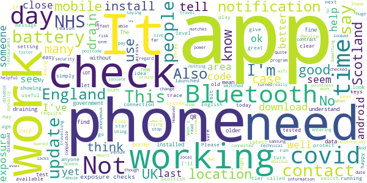

# Protect Scotland
App version ``1.1.0``

Analyzed with [covid-apps-observer](http://github.com/covid-apps-observer) project, version ``0.1``

## App overview
| | |
|-------------------------|-------------------------| 
| **Name**&nbsp;&nbsp;&nbsp;&nbsp;&nbsp;&nbsp;&nbsp;&nbsp;&nbsp;&nbsp;&nbsp;&nbsp;&nbsp;&nbsp;&nbsp;&nbsp;&nbsp;&nbsp;&nbsp;&nbsp;&nbsp;&nbsp;&nbsp;&nbsp;&nbsp;&nbsp;&nbsp;&nbsp;&nbsp;&nbsp;&nbsp;&nbsp;&nbsp;&nbsp;&nbsp;&nbsp;&nbsp;&nbsp;&nbsp;&nbsp;  | Protect Scotland |
| **Unique identifier** | gov.scot.covidtracker |
| **Link to Google Play** | [https://play.google.com/store/apps/details?id=gov.scot.covidtracker](https://play.google.com/store/apps/details?id=gov.scot.covidtracker) |
| **Summary**  | Help stop the spread of Covid-19 in Scotland by using the Protect Scotland app. |
| **Privacy policy** | [https://protect.scot/privacy-policy-app](https://protect.scot/privacy-policy-app) |
| **Latest version** | 1.1.0 |
| **Last update** | 2020-12-10 19:46:00 |
| **Recent changes** | Accessibility improvements: Amended content and age verification for secondary school age users Guidance updates: updated content to reflect changes to self-isolation rules |
| **Installs**  | 500,000+ |
| **Category** | Medical |
| **First release** | Sep 4, 2020 |
| **Size**  | 107M |
| **Supported Android version**  | 6.0 and up |

### Description
> Help Scotland keep the spread of coronavirus under control by downloading and using the free Protect Scotland app from NHS Scotland’s Test and Protect service. 
 Using the app is entirely voluntary.  When you use the app, you will be alerted if you have been in close contact with another app user who has tested positive for coronavirus. If you test positive and you enter the unique code sent to you into the app, it will anonymously warn other app users whom you have been in close contact with.
 Using Bluetooth, the app will search for other devices with the Protect Scotland app installed, which are within 2m of your phone. You don’t need to have a WiFi connection. The app uses a very small amount of your mobile phone data.  
 
Once you’ve downloaded the app, encourage your friends, family and colleagues to do so too. The more people who download and use the Protect Scotland app, the more likely we are to keep coronavirus under control. . The benefits of using the app are:

Speeds up the process of identifying and notifying people that have been at risk of catching coronavirus, particularly of unknown contacts
Slows the spread of the virus
Reduces the likelihood of further lockdowns
Helps protect the health service, your family and friends, yourself and the people of Scotland
 Ultimately, you can help to stop the spread of coronavirus in Scotland by downloading and using the Protect Scotland app.
 Privacy and Data
 The Protect Scotland app is designed to protect the privacy of all users. It doesn’t store or share any personally identifiable information, like your name or address. Nobody can track your location by using the app or tell who you are.
 You can remove the app from your device at any time, and all the data stored on your phone will be deleted.

### User interface
The developers of the app provide the following screenshots in the Google play store.
| | | |
|:-------------------------:|:-------------------------:|:-------------------------:|
 |   |   |   | 
 |   |  

## Development team
In the following we report the main information provided by the development team in the Google play store.

| | |
|-------------------------|-------------------------|
| **Developer**  | NHS Education for Scotland |
| **Website**  | [https://protect.scot/index.html](https://protect.scot/index.html) |
| **Email** | testandprotect@nhs.scot |
| **Physical address**  | [NHS Education for Scotland Knowledge Services 2 Central Quay 3rd Floor 89 Hydepark Street Glasgow G3 8BW ](https://www.google.com/maps/search/NHS%20Education%20for%20Scotland%20Knowledge%20Services%202%20Central%20Quay%203rd%20Floor%2089%20Hydepark%20Street%20Glasgow%20G3%208BW%20) (Google Maps) |
| **Other developed apps**  | [https://play.google.com/store/apps/developer?id=NHS+Education+for+Scotland](https://play.google.com/store/apps/developer?id=NHS+Education+for+Scotland) |

## Android support

| | |
|-------------------------|-------------------------|
| **Declared target Android version**  | Android10, version 10 (API level 29) |
| **Effective target Android version**  | Android10, version 10 (API level 29) |
| **Minimum supported Android version**  | Marshmallow, version 6.0 (API level 23) |
| **Maximum target Android version**  | - |

The larger the difference between the minimum and maximum supported Android versions, the better. A larger difference means a wider audience. For example, old phones have a very low Android version, so a high minimum supported Android version means that the app cannot be used by users with old phones, thus leading to accessibility problems. 

## Requested permissions

In the following we report the complete list of the permissions requested by the app. 

| **Permission** | **Protection level** | **Description** | 
|-------------------------|-------------------------|-------------------------|
 **android.permission ACCESS_NETWORK_STATE** | Normal | Allows applications to access information about networks. 
 **android.permission ACCESS_WIFI_STATE** | Normal | Allows applications to access information about Wi-Fi networks. 
 **android.permission BLUETOOTH** | Normal | Allows applications to connect to paired bluetooth devices. 
 **android.permission FOREGROUND_SERVICE** | Normal | Allows a regular application to use Service.startForeground. 
 **android.permission INTERNET** | Normal | Allows applications to open network sockets. 
 **android.permission RECEIVE_BOOT_COMPLETED** | Normal | Allows an application to receive the Intent.ACTION_BOOT_COMPLETED that is broadcast after the system finishes booting. 
 **android.permission VIBRATE** | Normal | Allows access to the vibrator. 

## Mentioned servers

| **Server** | **Registrant** | **Registrant country** | **Creation date** | 
|-------------------------|-------------------------|-------------------------|-------------------------|
 | android.com | Google LLC | :us: US | 1997-06-23 04:00:00 |
 | google.com | Google LLC | :us: US | 1997-09-15 04:00:00 |
 | expo.io | See PrivacyGuardian.org | :us: US | 2011-05-01 21:26:50 |

## Security analysis 

Below we report the main security warnings raised by our execution of the [Androwarn](https://github.com/maaaaz/androwarn) security analysis tool.

**Telephony identifiers leakage**
> - This application reads the numeric name (MCC+MNC) of current registered operator 
> - This application reads the operator name 

**Connection interfaces exfiltration**
> - This application reads details about the currently active data network 
> - This application tries to find out if the currently active data network is metered 

**Suspicious connection establishment**
> - This application opens a Socket and connects it to the remote address ' returned no addresses for  ; port is out of range' on the 'N/A' port  
> - This application opens a Socket and connects it to the remote address '' on the 'N/A' port  
> - This application opens a Socket and connects it to the remote address 'Ljava/lang/StringBuilder;->toString()Ljava/lang/String;' on the 'N/A' port  
> - This application opens a Socket and connects it to the remote address 'Ljava/net/Proxy;->type()Ljava/net/Proxy$Type;' on the 'N/A' port  
> - This application opens a Socket and connects it to the remote address 'timeout' on the 'N/A' port  

**Pim data leakage**
> - This application accesses data stored in the clipboard 

**Code execution**
> - This application loads a native library 
> - This application executes a UNIX command 

## User ratings and reviews

Below we provide information about how end users are reacting to the app in terms of ratings and reviews in the Google Play store.

### Ratings

The Protect Scotland app has been installed by more than **500000** times. At this time, **2247** rated the app and its average score is **4.0528636**. Below we show the distribution of the ratings across the usual star-based rating of Google Play

:star::star::star::star::star:: 1496

:star::star::star::star:: 168

:star::star::star:: 158

:star::star:: 59

:star:: 366

### Reviews 

#### 5-star reviews

> An essential but unobtrusive aid in the fight against Covid-19  :date: __2020-12-20 00:47:31__

> I've never had and hope not to but the fact it's there is reassurance of knowing.  :date: __2020-12-19 21:08:11__

> This is the first time I've sat in for a meal this year. I feel reassured having this app.  :date: __2020-12-19 14:48:11__

> With the ease of putting this app onto my phone, to the knowledge that it can be carried around undetected, unlike a mask or other type of guard, you have a back-up protection that has already been proven to alert people who would otherwise not have known that they had been in contact with a Covid 19 positive person. Most folk just see it as yet another app on their phone, when in actual fact it's a LIFE SAVER.  :date: __2020-12-18 21:06:50__

> This app is great to use and helpful and useful  :date: __2020-12-17 21:12:16__

> Thankfully not used it yet but well constructed and easy to understand  :date: __2020-12-17 12:31:36__

> If it's going to help it needs everyone to apply..  :date: __2020-12-17 03:41:21__

> A+  :date: __2020-12-16 14:56:16__

> Nothing so far  :date: __2020-12-16 11:52:15__

> Instant alerts and data speeds up actions  :date: __2020-12-16 11:30:32__

#### 4-star reviews

> Easy to use no problems except for the battery so had to use a back up facility  :date: __2020-12-16 22:14:09__

> Okay I think.I may just have been so Isolated I have not had a concern ..yet .  :date: __2020-12-14 23:01:39__

> I haven't had to use it so far  :date: __2020-11-26 23:25:03__

> Just downloaded the app, some folk saying you dont need to turn on location but the app says I have to keep both location and bluetooth on. Glad we have a safe app here in Scotland! 🏴󠁧󠁢󠁳󠁣󠁴󠁿  :date: __2020-11-18 14:51:54__

> I have not, thankfully been exposed to anyone who have tested positive for covid, but I have friends who use this app who have. From listening to them and hearing their experience proves that the Scottish app works  :date: __2020-11-15 03:26:08__

> Very easily understood and concise information explained simple and clearly. I would urge anyone I know to use this app to track and trace to protect the most vulnerable in not just our community, but our own families and friends!!  :date: __2020-10-25 13:23:33__

> YES I KNOW ITS MENT TO PROTECT SCOTLAND FROM COVID BUT im 12 in secondary school and This app was recommended by google play its self it said Pegi 3 so i downloaded it yesterday i forgot about then went back into it today and it came with two options im over 16 or under i said under as I am it said you are not entitled to use this app so undownload it so i did the point to this is *what is the point of making this a pegi 3 and only 16 are entitled to use this app* Thank you goodbye.............  :date: __2020-10-22 22:52:46__

> The app is great the alerts go off all the time outside the parligment building Edinburgh so who's not telling they have it  :date: __2020-10-19 18:17:39__

> Having issues with it not doing exposure checks unless I kill and restart the app. Apart from that, the app works.  :date: __2020-10-18 19:45:35__

> Beware software updates. I have a Samsung phone onto which I downloaded this app. 2 days ago I received an android/Samsung software update message and installed it. This app was shut down in the process which I had not noticed and was therefore not working for the last 2 days. I had no warning this would happen and as a result I have either put myself or someone else at risk. BEWARE.  :date: __2020-10-10 10:00:43__

#### 3-star reviews

> Won't install. When I click next after accepting T&C it says I'm not connected to the Internet. Could it be because I have the covid tracker program installed? Turns out if you have a VPN installed it will not work.  :date: __2020-12-20 12:00:57__

> Good idea but drains battery extremely fast. Cant be in public spaces anymore than an hour with it on or my phone dies  :date: __2020-12-18 04:02:10__

> Okay good  :date: __2020-12-15 16:23:30__

> Think it works!  :date: __2020-12-06 07:48:00__

> It would be great if updates of local area were posted, and the latest government updates policy in the area.  :date: __2020-11-30 17:37:16__

> App is fine but uses a LOT of data.  :date: __2020-11-27 16:07:22__

> On samsung devices you must ensure that disable apps setting is off otherwise the app will be disabled automatically after 30 days of not being used  :date: __2020-11-27 03:00:14__

> My phone has only done 1 check in the last 14 days, which was 14 days ago. I update my phone operation system with the latest update around then, might have knocked off the tracking. Heard others saying they've not had many checks  :date: __2020-11-26 16:20:39__

> Freezes,. does not allow you to book a test  :date: __2020-11-23 18:46:17__

> Asking me today to turn on my Bluetooth and repoen PS app. My Bluetooth is switched on. Reopened app,vstill asking me to switch Bluetooth on.... So guess it's not working  :date: __2020-11-21 19:32:03__

#### 2-star reviews

> Following the latest update It appears my phone had turned off the exposure notifications switch in settings / Google/ covid-19 exposure notifications. What is worrying was / is the Protect Scotland app did not notify me in any way, until I happened to open the app by chance and only then did a warning appear. Why doesn't the app generate a warning every time it tries to check or update it's database ? It seems a very basic failing. ☹️😳 Also why no exposure checks reported anymore ?  :date: __2020-12-19 02:35:30__

> Absolutely destroyed my battery life polling live connections for proximity checking. Also didn't warn of a close contact.  :date: __2020-12-14 12:29:30__

> How do I know this app is working?  :date: __2020-11-24 19:52:43__

> Great idea. Had to uninstall though as it started draining memory and wouldn't push notifications as a result. Might not be apps fault, could be mine or my phone's ability. Either way, can no longer use.  :date: __2020-11-20 07:16:33__

> Doesn't work, went on the app and then got a notification that ive been in close contact with an infexted person. This was 13 days after i was in contact with the person. Never got a text phone or email either. Just aswell i dont have any symptoms  :date: __2020-11-17 22:25:32__

> I have an android phone. This app gives me no notifications. Other users with iPhones tell me they get notifications saying they have no contacts and how many people they have been matched against etc. Why would that be?  :date: __2020-11-15 21:56:30__

> I WASNT NOTIFIED OF MY EXPOSURE TO SOMEONE WHO TESTED POSITIVE WITH COVID-19 TILL 6 DAYS LATER. NOT MUCH GOOD IF I HAD OF UNKNOWINGLY BEEN POSITIVE AND ASYMPTOMATIC. CLEARLY THE APP NEEDS TO BE IMPROVED AS WELL AS USED - DOWNLOADED BY MILLIONS MORE PEOPLE IF IT IS TO BE EFFECTIVE OR WORTHWHILE.  :date: __2020-11-12 23:38:12__

> To be honest I put this app on my phone when I was in Scotland for a week it didn't really seem to do anything like the nhs app in England  :date: __2020-11-12 15:01:09__

> Just clicked on the app and its came up saying i need to isolate as been in close contact with someone with covid i did not get a notification about this was only when i physically went into the app i knew. Also i am on day 16 and the app is still saying to isolate  :date: __2020-11-12 08:38:10__

> Thought I was using the app to book a test, after being redirected several times, finally ordering my test, now do not have a code to input in to the app, no way to get a code, no way to contact anyone about it.  :date: __2020-11-10 14:37:56__

#### 1-star reviews

> I work in a hospital that has covid patients, NOT ONCE HAVE I BEEN NOTIFIED THAT IVE BEEN NEAR ANYONE WITH IT. Also, if a person has it, if they don't put code into the app, then its useless.  :date: __2020-12-20 07:44:09__

> CONTROLAVIRUS. . Switch off your TV..bin the mask.. Hug each other.. Educate yourselves..#lulz  :date: __2020-12-19 08:30:42__

> Covid test positive no code giving  :date: __2020-12-18 23:11:10__

> Do not download protect your privacy  :date: __2020-12-18 18:38:43__

> Been out every day at work etc in many different locations and last scan done was 8 days ago?? 3 in the past 14 days, this is a waste of time.......  :date: __2020-12-17 23:43:54__

> DO NOT DOWNLOAD THIS. App is getting deleted!!! Had it from the get go and for some reason it decided to stop checking for contacts a few weeks ago. Anyway, installed the new app today and received a close contact notification. I have now been told by NHS Scotland contact tracers that it is up to me whether to self isolate or not!!!! Whats then point in having the app if thats the case?  :date: __2020-12-16 17:46:44__

> Got an alert 6 days late. I work in retail. This app is broken. Be aware.  :date: __2020-12-16 15:56:17__

> Bruh this game sucks  :date: __2020-12-16 09:31:50__

> Work in a Nursery. Was not notified when a family tested positive for Covid.  :date: __2020-12-15 19:20:15__

> Got a notification that I had to isolate for 10 days.... 2 days after this isolation period had finished  :date: __2020-12-15 15:44:39__

