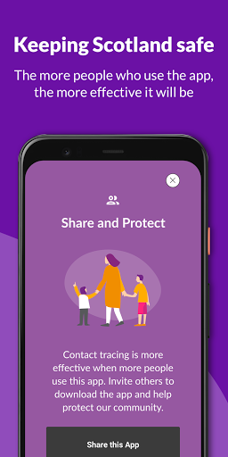
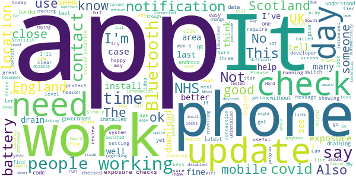

# Protect Scotland
App version ``1.1.1``

Analyzed with [covid-apps-observer](http://github.com/covid-apps-observer) project, version ``0.1``

## App overview
| | |
|-------------------------|-------------------------| 
| **Name**&nbsp;&nbsp;&nbsp;&nbsp;&nbsp;&nbsp;&nbsp;&nbsp;&nbsp;&nbsp;&nbsp;&nbsp;&nbsp;&nbsp;&nbsp;&nbsp;&nbsp;&nbsp;&nbsp;&nbsp;&nbsp;&nbsp;&nbsp;&nbsp;&nbsp;&nbsp;&nbsp;&nbsp;&nbsp;&nbsp;&nbsp;&nbsp;&nbsp;&nbsp;&nbsp;&nbsp;&nbsp;&nbsp;&nbsp;&nbsp;  | Protect Scotland |
| **Unique identifier** | gov.scot.covidtracker |
| **Link to Google Play** | [https://play.google.com/store/apps/details?id=gov.scot.covidtracker](https://play.google.com/store/apps/details?id=gov.scot.covidtracker) |
| **Summary**  | Help stop the spread of Covid-19 in Scotland by using the Protect Scotland app. |
| **Privacy policy** | [https://protect.scot/privacy-policy-app](https://protect.scot/privacy-policy-app) |
| **Latest version** | 1.1.1 |
| **Last update** | 2021-01-05 18:46:50 |
| **Recent changes** | Minor fixes and text changes |
| **Installs**  | 500,000+ |
| **Category** | Medical |
| **First release** | Sep 4, 2020 |
| **Size**  | 107M |
| **Supported Android version**  | 6.0 and up |

### Description
> Help Scotland keep the spread of coronavirus under control by downloading and using the free Protect Scotland app from NHS Scotland’s Test and Protect service. 
 Using the app is entirely voluntary.  When you use the app, you will be alerted if you have been in close contact with another app user who has tested positive for coronavirus. If you test positive and you enter the unique code sent to you into the app, it will anonymously warn other app users whom you have been in close contact with.
 Using Bluetooth, the app will search for other devices with the Protect Scotland app installed, which are within 2m of your phone. You don’t need to have a WiFi connection. The app uses a very small amount of your mobile phone data.  
 
Once you’ve downloaded the app, encourage your friends, family and colleagues to do so too. The more people who download and use the Protect Scotland app, the more likely we are to keep coronavirus under control. . The benefits of using the app are:

Speeds up the process of identifying and notifying people that have been at risk of catching coronavirus, particularly of unknown contacts
Slows the spread of the virus
Reduces the likelihood of further lockdowns
Helps protect the health service, your family and friends, yourself and the people of Scotland
 Ultimately, you can help to stop the spread of coronavirus in Scotland by downloading and using the Protect Scotland app.
 Privacy and Data
 The Protect Scotland app is designed to protect the privacy of all users. It doesn’t store or share any personally identifiable information, like your name or address. Nobody can track your location by using the app or tell who you are.
 You can remove the app from your device at any time, and all the data stored on your phone will be deleted.

### User interface
The developers of the app provide the following screenshots in the Google play store.
| | | |
|:-------------------------:|:-------------------------:|:-------------------------:|
 |   |   |   | 
 |   |  

## Development team
In the following we report the main information provided by the development team in the Google play store.

| | |
|-------------------------|-------------------------|
| **Developer**  | NHS Education for Scotland |
| **Website**  | [https://protect.scot/index.html](https://protect.scot/index.html) |
| **Email** | testandprotect@nhs.scot |
| **Physical address**  | [NHS Education for Scotland Knowledge Services 2 Central Quay 3rd Floor 89 Hydepark Street Glasgow G3 8BW ](https://www.google.com/maps/search/NHS%20Education%20for%20Scotland%20Knowledge%20Services%202%20Central%20Quay%203rd%20Floor%2089%20Hydepark%20Street%20Glasgow%20G3%208BW%20) (Google Maps) |
| **Other developed apps**  | [https://play.google.com/store/apps/developer?id=NHS+Education+for+Scotland](https://play.google.com/store/apps/developer?id=NHS+Education+for+Scotland) |

## Android support

| | |
|-------------------------|-------------------------|
| **Declared target Android version**  | Android10, version 10 (API level 29) |
| **Effective target Android version**  | Android10, version 10 (API level 29) |
| **Minimum supported Android version**  | Marshmallow, version 6.0 (API level 23) |
| **Maximum target Android version**  | - |

The larger the difference between the minimum and maximum supported Android versions, the better. A larger difference means a wider audience. For example, old phones have a very low Android version, so a high minimum supported Android version means that the app cannot be used by users with old phones, thus leading to accessibility problems. 

## Requested permissions

In the following we report the complete list of the permissions requested by the app. 

| **Permission** | **Protection level** | **Description** | 
|-------------------------|-------------------------|-------------------------|
 **android.permission ACCESS_NETWORK_STATE** | Normal | Allows applications to access information about networks. 
 **android.permission ACCESS_WIFI_STATE** | Normal | Allows applications to access information about Wi-Fi networks. 
 **android.permission BLUETOOTH** | Normal | Allows applications to connect to paired bluetooth devices. 
 **android.permission FOREGROUND_SERVICE** | Normal | Allows a regular application to use Service.startForeground. 
 **android.permission INTERNET** | Normal | Allows applications to open network sockets. 
 **android.permission RECEIVE_BOOT_COMPLETED** | Normal | Allows an application to receive the Intent.ACTION_BOOT_COMPLETED that is broadcast after the system finishes booting. 
 **android.permission VIBRATE** | Normal | Allows access to the vibrator. 

## Mentioned servers

| **Server** | **Registrant** | **Registrant country** | **Creation date** | 
|-------------------------|-------------------------|-------------------------|-------------------------|
 | android.com | Google LLC | :us: US | 1997-06-23 04:00:00 |
 | google.com | Google LLC | :us: US | 1997-09-15 04:00:00 |
 | expo.io | See PrivacyGuardian.org | :us: US | 2011-05-01 21:26:50 |

## Security analysis 

Below we report the main security warnings raised by our execution of the [Androwarn](https://github.com/maaaaz/androwarn) security analysis tool.

**Telephony identifiers leakage**
> - This application reads the MCC+MNC of the provider of the SIM 
> - This application reads the numeric name (MCC+MNC) of current registered operator 
> - This application reads the operator name 

**Connection interfaces exfiltration**
> - This application reads details about the currently active data network 
> - This application tries to find out if the currently active data network is metered 

**Suspicious connection establishment**
> - This application opens a Socket and connects it to the remote address ' returned no addresses for  ; port is out of range' on the 'N/A' port  
> - This application opens a Socket and connects it to the remote address '' on the 'N/A' port  
> - This application opens a Socket and connects it to the remote address 'Ljava/lang/StringBuilder;->toString()Ljava/lang/String;' on the 'N/A' port  
> - This application opens a Socket and connects it to the remote address 'Ljava/net/Proxy;->type()Ljava/net/Proxy$Type;' on the 'N/A' port  
> - This application opens a Socket and connects it to the remote address 'timeout' on the 'N/A' port  

**Pim data leakage**
> - This application accesses data stored in the clipboard 

**Code execution**
> - This application loads a native library 
> - This application executes a UNIX command 

## User ratings and reviews

Below we provide information about how end users are reacting to the app in terms of ratings and reviews in the Google Play store.

### Ratings

The Protect Scotland app has been installed by more than **500000** times. At this time, **2453** rated the app and its average score is **3.808765**. Below we show the distribution of the ratings across the usual star-based rating of Google Play

:star::star::star::star::star:: 1506

:star::star::star::star:: 146

:star::star::star:: 176

:star::star:: 78

:star:: 547

### Reviews 

#### 5-star reviews

> Pierce of mind  :date: __2021-01-16 11:20:56__

> It's a good thing.  :date: __2021-01-15 09:10:38__

> Makes me feel safer  :date: __2021-01-14 13:43:12__

> Very happy to have this on my phone. Looking forward to getting vaccinated.  :date: __2021-01-14 09:51:23__

> Vital  :date: __2021-01-14 07:56:12__

> Easy to set up  :date: __2021-01-13 23:03:59__

> Easy to use.  :date: __2021-01-13 15:07:02__

> I think we all need to do anything we can to stop the virus.  :date: __2021-01-13 13:11:19__

> Insurance against the passing on infect.  :date: __2021-01-13 11:36:32__

> It makes me feel safer. I suffer from severe Asthma but the NHS Lanarkshire have not put me in the vulnerable category box. It was the same prior to this new variable type of virus. My GPS surgery wrote to them saying that I needed to see a Respiratory Consultant urgently. This was about 20 weeks ago now! My Asthma is getting worse, on top of this I suffer from Compressive Cervical Myelopathy and getting around is becoming more difficult and my breathing doesn't help at all !.  :date: __2021-01-13 10:27:48__

#### 4-star reviews

> Ok  :date: __2021-01-14 15:36:03__

> OK  :date: __2021-01-07 10:58:35__

> It saves lives  :date: __2021-01-02 00:22:28__

> Have not needed to use  :date: __2020-12-23 00:24:50__

> Easy to use no problems except for the battery so had to use a back up facility  :date: __2020-12-16 22:14:09__

> Okay I think.I may just have been so Isolated I have not had a concern ..yet .  :date: __2020-12-14 23:01:39__

> I haven't had to use it so far  :date: __2020-11-26 23:25:03__

> Just downloaded the app, some folk saying you dont need to turn on location but the app says I have to keep both location and bluetooth on. Glad we have a safe app here in Scotland! 🏴󠁧󠁢󠁳󠁣󠁴󠁿  :date: __2020-11-18 14:51:54__

> I have not, thankfully been exposed to anyone who have tested positive for covid, but I have friends who use this app who have. From listening to them and hearing their experience proves that the Scottish app works  :date: __2020-11-15 03:26:08__

> Very easily understood and concise information explained simple and clearly. I would urge anyone I know to use this app to track and trace to protect the most vulnerable in not just our community, but our own families and friends!!  :date: __2020-10-25 13:23:33__

#### 3-star reviews

> Nice if there was a log of when it was working and when instead of praying that a notification comes up if you've been exposed.  :date: __2021-01-13 18:32:20__

> Update: appear to be getting daily exposure updates now. Will give the app another try. I have had zero response from the developer.  :date: __2021-01-09 00:16:58__

> The app used to work fine until the 10 Dec update but then stopped checking for exposures automatically. It was difficult to report the issue --- it feels like mails / app reviews only got attention after people made fuss on social media. The app works OK now, after the 5 Jan update, but I wish there was an easier way to report bugs, and more transparency regarding existing ones.  :date: __2021-01-08 13:18:19__

> Just got a notification after accidently turning off my.location to be informed I haven't been checked since 14th December !!!  :date: __2021-01-07 23:23:07__

> Was working for a while but not performed a check since 16th December 2020 despite always being on.  :date: __2021-01-03 22:07:19__

> I occasionally check this app and all is well. Thank God.  :date: __2020-12-30 23:14:17__

> No exposure checks in the last 14 days, yet I've had bluetooth & location switched on.  :date: __2020-12-30 14:39:08__

> Not enough information  :date: __2020-12-29 03:11:50__

> Periodically tells me that Bluetooth is turned off, even when (as far as I can see) it's not...  :date: __2020-12-28 19:22:14__

> Won't install. When I click next after accepting T&C it says I'm not connected to the Internet. Could it be because I have the covid tracker program installed? Turns out if you have a VPN installed it will not work.  :date: __2020-12-20 12:00:57__

#### 2-star reviews

> Known not to work as positive testing patients do not put in their results  :date: __2021-01-16 11:16:29__

> Entered my post code to see the restrictions in my post code and it can't find it  :date: __2021-01-13 16:28:03__

> Never tells me when I have been in known contact. Wouldn't except a code for positive result  :date: __2021-01-11 00:09:22__

> Is this app working.  :date: __2021-01-08 23:48:11__

> Does it do anything . No buttons seem active  :date: __2020-12-23 12:48:16__

> Its a good idea but while it was installed, it messed up my Bluetooth connections. Couldnt use any Bluetooth devices while it was installed  :date: __2020-12-22 04:04:22__

> Following the latest update It appears my phone had turned off the exposure notifications switch in settings / Google/ covid-19 exposure notifications. What is worrying was / is the Protect Scotland app did not notify me in any way, until I happened to open the app by chance and only then did a warning appear. Why doesn't the app generate a warning every time it tries to check or update it's database ? It seems a very basic failing. ☹️😳 Also why no exposure checks reported anymore ?  :date: __2020-12-19 02:35:30__

> Absolutely destroyed my battery life polling live connections for proximity checking. Also didn't warn of a close contact.  :date: __2020-12-14 12:29:30__

> How do I know this app is working?  :date: __2020-11-24 19:52:43__

> Great idea. Had to uninstall though as it started draining memory and wouldn't push notifications as a result. Might not be apps fault, could be mine or my phone's ability. Either way, can no longer use.  :date: __2020-11-20 07:16:33__

#### 1-star reviews

> Started using the app but I cannot input a test code?  :date: __2021-01-15 08:57:35__

> Got a notification last night saying i was in close contact with someone who tested positive on the 4th Jan 21 and to self isolate for 1 day. Not working very well and not good as ive been at work from 5th Jan and could have potentially passed to others if positive.  :date: __2021-01-14 09:16:49__

> Carried out three checks in one month. Have reinstalled and still not working properly. I'm using a Huawei.  :date: __2021-01-13 17:43:36__

> No feedback, postcode checker required, hungry on battery. Tried again, still hungry on battery.  :date: __2021-01-13 11:13:50__

> When it works it's fine. I like many others had problems with the exposure checks but it started doing them again after the update and it was fine. Suddenly yesterday something changed when you click on the covid exposure checks on. A message now comes up about the exposure and I clicked on the three dots at the top right where I was able to see what exposure checks have been done. Since 5pm yesterday no checks showing up. Please address this problem or I will just delete the app.  :date: __2021-01-13 10:22:29__

> Doesn't automatically refresh so is an utterly useless app for Covid.  :date: __2021-01-12 21:46:25__

> Doesn't work and drains battery. My wife has the app installed and enabled but was not traced after being in contact with a positive person who had been traced ☹️  :date: __2021-01-11 14:42:25__

> Why does it take 9 days after contact to be notified by the app. What use is that. Think of all the contacts you will have especially as a front line worker on 9 days.  :date: __2021-01-11 09:02:50__

> This app is garbage. Absolute waste of tax payer's money. Again. Been in close proximity to someone with a positive test and he has entered his details in and put mine in and ive had no notification at all. My Bluetooth and location is enabled at all times and still not a peep. Absolutely pointless.  :date: __2021-01-10 13:49:44__

> I have 2 matches when I check exposures but I have had no alerts? I work in retail so around thousands of people a day so could have it and be spreading it without knowing 😣  :date: __2021-01-10 13:47:09__

