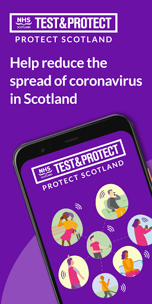
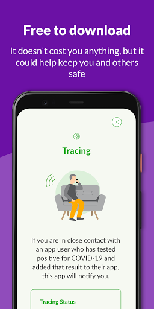
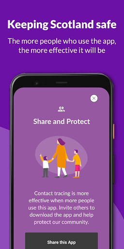
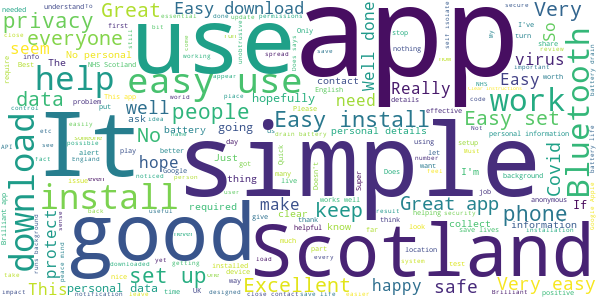
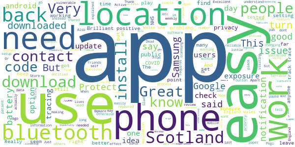
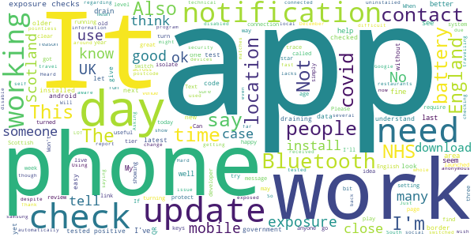
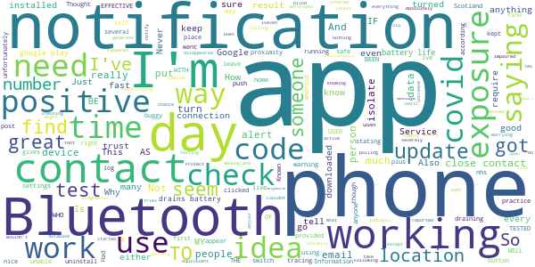
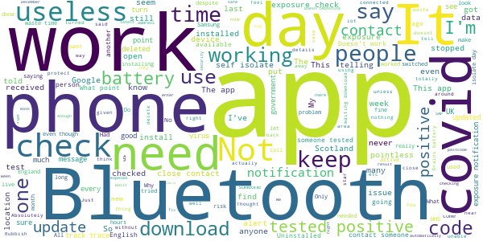

# Protect Scotland
App version ``1.2.0``

Analyzed with [covid-apps-observer](http://github.com/covid-apps-observer) project, version ``0.1``

## App overview
| | |
|-------------------------|-------------------------| 
| **Name**&nbsp;&nbsp;&nbsp;&nbsp;&nbsp;&nbsp;&nbsp;&nbsp;&nbsp;&nbsp;&nbsp;&nbsp;&nbsp;&nbsp;&nbsp;&nbsp;&nbsp;&nbsp;&nbsp;&nbsp;&nbsp;&nbsp;&nbsp;&nbsp;&nbsp;&nbsp;&nbsp;&nbsp;&nbsp;&nbsp;&nbsp;&nbsp;&nbsp;&nbsp;&nbsp;&nbsp;&nbsp;&nbsp;&nbsp;&nbsp;  | Protect Scotland |
| **Unique identifier** | gov.scot.covidtracker |
| **Link to Google Play** | [https://play.google.com/store/apps/details?id=gov.scot.covidtracker](https://play.google.com/store/apps/details?id=gov.scot.covidtracker) |
| **Summary**  | Help stop the spread of Covid-19 in Scotland by using the Protect Scotland app. |
| **Privacy policy** | [https://protect.scot/privacy-policy-app](https://protect.scot/privacy-policy-app) |
| **Latest version** | 1.2.0 |
| **Last update** | 2021-02-08 19:38:37 |
| **Recent changes** | In-app process for generating self-isolation certificates. |
| **Installs**  | 500,000+ |
| **Category** | Medical |
| **First release** | Sep 4, 2020 |
| **Size**  | 107M |
| **Supported Android version**  | 6.0 and up |

### Description
> Help Scotland keep the spread of coronavirus under control by downloading and using the free Protect Scotland app from NHS Scotland’s Test and Protect service. 
 Using the app is entirely voluntary.  When you use the app, you will be alerted if you have been in close contact with another app user who has tested positive for coronavirus. If you test positive and you enter the unique code sent to you into the app, it will anonymously warn other app users whom you have been in close contact with.
 Using Bluetooth, the app will search for other devices with the Protect Scotland app installed, which are within 2m of your phone. You don’t need to have a WiFi connection. The app uses a very small amount of your mobile phone data.  
 
Once you’ve downloaded the app, encourage your friends, family and colleagues to do so too. The more people who download and use the Protect Scotland app, the more likely we are to keep coronavirus under control. . The benefits of using the app are:

Speeds up the process of identifying and notifying people that have been at risk of catching coronavirus, particularly of unknown contacts
Slows the spread of the virus
Reduces the likelihood of further lockdowns
Helps protect the health service, your family and friends, yourself and the people of Scotland
 Ultimately, you can help to stop the spread of coronavirus in Scotland by downloading and using the Protect Scotland app.
 Privacy and Data
 The Protect Scotland app is designed to protect the privacy of all users. It doesn’t store or share any personally identifiable information, like your name or address. Nobody can track your location by using the app or tell who you are.
 You can remove the app from your device at any time, and all the data stored on your phone will be deleted.

### User interface
The developers of the app provide the following screenshots in the Google play store.
| | | |
|:-------------------------:|:-------------------------:|:-------------------------:|
 |   |   |   | 
 |   |  

## Development team
In the following we report the main information provided by the development team in the Google play store.

| | |
|-------------------------|-------------------------|
| **Developer**  | NHS Education for Scotland |
| **Website**  | [https://protect.scot/index.html](https://protect.scot/index.html) |
| **Email** | testandprotect@nhs.scot |
| **Physical address**  | [NHS Education for Scotland Knowledge Services 2 Central Quay 3rd Floor 89 Hydepark Street Glasgow G3 8BW ](https://www.google.com/maps/search/NHS%20Education%20for%20Scotland%20Knowledge%20Services%202%20Central%20Quay%203rd%20Floor%2089%20Hydepark%20Street%20Glasgow%20G3%208BW%20) (Google Maps) |
| **Other developed apps**  | [https://play.google.com/store/apps/developer?id=NHS+Education+for+Scotland](https://play.google.com/store/apps/developer?id=NHS+Education+for+Scotland) |

## Android support

| | |
|-------------------------|-------------------------|
| **Declared target Android version**  | Android10, version 10 (API level 29) |
| **Effective target Android version**  | Android10, version 10 (API level 29) |
| **Minimum supported Android version**  | Marshmallow, version 6.0 (API level 23) |
| **Maximum target Android version**  | - |

The larger the difference between the minimum and maximum supported Android versions, the better. A larger difference means a wider audience. For example, old phones have a very low Android version, so a high minimum supported Android version means that the app cannot be used by users with old phones, thus leading to accessibility problems. 

## Requested permissions

In the following we report the complete list of the permissions requested by the app. 

| **Permission** | **Protection level** | **Description** | 
|-------------------------|-------------------------|-------------------------|
 **android.permission ACCESS_NETWORK_STATE** | Normal | Allows applications to access information about networks. 
 **android.permission ACCESS_WIFI_STATE** | Normal | Allows applications to access information about Wi-Fi networks. 
 **android.permission BLUETOOTH** | Normal | Allows applications to connect to paired bluetooth devices. 
 **android.permission FOREGROUND_SERVICE** | Normal | Allows a regular application to use Service.startForeground. 
 **android.permission INTERNET** | Normal | Allows applications to open network sockets. 
 **android.permission RECEIVE_BOOT_COMPLETED** | Normal | Allows an application to receive the Intent.ACTION_BOOT_COMPLETED that is broadcast after the system finishes booting. 
 **android.permission VIBRATE** | Normal | Allows access to the vibrator. 

## Mentioned servers

| **Server** | **Registrant** | **Registrant country** | **Creation date** | 
|-------------------------|-------------------------|-------------------------|-------------------------|
 | android.com | Google LLC | :us: US | 1997-06-23 04:00:00 |
 | google.com | Google LLC | :us: US | 1997-09-15 04:00:00 |
 | expo.io | See PrivacyGuardian.org | :us: US | 2011-05-01 21:26:50 |

## Security analysis 

Below we report the main security warnings raised by our execution of the [Androwarn](https://github.com/maaaaz/androwarn) security analysis tool.

**Telephony identifiers leakage**
> - This application reads the MCC+MNC of the provider of the SIM 

**Connection interfaces exfiltration**
> - This application reads details about the currently active data network 
> - This application tries to find out if the currently active data network is metered 

**Suspicious connection establishment**
> - This application opens a Socket and connects it to the remote address ' returned no addresses for  ; port is out of range' on the 'N/A' port  
> - This application opens a Socket and connects it to the remote address '' on the 'N/A' port  
> - This application opens a Socket and connects it to the remote address 'Ljava/lang/StringBuilder;->toString()Ljava/lang/String;' on the 'N/A' port  
> - This application opens a Socket and connects it to the remote address 'Ljava/net/Proxy;->type()Ljava/net/Proxy$Type;' on the 'N/A' port  
> - This application opens a Socket and connects it to the remote address 'timeout' on the 'N/A' port  

**Pim data leakage**
> - This application accesses data stored in the clipboard 

**Code execution**
> - This application loads a native library 
> - This application executes a UNIX command 

## User ratings and reviews

Below we provide information about how end users are reacting to the app in terms of ratings and reviews in the Google Play store.

### Ratings

The Protect Scotland app has been installed by more than **500000** times. At this time, **2723** rated the app and its average score is **4.1214285**. Below we show the distribution of the ratings across the usual star-based rating of Google Play

:star::star::star::star::star:: 1819

:star::star::star::star:: 301

:star::star::star:: 107

:star::star:: 107

:star:: 389

### Reviews 

#### 5-star reviews

> Good app to have  :date: __2021-02-13 14:17:13__

> Easy install, anonymous and unobtrusive. No personal details required. Get alerted if you have been in close contact with anyone recently testing positive. What you choose to do then is up to you. Similarly if you have a positive test, you choose to update the app/system. A win-win for everyone, and it will help restrict and limit any spread. Update: 31st Jan 20: The app/system works. My partner got a +ve test result this morning. She entered her code and I was notified a few hours later.  :date: __2021-02-13 14:12:49__

> Excellent app, runs in the background, doesn't collect your data, never had a problem with it. Brilliant, thanks NHS Scotland!  :date: __2021-02-13 12:47:23__

> Well developed programme, well done to the Scottish government 👏  :date: __2021-02-13 09:16:08__

> Easy to do  :date: __2021-02-12 19:17:32__

> Good  :date: __2021-02-12 19:12:42__

> Doing what it's designed for  :date: __2021-02-12 12:45:26__

> Excellent  :date: __2021-02-11 19:25:33__

> Great app.....  :date: __2021-02-11 13:37:04__

> Best thing i ever done everyone should have it  :date: __2021-02-11 13:29:36__

#### 4-star reviews

> Useful  :date: __2021-02-12 16:43:23__

> Very important app very good  :date: __2021-02-07 17:27:01__

> Excellent. Many thanks for making this app which keeps us all safer and aware.  :date: __2021-01-27 22:28:42__

> Updating review,,,track and trace provided me with new code which worked within the app. Will say I have been in contact with two people who tested positive but had no notification through app but dont know if they inputted the code 🤔  :date: __2021-01-20 13:31:05__

> Ok  :date: __2021-01-14 15:36:03__

> OK  :date: __2021-01-07 10:58:35__

> It saves lives  :date: __2021-01-02 00:22:28__

> Have not needed to use  :date: __2020-12-23 00:24:50__

> Easy to use no problems except for the battery so had to use a back up facility  :date: __2020-12-16 22:14:09__

> Okay I think.I may just have been so Isolated I have not had a concern ..yet .  :date: __2020-12-14 23:01:39__

#### 3-star reviews

> I received a notification to self-isolate back in November. When I checked the periods of exposure on the Google notification page there had been no exposure checks for several days including the day I was allegedly exposed. It turned out I was nowhere near anybody that had corvid-19. My next door neighbour had tested positive a week or so before. The Bluetooth picked up the notification through the wall.  :date: __2021-02-12 14:22:32__

> None  :date: __2021-01-22 22:34:21__

> An ok app but my husband and I both tested positive on the same day. The following day, we each received a text to say we'd been in close contact with someone who had tested positive. Given we live in the same house ...  :date: __2021-01-20 18:16:11__

> Nice if there was a log of when it was working and when instead of praying that a notification comes up if you've been exposed.  :date: __2021-01-13 18:32:20__

> Update: appear to be getting daily exposure updates now. Will give the app another try. I have had zero response from the developer.  :date: __2021-01-09 00:16:58__

> The app used to work fine until the 10 Dec update but then stopped checking for exposures automatically. It was difficult to report the issue --- it feels like mails / app reviews only got attention after people made fuss on social media. The app works OK now, after the 5 Jan update, but I wish there was an easier way to report bugs, and more transparency regarding existing ones.  :date: __2021-01-08 13:18:19__

> Just got a notification after accidently turning off my.location to be informed I haven't been checked since 14th December !!!  :date: __2021-01-07 23:23:07__

> Was working for a while but not performed a check since 16th December 2020 despite always being on.  :date: __2021-01-03 22:07:19__

> I occasionally check this app and all is well. Thank God.  :date: __2020-12-30 23:14:17__

> No exposure checks in the last 14 days, yet I've had bluetooth & location switched on.  :date: __2020-12-30 14:39:08__

#### 2-star reviews

> There is no way of knowing if it iseven working. Updates saying everything is fine you haven't been in contact with a positive person would be nice.  :date: __2021-02-12 13:30:55__

> Never had an alert no idea if that's working and there's no way to take two phones and do a diagnostic safe proximity test between them for reassurance. I simply don't trust this or the NHSEngland equivalent and I use both.  :date: __2021-02-12 04:20:30__

> I don't know if it works right..  :date: __2021-02-11 11:40:25__

> Cannot increase or adjust the font size. I am severely visually impaired/blind.  :date: __2021-02-04 14:05:45__

> I had a message via the app once but when I clicked on it, it disappeared.theres nothing in app about using QR code...or how.  :date: __2021-01-17 09:03:08__

> Known not to work as positive testing patients do not put in their results  :date: __2021-01-16 11:16:29__

> Entered my post code to see the restrictions in my post code and it can't find it  :date: __2021-01-13 16:28:03__

> Never tells me when I have been in known contact. Wouldn't except a code for positive result  :date: __2021-01-11 00:09:22__

> Is this app working.  :date: __2021-01-08 23:48:11__

> Does it do anything . No buttons seem active  :date: __2020-12-23 12:48:16__

#### 1-star reviews

> As someone who works in England and commutes back to Scotland, this app is useless. Why is everyone in the UK not using the same app. There are thousands like me.  :date: __2021-02-13 14:15:18__

> Exceeding doubtful that the App actually works.  :date: __2021-02-13 14:11:50__

> This app seems useless  :date: __2021-02-13 12:21:58__

> CONTROLAVIRUS. . Switch off your TV..bin the mask.. Hug each other.. Educate yourselves. Seriously people this app is a security risk.. NEVER keep your Bluetooth 0n...  :date: __2021-02-13 07:23:28__

> I tested positive for covid and it wouldn't accept my test code to mark me as a positive case  :date: __2021-02-12 16:41:15__

> The app will not download or should I say update from the older version..  :date: __2021-02-11 19:26:45__

> Trying to download the updated App from the current App but it is in a loop and does not update.  :date: __2021-02-11 14:14:58__

> Useless. It doesn't update automatically. So by chance I saw a new update available. Had someone near me who has tested positive and has updated their app with the result but it didn't alert me in any way. Whoever invented this, should be sacked.  :date: __2021-02-11 14:10:20__

> Works smoother than a goat on a dance floor  :date: __2021-02-11 04:00:35__

> So in a month this app has used 0.00mb of data.. it doesnt work and totally pointless. More SNP propaganda  :date: __2021-02-06 12:24:45__

