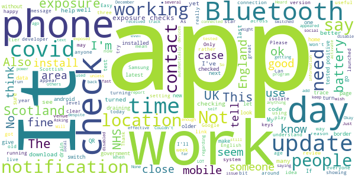
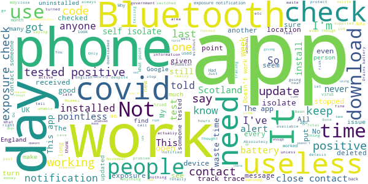

# Protect Scotland
App version ``1.2.1``

Analyzed with [covid-apps-observer](http://github.com/covid-apps-observer) project, version ``0.1``

## App overview
| | |
|-------------------------|-------------------------| 
| **Name**                                          | Protect Scotland |
| **Unique identifier** | gov.scot.covidtracker |
| **Link to Google Play** | [https://play.google.com/store/apps/details?id=gov.scot.covidtracker](https://play.google.com/store/apps/details?id=gov.scot.covidtracker) |
| **Summary**  | Help stop the spread of Covid-19 in Scotland by using the Protect Scotland app. |
| **Privacy policy** | [https://protect.scot/privacy-policy-app](https://protect.scot/privacy-policy-app) |
| **Latest version** | 1.2.1 |
| **Last update** | 2021-02-17 10:10:01 |
| **Recent changes** | Minor test changes. |
| **Installs**  | 500,000+ |
| **Category** | Medical |
| **First release** | Sep 4, 2020 |
| **Size**  | 107M |
| **Supported Android version**  | 6.0 and up |

### Description
> Help Scotland keep the spread of coronavirus under control by downloading and using the free Protect Scotland app from NHS Scotland’s Test and Protect service. 
 Using the app is entirely voluntary.  When you use the app, you will be alerted if you have been in close contact with another app user who has tested positive for coronavirus. If you test positive and you enter the unique code sent to you into the app, it will anonymously warn other app users whom you have been in close contact with.
 Using Bluetooth, the app will search for other devices with the Protect Scotland app installed, which are within 2m of your phone. You don’t need to have a WiFi connection. The app uses a very small amount of your mobile phone data.  
 
Once you’ve downloaded the app, encourage your friends, family and colleagues to do so too. The more people who download and use the Protect Scotland app, the more likely we are to keep coronavirus under control. . The benefits of using the app are:

Speeds up the process of identifying and notifying people that have been at risk of catching coronavirus, particularly of unknown contacts
Slows the spread of the virus
Reduces the likelihood of further lockdowns
Helps protect the health service, your family and friends, yourself and the people of Scotland
 Ultimately, you can help to stop the spread of coronavirus in Scotland by downloading and using the Protect Scotland app.
 Privacy and Data
 The Protect Scotland app is designed to protect the privacy of all users. It doesn’t store or share any personally identifiable information, like your name or address. Nobody can track your location by using the app or tell who you are.
 You can remove the app from your device at any time, and all the data stored on your phone will be deleted.

### User interface
The developers of the app provide the following screenshots in the Google play store.
| | | |
|:-------------------------:|:-------------------------:|:-------------------------:|
 |   |   |   | 
 |   |  

## Development team
In the following we report the main information provided by the development team in the Google play store.

| | |
|-------------------------|-------------------------|
| **Developer**  | NHS Education for Scotland |
| **Website**  | [https://protect.scot/index.html](https://protect.scot/index.html) |
| **Email** | testandprotect@nhs.scot |
| **Physical address**  | [NHS Education for Scotland Knowledge Services 2 Central Quay 3rd Floor 89 Hydepark Street Glasgow G3 8BW ](https://www.google.com/maps/search/NHS%20Education%20for%20Scotland%20Knowledge%20Services%202%20Central%20Quay%203rd%20Floor%2089%20Hydepark%20Street%20Glasgow%20G3%208BW%20) (Google Maps) |
| **Other developed apps**  | [https://play.google.com/store/apps/developer?id=NHS+Education+for+Scotland](https://play.google.com/store/apps/developer?id=NHS+Education+for+Scotland) |

## Android support

| | |
|-------------------------|-------------------------|
| **Declared target Android version**  | Android10, version 10 (API level 29) |
| **Effective target Android version**  | Android10, version 10 (API level 29) |
| **Minimum supported Android version**  | Marshmallow, version 6.0 (API level 23) |
| **Maximum target Android version**  | - |

The larger the difference between the minimum and maximum supported Android versions, the better. A larger difference means a wider audience. For example, old phones have a very low Android version, so a high minimum supported Android version means that the app cannot be used by users with old phones, thus leading to accessibility problems. 

## Requested permissions

In the following we report the complete list of the permissions requested by the app. 

| **Permission** | **Protection level** | **Description** | 
|-------------------------|-------------------------|-------------------------|
 **android.permission ACCESS_NETWORK_STATE** | Normal | Allows applications to access information about networks. 
 **android.permission ACCESS_WIFI_STATE** | Normal | Allows applications to access information about Wi-Fi networks. 
 **android.permission BLUETOOTH** | Normal | Allows applications to connect to paired bluetooth devices. 
 **android.permission FOREGROUND_SERVICE** | Normal | Allows a regular application to use Service.startForeground. 
 **android.permission INTERNET** | Normal | Allows applications to open network sockets. 
 **android.permission RECEIVE_BOOT_COMPLETED** | Normal | Allows an application to receive the Intent.ACTION_BOOT_COMPLETED that is broadcast after the system finishes booting. 
 **android.permission VIBRATE** | Normal | Allows access to the vibrator. 

## Mentioned servers

| **Server** | **Registrant** | **Registrant country** | **Creation date** | 
|-------------------------|-------------------------|-------------------------|-------------------------|
 | android.com | Google LLC | :us: US | 1997-06-23 04:00:00 |
 | google.com | Google LLC | :us: US | 1997-09-15 04:00:00 |
 | expo.io | See PrivacyGuardian.org | :us: US | 2011-05-01 21:26:50 |

## Security analysis 

Below we report the main security warnings raised by our execution of the [Androwarn](https://github.com/maaaaz/androwarn) security analysis tool.

**Telephony identifiers leakage**
> - This application reads the MCC+MNC of the provider of the SIM 

**Connection interfaces exfiltration**
> - This application reads details about the currently active data network 
> - This application tries to find out if the currently active data network is metered 

**Suspicious connection establishment**
> - This application opens a Socket and connects it to the remote address ' returned no addresses for  ; port is out of range' on the 'N/A' port  
> - This application opens a Socket and connects it to the remote address '' on the 'N/A' port  
> - This application opens a Socket and connects it to the remote address 'Ljava/lang/StringBuilder;->toString()Ljava/lang/String;' on the 'N/A' port  
> - This application opens a Socket and connects it to the remote address 'Ljava/net/Proxy;->type()Ljava/net/Proxy$Type;' on the 'N/A' port  
> - This application opens a Socket and connects it to the remote address 'timeout' on the 'N/A' port  

**Pim data leakage**
> - This application accesses data stored in the clipboard 

**Code execution**
> - This application loads a native library 
> - This application executes a UNIX command 

## User ratings and reviews

Below we provide information about how end users are reacting to the app in terms of ratings and reviews in the Google Play store.

### Ratings

The Protect Scotland app has been installed by more than **500000** times. At this time, **2827** rated the app and its average score is **4.216312**. Below we show the distribution of the ratings across the usual star-based rating of Google Play

:star::star::star::star::star:: 1986

:star::star::star::star:: 250

:star::star::star:: 130

:star::star:: 140

:star:: 321

### Reviews 

#### 5-star reviews

> Easy to setup and use. Minimal battery drain.  :date: __2021-03-24 13:36:27__

> This app should be law to have during this pandemic  :date: __2021-03-24 12:24:10__

> We r so Greatfull for the NHS AS IF IT WASN'T FOR THEM AN CARRIERS AND THE ONES WE DONT TALK ABOUT THEY ALL R AMAZING AN US THE GRAYS MUST BE SPEAKING FOR MILLIONS 💓💓 WE THANK U SO MUCH AN THEN SOME FOR EVER IN YOUR DEBTS XXXX  :date: __2021-03-23 16:35:15__

> Excellent  :date: __2021-03-23 13:19:09__

> If people are putting in positive results, then why are they out and not self isolated at home? If my app says I've been in close contact then the person who put there positive results in are out and about. Not the apps fault that's why I gave it 5* people just don't care they can potentially kill another person....  :date: __2021-03-22 04:08:30__

> This app keeps me informed of Any Changes thank. You. Bernard  :date: __2021-03-21 19:01:53__

> So simple - I'm surprised it took so long. Well done Scotland - the delay by the UK governments showed how shambooic and expensive their effort was. 500k downloads tho out of 6 million, can we make it mandatory??  :date: __2021-03-16 10:29:37__

> Love you Scotland  :date: __2021-03-14 11:55:20__

> If it helps everyone to be safe and stay safe quickly, then of course it's not a problem 👌  :date: __2021-03-12 21:44:05__

> Great  :date: __2021-03-11 16:21:52__

#### 4-star reviews

> Good helpful app  :date: __2021-02-23 17:24:21__

> Very good.  :date: __2021-02-22 14:00:38__

> The problem I have is police access but I'm using as the place is drowning in COVID19  :date: __2021-02-21 21:56:07__

> Good app but think you need everybody to sign up. Next door neibour had covid 19 but didnt know until a few weeks later.  :date: __2021-02-20 21:24:16__

> Had no interactions  :date: __2021-02-17 14:29:32__

> Notified  :date: __2021-02-14 15:57:22__

> Useful  :date: __2021-02-12 16:43:23__

> Very important app very good  :date: __2021-02-07 17:27:01__

> Excellent. Many thanks for making this app which keeps us all safer and aware.  :date: __2021-01-27 22:28:42__

> Updating review,,,track and trace provided me with new code which worked within the app. Will say I have been in contact with two people who tested positive but had no notification through app but dont know if they inputted the code 🤔  :date: __2021-01-20 13:31:05__

#### 3-star reviews

> Early version seemed fine, sat happily in background, but now app complains when I don't have Bluetooth or location on at home.  :date: __2021-03-25 11:07:01__

> Couldn't add my positive code to the app.  :date: __2021-03-22 01:02:01__

> Of questionable usability. Stay at home, and this app will still keep nagging you to switch on location - presumably the vision of the Covid hordes invading your dwelling makes spending battery power on satellite navigation worthwhile. Now, I remember The Omega Man from the first time around (1971 film), but did the designer of this really do so too? 🤔 I'd rather not be nagged at home to turn this on, thanks.  :date: __2021-03-19 19:13:23__

> It says it is unable to check for exposures as Bluetooth is turned off, but it's on.  :date: __2021-03-16 03:27:16__

> Seems ok  :date: __2021-03-09 20:15:55__

> Oooft photo.yruk  :date: __2021-02-25 12:44:41__

> Not enough people using it to make it effective.  :date: __2021-02-19 17:56:39__

> None yet .  :date: __2021-02-18 22:15:08__

> I received a notification to self-isolate back in November. When I checked the periods of exposure on the Google notification page there had been no exposure checks for several days including the day I was allegedly exposed. It turned out I was nowhere near anybody that had corvid-19. My next door neighbour had tested positive a week or so before. The Bluetooth picked up the notification through the wall.  :date: __2021-02-12 14:22:32__

> None  :date: __2021-01-22 22:34:21__

#### 2-star reviews

> Twice in three days I was contacted to isolate for 10 days despite never being in anyone's company inside or out within two meters I haven't even been near my own family. If passing someone on a pavement within seconds triggers the app for you to isolate then what's the point? They sell coffee at a door where people congregate on a pavement less than two meters to get past?  :date: __2021-03-13 10:03:34__

> Gave me a notification saying I had been in contact with someone with covid and had to self isolate....10 days AFTER I had been in contact with them and I only had to isolate for 1 day?? Not convinced it works or it is very slow to update you.  :date: __2021-02-19 14:05:01__

> When I first got the App I thought it was great to have it but now I am convinced it doesn't work giving people false confidence they've not been in contact with Covid, I have been in close contact with covid infected people yet never had notification. I think its flawed by requiring people to self input if they have it. Yet reading other reviews such as people in same household both entering details and none being informed that they've been in close contact? Raises suspension app authenticity  :date: __2021-02-14 10:44:35__

> I was quite naive and feeling safe because I hwe receuved zero contact alerts, so was blissfully confident that I was OK. Until today that is, when I discovered that a) there was an update that was not automatically applied, b) there are so many criticisms of the app and c) so many complaint communucations to the developer remain unanswered.... Is the app a complete con? Is it just to calm the naive and stupid like me. I had not encountered any issues, but then I didn't expect to.. I was safe???  :date: __2021-02-14 01:07:48__

> There is no way of knowing if it iseven working. Updates saying everything is fine you haven't been in contact with a positive person would be nice.  :date: __2021-02-12 13:30:55__

> Never had an alert no idea if that's working and there's no way to take two phones and do a diagnostic safe proximity test between them for reassurance. I simply don't trust this or the NHSEngland equivalent and I use both.  :date: __2021-02-12 04:20:30__

> I don't know if it works right..  :date: __2021-02-11 11:40:25__

> Cannot increase or adjust the font size. I am severely visually impaired/blind.  :date: __2021-02-04 14:05:45__

> I had a message via the app once but when I clicked on it, it disappeared.theres nothing in app about using QR code...or how.  :date: __2021-01-17 09:03:08__

> Known not to work as positive testing patients do not put in their results  :date: __2021-01-16 11:16:29__

#### 1-star reviews

> Looks like nobody uses it. Look at all the infections  :date: __2021-03-25 16:20:38__

> According to covid exposure checks in settings the app did three checks between launch and November Reinstalled app in November, it hasn't carried out one single check since!  :date: __2021-03-24 03:50:19__

> Shite  :date: __2021-03-21 01:57:25__

> What an incredible way of wasting billions of tax payer money.  :date: __2021-03-19 11:35:17__

> Useless if you work in England but live in Scotland. Can't give access to both apps.  :date: __2021-03-18 23:23:59__

> FRAUD, RAPE AND ROBBERY. SHAME ON ALL OF YOU.  :date: __2021-03-17 03:45:13__

> Not sure if it works  :date: __2021-03-16 18:48:37__

> Just stopped tracing i never new until looked on app deleting app now  :date: __2021-03-15 17:37:24__

> I've been in close contact with 2 people with confirmed covid and the app failed to notify me. It doesn't work.  :date: __2021-03-14 19:14:36__

> Has been pretty useless I think. It relies on people being honest enough to add a positive test.  :date: __2021-03-14 16:54:20__

