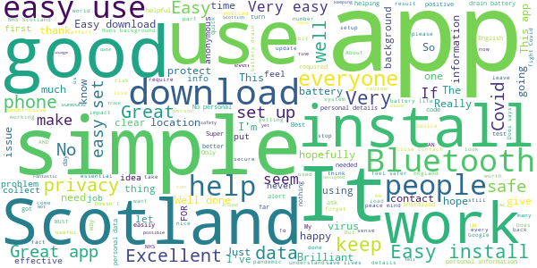
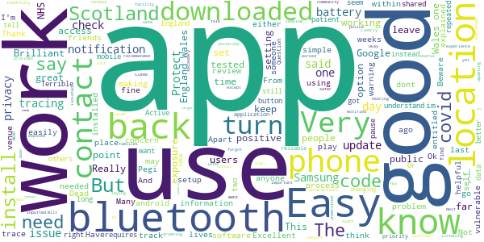
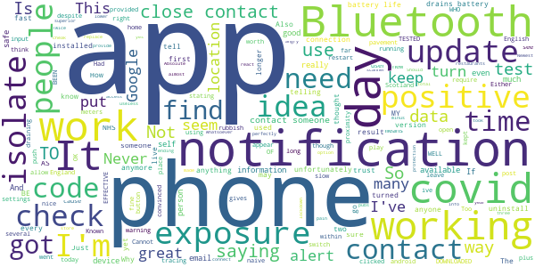
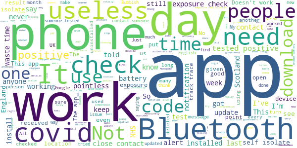

# Protect Scotland
App version ``1.2.2``

Analyzed with [covid-apps-observer](http://github.com/covid-apps-observer) project, version ``0.1``

## App overview
| | |
|-------------------------|-------------------------| 
| **Name**                                          | Protect Scotland |
| **Unique identifier** | gov.scot.covidtracker |
| **Link to Google Play** | [https://play.google.com/store/apps/details?id=gov.scot.covidtracker](https://play.google.com/store/apps/details?id=gov.scot.covidtracker) |
| **Summary**  | Help stop the spread of Covid-19 in Scotland by using the Protect Scotland app. |
| **Privacy policy** | [https://protect.scot/privacy-policy-app](https://protect.scot/privacy-policy-app) |
| **Latest version** | 1.2.2 |
| **Last update** | 2021-06-04 12:27:35 |
| **Recent changes** | Minor text updates |
| **Installs**  | 500,000+ |
| **Category** | Medical |
| **First release** | Sep 4, 2020 |
| **Size**  | 107M |
| **Supported Android version**  | 6.0 and up |

### Description
> Help Scotland keep the spread of coronavirus under control by downloading and using the free Protect Scotland app from NHS Scotland’s Test and Protect service. 
 Using the app is entirely voluntary.  When you use the app, you will be alerted if you have been in close contact with another app user who has tested positive for coronavirus. If you test positive and you enter the unique code sent to you into the app, it will anonymously warn other app users whom you have been in close contact with.
 Using Bluetooth, the app will search for other devices with the Protect Scotland app installed, which are within 2m of your phone. You don’t need to have a WiFi connection. The app uses a very small amount of your mobile phone data.  
 
Once you’ve downloaded the app, encourage your friends, family and colleagues to do so too. The more people who download and use the Protect Scotland app, the more likely we are to keep coronavirus under control. . The benefits of using the app are:

Speeds up the process of identifying and notifying people that have been at risk of catching coronavirus, particularly of unknown contacts
Slows the spread of the virus
Reduces the likelihood of further lockdowns
Helps protect the health service, your family and friends, yourself and the people of Scotland
 Ultimately, you can help to stop the spread of coronavirus in Scotland by downloading and using the Protect Scotland app.
 Privacy and Data
 The Protect Scotland app is designed to protect the privacy of all users. It doesn’t store or share any personally identifiable information, like your name or address. Nobody can track your location by using the app or tell who you are.
 You can remove the app from your device at any time, and all the data stored on your phone will be deleted.

### User interface
The developers of the app provide the following screenshots in the Google play store.
| | | |
|:-------------------------:|:-------------------------:|:-------------------------:|
 |   |   |   | 
 |   |  

## Development team
In the following we report the main information provided by the development team in the Google play store.

| | |
|-------------------------|-------------------------|
| **Developer**  | NHS Education for Scotland |
| **Website**  | [https://protect.scot/index.html](https://protect.scot/index.html) |
| **Email** | testandprotect@nhs.scot |
| **Physical address**  | [NHS Education for Scotland Knowledge Services 2 Central Quay 3rd Floor 89 Hydepark Street Glasgow G3 8BW ](https://www.google.com/maps/search/NHS%20Education%20for%20Scotland%20Knowledge%20Services%202%20Central%20Quay%203rd%20Floor%2089%20Hydepark%20Street%20Glasgow%20G3%208BW%20) (Google Maps) |
| **Other developed apps**  | [https://play.google.com/store/apps/developer?id=NHS+Education+for+Scotland](https://play.google.com/store/apps/developer?id=NHS+Education+for+Scotland) |

## Android support

| | |
|-------------------------|-------------------------|
| **Declared target Android version**  | Android10, version 10 (API level 29) |
| **Effective target Android version**  | Android10, version 10 (API level 29) |
| **Minimum supported Android version**  | Marshmallow, version 6.0 (API level 23) |
| **Maximum target Android version**  | - |

The larger the difference between the minimum and maximum supported Android versions, the better. A larger difference means a wider audience. For example, old phones have a very low Android version, so a high minimum supported Android version means that the app cannot be used by users with old phones, thus leading to accessibility problems. 

## Requested permissions

In the following we report the complete list of the permissions requested by the app. 

| **Permission** | **Protection level** | **Description** | 
|-------------------------|-------------------------|-------------------------|
 **android.permission ACCESS_NETWORK_STATE** | Normal | Allows applications to access information about networks. 
 **android.permission ACCESS_WIFI_STATE** | Normal | Allows applications to access information about Wi-Fi networks. 
 **android.permission BLUETOOTH** | Normal | Allows applications to connect to paired bluetooth devices. 
 **android.permission INTERNET** | Normal | Allows applications to open network sockets. 
 **android.permission RECEIVE_BOOT_COMPLETED** | Normal | Allows an application to receive the Intent.ACTION_BOOT_COMPLETED that is broadcast after the system finishes booting. 
 **android.permission VIBRATE** | Normal | Allows access to the vibrator. 

## Mentioned servers

| **Server** | **Registrant** | **Registrant country** | **Creation date** | 
|-------------------------|-------------------------|-------------------------|-------------------------|
 | android.com | Google LLC | :us: US | 1997-06-23 04:00:00 |
 | google.com | Google LLC | :us: US | 1997-09-15 04:00:00 |
 | expo.io | See PrivacyGuardian.org | :us: US | 2011-05-01 21:26:50 |

## Security analysis 

Below we report the main security warnings raised by our execution of the [Androwarn](https://github.com/maaaaz/androwarn) security analysis tool.

**Telephony identifiers leakage**
> - This application reads the numeric name (MCC+MNC) of current registered operator 
> - This application reads the operator name 

**Connection interfaces exfiltration**
> - This application reads details about the currently active data network 
> - This application tries to find out if the currently active data network is metered 

**Suspicious connection establishment**
> - This application opens a Socket and connects it to the remote address ' returned no addresses for  ; port is out of range' on the 'N/A' port  
> - This application opens a Socket and connects it to the remote address '' on the 'N/A' port  
> - This application opens a Socket and connects it to the remote address 'Ljava/lang/StringBuilder;->toString()Ljava/lang/String;' on the 'N/A' port  
> - This application opens a Socket and connects it to the remote address 'Ljava/net/Proxy;->type()Ljava/net/Proxy$Type;' on the 'N/A' port  
> - This application opens a Socket and connects it to the remote address 'timeout' on the 'N/A' port  

**Pim data leakage**
> - This application accesses data stored in the clipboard 

**Code execution**
> - This application loads a native library 
> - This application executes a UNIX command 

## User ratings and reviews

Below we provide information about how end users are reacting to the app in terms of ratings and reviews in the Google Play store.

### Ratings

The Protect Scotland app has been installed by more than **500000** times. At this time, **3040** rated the app and its average score is **3.7922077**. Below we show the distribution of the ratings across the usual star-based rating of Google Play

:star::star::star::star::star:: 1738

:star::star::star::star:: 286

:star::star::star:: 266

:star::star:: 148

:star:: 602

### Reviews 

#### 5-star reviews

> Always seems to work  :date: __2021-07-09 19:05:14__

> Very easy if you have all info ready.  :date: __2021-07-05 16:48:26__

> Brilliant, makes everyone feel safe  :date: __2021-07-04 12:30:41__

> After reading some of these comments I wont bother installing this app seems like they tell you it won't track location so why does it automatically turn it on it only states Bluetooth be on . My location is off permanently and at the start of the pandemic I did install the app and boom location automatically turned on . Having both location and Bluetooth switched on leaves you more at risk of people able to steal data and bank information and anything else personal to you . Don't install this  :date: __2021-06-22 19:34:40__

> a good company with personal information.  :date: __2021-06-08 17:01:15__

> Excellent  :date: __2021-05-30 12:22:39__

> No issues. Runs in the background. My Bluetooth always on for car anyway. Its never going to be perfectly accurate but it's one tool not a complete solution.  :date: __2021-05-22 14:11:17__

> Clever, simple app, it helps fight Covid while protecting your privacy  :date: __2021-05-19 08:23:31__

> A bit of a pain to drain battery keeping bluetooth/location on constantly, but a small price to pay for public health & safety!  :date: __2021-05-17 06:42:30__

> but yea m  :date: __2021-05-13 02:04:43__

#### 4-star reviews

> A,8,  :date: __2021-07-03 14:59:12__

> Not good  :date: __2021-06-12 12:34:36__

> Good app  :date: __2021-03-29 22:40:54__

> Good helpful app  :date: __2021-02-23 17:24:21__

> Very good.  :date: __2021-02-22 14:00:38__

> The problem I have is police access but I'm using as the place is drowning in COVID19  :date: __2021-02-21 21:56:07__

> Good app but think you need everybody to sign up. Next door neibour had covid 19 but didnt know until a few weeks later.  :date: __2021-02-20 21:24:16__

> Had no interactions  :date: __2021-02-17 14:29:32__

> Notified  :date: __2021-02-14 15:57:22__

> Useful  :date: __2021-02-12 16:43:23__

#### 3-star reviews

> OK if it works  :date: __2021-06-29 09:36:13__

> App appeared fine until a few days ago - now appears to be perpetually hung on 'checking exposure keys'  :date: __2021-06-01 22:19:34__

> App appears Okay on the Samsung TvPhone  :date: __2021-05-23 06:18:35__

> Not sure if this app actually does anything. Only seems to do a check when I open it. App can go days with no checking for contacts according to the fingerprint checking Google summary page.  :date: __2021-04-24 18:55:23__

> As people from other area's in the UK visit Scotland I don't believe the app syncs with other apps from other locations in the UK but only Scotland. If this is the case then it won't work unless someone in Scotland develops covid and others have this same version.  :date: __2021-04-18 14:37:32__

> Huawei 30pro. It doesn't recognize that my Bluetooth is on and so does not activate.  :date: __2021-04-07 11:02:15__

> This might just be the most effective software to be Bluetooth turned on all the time to enable almost everyone in Scotland to track&trace possible SARS/covid carriers,..  :date: __2021-04-04 11:33:48__

> Early version seemed fine, sat happily in background, but now app complains when I don't have Bluetooth or location on at home.  :date: __2021-03-25 11:07:01__

> Couldn't add my positive code to the app.  :date: __2021-03-22 01:02:01__

> Of questionable usability. Stay at home, and this app will still keep nagging you to switch on location - presumably the vision of the Covid hordes invading your dwelling makes spending battery power on satellite navigation worthwhile. Now, I remember The Omega Man from the first time around (1971 film), but did the designer of this really do so too? 🤔 I'd rather not be nagged at home to turn this on, thanks.  :date: __2021-03-19 19:13:23__

#### 2-star reviews

> Should have a code scanner on app for cheak in to pubs restaurants like the English app has  :date: __2021-07-09 12:37:02__

> Not working rubbish  :date: __2021-07-02 17:52:44__

> Keeps telling me a new version is available - go to app store, no update option, just uninstall or open  :date: __2021-06-06 13:29:11__

> Absolute rubbish no information whatsoever NHS app for England far superior  :date: __2021-05-16 13:59:20__

> Newest version no longer available for my phone. This means lower protection as lockdown is ending. very angry at this.  :date: __2021-05-01 01:13:48__

> Too slow to react. The app is only as good as the data it has to work with. I got a notification I should isolate for -6 days (yes minus 6 days) it took that long for the data to be made available to the app...  :date: __2021-04-13 11:47:25__

> It doesn't provide any live longer Information.  :date: __2021-04-06 11:13:28__

> Twice in three days I was contacted to isolate for 10 days despite never being in anyone's company inside or out within two meters I haven't even been near my own family. If passing someone on a pavement within seconds triggers the app for you to isolate then what's the point? They sell coffee at a door where people congregate on a pavement less than two meters to get past?  :date: __2021-03-13 10:03:34__

> Gave me a notification saying I had been in contact with someone with covid and had to self isolate....10 days AFTER I had been in contact with them and I only had to isolate for 1 day?? Not convinced it works or it is very slow to update you.  :date: __2021-02-19 14:05:01__

> When I first got the App I thought it was great to have it but now I am convinced it doesn't work giving people false confidence they've not been in contact with Covid, I have been in close contact with covid infected people yet never had notification. I think its flawed by requiring people to self input if they have it. Yet reading other reviews such as people in same household both entering details and none being informed that they've been in close contact? Raises suspension app authenticity  :date: __2021-02-14 10:44:35__

#### 1-star reviews

> Very limited use for those us travel and work in England. Why can't Scottish politicians accept that Covid does not recognise borders. The NHS Covid 19 app has far superior functionality and information. Scottish public services and politicians are blinded by their anti-anglo ideals and are putting the Scottish public at risk. Very disappointed, frustrated and considering a move south of the border.  :date: __2021-07-10 12:24:16__

> Not one exposure check in the last fortnight, used to get four or five a day.  :date: __2021-07-10 09:37:36__

> Not a chance in hell would I install this...I wear a mask and keep my hands clean..been using public transport through out the pandemic and have NVR tested positive...it's a fkn farce.  :date: __2021-07-09 19:03:37__

> Not compatible with English system so complete waste of time using it while on holiday  :date: __2021-07-09 18:37:42__

> Total garbage. Apart from the fact that technically the app doesn't work that well, it clearly expects me to walk around all day with an 'open' phone. Surely a wet dream for bureaucracy. It's never going to happen.  :date: __2021-07-09 13:43:45__

> Dosent even work, I was sitting next someone who done 2 rapid tests that was then registeredb on the app and nothing all day. No alert saying that the person right next to you positive  :date: __2021-07-08 00:13:12__

> Think this is an important app & helps us all do our bit, but considering the importance of this app would have been better if it had been designed to be able to be stored on an SD card for people who mobiles don't have a lot of memory. In my case had to delete due to this.  :date: __2021-07-05 17:25:24__

> Just read news article about people in Scotland not using this App anymore. I've been trying to get it to work again for months after it stopped working. Keeps telling me that it's unable to check for exposure. Bluetooth on, all settings correct. Uninstalled and reinstalled several times. Very frustrating as I really want to use this app.  :date: __2021-07-04 19:49:39__

> Absolute rubbish, was sitting with both my friends when they got there positive emails. Things never went off yet. Pure joke. Just to see if it was working pure rubbed it across my mates phone earlier to see what would happen and not a thing. Apps a pure waste of time.  :date: __2021-07-04 13:13:51__

> Nonsense  :date: __2021-07-02 17:53:29__

