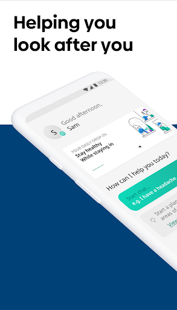
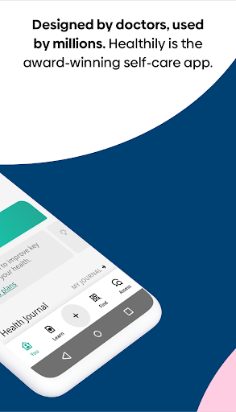
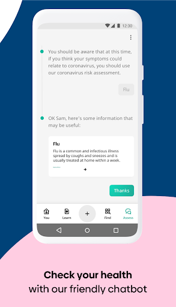
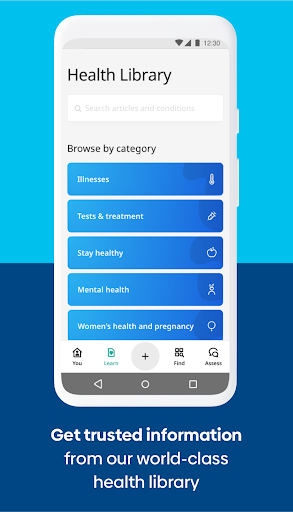
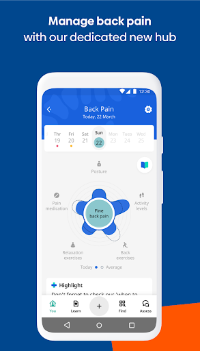
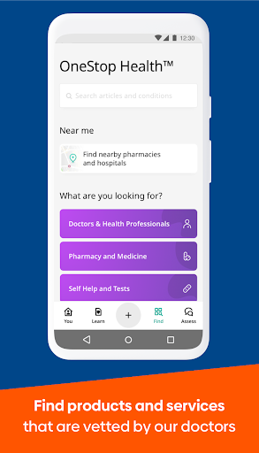
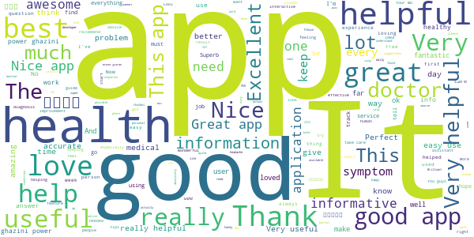

# Healthily: Self-Care & Health Journal
App version ``4.01.08``

Analyzed with [covid-apps-observer](http://github.com/covid-apps-observer) project, version ``0.1``

## App overview
| | |
|-------------------------|-------------------------| 
| **Name**&nbsp;&nbsp;&nbsp;&nbsp;&nbsp;&nbsp;&nbsp;&nbsp;&nbsp;&nbsp;&nbsp;&nbsp;&nbsp;&nbsp;&nbsp;&nbsp;&nbsp;&nbsp;&nbsp;&nbsp;&nbsp;&nbsp;&nbsp;&nbsp;&nbsp;&nbsp;&nbsp;&nbsp;&nbsp;&nbsp;&nbsp;&nbsp;&nbsp;&nbsp;&nbsp;&nbsp;&nbsp;&nbsp;&nbsp;&nbsp;  | Healthily: Self-Care & Health Journal |
| **Unique identifier** | md.your |
| **Link to Google Play** | [https://play.google.com/store/apps/details?id=md.your](https://play.google.com/store/apps/details?id=md.your) |
| **Summary**  | Manage your health, check your symptoms and track your progress |
| **Privacy policy** | [https://www.your.md/privacy](https://www.your.md/privacy) |
| **Latest version** | 4.01.08 |
| **Last update** | 2020-12-15 20:12:14 |
| **Recent changes** | In this release we’ve tuned up some tech and squashed some bugs.   Have feedback? We&#39;d love to hear it. Email us at support@livehealthily.com and we&#39;ll get back to you. |
| **Installs**  | 1,000,000+ |
| **Category** | Health & Fitness |
| **First release** | Apr 28, 2014 |
| **Size**  | 17M |
| **Supported Android version**  | 5.0 and up |

### Description
> Designed by doctors, used by millions, Healthily is the free, award-winning self-care app that helps you look after you every day. Manage 100s of conditions, check your symptoms, track your progress and much more.
 From deciding when to see a doctor, to making small changes to feel better every day, Healthily brings you the tools you need for self-care, wherever you are.
 Talk to our friendly chatbot about your symptoms, browse our world-class health library and use our journal and trackers to look after your health with confidence.
 <b>From coronavirus to mental health, we’ve got you covered</b>
 We help you find self-care information on a huge range of health conditions including:
 • Coronavirus (Covid-19)
 • Cold and flu
 • Sore throat
 • Headaches
 • Back pain
 • Sexual health
 • Sleep and tiredness
 • Anxiety and depression
 <b>How to use Healthily</b>
 Understand your health, take action and build healthier habits, step by step.
 ASSESS: Talk to our friendly chatbot to check your health.
 LEARN: Get trusted information from our world-class health library.
 TRACK: See what’s working with our health journal and trackers. 
 FIND: Find vetted products and services in our OneStop Health™ marketplace.
 DISCUSS: Connect with people with similar experiences.
 MANAGE: Look after specific issues with our dedicated hubs.
 We bring together everything you need for self-care, during the coronavirus (Covid-19) outbreak and beyond.
 <b>Here’s what people are saying about Healthily</b>
 <i>“This is the best app I ever installed”</i> - @Emanuel Tănasă, Google Play
 <i>“Very accurate and always on point with information”</i> - @Jesseina Torres, Google Play
 <i>“This is like carrying a personal doctor in your pocket”</i> - @Rising Sun, Google Play
 <i>“The best health app so far”</i> - @Likando Ilishebo, Google Play
 <i>“Love this app and especially the journal”</i> - @Sondre Eftedal Blom, Google Play
 Join millions of people already using Healthily, the self-care app.
 <b>Your safety is our top priority</b>
 As your self-care app, we take your security seriously. Our chatbot, health tracker and journal have the ePrivacy seal of approval, so you can be confident your data is private and protected.
 All our health and self-care content is reviewed and approved by our team of in-house doctors. Our Clinical Advisory Board, made up of world-renowned medical experts, supervise this process.
 Healthily is classified as a Class I Medical Device registered with the Medicines and Healthcare products Regulatory Agency (MHRA) and is CE accredited, which means that our services comply with European Union Medical Device legislation.
 <b>(*) SAFE USE</b>
 If you’re generally healthy and don’t suffer from any chronic or rare medical conditions, we can help identify less serious conditions that you can manage yourself and guide you on whether to see a doctor. Healthily cannot consider all the information a doctor can and is not able to identify all conditions or symptoms. Healthily does not provide diagnosis or medical advice.
 Healthily cannot be used for information about babies, children aged 15 and younger, pregnant women, people on immunosuppressive treatment, and people with complex or long-term conditions.
 For more information read <i><a href="https://www.google.com/url?q=https%3A%2F%2Fwww.your.md%2Flegal%2Fterms&sa=D&sntz=1&usg=AFQjCNHMtLbfQYmnPJ17jtXb5y9C0WeuCg">Healthily Terms of Service and </a><a href="https://www.google.com/url?q=https%3A%2F%2Fwww.your.md%2Flegal%2Fsafe-use&sa=D&sntz=1&usg=AFQjCNF_NSceUv2TAvAxVm8NddwVB8BPVw">Safe Use Instructions</a></i>.

### User interface
The developers of the app provide the following screenshots in the Google play store.
| | | |
|:-------------------------:|:-------------------------:|:-------------------------:|
 |   |   |   | 
 |   |   |   | 
 |  

## Development team
In the following we report the main information provided by the development team in the Google play store.

| | |
|-------------------------|-------------------------|
| **Developer**  | Your.MD |
| **Website**  | [https://www.your.md](https://www.your.md) |
| **Email** | feedback@your.md |
| **Physical address**  | [5th Floor, 43 Whitfield Street London W1T 4HD](https://www.google.com/maps/search/5th%20Floor,%2043%20Whitfield%20Street%20London%20W1T%204HD) (Google Maps) |
| **Other developed apps**  | [https://play.google.com/store/apps/developer?id=Your.MD](https://play.google.com/store/apps/developer?id=Your.MD) |

## Android support

| | |
|-------------------------|-------------------------|
| **Declared target Android version**  | Android10, version 10 (API level 29) |
| **Effective target Android version**  | Android10, version 10 (API level 29) |
| **Minimum supported Android version**  | Lollipop, version 5.0 (API level 21) |
| **Maximum target Android version**  | - |

The larger the difference between the minimum and maximum supported Android versions, the better. A larger difference means a wider audience. For example, old phones have a very low Android version, so a high minimum supported Android version means that the app cannot be used by users with old phones, thus leading to accessibility problems. 

## Requested permissions

In the following we report the complete list of the permissions requested by the app. 

| **Permission** | **Protection level** | **Description** | 
|-------------------------|-------------------------|-------------------------|
 **android.permission ACCESS_FINE_LOCATION** | :warning:**Dangerous** | Allows an app to access precise location. 
 **android.permission ACCESS_NETWORK_STATE** | Normal | Allows applications to access information about networks. 
 **android.permission ACCESS_WIFI_STATE** | Normal | Allows applications to access information about Wi-Fi networks. 
 **android.permission BODY_SENSORS** | :warning:**Dangerous** | Allows an application to access data from sensors that the user uses to measure what is happening inside his/her body, such as heart rate. 
 **android.permission FOREGROUND_SERVICE** | Normal | Allows a regular application to use Service.startForeground. 
 **android.permission INTERNET** | Normal | Allows applications to open network sockets. 
 **android.permission READ_PROFILE** | - | - 
 **android.permission RECEIVE_BOOT_COMPLETED** | Normal | Allows an application to receive the Intent.ACTION_BOOT_COMPLETED that is broadcast after the system finishes booting. 
 **android.permission USE_CREDENTIALS** | - | - 
 **android.permission VIBRATE** | Normal | Allows access to the vibrator. 
 **android.permission WAKE_LOCK** | Normal | Allows using PowerManager WakeLocks to keep processor from sleeping or screen from dimming. 
 **android.permission WRITE_EXTERNAL_STORAGE** | :warning:**Dangerous** | Allows an application to write to external storage. 
 **com.android.vending BILLING** | - | - 
 **com.google.android.c2dm.permission RECEIVE** | - | - 
 **com.google.android.finsky.permission BIND_GET_INSTALL_REFERRER_SERVICE** | - | - 

## Mentioned servers

| **Server** | **Registrant** | **Registrant country** | **Creation date** | 
|-------------------------|-------------------------|-------------------------|-------------------------|
 | googlesyndication.com | Google LLC | :us: US | 2003-01-21 06:17:24 |
 | googleapis.com | Google LLC | :us: US | 2005-01-25 17:52:26 |
 | urbanairship.com | DNStination Inc. | :us: US | 2009-04-14 06:34:46 |
 | asnapieu.com | DNStination Inc. | :us: US | 2019-05-15 21:27:07 |
 | android.com | Google LLC | :us: US | 1997-06-23 04:00:00 |
 | apache.org | The Apache Software Foundation | :us: US | 1995-04-11 04:00:00 |
 | github.com | GitHub, Inc. | :us: US | 2007-10-09 18:20:50 |
 | github.io | GitHub, Inc. | :us: US | 2013-03-08 19:12:48 |
 | facebook.com | Facebook, Inc. | :us: US | 1997-03-29 05:00:00 |
 | github.io | GitHub, Inc. | :us: US | 2013-03-08 19:12:48 |
 | amplitude.com | Amplitude | :us: US | 1996-05-09 04:00:00 |
 | gstatic.com | Google LLC | :us: US | 2008-02-11 15:31:25 |
 | google.com | Google LLC | :us: US | 1997-09-15 04:00:00 |
 | googleapis.com | Google LLC | :us: US | 2005-01-25 17:52:26 |
 | googleadservices.com | Google LLC | :us: US | 2003-06-19 16:34:53 |
 | app-measurement.com | Google LLC | :us: US | 2015-06-19 20:13:31 |
 | crashlytics.com | Google LLC | :us: US | 2011-01-21 15:30:40 |
 | googleapis.com | Google LLC | :us: US | 2005-01-25 17:52:26 |
 | eprivacy.eu | - | - | - |
 | twitter.com | Twitter, Inc. | :us: US | 2000-01-21 16:28:17 |
 | linkedin.com | LinkedIn Corporation | :us: US | 2002-11-02 15:38:11 |
 | instagram.com | Instagram LLC | :us: US | 2004-06-04 13:37:18 |
 | livehealthily.com | - | :us: US | 2003-11-02 19:28:09 |

## Security analysis 

Below we report the main security warnings raised by our execution of the [Androwarn](https://github.com/maaaaz/androwarn) security analysis tool.

**Telephony identifiers leakage**
> - This application reads the ISO country code equivalent of the current registered operator's MCC (Mobile Country Code) 
> - This application reads the MCC+MNC of the provider of the SIM 
> - This application reads the Service Provider Name (SPN) 
> - This application reads the device phone type value 
> - This application reads the numeric name (MCC+MNC) of current registered operator 
> - This application reads the operator name 

**Location lookup**
> - This application reads location information from all available providers (WiFi, GPS etc.) 

**Connection interfaces exfiltration**
> - This application reads details about the currently active data network 
> - This application tries to find out if the currently active data network is metered 

**Suspicious connection establishment**
> - This application opens a Socket and connects it to the remote address '; port is out of range' on the 'N/A' port  
> - This application opens a Socket and connects it to the remote address 'Ljava/net/Proxy;->type()Ljava/net/Proxy$Type;' on the 'N/A' port  
> - This application opens a Socket and connects it to the remote address 'Lm0/c/c/a/a;->t(Ljava/lang/String;)Ljava/lang/StringBuilder;' on the 'N/A' port  
> - This application opens a Socket and connects it to the remote address 'timeout' on the 'N/A' port  

**Code execution**
> - This application loads a native library 
> - This application loads a native library: 'bypass' 
> - This application loads a native library: 'tool-checker' 
> - This application executes a UNIX command 
> - This application executes a UNIX command containing this argument: 'getprop' 
> - This application executes a UNIX command containing this argument: 'mount' 

## User ratings and reviews

Below we provide information about how end users are reacting to the app in terms of ratings and reviews in the Google Play store.

### Ratings

The Healthily: Self-Care & Health Journal app has been installed by more than **1000000** times. At this time, **13944** rated the app and its average score is **4.105301**. Below we show the distribution of the ratings across the usual star-based rating of Google Play

:star::star::star::star::star:: 8442

:star::star::star::star:: 2207

:star::star::star:: 1228

:star::star:: 459

:star:: 1608

### Reviews 

#### 5-star reviews

> Prayers for healing  :date: __2021-01-08 15:05:08__

> Gives me healthy tips evrry single day to remind me to take care of myself.  :date: __2021-01-05 14:57:39__

> nice Application  :date: __2021-01-04 13:59:25__

> Very useful used few times a week.  :date: __2021-01-01 12:43:33__

> makes tracking my health much easier and has built in symptom checker too!  :date: __2020-12-22 10:18:16__

> MU5 Maximum  :date: __2020-12-17 05:25:18__

> Good  :date: __2020-12-15 19:41:38__

> ok so far  :date: __2020-12-15 16:40:27__

> great app for health .and .very education  :date: __2020-12-15 09:21:54__

> I'm loving it. I loved the revamped UI design. Seems like I won't be needing another health app. Keep it up!  :date: __2020-12-11 12:04:26__

#### 4-star reviews

> it very nice to have a Healthy app to improve body works  :date: __2020-11-21 01:08:24__

> Not used yet  :date: __2020-11-14 13:33:05__

> I really like it but really wish you could have dark mode feature please and thank you!!!!  :date: __2020-11-10 21:28:14__

> Interesting  :date: __2020-11-08 22:26:29__

> nice app  :date: __2020-11-08 15:30:38__

> I feel pain and weak today. thinking of going to the E.R. the past few days.  :date: __2020-10-27 03:39:59__

> good app  :date: __2020-10-21 15:36:15__

> Good experience  :date: __2020-09-24 02:06:25__

> It is good for keeping notes about your health and other information  :date: __2020-09-21 01:45:58__

> Reliable  :date: __2020-08-01 21:24:53__

#### 3-star reviews

> it's helpful  :date: __2020-12-18 09:23:55__

> 👍🏿  :date: __2020-12-14 15:49:12__

> cool  :date: __2020-11-27 02:36:18__

> Reasonable  :date: __2020-10-12 17:07:49__

> I have a headache today and app sent me almost strait to the doctor as a serious issue. Not sure one of headache is that serious and reason might be any. Also I would welcome dark version (theme) of the app. Headache and white screen is not good.  :date: __2020-10-09 20:36:09__

> First impression fairly easy to use, me being a 59 year old tec no fobe  :date: __2020-10-03 15:30:49__

> Most third class 👎👎👎  :date: __2020-09-30 13:58:53__

> Can't decide right away_need a little more time working on this app to get a hang of how it works  :date: __2020-09-30 12:12:37__

> Hello! I can't open the app after updating, it just shows blank page and then closes. I'm still on android version 5.1 if it helps. I really like this app as a health checker, hope it gets a fix soon.  :date: __2020-09-12 21:18:27__

> The chat with someone part sucks but rest is interesting  :date: __2020-09-05 08:41:55__

#### 2-star reviews

> Just asked how i felt today, i said awful and the reply was.....Awesome? Bye bye  :date: __2020-10-12 01:00:36__

> Didn't seem bad, but I'm not able to use it because I'm currently pregnant. There's no options for pregnancy or post delivery options.  :date: __2020-10-10 23:31:28__

> The how to use the app instructions aren't clear enough for me.  :date: __2020-10-07 05:17:05__

> Error message comes up when I try to sign up so I can't use the app.....  :date: __2020-09-03 12:54:01__

> I has always been a great app. But after update it keeps crashing ..Please Fix this.  :date: __2020-07-23 03:04:41__

> Keeps crashing. Won't open  :date: __2020-06-28 00:43:57__

> Keep getting and error message when trying to go to journal.  :date: __2020-06-27 12:37:51__

> Not what I expected didnt find it very helpful for me  :date: __2020-04-01 08:10:43__

> I tried to open the app and when it asked for my birth year I put 2006,it said the app was only for 16-100 but I dont get why,people under the age of 16 might need help too this app is limiting chances of people the age of 15 and under to get help,apart from this I think the app is quite good for those over 16 as it can help them with things they didnt know they could use help with or give them more help. In conclusion good app but improve on the age situation please as I want to try it.  :date: __2019-12-30 23:59:09__

> Pl advice doctors advice which u give here from which country  :date: __2019-09-15 18:35:53__

#### 1-star reviews

> never downloaded this. no clue how it ended up in my app list  :date: __2020-12-30 20:13:04__

> Great app  :date: __2020-11-13 07:47:00__

> Notes don't save. It only has a back button which does not save the note.  :date: __2020-10-07 16:26:38__

> I have this app downloaded on my phone, but I can't open it What's wrong.  :date: __2020-10-04 04:03:07__

> Not useful to me  :date: __2020-10-03 14:29:55__

> Malware possibilities  :date: __2020-09-22 01:13:09__

> Inappropriate question (unrelated to headaches). Uninstalled app  :date: __2020-09-19 21:23:47__

> Unable to register with email address. Keep on receiving error message, even after uninstall and reinstall.  :date: __2020-09-16 18:03:27__

> Not working , dead app. Airtel provider  :date: __2020-08-07 12:26:46__

> Acidity? You're a doctor app and you don't know what is acidity?  :date: __2020-08-03 19:06:33__

