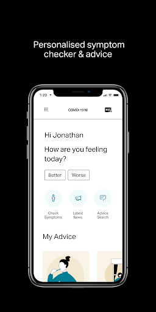
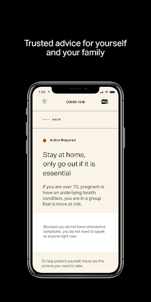
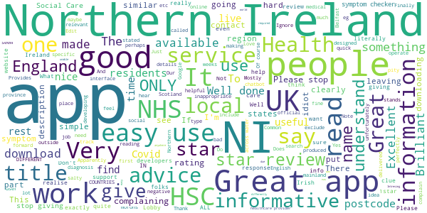
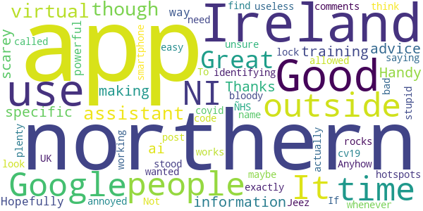
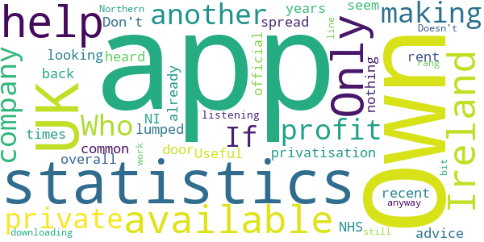
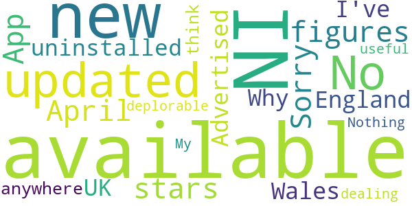
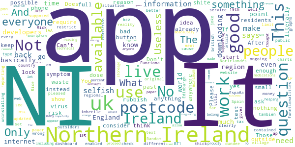

# COVID-19 NI
App version ``1.5``

Analyzed with [covid-apps-observer](http://github.com/covid-apps-observer) project, version ``0.1``

## App overview
| | |
|-------------------------|-------------------------| 
| **Name**&nbsp;&nbsp;&nbsp;&nbsp;&nbsp;&nbsp;&nbsp;&nbsp;&nbsp;&nbsp;&nbsp;&nbsp;&nbsp;&nbsp;&nbsp;&nbsp;&nbsp;&nbsp;&nbsp;&nbsp;&nbsp;&nbsp;&nbsp;&nbsp;&nbsp;&nbsp;&nbsp;&nbsp;&nbsp;&nbsp;&nbsp;&nbsp;&nbsp;&nbsp;&nbsp;&nbsp;&nbsp;&nbsp;&nbsp;&nbsp;  | COVID-19 NI |
| **Unique identifier** | net.hscni.covid19ni |
| **Link to Google Play** | [https://play.google.com/store/apps/details?id=net.hscni.covid19ni](https://play.google.com/store/apps/details?id=net.hscni.covid19ni) |
| **Summary**  | COVID-19 NI is a coronavirus symptom checker and provides the latest advice. |
| **Privacy policy** | [https://www.health-ni.gov.uk/publications/covid-19-app-privacy-notice](https://www.health-ni.gov.uk/publications/covid-19-app-privacy-notice) |
| **Latest version** | 1.5 |
| **Last update** | 2020-04-30 22:43:22 |
| **Recent changes** | - Improved dashboard navigation. - Updated self-isolation and leaving isolation guides. - Updated symptom checker advice pages, including an isolation timer for those whose symptoms suggest they have coronavirus. - Live latest news feed. |
| **Installs**  | 50,000+ |
| **Category** | Medical |
| **First release** | Mar 24, 2020 |
| **Size**  | 51M |
| **Supported Android version**  | 4.2 and up |

### Description
> App from Health & Social Care (HSC) Northern Ireland 
 Owned and run by Digital Health and Care NI (DHCNI) on behalf of HSC, the Public Health Agency, and the Department of Health.
 The app is designed to help the public in Northern Ireland keep up to date with the latest advice on the Covid-19 pandemic, helping you to:
 ·         Decide if you have the symptoms of coronavirus infection
 ·         Depending on the severity of your illness, know how to cope and what to do
 ·         Decide if you need to get clinical advice and how to access it
 ·         Give advice for vulnerable members of the public
 ·         Provide links to trusted information resources
 ·         Direct you to be able to get an isolation note if you have to self-isolate
 ·         Provide an advice search function of FAQs that will be developed and updated regularly 
 The app will also be used to notify users of important updates with notifications. The features outlined above are in the initial release, with future possibilities like ensuring app users get access to the most up to date headlines and changes in the advice and guidance, and potentially helping people who are isolating at home to provide information to the HSC and Public Health Agency about your situation. Things are moving quickly with the pandemic so you may need to come back to refresh your app regularly. We’ll let you know when this is necessary.
  
 Who can use this app
 The app is available for use in Northern Ireland to all individuals who are currently residing in Northern Ireland.
 You can use this app to get advice for yourself, or on behalf of someone else that you would like to help.
 Data security
 The app does not collect any personally identifiable information.
 We will collect information related to the postcode and age of the user to help us track the impact of Covid-19 in Northern Ireland.
 This will help us to plan services and ensure that resources are directed to the areas of greatest need.
 Updates
 As coronavirus infection spreads in Northern Ireland and the advice changes on how best we can respond, we will notify you of important changes and will update the app to provide you with the most up to date support available.

### User interface
The developers of the app provide the following screenshots in the Google play store.
| | | |
|:-------------------------:|:-------------------------:|:-------------------------:|
 |   |   |   | 
 |  

## Development team
In the following we report the main information provided by the development team in the Google play store.

| | |
|-------------------------|-------------------------|
| **Developer**  | Health & Social Care Northern Ireland |
| **Website**  | [https://www.publichealth.hscni.net/](https://www.publichealth.hscni.net/) |
| **Email** | hscdhcni@gmail.com |
| **Physical address**  | - |
| **Other developed apps**  | [https://play.google.com/store/apps/developer?id=Health+%26+Social+Care+Northern+Ireland](https://play.google.com/store/apps/developer?id=Health+%26+Social+Care+Northern+Ireland) |

## Android support

| | |
|-------------------------|-------------------------|
| **Declared target Android version**  | Android10, version 10 (API level 29) |
| **Effective target Android version**  | Android10, version 10 (API level 29) |
| **Minimum supported Android version**  | Jelly Bean, version 4.2.x (API level 17) |
| **Maximum target Android version**  | - |

The larger the difference between the minimum and maximum supported Android versions, the better. A larger difference means a wider audience. For example, old phones have a very low Android version, so a high minimum supported Android version means that the app cannot be used by users with old phones, thus leading to accessibility problems. 

## Requested permissions

In the following we report the complete list of the permissions requested by the app. 

| **Permission** | **Protection level** | **Description** | 
|-------------------------|-------------------------|-------------------------|
 **android.permission ACCESS_NETWORK_STATE** | Normal | Allows applications to access information about networks. 
 **android.permission ACCESS_WIFI_STATE** | Normal | Allows applications to access information about Wi-Fi networks. 
 **android.permission INTERNET** | Normal | Allows applications to open network sockets. 
 **android.permission WAKE_LOCK** | Normal | Allows using PowerManager WakeLocks to keep processor from sleeping or screen from dimming. 
 **com.google.android.c2dm.permission RECEIVE** | - | - 
 **net.hscni.covid19ni.permission C2D_MESSAGE** | - | - 

## Mentioned servers

| **Server** | **Registrant** | **Registrant country** | **Creation date** | 
|-------------------------|-------------------------|-------------------------|-------------------------|
 | google.com | Google LLC | :us: US | 1997-09-15 04:00:00 |
 | w3.org | W3C | :us: US | 1994-07-06 04:00:00 |
 | microsoft.com | Microsoft Corporation | :us: US | 1991-05-02 04:00:00 |
 | googleapis.com | Google LLC | :us: US | 2005-01-25 17:52:26 |

## Security analysis 

Below we report the main security warnings raised by our execution of the [Androwarn](https://github.com/maaaaz/androwarn) security analysis tool.

**Telephony identifiers leakage**
> - This application reads the ISO country code equivalent of the current registered operator's MCC (Mobile Country Code) 
> - This application reads the numeric name (MCC+MNC) of current registered operator 
> - This application reads the operator name 

**Connection interfaces exfiltration**
> - This application reads details about the currently active data network 

**Code execution**
> - This application loads a native library: 'monodroid' 
> - This application loads a native library: 'monosgen-2.0' 
> - This application loads a native library: 'xamarin-app' 
> - This application loads a native library: 'xamarin-debug-app-helper' 

## User ratings and reviews

Below we provide information about how end users are reacting to the app in terms of ratings and reviews in the Google Play store.

### Ratings

The COVID-19 NI app has been installed by more than **50000** times. At this time, **248** rated the app and its average score is **3.67**. Below we show the distribution of the ratings across the usual star-based rating of Google Play

:star::star::star::star::star:: 141

:star::star::star::star:: 17

:star::star::star:: 17

:star::star:: 9

:star:: 62

### Reviews 

#### 5-star reviews

> Very good  :date: __2020-05-08 18:22:42__

> Intresing read about covid 19  :date: __2020-05-02 15:58:29__

> Very good feels like I can really see what's going on  :date: __2020-05-02 00:31:11__

> Great app for the people in N. Ireland  :date: __2020-05-01 11:34:34__

> I'm in England and it works just fine! Great App!!  :date: __2020-04-26 10:15:16__

> Was good great apps  :date: __2020-04-20 16:55:30__

> Great app for people in NI (as stated in title), includes symptoms, contact details and advice for people in Northern Ireland. Our services operate differently than those in the UK so don't be an idiot and download if you're anywhere else in the world, it's not going to work for you.  :date: __2020-04-20 10:43:39__

> Great app. Has bad reviews due to people being unable to read, it quite clearly says NI in the apps name.  :date: __2020-04-20 08:08:20__

> Brilliant app. Does exactly what is required and is easy to use. Thank you for your hard work. It's a shame a lot of the people reviewing the app do not have the basic level of intelligence to realise it's for people here in northern Ireland so they can track our localised cases. I can only assume these are the same people who don't social distance and burn 5g phone masts. App developers have done a top job.  :date: __2020-04-20 06:15:43__

> App works fine. Mostly putting this here for the morons that don't understand it's for NI only, mostly people in England who don't understand how borders work.  :date: __2020-04-20 00:29:52__

#### 4-star reviews

> Good app  :date: __2020-05-06 23:22:23__

> Great app, though the virtual assistant could use some more specific information / ai training. Thanks for making this.  :date: __2020-04-02 10:48:28__

> Handy advice in scarey times  :date: __2020-04-01 21:27:09__

> Hopefully this could be a very powerful way of identifying cv19 hotspots.  :date: __2020-03-31 20:18:01__

> Not bad. To all the people saying its useless as it only works in Northern Ireland, just what exactly do you think the NI in the bloody name stood for? If you're that stupid maybe you shouldn't be allowed a smartphone - Jeez! 🙄  :date: __2020-03-30 14:46:56__

> It's a good app, unsure why the comments are being so annoyed about it not working outside of northern ireland whenever the app is called covid 19 ni... Anyhow if any of the people actually wanted to use the app outside the UK all they would need to do is look on Google for a post code from northern Ireland which is easy to find and since we're all on lock down then you all have plenty of time to Google it.  :date: __2020-03-30 10:24:28__

> ÑHS rocks  :date: __2020-03-30 09:25:57__

#### 3-star reviews

> Who owns this App is it a private profit making company? If so is this another privatisation by the back door which is all too common with the NHS overall in recent years Own it Don't rent it!  :date: __2020-05-06 15:23:14__

> I was looking for statistics on the spread in NI as we are lumped in with the UK in official statistics, this app doesn't seem to have that. Useful advice but nothing I haven't heard 1000 times already - those who aren't listening won't be downloading the app anyway.  :date: __2020-04-11 15:32:23__

> N/A  :date: __2020-04-10 00:07:41__

> Helps a bit but I still rang 111 help line  :date: __2020-04-07 03:46:29__

> Only available in Ireland!  :date: __2020-04-02 18:40:10__

> Doesn't work in the UK  :date: __2020-04-01 08:16:36__

> Only available in Northern Ireland 🇮🇪 😢  :date: __2020-03-26 13:18:23__

#### 2-star reviews

> No updated figures since April 30  :date: __2020-05-04 17:55:33__

> Sorry 2 stars only. App not for England or Wales. Advertised on the news as available all over UK and this is not so. So I've uninstalled it.  :date: __2020-04-11 23:08:08__

> Why is this only available in NI and not available anywhere else I think its deplorable as we are all dealing with this and not just NI  :date: __2020-04-10 14:03:09__

> Nothing new or useful here.  :date: __2020-04-06 19:46:22__

> My is it only NI  :date: __2020-03-26 08:24:52__

#### 1-star reviews

> Useless and a waste of tax payer money. What's the point of this app? It shows text which I can see on any website and get the same service as this "app". And it's only available to NI? What's next, a different app for every other village in NI? What a joke. It's clearly a set-up between developers and HSC to show the public they are doing something, in reality doing nothing.  :date: __2020-05-07 10:46:29__

> To G Rice - You thick Mick NI is british  :date: __2020-05-05 10:11:13__

> It works in Spain also!, just type a NI postcode. Funciona en España también, pon un CP Norirlandés. It's just the web in an app.  :date: __2020-05-01 01:45:21__

> Does not start for me  :date: __2020-04-24 20:39:09__

> The original dashboard contained graphs and charts as well as regional information that enabled people to get a far better idea of the ongoing situation this app gives the minimum information possible. Not pleased with it and uninstalling it now  :date: __2020-04-24 19:24:36__

> This ap has not been updated since 19th  :date: __2020-04-23 08:32:16__

> Useless  :date: __2020-04-23 08:28:34__

> bad  :date: __2020-04-16 08:54:53__

> It dose not work in England.  :date: __2020-04-12 23:04:52__

> This is rubbish how are people supposed to check if the have it cause this is only for Ireland  :date: __2020-04-09 13:50:03__

