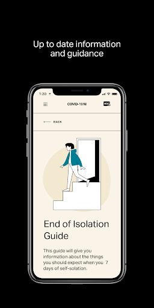
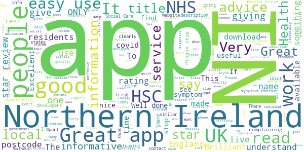
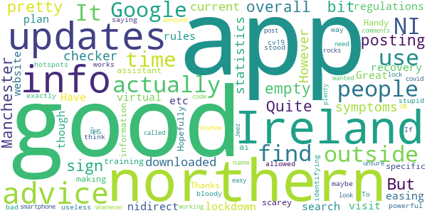
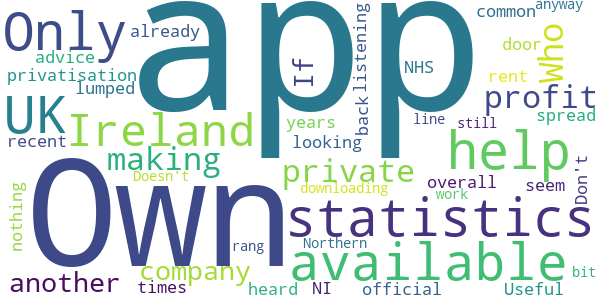
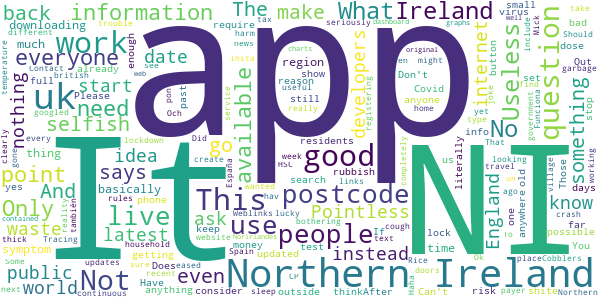

# COVID-19 NI
App version ``1.7``

Analyzed with [covid-apps-observer](http://github.com/covid-apps-observer) project, version ``0.1``

## App overview
| | |
|-------------------------|-------------------------| 
| **Name**&nbsp;&nbsp;&nbsp;&nbsp;&nbsp;&nbsp;&nbsp;&nbsp;&nbsp;&nbsp;&nbsp;&nbsp;&nbsp;&nbsp;&nbsp;&nbsp;&nbsp;&nbsp;&nbsp;&nbsp;&nbsp;&nbsp;&nbsp;&nbsp;&nbsp;&nbsp;&nbsp;&nbsp;&nbsp;&nbsp;&nbsp;&nbsp;&nbsp;&nbsp;&nbsp;&nbsp;&nbsp;&nbsp;&nbsp;&nbsp;  | COVID-19 NI |
| **Unique identifier** | net.hscni.covid19ni |
| **Link to Google Play** | [https://play.google.com/store/apps/details?id=net.hscni.covid19ni](https://play.google.com/store/apps/details?id=net.hscni.covid19ni) |
| **Summary**  | COVID-19 NI is a coronavirus symptom checker and provides the latest advice. |
| **Privacy policy** | [https://www.health-ni.gov.uk/publications/covid-19-app-privacy-notice](https://www.health-ni.gov.uk/publications/covid-19-app-privacy-notice) |
| **Latest version** | 1.7 |
| **Last update** | 2020-06-01 17:18:43 |
| **Recent changes** | Updated to include additional coronavirus symptoms.  Updated with the most accurate advice. Performance Improvements |
| **Installs**  | 50,000+ |
| **Category** | Medical |
| **First release** | Mar 24, 2020 |
| **Size**  | 54M |
| **Supported Android version**  | 4.2 and up |

### Description
> Overview
  
 The COVID-19 NI app has been developed by Digital Health and Care NI in partnership with Health & Social Care, the Public Health Agency and the Department of Health. 
  
 The app has been designed to help the public in Northern Ireland keep up to date with the latest advice on the COVID-19 pandemic, helping you to:
  
 ·         Check if you or someone in your household has coronavirus symptoms. 
 ·         Access personalised advice based on your answers to the symptom check questions.
 ·         Decide if you need clinical advice and how to access it.
 ·         Easily find links to trusted information resources.
 ·         Self-isolate if you have symptoms by checking the self-isolation timer for both yourself and your household.
 ·         Search current advice by using a search function of FAQs.
  
 We continue to update the app with new features based on feedback from citizens in Northern Ireland and will continue to ensure app users get access to the most up to date headlines and changes in the advice and guidance.
  
 Things are moving quickly with the pandemic so you may need to come back to refresh your app regularly. We’ll let you know when this is necessary.
  
 Thank you for your support in helping us project your family, friends and community.
  
  
 Who can use this app
  
 The app is available for use in Northern Ireland to all individuals who are currently residing in Northern Ireland.
  
  
 Data security
  
 The app does not collect any personally identifiable information.
  
 We will collect information related to the postcode and age of the user to help us track the impact of COVID-19 in Northern Ireland.
  
 This will help us to plan services and ensure that resources are directed to the areas of greatest need.

### User interface
The developers of the app provide the following screenshots in the Google play store.
| | | |
|:-------------------------:|:-------------------------:|:-------------------------:|
 |   |   |   | 
 |  

## Development team
In the following we report the main information provided by the development team in the Google play store.

| | |
|-------------------------|-------------------------|
| **Developer**  | Health & Social Care Northern Ireland |
| **Website**  | [https://www.publichealth.hscni.net/](https://www.publichealth.hscni.net/) |
| **Email** | hscdhcni@gmail.com |
| **Physical address**  | - |
| **Other developed apps**  | [https://play.google.com/store/apps/developer?id=Health+%26+Social+Care+Northern+Ireland](https://play.google.com/store/apps/developer?id=Health+%26+Social+Care+Northern+Ireland) |

## Android support

| | |
|-------------------------|-------------------------|
| **Declared target Android version**  | Android10, version 10 (API level 29) |
| **Effective target Android version**  | Android10, version 10 (API level 29) |
| **Minimum supported Android version**  | Jelly Bean, version 4.2.x (API level 17) |
| **Maximum target Android version**  | - |

The larger the difference between the minimum and maximum supported Android versions, the better. A larger difference means a wider audience. For example, old phones have a very low Android version, so a high minimum supported Android version means that the app cannot be used by users with old phones, thus leading to accessibility problems. 

## Requested permissions

In the following we report the complete list of the permissions requested by the app. 

| **Permission** | **Protection level** | **Description** | 
|-------------------------|-------------------------|-------------------------|
 **android.permission ACCESS_NETWORK_STATE** | Normal | Allows applications to access information about networks. 
 **android.permission ACCESS_WIFI_STATE** | Normal | Allows applications to access information about Wi-Fi networks. 
 **android.permission INTERNET** | Normal | Allows applications to open network sockets. 
 **android.permission WAKE_LOCK** | Normal | Allows using PowerManager WakeLocks to keep processor from sleeping or screen from dimming. 
 **com.google.android.c2dm.permission RECEIVE** | - | - 
 **net.hscni.covid19ni.permission C2D_MESSAGE** | - | - 

## Mentioned servers

| **Server** | **Registrant** | **Registrant country** | **Creation date** | 
|-------------------------|-------------------------|-------------------------|-------------------------|
 | google.com | Google LLC | :us: US | 1997-09-15 04:00:00 |
 | w3.org | W3C | :us: US | 1994-07-06 04:00:00 |
 | microsoft.com | Microsoft Corporation | :us: US | 1991-05-02 04:00:00 |
 | googleapis.com | Google LLC | :us: US | 2005-01-25 17:52:26 |

## Security analysis 

Below we report the main security warnings raised by our execution of the [Androwarn](https://github.com/maaaaz/androwarn) security analysis tool.

**Telephony identifiers leakage**
> - This application reads the ISO country code equivalent of the current registered operator's MCC (Mobile Country Code) 
> - This application reads the numeric name (MCC+MNC) of current registered operator 
> - This application reads the operator name 

**Connection interfaces exfiltration**
> - This application reads details about the currently active data network 

**Code execution**
> - This application loads a native library: 'monodroid' 
> - This application loads a native library: 'monosgen-2.0' 
> - This application loads a native library: 'xamarin-app' 
> - This application loads a native library: 'xamarin-debug-app-helper' 

## User ratings and reviews

Below we provide information about how end users are reacting to the app in terms of ratings and reviews in the Google Play store.

### Ratings

The COVID-19 NI app has been installed by more than **50000** times. At this time, **281** rated the app and its average score is **3.61**. Below we show the distribution of the ratings across the usual star-based rating of Google Play

:star::star::star::star::star:: 160

:star::star::star::star:: 14

:star::star::star:: 16

:star::star:: 16

:star:: 73

### Reviews 

#### 5-star reviews

> Amazing the p we people who it doesn't work you need to go to the NHS website or gothirmont web don't give the 1 star if do you are ungrateful and it probably your phone. 😂😂😂  :date: __2020-06-06 22:45:27__

> Easy to use informative and source of good advice and information specific for NI residents.  :date: __2020-06-06 10:56:34__

> If you are from UK but not from NI, this app is not for you as it may not match the advice your local government is giving. Crucially, this is the advice of the Northern Irish HSC (NHS equivalent).  :date: __2020-06-02 13:07:43__

> I don't live in NI, and I don't have any covid symptoms but I was curious to see how this app worked, so I used an NI postcode and 'role-played'. This is great; clear and concise, with efficient links through to local health service info. We could definitely benefit from an app like this in mainland UK. Hats off to the developers! To those giving 1 star reviews, I note many of you do not live in NI & did not notice that the app was, therefore, not designed for you!!!  :date: __2020-05-27 19:31:24__

> 🌍🌎🌏😷  :date: __2020-05-20 18:53:50__

> This app got its rating destroyed by people across the water, therefore, the HSC deserve as many 5 star ratings as possible.  :date: __2020-05-14 06:12:38__

> Very good  :date: __2020-05-08 18:22:42__

> Intresing read about covid 19  :date: __2020-05-02 15:58:29__

> Very good feels like I can really see what's going on  :date: __2020-05-02 00:31:11__

> Great app for the people in N. Ireland  :date: __2020-05-01 11:34:34__

#### 4-star reviews

> A bit empty but good overall!  :date: __2020-06-17 22:06:54__

> Manchester not,,,,,  :date: __2020-06-11 21:25:59__

> Quite good app as has a symptoms checker and some info, advice and statistics.. However doesn't have what I actually downloaded it for which was to find out about updates to current regulations and recovery plan such as easing of lockdown rules etc.. Have to search for this and then visit nidirect website for this info..  :date: __2020-06-07 21:55:20__

> Good app  :date: __2020-05-06 23:22:23__

> Great app, though the virtual assistant could use some more specific information / ai training. Thanks for making this.  :date: __2020-04-02 10:48:28__

> Handy advice in scarey times  :date: __2020-04-01 21:27:09__

> Hopefully this could be a very powerful way of identifying cv19 hotspots.  :date: __2020-03-31 20:18:01__

> Not bad. To all the people saying its useless as it only works in Northern Ireland, just what exactly do you think the NI in the bloody name stood for? If you're that stupid maybe you shouldn't be allowed a smartphone - Jeez! 🙄  :date: __2020-03-30 14:46:56__

> It's a good app, unsure why the comments are being so annoyed about it not working outside of northern ireland whenever the app is called covid 19 ni... Anyhow if any of the people actually wanted to use the app outside the UK all they would need to do is look on Google for a post code from northern Ireland which is easy to find and since we're all on lock down then you all have plenty of time to Google it.  :date: __2020-03-30 10:24:28__

> ÑHS rocks  :date: __2020-03-30 09:25:57__

#### 3-star reviews

> Who owns this App is it a private profit making company? If so is this another privatisation by the back door which is all too common with the NHS overall in recent years Own it Don't rent it!  :date: __2020-05-06 15:23:14__

> I was looking for statistics on the spread in NI as we are lumped in with the UK in official statistics, this app doesn't seem to have that. Useful advice but nothing I haven't heard 1000 times already - those who aren't listening won't be downloading the app anyway.  :date: __2020-04-11 15:32:23__

> N/A  :date: __2020-04-10 00:07:41__

> Helps a bit but I still rang 111 help line  :date: __2020-04-07 03:46:29__

> Only available in Ireland!  :date: __2020-04-02 18:40:10__

> Doesn't work in the UK  :date: __2020-04-01 08:16:36__

> Only available in Northern Ireland 🇮🇪 😢  :date: __2020-03-26 13:18:23__

#### 2-star reviews

> Not in NI but won't load 😔  :date: __2020-06-20 10:41:04__

> Sporadic updates. Better to just use google.  :date: __2020-05-26 17:42:14__

> No updated figures since April 30  :date: __2020-05-04 17:55:33__

> Sorry 2 stars only. App not for England or Wales. Advertised on the news as available all over UK and this is not so. So I've uninstalled it.  :date: __2020-04-11 23:08:08__

> Why is this only available in NI and not available anywhere else I think its deplorable as we are all dealing with this and not just NI  :date: __2020-04-10 14:03:09__

> Nothing new or useful here.  :date: __2020-04-06 19:46:22__

> My is it only NI  :date: __2020-03-26 08:24:52__

#### 1-star reviews

> Ok  :date: __2020-06-15 16:57:46__

> Insta-crash all this week - lucky we don't need it yet. Pointless when it was working. Out of date news. Weblinks in one place might be useful. Contact Tracing search links to this app.  :date: __2020-06-05 09:30:21__

> App is garbage. Only for NI.  :date: __2020-05-25 23:34:54__

> What's the point of a Covid app for the public that doesn't even include the latest lockdown rules. Its like the government has gone to sleep now that things have eased. Should we also stop bothering to take things seriously? Och sure, where's the harm...  :date: __2020-05-25 10:42:48__

> Not up to date, the recent info starts at 9 days old. I just googled what I was looking for instead. What's the point in this app if it doesn't have the latest updates for Northern Ireland?  :date: __2020-05-22 23:37:16__

> Cobblers  :date: __2020-05-22 16:22:27__

> Haha! Some people hav nothing to do them create useless apps  :date: __2020-05-21 14:10:33__

> Pointless waste of public money  :date: __2020-05-21 00:12:49__

> Pointless really, after you go to the trouble of registering and getting it set up, all our doors is ask you 3 questions. Have you a temperature? Have you a continuous cough? Did anyone in your household have covid symptoms? That's it!!  :date: __2020-05-20 20:09:40__

> Latest information updated 20 days ago. I wanted to find out how far I can travel from home. I still have no idea. This app is completely useless and not up to date  :date: __2020-05-19 20:12:40__

