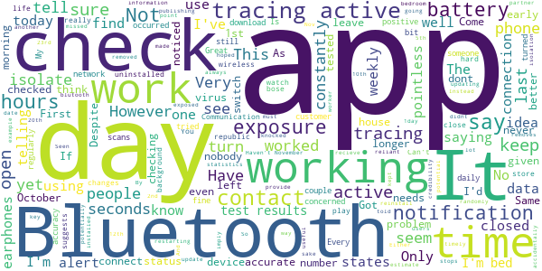

# StopCOVID NI
App version ``2.3.0``

Analyzed with [covid-apps-observer](http://github.com/covid-apps-observer) project, version ``0.1``

## App overview
| | |
|-------------------------|-------------------------| 
| **Name**                                          | StopCOVID NI |
| **Unique identifier** | net.hscni.covidtracker |
| **Link to Google Play** | [https://play.google.com/store/apps/details?id=net.hscni.covidtracker](https://play.google.com/store/apps/details?id=net.hscni.covidtracker) |
| **Summary**  | The coronavirus contact tracing app for Northern Ireland |
| **Privacy policy** | [https://covid-19.hscni.net/privacy-notice/](https://covid-19.hscni.net/privacy-notice/) |
| **Latest version** | 2.3.0 |
| **Last update** | 2020-11-13 18:21:47 |
| **Recent changes** | - Create and send a certificate proving you need to self-isolate to other people and organisations, e.g. your employer or the Social Security Agency. - Self-isolation periods are now calculated based on the date of exposure.  |
| **Installs**  | 100,000+ |
| **Category** | Medical |
| **First release** | Jul 29, 2020 |
| **Size**  | 108M |
| **Supported Android version**  | 6.0 and up |

### Description
> If you are 11 or older and live in Northern Ireland you can use this HSC contact tracing app. By using it you will help stop or slow the spread of coronavirus.
 ** Support the health services **
 ** Help avoid more lockdowns **
 ** Save lives **
 How does the app work?
 If you are in close contact with an app user who has told their app that they have COVID-19, you will get an alert from this app. You won’t know who it was or where it happened. You must then self-isolate for the period shown in the app. There’s advice on how to self-isolate and answers to common questions about this in the app.
 If you test positive for COVID-19 you can tell this app. Other app users that you’ve been close to will then be alerted. They won’t know that it was you or where it happened.
 ** Works in the background on Bluetooth, not GPS, and uses very little battery **
 ** Please keep Bluetooth on so the app can work properly **
 How is my privacy protected?
 ** This app never knows your name or where you are, so it’s completely private **
 It uses the ‘Exposure Notification API’ developed by Apple and Google in a joint effort to help governments and health agencies reduce the spread of COVID-19 through contact tracing, with user privacy and security core to the design. This is sometimes called the ‘decentralised’ model.
 If you test positive for COVID-19 you will get a code by SMS text message from 'HSCresult'. When you put your code into this app you will be asked to share the 'Random IDs’ that your phone has been swapping with other app users over the last 14 days. This will allow us to tell those people that they have been exposed to COVID-19. 
 ** We will never ask you to reply to the SMS text message **
 ** Please ignore any message if it asks you to reply or send information **
 So that you can use this app when travelling abroad we will securely share 'Random IDs' with other countries. This also means that apps used by visitors from those countries will work here.
 ** This app will never track your identity or location **

### User interface
The developers of the app provide the following screenshots in the Google play store.
| | | |
|:-------------------------:|:-------------------------:|:-------------------------:|
 |   |   |   | 
 |   |   |   | 
 |  

## Development team
In the following we report the main information provided by the development team in the Google play store.

| | |
|-------------------------|-------------------------|
| **Developer**  | Health & Social Care Northern Ireland |
| **Website**  | [https://covid-19.hscni.net/contact-tracing/](https://covid-19.hscni.net/contact-tracing/) |
| **Email** | StopCOVIDNIApp@hscni.net |
| **Physical address**  | - |
| **Other developed apps**  | [https://play.google.com/store/apps/developer?id=Health+%26+Social+Care+Northern+Ireland](https://play.google.com/store/apps/developer?id=Health+%26+Social+Care+Northern+Ireland) |

## Android support

| | |
|-------------------------|-------------------------|
| **Declared target Android version**  | Android10, version 10 (API level 29) |
| **Effective target Android version**  | Android10, version 10 (API level 29) |
| **Minimum supported Android version**  | Marshmallow, version 6.0 (API level 23) |
| **Maximum target Android version**  | - |

The larger the difference between the minimum and maximum supported Android versions, the better. A larger difference means a wider audience. For example, old phones have a very low Android version, so a high minimum supported Android version means that the app cannot be used by users with old phones, thus leading to accessibility problems. 

## Requested permissions

In the following we report the complete list of the permissions requested by the app. 

| **Permission** | **Protection level** | **Description** | 
|-------------------------|-------------------------|-------------------------|
 **android.permission ACCESS_NETWORK_STATE** | Normal | Allows applications to access information about networks. 
 **android.permission ACCESS_WIFI_STATE** | Normal | Allows applications to access information about Wi-Fi networks. 
 **android.permission BLUETOOTH** | Normal | Allows applications to connect to paired bluetooth devices. 
 **android.permission FOREGROUND_SERVICE** | Normal | Allows a regular application to use Service.startForeground. 
 **android.permission INTERNET** | Normal | Allows applications to open network sockets. 
 **android.permission RECEIVE_BOOT_COMPLETED** | Normal | Allows an application to receive the Intent.ACTION_BOOT_COMPLETED that is broadcast after the system finishes booting. 
 **android.permission VIBRATE** | Normal | Allows access to the vibrator. 

## Mentioned servers

| **Server** | **Registrant** | **Registrant country** | **Creation date** | 
|-------------------------|-------------------------|-------------------------|-------------------------|
 | android.com | Google LLC | :us: US | 1997-06-23 04:00:00 |
 | google.com | Google LLC | :us: US | 1997-09-15 04:00:00 |
 | expo.io | See PrivacyGuardian.org | :us: US | 2011-05-01 21:26:50 |

## Security analysis 

Below we report the main security warnings raised by our execution of the [Androwarn](https://github.com/maaaaz/androwarn) security analysis tool.

**Telephony identifiers leakage**
> - This application reads the numeric name (MCC+MNC) of current registered operator 
> - This application reads the operator name 

**Connection interfaces exfiltration**
> - This application reads details about the currently active data network 
> - This application tries to find out if the currently active data network is metered 

**Suspicious connection establishment**
> - This application opens a Socket and connects it to the remote address ' returned no addresses for  ; port is out of range' on the 'N/A' port  
> - This application opens a Socket and connects it to the remote address '' on the 'N/A' port  
> - This application opens a Socket and connects it to the remote address 'Ljava/lang/StringBuilder;->toString()Ljava/lang/String;' on the 'N/A' port  
> - This application opens a Socket and connects it to the remote address 'Ljava/net/Proxy;->type()Ljava/net/Proxy$Type;' on the 'N/A' port  
> - This application opens a Socket and connects it to the remote address 'timeout' on the 'N/A' port  

**Pim data leakage**
> - This application accesses data stored in the clipboard 

**Code execution**
> - This application loads a native library 
> - This application executes a UNIX command 

## User ratings and reviews

Below we provide information about how end users are reacting to the app in terms of ratings and reviews in the Google Play store.

### Ratings

The StopCOVID NI app has been installed by more than **100000** times. At this time, **478** rated the app and its average score is **2.67**. Below we show the distribution of the ratings across the usual star-based rating of Google Play

:star::star::star::star::star:: 148

:star::star::star::star:: 19

:star::star::star:: 43

:star::star:: 62

:star:: 206

### Reviews 

#### 5-star reviews

> Works for me...  :date: __2021-01-29 17:24:27__

> Thankfully no alert yet  :date: __2021-01-27 19:45:45__

> Fantastic  :date: __2021-01-08 19:00:21__

> This app is a scam , it steals all your information and sent to 3rd parties , so be careful.  :date: __2021-01-08 14:34:36__

> Very good  :date: __2021-01-05 19:18:02__

> Installed this as soon as it became available. Happy to support the good work  :date: __2021-01-03 15:43:57__

> Helpful  :date: __2021-01-02 01:45:10__

> I strumming for DCI middlemoor u big style fun and games cock  :date: __2020-12-26 05:13:43__

> Helps to keep me safe and others safe  :date: __2020-12-21 03:35:48__

> Perfect  :date: __2020-12-10 13:47:17__

#### 4-star reviews

> Very good upto date info.  :date: __2021-02-04 10:51:09__

> COVID NI there are many driffence information about COVID  :date: __2021-01-10 23:10:53__

> Zoe123  :date: __2020-11-22 15:45:06__

> Just discovered the app had been "Auto Disabled" on my android phone. Something to watch out for (When it's running you should get a notification once a week, reminding you and confirming that it is indeed running).  :date: __2020-10-21 23:33:44__

> Please add the capacity to scan QR codes like the NHS app does, not having this function leads to confusion in dealing with GB businesses in NI  :date: __2020-10-10 08:57:01__

> It seems to work, and I really hope it does.. it is simple, and not intrusive. I look forward to seeing his it pans out.  :date: __2020-10-08 01:00:45__

> This app only checks exposure if it comes within a short distance of someone else who has the app. No exposure checks mean you havent been close enough to someone for it to check.  :date: __2020-10-02 20:06:28__

> QUERY! If having to move devices, how are you supposed to transfer the existing exposure checks from the previous 14 days to the new device, in case any of those report a positive case?  :date: __2020-09-21 22:39:02__

> Once running, seems to be very good. But was hard to find. Wasn't immediately clear if there was a background daemon service running or the app had to be "minimized" but not closed to work. Samsung Galaxy 8 running Android 9: It seems Samsung's battery optimisation service was killing the app. After a reboot, it seemed OK, though. Closing/swiping away the app and then toggling bluetooth on/off showed it was still running (I got an alert from the app saying bluetooth needs enabled).  :date: __2020-08-13 21:40:20__

> No problems downloading and it appears active on my Samsung S10. Would love to understand more about the keys as we're registering them without leaving the house!  :date: __2020-08-12 22:11:42__

#### 3-star reviews

> It has stopped working for over a week  :date: __2021-01-20 02:36:29__

> Can you make a version of this app for the huawei app gallery?  :date: __2020-11-26 21:32:22__

> Does not give n Ireland  :date: __2020-11-20 13:22:56__

> The App keeps disabling itself.  :date: __2020-10-26 07:53:08__

> C. Nmu  :date: __2020-10-17 23:19:09__

> No log updates. Uninstalled and reinstalled the app for NI. Made no difference. How can we trust it.  :date: __2020-10-16 14:07:46__

> I don't know  :date: __2020-10-11 18:11:48__

> Downloaded this when it became available, but after the last update, it keeps pushing me to turn my bluetooth on and restart the app; my Bluetooth has been on, and restarting the app doesn't help. Only had this issue since the update, but makes having the app pretty much useless.  :date: __2020-10-11 15:06:04__

> Mine barely checks (once in 14 days) but my friends checks multiple times a day. I'm nearer much more people than them so I don't understand.  :date: __2020-10-11 11:19:25__

> I downloaded the app. I get that someone will notify me if I come into contact with someone who has the app and then tests positive. However, I feel it should give people either daily or weekly updates of places that the person has been and I wonder when two mobile phones that have the app downloaded on the phones - do they react to each other. Another thing is people on the island of ireland both north and south of the island should be able to use both apps together.  :date: __2020-10-06 23:59:37__

#### 2-star reviews

> Haven't use it yet so not sure what to say.  :date: __2021-01-12 01:12:16__

> Bluetooth is always on but the app tells me to turn it on! Same after restarting the device and checking Bluetooth status  :date: __2020-12-30 18:52:58__

> Got a notification to say i was in contact and had to isolate. Only problem was i had been in contact the 10th. First told of it the 23rd with 1day left to isolate. Its reliant on people updating the app with their test results and if they dont do that then nobody knows  :date: __2020-11-23 21:34:22__

> I had hoped that this app would provide useful timely and accurate information to users. Instead I see that the statistics are not kept up to date. By way of example today is 05/11/20 but the R number estimate is from 16/10/20. Come on people for the sake of credibility must do better!  :date: __2020-11-05 23:37:19__

> I don't see the point in this app. As I checked today 2nd November as I'd accidentally knocked off Bluetooth. Seen it last checked on 12th October. I am a key worker, I could potentially come into contact with this virus. And after 14 days it removes data. So that is a lot of potential contact with this virus missed. If it's not going to work and check then why have it installed?  :date: __2020-11-02 09:56:14__

> Either it doesn't work or nobody has it... since the 20th of October (it is now the 1st of Nov) I have had 2 notifications (checks), 1 of which are my partner. Pointless.  :date: __2020-11-01 20:20:25__

> Its not working keeps telling me connect to blutooth and I have!  :date: __2020-10-28 18:45:24__

> The app worked well but I noticed at times when I was out that no checks had been made. I did recieve an alert to isolate for 14 days which I did, yet on the 5th day into isolation I got another notification saying that I've been exposed and have to isolate for 14 days. I hadn't left to house, I didnt even leave my bedroom so I'm not sure how accurate this app is which is why I removed it.  :date: __2020-10-26 09:57:00__

> No alert given for App update. No weekly alerts given for 2 consecutive weeks  :date: __2020-10-24 04:50:41__

> Despite having my Bluetooth on constantly, the app is telling me tracing is not active. There is clearly a bug in the app that needs fixed.  :date: __2020-10-23 23:31:59__

#### 1-star reviews

> I used this app from I tested positive it has never turned red etc like it suppose to 😡  :date: __2021-02-06 15:42:06__

> In contact with quite a few covid positive people and no alert, obviously not working  :date: __2021-02-03 10:33:24__

> Even though it says you only need Bluetooth enabled my app tells me to keep location enabled for notifications. This drains my battery so I won't be using it.  :date: __2021-02-02 16:39:24__

> I have just deleted the app, the police in England are being given new powers to access your information via the app. Its only a matter of time before NI does the same. This is NOT what I signed up for. Completely lost my trust and have uninstalled. The notifications aren't useful, it doesn't tell you when or where you came into contact with someone.  :date: __2021-01-30 10:25:47__

> Statistically I have been in direct contact with a number of Covid cases. Not one single alert.  :date: __2021-01-30 00:09:06__

> I have used it daily just to see if it works and it has never went off. I work on a Covid Ward... I also have family who were in the same place for the same amount of time with the same people and some got the notification and others didnt. It simply doesn't work.  :date: __2021-01-26 12:42:55__

> It didn't send me any notification I happened to open my app and had 4 days self isolation left, that was certainly pointless considering I missed 6 days isolation and being around my co workers  :date: __2021-01-18 08:43:00__

> Notified that I'd been exposed nine days previous and that I needed to isolate for one more day. Bit late notice considering I'm a key worker and have been working in the hospital during the previous nine days.  :date: __2021-01-17 04:45:13__

> Why does it not check for exposure ive had 0 exposure checks for the past 25 days or so why???  :date: __2021-01-16 04:27:01__

> Doesn't work properly  :date: __2021-01-06 12:46:58__

