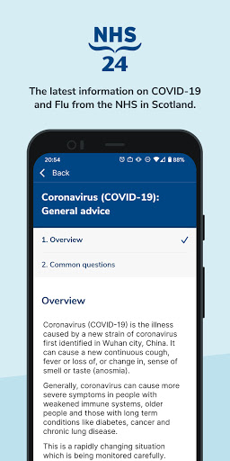
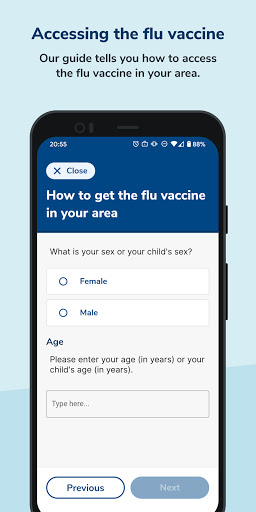
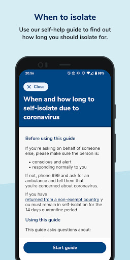
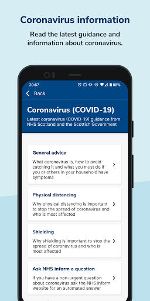
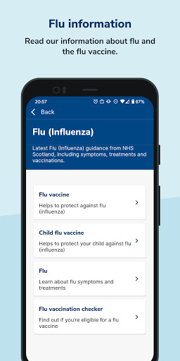
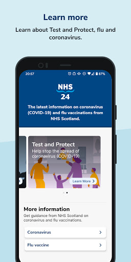
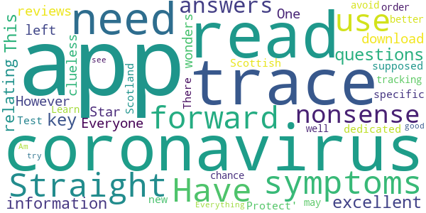
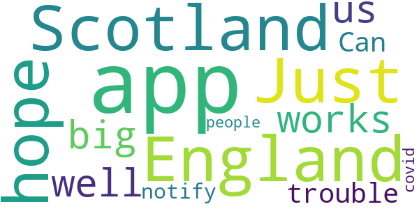
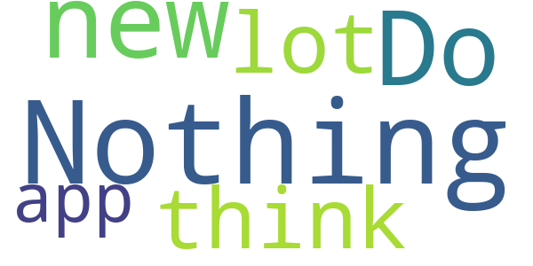
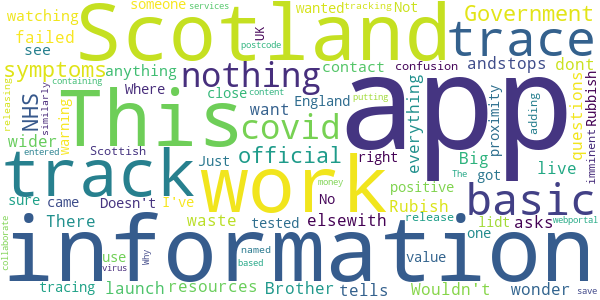

# NHS 24 : Covid-19 and flu information
App version ``2.0.1``

Analyzed with [covid-apps-observer](http://github.com/covid-apps-observer) project, version ``0.1``

## App overview
| | |
|-------------------------|-------------------------| 
| **Name**&nbsp;&nbsp;&nbsp;&nbsp;&nbsp;&nbsp;&nbsp;&nbsp;&nbsp;&nbsp;&nbsp;&nbsp;&nbsp;&nbsp;&nbsp;&nbsp;&nbsp;&nbsp;&nbsp;&nbsp;&nbsp;&nbsp;&nbsp;&nbsp;&nbsp;&nbsp;&nbsp;&nbsp;&nbsp;&nbsp;&nbsp;&nbsp;&nbsp;&nbsp;&nbsp;&nbsp;&nbsp;&nbsp;&nbsp;&nbsp;  | NHS 24 : Covid-19 and flu information |
| **Unique identifier** | scot.nhs24.coronavirus |
| **Link to Google Play** | [https://play.google.com/store/apps/details?id=scot.nhs24.coronavirus](https://play.google.com/store/apps/details?id=scot.nhs24.coronavirus) |
| **Summary**  | Coronavirus info and flu vaccine guidance for people in Scotland |
| **Privacy policy** | [https://www.nhsinform.scot/privacy-and-cookies-policy](https://www.nhsinform.scot/privacy-and-cookies-policy) |
| **Latest version** | 2.0.1 |
| **Last update** | 2020-10-13 14:55:01 |
| **Recent changes** | Minor bug fixes |
| **Installs**  | 10,000+ |
| **Category** | Health & Fitness |
| **First release** | Apr 19, 2020 |
| **Size**  | 12M |
| **Supported Android version**  | 4.2 and up |

### Description
> Get the latest health information on coronavirus in Scotland and find out how and where to get your flu vaccination this winter.
 This app is owned and delivered by NHS 24

### User interface
The developers of the app provide the following screenshots in the Google play store.
| | | |
|:-------------------------:|:-------------------------:|:-------------------------:|
 |   |   |   | 
 |   |   |   | 

## Development team
In the following we report the main information provided by the development team in the Google play store.

| | |
|-------------------------|-------------------------|
| **Developer**  | NHS24 |
| **Website**  | - |
| **Email** | ContentWorkRequest@nhs24.scot.nhs.uk |
| **Physical address**  | - |
| **Other developed apps**  | [https://play.google.com/store/apps/developer?id=NHS24](https://play.google.com/store/apps/developer?id=NHS24) |

## Android support

| | |
|-------------------------|-------------------------|
| **Declared target Android version**  | - |
| **Effective target Android version**  | - |
| **Minimum supported Android version**  | Jelly Bean, version 4.2.x (API level 17) |
| **Maximum target Android version**  | - |

The larger the difference between the minimum and maximum supported Android versions, the better. A larger difference means a wider audience. For example, old phones have a very low Android version, so a high minimum supported Android version means that the app cannot be used by users with old phones, thus leading to accessibility problems. 

## Requested permissions

In the following we report the complete list of the permissions requested by the app. 

| **Permission** | **Protection level** | **Description** | 
|-------------------------|-------------------------|-------------------------|
 **android.permission ACCESS_NETWORK_STATE** | Normal | Allows applications to access information about networks. 
 **android.permission INTERNET** | Normal | Allows applications to open network sockets. 
 **android.permission WAKE_LOCK** | Normal | Allows using PowerManager WakeLocks to keep processor from sleeping or screen from dimming. 
 **com.google.android.c2dm.permission RECEIVE** | - | - 

## Mentioned servers

| **Server** | **Registrant** | **Registrant country** | **Creation date** | 
|-------------------------|-------------------------|-------------------------|-------------------------|
 | google.com | Google LLC | :us: US | 1997-09-15 04:00:00 |
 | w3.org | W3C | :us: US | 1994-07-06 04:00:00 |

## Security analysis 

Below we report the main security warnings raised by our execution of the [Androwarn](https://github.com/maaaaz/androwarn) security analysis tool.

**Telephony identifiers leakage**
> - This application reads the ISO country code equivalent of the current registered operator's MCC (Mobile Country Code) 

**Connection interfaces exfiltration**
> - This application reads details about the currently active data network 

**Suspicious connection establishment**
> - This application opens a Socket and connects it to the remote address '' on the 'N/A' port  
> - This application opens a Socket and connects it to the remote address 'Ljava/lang/StringBuilder;->toString()Ljava/lang/String;' on the 'N/A' port  
> - This application opens a Socket and connects it to the remote address 'Ljava/net/Proxy;->type()Ljava/net/Proxy$Type;' on the 'N/A' port  
> - This application opens a Socket and connects it to the remote address 'timeout' on the 'N/A' port  

**Pim data leakage**
> - This application accesses data stored in the clipboard 

**Code execution**
> - This application loads a native library: 'flutter' 

## User ratings and reviews

Below we provide information about how end users are reacting to the app in terms of ratings and reviews in the Google Play store.

### Ratings

The NHS 24 : Covid-19 and flu information app has been installed by more than **10000** times. At this time, **53** rated the app and its average score is **3.2075472**. Below we show the distribution of the ratings across the usual star-based rating of Google Play

:star::star::star::star::star:: 21

:star::star::star::star:: 7

:star::star::star:: 5

:star::star:: 2

:star:: 18

### Reviews 

#### 5-star reviews

> Just get this app on my phone please  :date: __2021-05-22 15:09:52__

> Have symptoms.  :date: __2021-02-04 02:33:24__

> Straight forward to use and no nonsense answers to questions  :date: __2020-09-29 22:57:54__

> This is an excellent app with key information relating to coronavirus. Everyone should download it. However, for all of the clueless wonders out there who cannot read and have left it One Star reviews because it doesn't trace, it's not supposed to trace. There is a specific, dedicated app for 'Test & Protect' in Scotland, and that is the new Scottish tracking app. Learn to read, and you may well have a better chance of doing what you need to do in order to avoid coronavirus.  :date: __2020-09-24 18:39:42__

> Everything you need  :date: __2020-07-31 14:49:51__

> Am just about to try to see how good it is!  :date: __2020-05-29 12:27:51__

#### 4-star reviews

> I am in England not Scotland  :date: __2020-09-27 22:41:55__

> Just hope that this app works well for all of us if not we'll all in big trouble.  :date: __2020-09-26 13:18:41__

> Can this app notify me for other people who have covid  :date: __2020-09-24 19:20:35__

#### 3-star reviews

> Ok  :date: __2020-10-24 12:35:36__

> Since there's so many NHS apps, one general for patients who may need advice for their condition, another for general health information, whilst so many 3rd parties are using their logo, can NHS not name this Scottish app with Scotland AND COVID-19 in the name so the English and Welsh people can avoid this one?  :date: __2020-09-25 15:59:44__

> How do i check using post code  :date: __2020-09-24 13:19:39__

> If you are looking for the contact tracing app you need to search for Protect Scotland - this is not the app you are looking for. Stay Safe, Be Kind.  :date: __2020-09-10 12:15:04__

> Very disappointed with this app, very very basic, no proximity alerts, no information where positive areas are. I really wanted this app to impress me but sadly has failed. Why not just team up with the Kings College / ZOE Covid19 app as this has more information on where the hotpots are and offers you daily check-in for symptoms to collect live data. Come on NHS Scotland you can do much better than this!  :date: __2020-09-03 17:22:15__

#### 2-star reviews

> Nothing new here  :date: __2020-09-27 16:01:55__

> Do not think a lot of this app  :date: __2020-09-24 09:18:39__

#### 1-star reviews

> I dont live in scotland, why would I want this?  :date: __2021-01-28 14:01:16__

> There is no track and trace, if this isn't it then where is it?  :date: __2020-12-18 17:52:56__

> Rubish it does not work andstops everything elsewith failed to launch  :date: __2020-10-09 14:01:12__

> This is too basic, and tells you nothing about covid-19 nor its wider symptoms. It just asks those 3 questions. I wonder if this is just a waste of resources.  :date: __2020-10-05 02:00:49__

> Wouldn't work  :date: __2020-10-04 23:13:02__

> Big Brother is watching you!  :date: __2020-09-29 04:12:08__

> I couldn't see anything about contact tracing if I came close to someone who tested positive. Just a lidt of symptoms  :date: __2020-09-28 21:45:06__

> no use at all  :date: __2020-09-27 20:36:00__

> This is for Scotland not England  :date: __2020-09-24 22:04:32__

> Not sure I've got the right app I wanted the track and trace one  :date: __2020-09-24 19:30:42__

