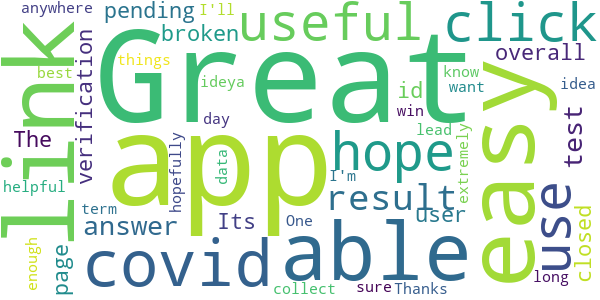

# COVID-19 Sounds
App version ``1.1.19``

Analyzed with [covid-apps-observer](http://github.com/covid-apps-observer) project, version ``0.1``

## App overview
| | |
|-------------------------|-------------------------| 
| **Name**&nbsp;&nbsp;&nbsp;&nbsp;&nbsp;&nbsp;&nbsp;&nbsp;&nbsp;&nbsp;&nbsp;&nbsp;&nbsp;&nbsp;&nbsp;&nbsp;&nbsp;&nbsp;&nbsp;&nbsp;&nbsp;&nbsp;&nbsp;&nbsp;&nbsp;&nbsp;&nbsp;&nbsp;&nbsp;&nbsp;&nbsp;&nbsp;&nbsp;&nbsp;&nbsp;&nbsp;&nbsp;&nbsp;&nbsp;&nbsp;  | COVID-19 Sounds |
| **Unique identifier** | uk.ac.cam.cl.covid19sounds |
| **Link to Google Play** | [https://play.google.com/store/apps/details?id=uk.ac.cam.cl.covid19sounds](https://play.google.com/store/apps/details?id=uk.ac.cam.cl.covid19sounds) |
| **Summary**  | Contribute your cough and voice sounds for research into COVID-19. |
| **Privacy policy** | [http://covid-19-sounds.org/privacy.html](http://covid-19-sounds.org/privacy.html) |
| **Latest version** | 1.1.19 |
| **Last update** | 2020-10-15 19:20:46 |
| **Recent changes** | scroll bar highliting |
| **Installs**  | 10,000+ |
| **Category** | Education |
| **First release** | Mar 25, 2020 |
| **Size**  | 3.4M |
| **Supported Android version**  | 5.0 and up |

### Description
> This app is part of a research project at the University of Cambridge. The aim of this research is to develop machine learning algorithms to automatically detect if a person is suffering of COVID-19, based primarily on sounds of their voice, their breathing and coughing. 
 In order to enable this research we are launching a large scale, crowdsourced data collection through a mobile app. The app will collect some basic demographics and medical history data, as well as some voice samples (while you read text on the screen) through a questionnaire and a few seconds of breathing and coughing through the phone microphone. We will additionally collect one location sample. The app will also ask if you have tested positive for the virus. The app won't be tracking you and only collect this data when you actively interact with it. 
 The data will be stored on University servers and be used solely for research purposes. We hope to release the dataset we are collecting to other researchers after the initial analysis. 
 The app will not give medical advice and any reports of symptoms will not be responded to by medical assistance.
 This app is available in English, Spanish, French, German, Hindi, Greek, Portuguese, Russian, Italian, and Chinese.

### User interface
The developers of the app provide the following screenshots in the Google play store.
| | | |
|:-------------------------:|:-------------------------:|:-------------------------:|
 |   |   |   | 
 |  

## Development team
In the following we report the main information provided by the development team in the Google play store.

| | |
|-------------------------|-------------------------|
| **Developer**  | cam-cl-mobile-systems |
| **Website**  | [http://covid-19-sounds.org](http://covid-19-sounds.org) |
| **Email** | covid19sounds@gmail.com |
| **Physical address**  | - |
| **Other developed apps**  | [https://play.google.com/store/apps/developer?id=cam-cl-mobile-systems](https://play.google.com/store/apps/developer?id=cam-cl-mobile-systems) |

## Android support

| | |
|-------------------------|-------------------------|
| **Declared target Android version**  | Android10, version 10 (API level 29) |
| **Effective target Android version**  | Android10, version 10 (API level 29) |
| **Minimum supported Android version**  | Lollipop, version 5.0 (API level 21) |
| **Maximum target Android version**  | - |

The larger the difference between the minimum and maximum supported Android versions, the better. A larger difference means a wider audience. For example, old phones have a very low Android version, so a high minimum supported Android version means that the app cannot be used by users with old phones, thus leading to accessibility problems. 

## Requested permissions

In the following we report the complete list of the permissions requested by the app. 

| **Permission** | **Protection level** | **Description** | 
|-------------------------|-------------------------|-------------------------|
 **android.permission ACCESS_COARSE_LOCATION** | :warning:**Dangerous** | Allows an app to access approximate location. 
 **android.permission ACCESS_NETWORK_STATE** | Normal | Allows applications to access information about networks. 
 **android.permission ACCESS_WIFI_STATE** | Normal | Allows applications to access information about Wi-Fi networks. 
 **android.permission AUTHENTICATE_ACCOUNTS** | - | - 
 **android.permission GET_ACCOUNTS** | :warning:**Dangerous** | Allows access to the list of accounts in the Accounts Service. 
 **android.permission INTERNET** | Normal | Allows applications to open network sockets. 
 **android.permission READ_SYNC_SETTINGS** | Normal | Allows applications to read the sync settings. 
 **android.permission READ_SYNC_STATS** | Normal | Allows applications to read the sync stats. 
 **android.permission RECORD_AUDIO** | :warning:**Dangerous** | Allows an application to record audio. 
 **android.permission WRITE_SYNC_SETTINGS** | Normal | Allows applications to write the sync settings. 
 **com.samsung.android.providers.context.permission WRITE_USE_APP_FEATURE_SURVEY** | - | - 

## Mentioned servers

| **Server** | **Registrant** | **Registrant country** | **Creation date** | 
|-------------------------|-------------------------|-------------------------|-------------------------|
 | google.com | Google LLC | :us: US | 1997-09-15 04:00:00 |
 | googleapis.com | Google LLC | :us: US | 2005-01-25 17:52:26 |

## Security analysis 

Below we report the main security warnings raised by our execution of the [Androwarn](https://github.com/maaaaz/androwarn) security analysis tool.

**Connection interfaces exfiltration**
> - This application reads details about the currently active data network 
> - This application tries to find out if the currently active data network is metered 

**Suspicious connection establishment**
> - This application opens a Socket and connects it to the remote address 'Lcz/msebera/android/httpclient/HttpHost;->getPort()I' on the 'Lcz/msebera/android/httpclient/HttpHost;->getPort()I' port  

## User ratings and reviews

Below we provide information about how end users are reacting to the app in terms of ratings and reviews in the Google Play store.

### Ratings

The COVID-19 Sounds app has been installed by more than **10000** times. At this time, **72** rated the app and its average score is **3.8611112**. Below we show the distribution of the ratings across the usual star-based rating of Google Play

:star::star::star::star::star:: 43

:star::star::star::star:: 7

:star::star::star:: 4

:star::star:: 5

:star:: 13

### Reviews 

#### 5-star reviews

> The verification page with the user id has a broken link. Its not closed so if you click anywhere after the link, it clicks the link. Great app! I hope they are able to collect enough data to do what they want.  :date: __2020-11-10 20:11:56__

> Great easy to use app. One day could lead to great things.  :date: __2020-11-03 18:29:57__

> Easy to use, hopefully helpful.  :date: __2020-09-02 04:49:31__

> Great easy app I'm sure it will be extremely useful long term  :date: __2020-08-08 09:23:57__

> 👍👍👍👍👍 this app is very useful. Thanks for this ideya. 😉😉👍👍👍👍👍  :date: __2020-07-18 12:42:37__

> how I'll know my result  :date: __2020-05-22 00:35:52__

> Great idea, all the best with this app, hope we can win over Covid-19!  :date: __2020-04-13 21:34:53__

#### 4-star reviews

No recent reviews available with 4 stars.

#### 3-star reviews

No recent reviews available with 3 stars.

#### 2-star reviews

No recent reviews available with 2 stars.

#### 1-star reviews

> I cant open it  :date: __2020-10-20 00:37:26__

