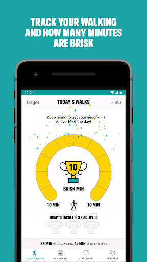
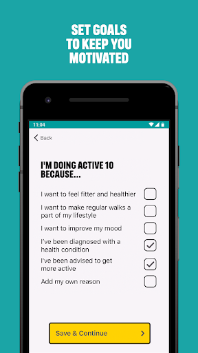
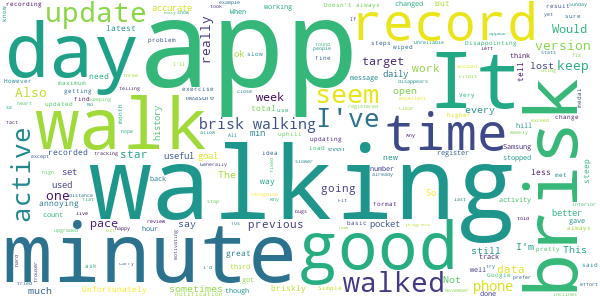

# One You Active 10 Walking Tracker
App version ``4.1.0``

Analyzed with [covid-apps-observer](http://github.com/covid-apps-observer) project, version ``0.1``

## App overview
| | |
|-------------------------|-------------------------| 
| **Name**                                          | One You Active 10 Walking Tracker |
| **Unique identifier** | uk.ac.shef.oak.pheactiveten |
| **Link to Google Play** | [https://play.google.com/store/apps/details?id=uk.ac.shef.oak.pheactiveten](https://play.google.com/store/apps/details?id=uk.ac.shef.oak.pheactiveten) |
| **Summary**  | Active 10 shows you when you are walking quickly enough to get health benefits. |
| **Privacy policy** | [https://www.nhs.uk/oneyou/privacy-policy#H6QQyKsRuuBpI7Dg.97](https://www.nhs.uk/oneyou/privacy-policy#H6QQyKsRuuBpI7Dg.97) |
| **Latest version** | 4.1.0 |
| **Last update** | 2020-10-06 14:21:07 |
| **Recent changes** | We release regular updates to the Active 10 app to fix issues and improve performance.  In this release we have completed some minor bug fixes under the hood. |
| **Installs**  | 100,000+ |
| **Category** | Health & Fitness |
| **First release** | Mar 3, 2017 |
| **Size**  | 18M |
| **Supported Android version**  | 5.1 and up |

### Description
> Active 10 is a free and easy to use walking app that tracks your walking and shows you how you can increase your intensity to benefit your health. The app is designed to support you every step of the way to increase your daily level of physical activity, with simple and achievable milestones and rewards along the way.
 Key features:
 * Tracks all your walking and how many minutes were brisk
 * Rewards every brisk minute achieved throughout the day, so perfect for those starting from low levels of activity
 * Promotes goal setting to help keep you motivated and help you progress
 * Store and view up to 12 months of your walking activity, to see how far you have come 
 * Discover loads of hints and tips on achieving a healthier lifestyle
 BRISK WALKING BENEFITS YOUR HEALTH
 We all know how important it is to be active. The good news is you don’t have to go to the gym or start expensive fitness programmes, walking counts too!
 Just ten minutes of brisk walking every day can get your heart pumping and can make you feel more energetic, as well as lowering your risk of serious illnesses like heart disease and type 2 diabetes. Going for a brisk walk is a great way to clear your head and improve your mood.
 Active 10s are simple to fit into your day. From taking the dog out to going for a lunchtime walk there are lots of opportunities to introduce brisk walking into your daily routine.
 This app relies on your phone’s inbuilt sensors to measure your activity so you may experience varying levels of accuracy especially in older devices/operating systems. To improve accuracy, keep your phone in a pocket close to your body rather than in a loose coat pocket or bag.
 If you have any feedback on how we can improve the app please send it to oneyou@phe.gov.uk.
 Frequently asked questions: https://www.nhs.uk/oneyou/active10/faqs

### User interface
The developers of the app provide the following screenshots in the Google play store.
| | | |
|:-------------------------:|:-------------------------:|:-------------------------:|
 |   |   |   | 
 |   |  

## Development team
In the following we report the main information provided by the development team in the Google play store.

| | |
|-------------------------|-------------------------|
| **Developer**  | Public Health England Digital |
| **Website**  | [http://www.nhs.uk/oneyou/active10](http://www.nhs.uk/oneyou/active10) |
| **Email** | oneyou@phe.gov.uk |
| **Physical address**  | - |
| **Other developed apps**  | [https://play.google.com/store/apps/developer?id=Public+Health+England+Digital](https://play.google.com/store/apps/developer?id=Public+Health+England+Digital) |

## Android support

| | |
|-------------------------|-------------------------|
| **Declared target Android version**  | Pie, version 9 (API level 28) |
| **Effective target Android version**  | Pie, version 9 (API level 28) |
| **Minimum supported Android version**  | Lollipop, version 5.1 (API level 22) |
| **Maximum target Android version**  | - |

The larger the difference between the minimum and maximum supported Android versions, the better. A larger difference means a wider audience. For example, old phones have a very low Android version, so a high minimum supported Android version means that the app cannot be used by users with old phones, thus leading to accessibility problems. 

## Requested permissions

In the following we report the complete list of the permissions requested by the app. 

| **Permission** | **Protection level** | **Description** | 
|-------------------------|-------------------------|-------------------------|
 **android.permission ACCESS_FINE_LOCATION** | :warning:**Dangerous** | Allows an app to access precise location. 
 **android.permission ACCESS_NETWORK_STATE** | Normal | Allows applications to access information about networks. 
 **android.permission ACCESS_WIFI_STATE** | Normal | Allows applications to access information about Wi-Fi networks. 
 **android.permission INTERNET** | Normal | Allows applications to open network sockets. 
 **android.permission MODIFY_AUDIO_SETTINGS** | Normal | Allows an application to modify global audio settings. 
 **android.permission READ_EXTERNAL_STORAGE** | :warning:**Dangerous** | Allows an application to read from external storage. 
 **android.permission RECEIVE_BOOT_COMPLETED** | Normal | Allows an application to receive the Intent.ACTION_BOOT_COMPLETED that is broadcast after the system finishes booting. 
 **android.permission RECORD_AUDIO** | :warning:**Dangerous** | Allows an application to record audio. 
 **android.permission WAKE_LOCK** | Normal | Allows using PowerManager WakeLocks to keep processor from sleeping or screen from dimming. 
 **android.permission WRITE_EXTERNAL_STORAGE** | :warning:**Dangerous** | Allows an application to write to external storage. 
 **com.google.android.c2dm.permission RECEIVE** | - | - 
 **com.google.android.finsky.permission BIND_GET_INSTALL_REFERRER_SERVICE** | - | - 

## Mentioned servers

| **Server** | **Registrant** | **Registrant country** | **Creation date** | 
|-------------------------|-------------------------|-------------------------|-------------------------|
 | googleapis.com | Google LLC | :us: US | 2005-01-25 17:52:26 |
 | phedigital.co.uk | - | - | 2018-06-06 00:00:00 |
 | paragon-cc.co.uk | - | - | 2017-04-04 00:00:00 |
 | nhs.uk | Department of Health | - | 1996-08-01 00:00:00 |
 | googlesyndication.com | Google LLC | :us: US | 2003-01-21 06:17:24 |
 | google.com | Google LLC | :us: US | 1997-09-15 04:00:00 |
 | app-measurement.com | Google LLC | :us: US | 2015-06-19 20:13:31 |
 | instabug.com | - | :us: US | 2000-05-16 23:13:25 |
 | crashlytics.com | Google LLC | :us: US | 2011-01-21 15:30:40 |
 | googleadservices.com | Google LLC | :us: US | 2003-06-19 16:34:53 |

## Security analysis 

Below we report the main security warnings raised by our execution of the [Androwarn](https://github.com/maaaaz/androwarn) security analysis tool.

**Telephony identifiers leakage**
> - This application reads the numeric name (MCC+MNC) of current registered operator 
> - This application reads the operator name 

**Connection interfaces exfiltration**
> - This application reads details about the currently active data network 
> - This application tries to find out if the currently active data network is metered 

**Audio video eavesdropping**
> - This application records audio from the 'MIC' source  

**Suspicious connection establishment**
> - This application opens a Socket and connects it to the remote address ': ; port is out of range' on the 'N/A' port  
> - This application opens a Socket and connects it to the remote address 'Lc/b/a/a/a;->a(Ljava/lang/String;)Ljava/lang/StringBuilder;' on the 'N/A' port  
> - This application opens a Socket and connects it to the remote address 'Ljava/net/Proxy;->type()Ljava/net/Proxy$Type;' on the 'N/A' port  
> - This application opens a Socket and connects it to the remote address 'timeout' on the 'N/A' port  

**Code execution**
> - This application loads a native library 
> - This application loads a native library: 'constant' 
> - This application executes a UNIX command 
> - This application executes a UNIX command containing this argument: '' 

## User ratings and reviews

Below we provide information about how end users are reacting to the app in terms of ratings and reviews in the Google Play store.

### Ratings

The One You Active 10 Walking Tracker app has been installed by more than **100000** times. At this time, **3985** rated the app and its average score is **4.235589**. Below we show the distribution of the ratings across the usual star-based rating of Google Play

:star::star::star::star::star:: 2239

:star::star::star::star:: 1079

:star::star::star:: 279

:star::star:: 149

:star:: 239

### Reviews 

#### 5-star reviews

> It motivates.  :date: __2021-01-16 18:41:58__

> Amazing App! So easy to follow and use. My walking style has certainly improved. Motivational! Love it! For me this works better than cointing steps. Another family member has surprised us by actually wanting to go out and exercise more since using it. We hope it will continue to motivate us and help us to improve our health. Jan 15 Update - something is going wrong, not logging my walking some days and not storing daily walks like before. What's happening?  :date: __2021-01-16 01:20:09__

> Great app. Would recommend 👌  :date: __2021-01-15 19:13:24__

> Keeps us going  :date: __2021-01-15 15:49:13__

> It has made a huge motivation to get me out and walking briskly. I can do it in bites sizes and still feel a sense of achievement.  :date: __2021-01-14 22:56:35__

> It encourages me to be active on a daily basis  :date: __2021-01-14 17:41:51__

> Very good  :date: __2021-01-14 10:16:05__

> Great app, really demonstrated the difference between walking and brisk walking. The trophies every 10 minutes really spur me on. Also great to compare week on week.  :date: __2021-01-13 18:42:31__

> Much better now. They reacted to comments and have done a good job. It is now a pleasant and very useful app. Good Work!  :date: __2021-01-13 14:41:08__

> Motivates me  :date: __2021-01-12 20:23:42__

#### 4-star reviews

> After the update I eventually got the app to work by repeatedly re- downloading, but after 3 days it has failed again. We should be given the option of using the original app, which worked well. My phone is a Samsung Galaxy S6.  :date: __2021-01-16 12:39:05__

> Easy to use and mildly addictive!But it has stopped working after the update and hasn't recorded my walks this week; very demotivating.  :date: __2021-01-15 21:37:26__

> Very Good & Easy to use At least it was until it stopped recording  :date: __2021-01-15 14:43:36__

> It's very useful app. It's encouraging me to walk  :date: __2021-01-15 13:00:00__

> The app was fine as it was, simple and straightforward. I don't really care about the badges.  :date: __2021-01-14 20:02:46__

> 13-1-21. Just updated app and 71 brisk minutes yesterday has disappeared. Why? * * 19-10-20 Latest update has returned data. Just hope earlier improvements have been maintained. * 2018. I've just walked and slow jogged 9.1k in 1hr 8 minutes. According to the app I only managed 30 brisk minutes! Over the last few months it has been considrately better at recording brisk walking but why does it not take account of jogging? Update: the app recorded jogging as brisk walking today 19/10/20. Thanks  :date: __2021-01-13 10:49:00__

> Since installing this had helped me to get out for at least 10 mins brisk walking a day. The app is just there in the background, and it's motivating to see how easy it is to get brisk walking into my day, even in lockdown!  :date: __2021-01-13 10:10:46__

> Would like to know how far we go. App rates my wife consistently higher on brisk walking.  :date: __2021-01-10 14:20:38__

> Helpful motivator and good to know walking briskly enough.  :date: __2021-01-03 17:27:30__

> Using this app helps me to be more disciplined with walking and it has taught me how fast I should be going.  :date: __2021-01-03 09:39:49__

#### 3-star reviews

> I like the idea of this app. But it seems to have wiped all my walks this week telling me it needs to update.  :date: __2021-01-14 09:12:49__

> I really liked this but since updating it has lost a number of days which defeats the object. I'd rather have an accurate record than badges!  :date: __2021-01-14 07:53:37__

> I really like this app as it is an excellent way of keeping track of brisk minutes and seeing progress. Unfortunately I have also found since updating yesterday it keeps deleting my daily walks. Very frustrating and I really hope it gets fixed soon.  :date: __2021-01-13 18:03:39__

> All going great until your update wiped out all hard earned stats!! Not very good for motivation😣  :date: __2021-01-13 17:52:50__

> 80 heart points in Google Fit but this app doesn't get the brisk element so no goals met. It syncs but doesn't seem to get full data somehow. I just updated it. I opened it the app told me there was an update and brought me back here I don't understand how it concludes that I have met goals. One day had 76 brisk minutes out of 191walking minutes but told I hadn't met my goal of 2 x Active 10s but other days have less brisk minutes but does meet goal. It seems a bit random. What's it measuring?  :date: __2021-01-13 17:28:40__

> Since the update a days record has been deleted  :date: __2021-01-13 11:29:44__

> Since the latest update I am losing some days records completely. No problems before updating.  :date: __2021-01-09 12:27:49__

> Doesn't always record your walks, you can go on a brisk walk and it won't reconize it. Stava does it better  :date: __2021-01-08 15:14:57__

> Reasonably accurate, though it does not appear to take account of less steep inclines. It responds only to the speed and length of time you walk.  :date: __2021-01-04 23:43:45__

> Unreliable. Data registered and then disappears.  :date: __2021-01-03 14:38:01__

#### 2-star reviews

> Stopped working on 3rd day saying it couldn't retrieve my walk data🤔  :date: __2021-01-15 19:50:33__

> Lost previous days walk data at the start of every new day. Pretty frustrating.  :date: __2021-01-15 08:57:10__

> Used this app really successfully until this week when it's not storing daily levels so can't compare any more. What's happened? Disappointed  :date: __2021-01-14 15:51:31__

> Disappointed. Following update several days walks not recorded or have disappeared. If this continues will research another app.  :date: __2021-01-13 21:54:12__

> Definitely loved the app but doesn't work following update. I've logged 3 days walking this week which subsequently disappears and doesn't update weekly or monthly summary. It's not working at all. Disappointed.  :date: __2021-01-13 17:14:31__

> Always Only show 8 minutes of brisk walking even though I have done 44mins.  :date: __2020-12-30 16:24:28__

> Keep adding my husband and my totals together  :date: __2020-12-29 16:40:16__

> Far too often doesn't recognised I've walked at all.  :date: __2020-12-01 20:26:15__

> I was enjoying this app and it was great for getting you motivated about getting out and about. I have just clicked on it and it's not showing that I did any walking for the last 2 days!! I walk to work, so it should show. It was all there yesterday, but now nothing. Seems pointless using the app of it's going to delete what I've done, that's not very motivating..  :date: __2020-11-29 08:23:41__

> It does not work offline and i hate that  :date: __2020-11-17 08:29:56__

#### 1-star reviews

> After using it for several weeks I am annoyed by the frequency that it fails to register ANY brisk minutes when I take my 8km daily walk. Very disappointing!!  :date: __2021-01-16 14:56:39__

> Full of glitches and inconsistencies.....  :date: __2021-01-16 14:08:07__

> Like others have said since the update your previous walks have disappeared. Shame because I would have rated higher. Will probably look for something else now!  :date: __2021-01-16 11:19:10__

> Since updating the App last week it only shows data for the current day and does not display data for previous days. Really liked the App prior to the update. Hope there will be a fix soon.  :date: __2021-01-15 16:14:52__

> Like the idea of showing minutes walked, but liked the previous version as it broke down when and what time u managed to walk briskly. New version doesn't so a result only 3 stars. Update! since 12.1.21 no record of the walking I have done. Ties up and can't access data. No good at all.  :date: __2021-01-15 13:29:10__

> You've broken it! Was asked to update, now I have it does not seem to be recording brisk walking as much as it was, has wiped/will not record the week's data, keeps saying update available. I think this update included "rewards" which would be a good addition except it doesn't recognize my previous day exercise, and now won't register what I have done since the faulty update.  :date: __2021-01-15 11:57:33__

> Stopped working  :date: __2021-01-15 10:46:18__

> Lost most of my progress for this week. Pretty disappointing.  :date: __2021-01-15 09:47:23__

> This App goes from bad to worse with this update. Last year they stripped out the really useful daily timeline so you could see when you were walking normally vs briskly. The latest update tells me to update each morning although no new update is available. It is also throwing away the previous day's walk. I can only now see my walks from before the upgrade and the current day. So every walk you do is thrown away the next day. Reading the recent reviews this appears to be a common problem.  :date: __2021-01-15 09:23:48__

> Not recording my walking All I'm getting is " oops we cannot access your walking data please try again later" also says i should update app but no update available  :date: __2021-01-14 16:53:19__

