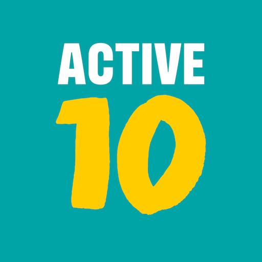
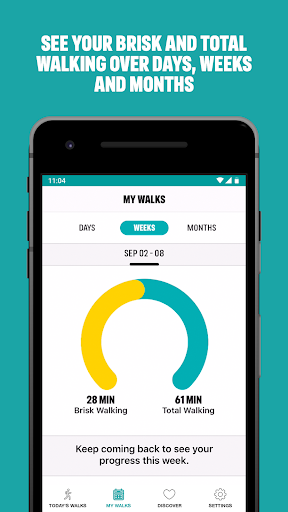
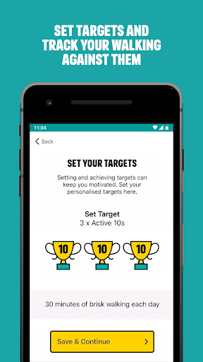
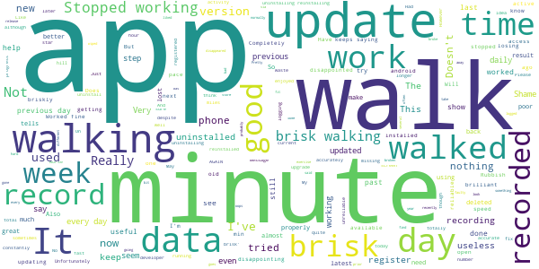

# One You Active 10 Walking Tracker
App version ``4.1.0``

Analyzed with [covid-apps-observer](http://github.com/covid-apps-observer) project, version ``0.1``

## App overview
| | |
|-------------------------|-------------------------| 
| **Name**                                          | One You Active 10 Walking Tracker |
| **Unique identifier** | uk.ac.shef.oak.pheactiveten |
| **Link to Google Play** | [https://play.google.com/store/apps/details?id=uk.ac.shef.oak.pheactiveten](https://play.google.com/store/apps/details?id=uk.ac.shef.oak.pheactiveten) |
| **Summary**  | Active 10 shows you when you are walking quickly enough to get health benefits. |
| **Privacy policy** | [https://www.nhs.uk/oneyou/privacy-policy#H6QQyKsRuuBpI7Dg.97](https://www.nhs.uk/oneyou/privacy-policy#H6QQyKsRuuBpI7Dg.97) |
| **Latest version** | 4.1.0 |
| **Last update** | 2020-10-06 14:21:07 |
| **Recent changes** | We release regular updates to the Active 10 app to fix issues and improve performance.  In this release we have completed some minor bug fixes under the hood. |
| **Installs**  | 100,000+ |
| **Category** | Health & Fitness |
| **First release** | Mar 3, 2017 |
| **Size**  | 18M |
| **Supported Android version**  | 5.1 and up |

### Description
> Active 10 is a free and easy to use walking app that tracks your walking and shows you how you can increase your intensity to benefit your health. The app is designed to support you every step of the way to increase your daily level of physical activity, with simple and achievable milestones and rewards along the way.
 Key features:
 * Tracks all your walking and how many minutes were brisk
 * Rewards every brisk minute achieved throughout the day, so perfect for those starting from low levels of activity
 * Promotes goal setting to help keep you motivated and help you progress
 * Store and view up to 12 months of your walking activity, to see how far you have come 
 * Discover loads of hints and tips on achieving a healthier lifestyle
 BRISK WALKING BENEFITS YOUR HEALTH
 We all know how important it is to be active. The good news is you don’t have to go to the gym or start expensive fitness programmes, walking counts too!
 Just ten minutes of brisk walking every day can get your heart pumping and can make you feel more energetic, as well as lowering your risk of serious illnesses like heart disease and type 2 diabetes. Going for a brisk walk is a great way to clear your head and improve your mood.
 Active 10s are simple to fit into your day. From taking the dog out to going for a lunchtime walk there are lots of opportunities to introduce brisk walking into your daily routine.
 This app relies on your phone’s inbuilt sensors to measure your activity so you may experience varying levels of accuracy especially in older devices/operating systems. To improve accuracy, keep your phone in a pocket close to your body rather than in a loose coat pocket or bag.
 If you have any feedback on how we can improve the app please send it to oneyou@phe.gov.uk.
 Frequently asked questions: https://www.nhs.uk/oneyou/active10/faqs

### User interface
The developers of the app provide the following screenshots in the Google play store.
| | | |
|:-------------------------:|:-------------------------:|:-------------------------:|
 |   |   |   | 
 |   |  

## Development team
In the following we report the main information provided by the development team in the Google play store.

| | |
|-------------------------|-------------------------|
| **Developer**  | Public Health England Digital |
| **Website**  | [http://www.nhs.uk/oneyou/active10](http://www.nhs.uk/oneyou/active10) |
| **Email** | oneyou@phe.gov.uk |
| **Physical address**  | - |
| **Other developed apps**  | [https://play.google.com/store/apps/developer?id=Public+Health+England+Digital](https://play.google.com/store/apps/developer?id=Public+Health+England+Digital) |

## Android support

| | |
|-------------------------|-------------------------|
| **Declared target Android version**  | Pie, version 9 (API level 28) |
| **Effective target Android version**  | Pie, version 9 (API level 28) |
| **Minimum supported Android version**  | Lollipop, version 5.1 (API level 22) |
| **Maximum target Android version**  | - |

The larger the difference between the minimum and maximum supported Android versions, the better. A larger difference means a wider audience. For example, old phones have a very low Android version, so a high minimum supported Android version means that the app cannot be used by users with old phones, thus leading to accessibility problems. 

## Requested permissions

In the following we report the complete list of the permissions requested by the app. 

| **Permission** | **Protection level** | **Description** | 
|-------------------------|-------------------------|-------------------------|
 **android.permission ACCESS_FINE_LOCATION** | :warning:**Dangerous** | Allows an app to access precise location. 
 **android.permission ACCESS_NETWORK_STATE** | Normal | Allows applications to access information about networks. 
 **android.permission ACCESS_WIFI_STATE** | Normal | Allows applications to access information about Wi-Fi networks. 
 **android.permission INTERNET** | Normal | Allows applications to open network sockets. 
 **android.permission MODIFY_AUDIO_SETTINGS** | Normal | Allows an application to modify global audio settings. 
 **android.permission READ_EXTERNAL_STORAGE** | :warning:**Dangerous** | Allows an application to read from external storage. 
 **android.permission RECEIVE_BOOT_COMPLETED** | Normal | Allows an application to receive the Intent.ACTION_BOOT_COMPLETED that is broadcast after the system finishes booting. 
 **android.permission RECORD_AUDIO** | :warning:**Dangerous** | Allows an application to record audio. 
 **android.permission WAKE_LOCK** | Normal | Allows using PowerManager WakeLocks to keep processor from sleeping or screen from dimming. 
 **android.permission WRITE_EXTERNAL_STORAGE** | :warning:**Dangerous** | Allows an application to write to external storage. 
 **com.google.android.c2dm.permission RECEIVE** | - | - 
 **com.google.android.finsky.permission BIND_GET_INSTALL_REFERRER_SERVICE** | - | - 

## Mentioned servers

| **Server** | **Registrant** | **Registrant country** | **Creation date** | 
|-------------------------|-------------------------|-------------------------|-------------------------|
 | googleapis.com | Google LLC | :us: US | 2005-01-25 17:52:26 |
 | phedigital.co.uk | - | - | 2018-06-06 00:00:00 |
 | paragon-cc.co.uk | - | - | 2017-04-04 00:00:00 |
 | nhs.uk | Department of Health | - | 1996-08-01 00:00:00 |
 | googlesyndication.com | Google LLC | :us: US | 2003-01-21 06:17:24 |
 | google.com | Google LLC | :us: US | 1997-09-15 04:00:00 |
 | app-measurement.com | Google LLC | :us: US | 2015-06-19 20:13:31 |
 | instabug.com | - | :us: US | 2000-05-16 23:13:25 |
 | crashlytics.com | Google LLC | :us: US | 2011-01-21 15:30:40 |
 | googleadservices.com | Google LLC | :us: US | 2003-06-19 16:34:53 |

## Security analysis 

Below we report the main security warnings raised by our execution of the [Androwarn](https://github.com/maaaaz/androwarn) security analysis tool.

**Telephony identifiers leakage**
> - This application reads the numeric name (MCC+MNC) of current registered operator 
> - This application reads the operator name 

**Connection interfaces exfiltration**
> - This application reads details about the currently active data network 
> - This application tries to find out if the currently active data network is metered 

**Audio video eavesdropping**
> - This application records audio from the 'MIC' source  

**Suspicious connection establishment**
> - This application opens a Socket and connects it to the remote address ': ; port is out of range' on the 'N/A' port  
> - This application opens a Socket and connects it to the remote address 'Lc/b/a/a/a;->a(Ljava/lang/String;)Ljava/lang/StringBuilder;' on the 'N/A' port  
> - This application opens a Socket and connects it to the remote address 'Ljava/net/Proxy;->type()Ljava/net/Proxy$Type;' on the 'N/A' port  
> - This application opens a Socket and connects it to the remote address 'timeout' on the 'N/A' port  

**Code execution**
> - This application loads a native library 
> - This application loads a native library: 'constant' 
> - This application executes a UNIX command 
> - This application executes a UNIX command containing this argument: '' 

## User ratings and reviews

Below we provide information about how end users are reacting to the app in terms of ratings and reviews in the Google Play store.

### Ratings

The One You Active 10 Walking Tracker app has been installed by more than **100000** times. At this time, **3985** rated the app and its average score is **4.235589**. Below we show the distribution of the ratings across the usual star-based rating of Google Play

:star::star::star::star::star:: 2239

:star::star::star::star:: 1079

:star::star::star:: 279

:star::star:: 149

:star:: 239

### Reviews 

#### 5-star reviews

> Unpressurised yet still strangely motivating. Good record of what you've done on the graphs.  :date: __2020-11-29 14:12:01__

> Simple and Effective.  :date: __2020-11-29 12:20:37__

> Excellent motivator! The first time I used it, I realised I needed to upgrade my walking a bit to make it 'brisker'😃...it is an easy to use app and lovely to see those trophies after a good brisk walk...wish it would pick my 'brisk' cycling moves too☺  :date: __2020-11-28 19:40:21__

> Great way of recording activity.  :date: __2020-11-28 18:34:29__

> Brilliant  :date: __2020-11-27 20:22:21__

> Is is a simple app in terms of information but that's why I like it. I can clearly see that some days I'm v active and some days not so, it reminds me to do something simple, like go for a brisk walk. I have other apps for teaching runs etc but I love this app as it gives me an overall snapshot of my daily and weekly brisk movement.  :date: __2020-11-26 16:07:14__

> Great motivation  :date: __2020-11-26 14:47:05__

> Very easy and simple to use and understand  :date: __2020-11-26 14:29:00__

> Very good it will be even better if you can accommodate steps in your app  :date: __2020-11-25 19:02:45__

> Good  :date: __2020-11-25 11:35:02__

#### 4-star reviews

> Makes me go out for a walk even if I dont have much time. If I achieve my target I treat myself.  :date: __2020-11-29 13:07:56__

> The app has made me more active, however would be better if it showed distance walked based on an average step length.  :date: __2020-11-27 10:50:12__

> A good, simple app, tracks my walking time with the hounds  :date: __2020-11-23 14:39:07__

> I've persevered with the app and it improved to 5 star standard. It was used in conjunction with a Fitbit; they gave comprehensive information together, particularly when used for backpacking or trying new walks. Unfortunately the comprehensive output of the original, where you could see where active minutes were lost due to using gates, stiles bogs etc., has been replaced with a trophy icon for every 10 mins that reduces it usefulness quite considerably, without losing its core purpose.  :date: __2020-11-23 10:23:10__

> Very useful and encouraging to exercise.  :date: __2020-11-23 09:53:41__

> Wonderful software.  :date: __2020-11-21 15:42:45__

> Motivating to move. This app allows me to track how much brisk walking I've done without any kerfuffle. And keeps a record so I can see day by day week by week.  :date: __2020-11-20 16:45:16__

> Helps me stay on track  :date: __2020-11-17 13:41:04__

> Very useful. It has helped my husband immensely to recover from a heart attack in our first lockdown. As he could not have proper rehab at hospital, his recovery was very much in his hands with just telephone consults as guidance. He could track how much of his walking was brisk and improve in a sensible and safe timeframe as dictated by the hospital.  :date: __2020-11-15 13:12:22__

> Clear and not fussy.  :date: __2020-11-15 09:32:11__

#### 3-star reviews

> Generally good and has motivated me to get a faster pace and do that for me time. Some irritations, however. I would like to set a (much) higher target but 30 mins a day is the maximum. Also, totals seem very slow to update at times and you have to close the app and open again. E.g. Its Sunday and yet my Saturday walk was still not reflected in the weekly figurea until I shut the app.  :date: __2020-11-29 23:42:05__

> I would like the app to dostep counter as well as distance and pace record  :date: __2020-11-25 14:34:13__

> Reach goals every day  :date: __2020-11-23 20:09:33__

> OK ish  :date: __2020-11-19 17:11:19__

> If you exceed your target the app doesn't recognise that and tells you 'keep going' for the target.  :date: __2020-11-16 10:42:09__

> Loads quicker than the earlier version, but otherwise inferior. Needs to allow more than 30 minutes as a target, also appears to under-record brisk walking.  :date: __2020-11-10 18:47:51__

> 9 November 2020: it works better than it used to, except I keep getting messages to update, I click the update button but the update doesn't happen. So annoying. Still, this app got me walking, and I've got healthier because of it.  :date: __2020-11-09 11:15:39__

> Active 10 just did an update and got rid of all my walks! Very annoying  :date: __2020-11-05 14:23:04__

> Why does it ask, every time it starts, to get the latest updates, when it has the latest version?? It'll be removed if it continues to annoy me.  :date: __2020-11-04 10:02:55__

> It is a good, useful and simple tracker. I like the use of time. Would prefer if it allowed you to set higher targets but it's good enough for me. I gave it 4 stars when I left that review but for some reason it now asks to be updated every day!! I reinstalled it to try and stop this but it wiped all my data! So now downgrading to 3 stars.  :date: __2020-11-02 20:04:34__

#### 2-star reviews

> I was enjoying this app and it was great for getting you motivated about getting out and about. I have just clicked on it and it's not showing that I did any walking for the last 2 days!! I walk to work, so it should show. It was all there yesterday, but now nothing. Seems pointless using the app of it's going to delete what I've done, that's not very motivating..  :date: __2020-11-29 08:23:41__

> It does not work offline and i hate that  :date: __2020-11-17 08:29:56__

> App needs tweaking. Just walked for 25 mins app says 8 mins active that's all, not recorded the other 17 mins at all, I know phone senser is working as samsung health has recorded correctly. Also it can't add up,yesterday the daily "today" says I've done "32" mins of brisk walking then tells me I've NEARLY achieved 3 x10min awards, but it shows 3 gold cups. I also get fed up of it asking me to "update" everytime I open the app, if I choose "ok" there is clearly no new update  :date: __2020-11-13 12:01:01__

> I like the app, it's simple and tells me exactly what I need to know. But the latest version keeps prompting to update, very annoying!!  :date: __2020-11-08 20:04:35__

> Keeps telling me an update is available. As far as I can tell Ihave already downloaded it  :date: __2020-11-05 13:45:47__

> Very basic, but good enough. Been using for a year now and no major problems. A few extra features would make it more useful, but then I guess complexity could compromise the quality and reliability. UPDATE: New version is buggy. It keeps saying there is an update when I am on the latest.  :date: __2020-11-05 10:13:24__

> App does not give distance travelled, constantly reminds about an update but if you try to update your taken to the option to download same version as already installed. Not good.  :date: __2020-10-23 23:50:09__

> Doesn't register cycling big disappointment,wants to update every time I open the app.  :date: __2020-10-17 08:45:49__

> Seems a bit hit and miss since upgrade, probably by Serco. 2 people did same walk and it registers 130 mins for 1 and 237 for the other ??!  :date: __2020-10-17 01:08:09__

> 1850's patronising user interface  :date: __2020-10-09 08:02:49__

#### 1-star reviews

> Not working properly, even when brisk walking, says no brisk walking, was OK, up until about 2 weeks ago.... now does not register steps correctly 🙄  :date: __2020-11-29 13:59:30__

> Not accurate  :date: __2020-11-28 23:02:54__

> Nov 2020 - decided to try app again but it crashed twice this past week and can't get any help from the developers. May 2020 - the app has again deleted all my data - which is even more upsetting given how much effort I've been making during lock down to move more. I'd give it 1/2 star now and will be looking for a new app. Previous review (Dec 2019) said the app is great but I no longer think so after my data being totally deleted.  :date: __2020-11-27 22:15:58__

> We are having real issues with this app. A 55 minute very brisk walk recently gave us only 6 minutes brisk walking and the following day showed nothing. Losing relevance rapidly!!  :date: __2020-11-27 10:45:56__

> Cannot get app to work. It seems to get into a loop when setting up at the fitness page. I press continue and get taken back to the beginning.  :date: __2020-11-22 11:49:01__

> I only have a 26inch leg so my strides are short, to get it to register as a brisk walk on this app i had to jog for the10min  :date: __2020-11-18 12:46:23__

> Previous version was very good and accurate. Walk the same route at the same speed. Previous version 20 minutes brisk new version 5 minutes brisk. Going to uninstall. It is a waste of time.  :date: __2020-11-10 20:57:41__

> Since I've updated a few weeks ago, it's just not logging anything. Just keeps giving me an annoying 'oops' message.  :date: __2020-11-09 21:59:28__

> Walked very briskly for 40 minutes, and this App didn't register a single movement. It worked well for about two weeks. Very disappointed. Don't bother with this App.  :date: __2020-11-09 18:02:58__

> Not working.. constant update ..walking speed faulty..someone has being adjusting the app parameters.. brilliant app the way it was (pre Nov 20)  :date: __2020-11-09 10:09:06__

