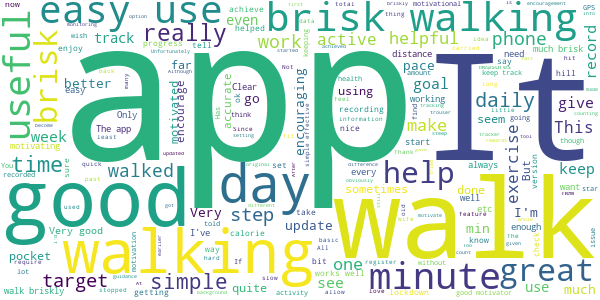
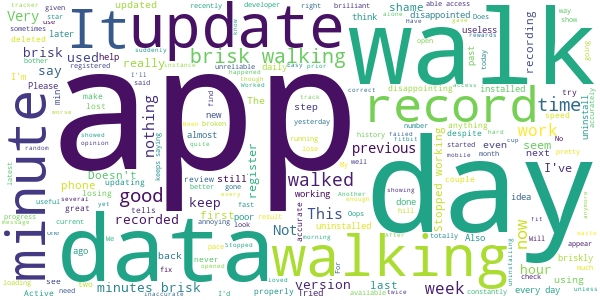

# One You Active 10 Walking Tracker
App version ``5.0.13``

Analyzed with [covid-apps-observer](http://github.com/covid-apps-observer) project, version ``0.1``

## App overview
| | |
|-------------------------|-------------------------| 
| **Name**&nbsp;&nbsp;&nbsp;&nbsp;&nbsp;&nbsp;&nbsp;&nbsp;&nbsp;&nbsp;&nbsp;&nbsp;&nbsp;&nbsp;&nbsp;&nbsp;&nbsp;&nbsp;&nbsp;&nbsp;&nbsp;&nbsp;&nbsp;&nbsp;&nbsp;&nbsp;&nbsp;&nbsp;&nbsp;&nbsp;&nbsp;&nbsp;&nbsp;&nbsp;&nbsp;&nbsp;&nbsp;&nbsp;&nbsp;&nbsp;  | One You Active 10 Walking Tracker |
| **Unique identifier** | uk.ac.shef.oak.pheactiveten |
| **Link to Google Play** | [https://play.google.com/store/apps/details?id=uk.ac.shef.oak.pheactiveten](https://play.google.com/store/apps/details?id=uk.ac.shef.oak.pheactiveten) |
| **Summary**  | Active 10 shows you when you are walking quickly enough to get health benefits. |
| **Privacy policy** | [https://www.nhs.uk/oneyou/privacy-policy#H6QQyKsRuuBpI7Dg.97](https://www.nhs.uk/oneyou/privacy-policy#H6QQyKsRuuBpI7Dg.97) |
| **Latest version** | 5.0.13 |
| **Last update** | 2021-02-01 19:03:16 |
| **Recent changes** | This release features an update to restore the missing data that some users experienced after a previous app update. The app will need to be open in order for the data to be restored. The process may take a few minutes so please keep your app open while it is processing in the background.  |
| **Installs**  | 100,000+ |
| **Category** | Health & Fitness |
| **First release** | Mar 3, 2017 |
| **Size**  | 18M |
| **Supported Android version**  | 5.1 and up |

### Description
> Active 10 is a free and easy to use walking app that tracks your walking and shows you how you can increase your intensity to benefit your health. The app is designed to support you every step of the way to increase your daily level of physical activity, with simple and achievable milestones and rewards along the way.
 Key features:
 * Tracks all your walking and how many minutes were brisk
 * Rewards every brisk minute achieved throughout the day, so perfect for those starting from low levels of activity
 * Promotes goal setting to help keep you motivated and help you progress
 * Store and view up to 12 months of your walking activity, to see how far you have come 
 * Discover loads of hints and tips on achieving a healthier lifestyle
 BRISK WALKING BENEFITS YOUR HEALTH
 We all know how important it is to be active. The good news is you don’t have to go to the gym or start expensive fitness programmes, walking counts too!
 Just ten minutes of brisk walking every day can get your heart pumping and can make you feel more energetic, as well as lowering your risk of serious illnesses like heart disease and type 2 diabetes. Going for a brisk walk is a great way to clear your head and improve your mood.
 Active 10s are simple to fit into your day. From taking the dog out to going for a lunchtime walk there are lots of opportunities to introduce brisk walking into your daily routine.
 This app relies on your phone’s inbuilt sensors to measure your activity so you may experience varying levels of accuracy especially in older devices/operating systems. To improve accuracy, keep your phone in a pocket close to your body rather than in a loose coat pocket or bag.
 If you have any feedback on how we can improve the app please send it to oneyou@phe.gov.uk.
 Frequently asked questions: https://www.nhs.uk/oneyou/active10/faqs

### User interface
The developers of the app provide the following screenshots in the Google play store.
| | | |
|:-------------------------:|:-------------------------:|:-------------------------:|
 |   |   |   | 
 |   |   |   | 

## Development team
In the following we report the main information provided by the development team in the Google play store.

| | |
|-------------------------|-------------------------|
| **Developer**  | Public Health England Digital |
| **Website**  | [http://www.nhs.uk/oneyou/active10](http://www.nhs.uk/oneyou/active10) |
| **Email** | oneyou@phe.gov.uk |
| **Physical address**  | - |
| **Other developed apps**  | [https://play.google.com/store/apps/developer?id=Public+Health+England+Digital](https://play.google.com/store/apps/developer?id=Public+Health+England+Digital) |

## Android support

| | |
|-------------------------|-------------------------|
| **Declared target Android version**  | Android10, version 10 (API level 29) |
| **Effective target Android version**  | Android10, version 10 (API level 29) |
| **Minimum supported Android version**  | Lollipop, version 5.1 (API level 22) |
| **Maximum target Android version**  | - |

The larger the difference between the minimum and maximum supported Android versions, the better. A larger difference means a wider audience. For example, old phones have a very low Android version, so a high minimum supported Android version means that the app cannot be used by users with old phones, thus leading to accessibility problems. 

## Requested permissions

In the following we report the complete list of the permissions requested by the app. 

| **Permission** | **Protection level** | **Description** | 
|-------------------------|-------------------------|-------------------------|
 **android.permission ACCESS_FINE_LOCATION** | :warning:**Dangerous** | Allows an app to access precise location. 
 **android.permission ACCESS_NETWORK_STATE** | Normal | Allows applications to access information about networks. 
 **android.permission ACCESS_WIFI_STATE** | Normal | Allows applications to access information about Wi-Fi networks. 
 **android.permission ACTIVITY_RECOGNITION** | :warning:**Dangerous** | Allows an application to recognize physical activity. 
 **android.permission INTERNET** | Normal | Allows applications to open network sockets. 
 **android.permission MODIFY_AUDIO_SETTINGS** | Normal | Allows an application to modify global audio settings. 
 **android.permission READ_EXTERNAL_STORAGE** | :warning:**Dangerous** | Allows an application to read from external storage. 
 **android.permission RECEIVE_BOOT_COMPLETED** | Normal | Allows an application to receive the Intent.ACTION_BOOT_COMPLETED that is broadcast after the system finishes booting. 
 **android.permission WAKE_LOCK** | Normal | Allows using PowerManager WakeLocks to keep processor from sleeping or screen from dimming. 
 **android.permission WRITE_EXTERNAL_STORAGE** | :warning:**Dangerous** | Allows an application to write to external storage. 
 **com.google.android.c2dm.permission RECEIVE** | - | - 
 **com.google.android.finsky.permission BIND_GET_INSTALL_REFERRER_SERVICE** | - | - 

## Mentioned servers

| **Server** | **Registrant** | **Registrant country** | **Creation date** | 
|-------------------------|-------------------------|-------------------------|-------------------------|
 | nhs.uk | Department of Health | - | 1996-08-01 00:00:00 |
 | googlesyndication.com | Google LLC | :us: US | 2003-01-21 06:17:24 |
 | google.com | Google LLC | :us: US | 1997-09-15 04:00:00 |
 | googleapis.com | Google LLC | :us: US | 2005-01-25 17:52:26 |
 | app-measurement.com | Google LLC | :us: US | 2015-06-19 20:13:31 |
 | instabug.com | - | :us: US | 2000-05-16 23:13:25 |
 | phedigital.co.uk | - | - | 2018-06-06 00:00:00 |
 | paragon-cc.co.uk | - | - | 2017-04-04 00:00:00 |
 | crashlytics.com | Google LLC | :us: US | 2011-01-21 15:30:40 |
 | googleadservices.com | Google LLC | :us: US | 2003-06-19 16:34:53 |

## Security analysis 

Below we report the main security warnings raised by our execution of the [Androwarn](https://github.com/maaaaz/androwarn) security analysis tool.

**Telephony identifiers leakage**
> - This application reads the numeric name (MCC+MNC) of current registered operator 
> - This application reads the operator name 

**Connection interfaces exfiltration**
> - This application reads details about the currently active data network 
> - This application tries to find out if the currently active data network is metered 

**Audio video eavesdropping**
> - This application records audio from the 'MIC' source  

**Suspicious connection establishment**
> - This application opens a Socket and connects it to the remote address 'La/b/a/a/a;->s(Ljava/lang/String;)Ljava/lang/StringBuilder;' on the 'N/A' port  
> - This application opens a Socket and connects it to the remote address 'Ljava/net/Proxy;->type()Ljava/net/Proxy$Type;' on the 'N/A' port  
> - This application opens a Socket and connects it to the remote address 'hostname == null ' on the 'N/A' port  
> - This application opens a Socket and connects it to the remote address 'timeout' on the 'N/A' port  

**Code execution**
> - This application loads a native library 
> - This application loads a native library: 'constant' 
> - This application executes a UNIX command 
> - This application executes a UNIX command containing this argument: '' 

## User ratings and reviews

Below we provide information about how end users are reacting to the app in terms of ratings and reviews in the Google Play store.

### Ratings

The One You Active 10 Walking Tracker app has been installed by more than **100000** times. At this time, **4309** rated the app and its average score is **3.983871**. Below we show the distribution of the ratings across the usual star-based rating of Google Play

:star::star::star::star::star:: 2275

:star::star::star::star:: 963

:star::star::star:: 327

:star::star:: 218

:star:: 526

### Reviews 

#### 5-star reviews

> It really helps as a kind of reminder to get out as often as possible for a brisk walk, which I know is very important for my general fitness...and I feel 'rewarded' when I get my results!!  :date: __2021-03-14 13:16:46__

> Very helpful tool to watch excersise on a daily basis  :date: __2021-03-13 13:59:23__

> Really helps encourage me to walk and move more. Simple and easy to use. Love it!!  :date: __2021-03-13 12:11:03__

> Excellent app absolute love it as a newbie to exercise even my 14 Yr old uses it to collect trophies  :date: __2021-03-13 11:52:03__

> i think it is absolutely brilliant, i enjoy using it and it does encourage you to put that extra spring in your step so thankyou 😁😁  :date: __2021-03-11 10:33:39__

> Easy to use. Great app.  :date: __2021-03-10 20:48:49__

> Encouraging and positive. Love it.  :date: __2021-03-09 10:17:19__

> It is simple to use, enabling a neat way of setting personal goals. The visual displays are excellent and it makes me smile when confetti or what ever it is gently drops down the screen in recognition of exceeding the set goal. Highly recommend this app if you are keen to keep fit through walking.  :date: __2021-03-08 20:38:39__

> Love this. Helps me increase my brisk walking.  :date: __2021-03-07 16:13:05__

> Excellent app tracks just what I needed shows achievement very easily  :date: __2021-03-07 13:54:17__

#### 4-star reviews

> Good  :date: __2021-03-14 15:05:01__

> Useful record of exercise taken.  :date: __2021-03-13 16:50:39__

> Useful and easy to use  :date: __2021-03-07 12:47:17__

> Sometimes I walk fast and the tracker doesn't register it as brisk.  :date: __2021-03-05 13:06:01__

> Great app. Simple, straight forward. Has motivated me to up my brisk walking and achieve simple goals. Stops me taking short cuts on my walk.  :date: __2021-03-05 11:48:10__

> It's good to feel the achievement of meeting your goal but I'd like it beyter c there was a step count too.  :date: __2021-03-04 19:45:10__

> Find this app very good and easy to use.  :date: __2021-03-04 14:22:17__

> Too intrusive. It wants an email address and wants to access too many features on my phone.  :date: __2021-03-03 20:20:15__

> I love this app and use it daily. Only gripe is that you can only have a target of 30 minutes maximum.  :date: __2021-02-26 01:48:55__

> Measures brisk walking via GPS. I feel better having completed a few active 10s. 10 minutes brisk. Apparently very good for you. Gives award icons.  :date: __2021-02-25 08:54:00__

#### 3-star reviews

> Very informative and encouraging. However the app lags a lot. Sometimes it doesn't record the walks or minutes I have spent because of cellullar signal problems. :(  :date: __2021-03-11 12:50:35__

> Brilliant when it works but sometimes it doesn't record brisk walking even though nearly running. I think it depends a lot on which pocket it is in although today it was in my usual coat pocket and I definitely walked briskly because there was a freezing cold wind but recorded 50 mins walking only 5 brisk. On the plus side I love the rosettes and badges. I would like to be able to set for more brisk minutes than 30.  :date: __2021-03-10 17:55:04__

> Great app, would be a good feature if you could add your minutes in manually as it can be quite difficult to always carry the phone on your body so it can measure you walking. In the summer it will be impossible to carry the phone and push a pram or carry bags when a lot of ladies clothes don't have pockets big enough for a phone. Other than that good app  :date: __2021-03-07 15:29:14__

> Doesn't always work even though I always take my phone with me in my pocket when I'm walking.  :date: __2021-03-05 08:45:24__

> Quite handy but seems a little glitchy as i can be practically running but its not registering my steps as active.  :date: __2021-03-02 20:46:18__

> Downloaded this to measure what I do. As a person with a disability it is slightly disappointing. I walked for 15mins as briskly as I could and it left me out of breath, however, this apparently wasn't good enough to register as brisk. Trust me, for me it was very brisk. It needs to be able to be adjusted to take these things into account.  :date: __2021-02-21 16:50:12__

> It's an ok app to get you motivated and doing a daily walk. Like others have said it only seems to monitor the really brisk walking. Doesn't take into account inclines. It has made me move more alongside the NHS 12 week plan . Say if you set off to do 20 minutes and it hasn't monitored the slower walk due to a hill. It might only have registered 18 minutes of the brisk walking. I have then found myself going out again to complete the full 20 minutes. So I suppose it does work hahaha  :date: __2021-02-20 12:43:42__

> Good idea but a little glitchy  :date: __2021-02-20 12:20:44__

> Useful when working properly but not reliable. Sometimes only registers 12 minutes walking on a 30 minute walk. The brisk count seems to be okay now.  :date: __2021-02-17 09:53:54__

> Does encourage me to walk faster for longer. However doesn't always count brisk steps which is really frustrating and annoying.  :date: __2021-02-16 09:02:41__

#### 2-star reviews

> It just doesn't register much of my brisk walking. Seems completely random, some days all is fine, other days only about 10% registers.  :date: __2021-03-06 17:09:46__

> Frustrating. App regularly loses all records. This did not use to happen  :date: __2021-03-06 11:41:19__

> My phone came with this app installed & I used it for years. Sadly it now requires me to enter a password for a samsung account which I don't have. My phone is quite old, & I imagine this is something which has come in since I got it. There seems to be no way through this, so I cannot use it any more & have lost my data. If not for this I would have given 4 stars. I found it very useful.  :date: __2021-02-16 19:39:53__

> Doesn't take into consideration somebody's starting fitness level or age. I went for a walk for 40 minutes in the snow came back sweating and out of breath. My doctor says that is a brisk walk and good for me the app size I did 5-minutes. I feel that you need to be jogging for it to say you're walking briskly. Not all bad it does tell you how long you've been walking for.  :date: __2021-02-10 17:04:25__

> Very disappointed that the app doesn't always count the brisk steps. If I put my phone in my pocket it counts steps but not brisk steps. I have to hold the phone in my hand for it to work properly. It took me a long while to work this out. It was helpful to read that other people had experienced the same problem and I tried holding it as a result. Nowhere on the app to discuss problems like this. When it does count accurately I find it very useful and motivating.  :date: __2021-02-10 13:31:15__

> A 20 minute walk is apparently 40 minutes. Unsure if this actually measures the time of the walk correctly however it definitely encourages you to be more active. I'd give it more if it was more accurate.  :date: __2021-02-06 21:27:37__

> Recently has consistently failed to record what I know must be brisk walking given the number of people I overtake, and the distance. Am going to uninstall. Disappointing.  :date: __2021-02-05 16:21:50__

> Sometimes works sometimes doesn't.. Bit more than frustrating at times... Still the steps are done which is the point..  :date: __2021-02-04 12:38:59__

> Doesn't recognize brisk walking on my HTC desire 530, even if I jog and I've tried it in every pocket.  :date: __2021-02-01 19:11:34__

> Although it's an encouraging app, I've noticed it's not completely accurate but helps general motivational. I would be really happy if it actually measured the distances walked or run.  :date: __2021-01-28 14:56:11__

#### 1-star reviews

> Very disappointed to find that the app doesn't record activities offline. Useless.  :date: __2021-03-07 09:02:45__

> This app still loses data even after the update to correct. Recorded my walk yesterday but when I opened the app an hour later to record data, it showed nothing for the day. No historic info is being kept for more than a few hours..  :date: __2021-03-05 18:15:16__

> My app has gone into a weird state and won't work anymore. Upon loading it displays a message "Oops! We don't seem to be able to access your walking data right now. Please check back later" I've already confirmed that all app permissions are enabled. Also I'd tried uninstalling/reinstalling and deleting app cache/data... all to no avail. Not clear how to seek support for this app!  :date: __2021-03-05 01:50:22__

> The app suddenly stopped working after 6 days. I have reinstalled it, but very disappointed as it was quite motivating.  :date: __2021-02-25 08:17:55__

> Easy to use app but totally inaccurate. After my last positive review I have changed my opinion. My watch and mobile can say fir instance I gave walked for two hours yet the app will say I have walked 41 minutes with 10 minutes of it brisk, it makes no sense. Initially it was accurate now its pretty useless.  :date: __2021-02-19 18:39:00__

> Been using this for several weeks. Opened it this morning, empty, no history, nothing retained. Pissed off.  :date: __2021-02-19 08:21:19__

> For a supposedly motivational app, this one is astonishingly demotivating! Regularly removing "Active" minutes a few hours after awarding them is not good. It has now started not recording anything about 1 day in 3 - just pretends my brisk walking didn't happen!  :date: __2021-02-11 12:49:37__

> It hasn't registered my walks for the last few days, definitely walking 'briskly' enough! Disappointed.  :date: __2021-02-09 13:42:28__

> I have no idea what you have to do to register brisk walking. I was walking at a pace to make me breath hard and built a sweat keeping the pace steady up and down hills. Result 31 minutes 0 brisk. Tried it again. This time despite walking for a couple of hours at the weekend and one again today, the app failed to record that I had walked at all, let alone briskly. It is therefore useless. Time to uninstall.  :date: __2021-02-03 12:30:13__

> Very poor app. Have installed and used it twice now. Both times my fitbit tracker recorded over 100 minutes brisk walking. This app recorded 3 minutes the first walk, and 19 the next. I have deleted it and won't bother again.  :date: __2021-01-31 12:59:27__

