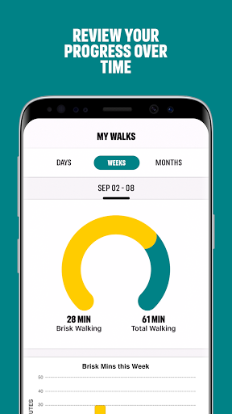

# One You Active 10 Walking Tracker
App version ``5.0.13``

Analyzed with [covid-apps-observer](http://github.com/covid-apps-observer) project, version ``0.1``

## App overview
| | |
|-------------------------|-------------------------| 
| **Name**&nbsp;&nbsp;&nbsp;&nbsp;&nbsp;&nbsp;&nbsp;&nbsp;&nbsp;&nbsp;&nbsp;&nbsp;&nbsp;&nbsp;&nbsp;&nbsp;&nbsp;&nbsp;&nbsp;&nbsp;&nbsp;&nbsp;&nbsp;&nbsp;&nbsp;&nbsp;&nbsp;&nbsp;&nbsp;&nbsp;&nbsp;&nbsp;&nbsp;&nbsp;&nbsp;&nbsp;&nbsp;&nbsp;&nbsp;&nbsp;  | One You Active 10 Walking Tracker |
| **Unique identifier** | uk.ac.shef.oak.pheactiveten |
| **Link to Google Play** | [https://play.google.com/store/apps/details?id=uk.ac.shef.oak.pheactiveten](https://play.google.com/store/apps/details?id=uk.ac.shef.oak.pheactiveten) |
| **Summary**  | Active 10 shows you when you are walking quickly enough to get health benefits. |
| **Privacy policy** | [https://www.nhs.uk/oneyou/privacy-policy#H6QQyKsRuuBpI7Dg.97](https://www.nhs.uk/oneyou/privacy-policy#H6QQyKsRuuBpI7Dg.97) |
| **Latest version** | 5.0.13 |
| **Last update** | 2021-02-01 19:03:16 |
| **Recent changes** | This release features an update to restore the missing data that some users experienced after a previous app update. The app will need to be open in order for the data to be restored. The process may take a few minutes so please keep your app open while it is processing in the background.  |
| **Installs**  | 100,000+ |
| **Category** | Health & Fitness |
| **First release** | Mar 3, 2017 |
| **Size**  | 18M |
| **Supported Android version**  | 5.1 and up |

### Description
> Active 10 is a free and easy to use walking app that tracks your walking and shows you how you can increase your intensity to benefit your health. The app is designed to support you every step of the way to increase your daily level of physical activity, with simple and achievable milestones and rewards along the way.
 Key features:
 * Tracks all your walking and how many minutes were brisk
 * Rewards every brisk minute achieved throughout the day, so perfect for those starting from low levels of activity
 * Promotes goal setting to help keep you motivated and help you progress
 * Store and view up to 12 months of your walking activity, to see how far you have come 
 * Discover loads of hints and tips on achieving a healthier lifestyle
 BRISK WALKING BENEFITS YOUR HEALTH
 We all know how important it is to be active. The good news is you don’t have to go to the gym or start expensive fitness programmes, walking counts too!
 Just ten minutes of brisk walking every day can get your heart pumping and can make you feel more energetic, as well as lowering your risk of serious illnesses like heart disease and type 2 diabetes. Going for a brisk walk is a great way to clear your head and improve your mood.
 Active 10s are simple to fit into your day. From taking the dog out to going for a lunchtime walk there are lots of opportunities to introduce brisk walking into your daily routine.
 This app relies on your phone’s inbuilt sensors to measure your activity so you may experience varying levels of accuracy especially in older devices/operating systems. To improve accuracy, keep your phone in a pocket close to your body rather than in a loose coat pocket or bag.
 If you have any feedback on how we can improve the app please send it to oneyou@phe.gov.uk.
 Frequently asked questions: https://www.nhs.uk/oneyou/active10/faqs

### User interface
The developers of the app provide the following screenshots in the Google play store.
| | | |
|:-------------------------:|:-------------------------:|:-------------------------:|
 |   |   |   | 
 |   |   |   | 

## Development team
In the following we report the main information provided by the development team in the Google play store.

| | |
|-------------------------|-------------------------|
| **Developer**  | Public Health England Digital |
| **Website**  | [http://www.nhs.uk/oneyou/active10](http://www.nhs.uk/oneyou/active10) |
| **Email** | oneyou@phe.gov.uk |
| **Physical address**  | - |
| **Other developed apps**  | [https://play.google.com/store/apps/developer?id=Public+Health+England+Digital](https://play.google.com/store/apps/developer?id=Public+Health+England+Digital) |

## Android support

| | |
|-------------------------|-------------------------|
| **Declared target Android version**  | Android10, version 10 (API level 29) |
| **Effective target Android version**  | Android10, version 10 (API level 29) |
| **Minimum supported Android version**  | Lollipop, version 5.1 (API level 22) |
| **Maximum target Android version**  | - |

The larger the difference between the minimum and maximum supported Android versions, the better. A larger difference means a wider audience. For example, old phones have a very low Android version, so a high minimum supported Android version means that the app cannot be used by users with old phones, thus leading to accessibility problems. 

## Requested permissions

In the following we report the complete list of the permissions requested by the app. 

| **Permission** | **Protection level** | **Description** | 
|-------------------------|-------------------------|-------------------------|
 **android.permission ACCESS_FINE_LOCATION** | :warning:**Dangerous** | Allows an app to access precise location. 
 **android.permission ACCESS_NETWORK_STATE** | Normal | Allows applications to access information about networks. 
 **android.permission ACCESS_WIFI_STATE** | Normal | Allows applications to access information about Wi-Fi networks. 
 **android.permission ACTIVITY_RECOGNITION** | :warning:**Dangerous** | Allows an application to recognize physical activity. 
 **android.permission INTERNET** | Normal | Allows applications to open network sockets. 
 **android.permission MODIFY_AUDIO_SETTINGS** | Normal | Allows an application to modify global audio settings. 
 **android.permission READ_EXTERNAL_STORAGE** | :warning:**Dangerous** | Allows an application to read from external storage. 
 **android.permission RECEIVE_BOOT_COMPLETED** | Normal | Allows an application to receive the Intent.ACTION_BOOT_COMPLETED that is broadcast after the system finishes booting. 
 **android.permission WAKE_LOCK** | Normal | Allows using PowerManager WakeLocks to keep processor from sleeping or screen from dimming. 
 **android.permission WRITE_EXTERNAL_STORAGE** | :warning:**Dangerous** | Allows an application to write to external storage. 
 **com.google.android.c2dm.permission RECEIVE** | - | - 
 **com.google.android.finsky.permission BIND_GET_INSTALL_REFERRER_SERVICE** | - | - 

## Mentioned servers

| **Server** | **Registrant** | **Registrant country** | **Creation date** | 
|-------------------------|-------------------------|-------------------------|-------------------------|
 | nhs.uk | Department of Health | - | 1996-08-01 00:00:00 |
 | googlesyndication.com | Google LLC | :us: US | 2003-01-21 06:17:24 |
 | google.com | Google LLC | :us: US | 1997-09-15 04:00:00 |
 | googleapis.com | Google LLC | :us: US | 2005-01-25 17:52:26 |
 | app-measurement.com | Google LLC | :us: US | 2015-06-19 20:13:31 |
 | instabug.com | - | :us: US | 2000-05-16 23:13:25 |
 | phedigital.co.uk | - | - | 2018-06-06 00:00:00 |
 | paragon-cc.co.uk | - | - | 2017-04-04 00:00:00 |
 | crashlytics.com | Google LLC | :us: US | 2011-01-21 15:30:40 |
 | googleadservices.com | Google LLC | :us: US | 2003-06-19 16:34:53 |

## Security analysis 

Below we report the main security warnings raised by our execution of the [Androwarn](https://github.com/maaaaz/androwarn) security analysis tool.

**Telephony identifiers leakage**
> - This application reads the numeric name (MCC+MNC) of current registered operator 
> - This application reads the operator name 

**Connection interfaces exfiltration**
> - This application reads details about the currently active data network 
> - This application tries to find out if the currently active data network is metered 

**Audio video eavesdropping**
> - This application records audio from the 'MIC' source  

**Suspicious connection establishment**
> - This application opens a Socket and connects it to the remote address 'La/b/a/a/a;->s(Ljava/lang/String;)Ljava/lang/StringBuilder;' on the 'N/A' port  
> - This application opens a Socket and connects it to the remote address 'Ljava/net/Proxy;->type()Ljava/net/Proxy$Type;' on the 'N/A' port  
> - This application opens a Socket and connects it to the remote address 'hostname == null ' on the 'N/A' port  
> - This application opens a Socket and connects it to the remote address 'timeout' on the 'N/A' port  

**Code execution**
> - This application loads a native library 
> - This application loads a native library: 'constant' 
> - This application executes a UNIX command 
> - This application executes a UNIX command containing this argument: '' 

## User ratings and reviews

Below we provide information about how end users are reacting to the app in terms of ratings and reviews in the Google Play store.

### Ratings

The One You Active 10 Walking Tracker app has been installed by more than **100000** times. At this time, **4309** rated the app and its average score is **3.983871**. Below we show the distribution of the ratings across the usual star-based rating of Google Play

:star::star::star::star::star:: 2275

:star::star::star::star:: 963

:star::star::star:: 327

:star::star:: 218

:star:: 526

### Reviews 

#### 5-star reviews

> A great incentive to help you keep active.  :date: __2021-02-13 14:06:38__

> Simply but effective way to encourage maintaining a brisk pace.  :date: __2021-02-13 09:24:34__

> Excellent App!  :date: __2021-02-12 14:42:38__

> One of the best app I'll added 10/10  :date: __2021-02-11 11:58:28__

> Makes me want to go out for a walk really enjoying the app  :date: __2021-02-10 18:45:57__

> Useful to make sure you are getting the most health benefits from walking. Good motivation to get out every day. Enjoying having a daily goal to aim for and it spurs me to do an extra few minutes to make sure I get the next Active 10 trophy!  :date: __2021-02-10 10:41:37__

> It's motivating, I have only been using the app for just over a week, and I set myself daily challenges to do a bit more than the day before. It's easy to use, and u can see your progress. Whether ur walking for 10 mins a day, or going on an expedition, it's brilliant, and you feel good when u look at your progress. Highly recommended  :date: __2021-02-09 14:17:57__

> Great little app  :date: __2021-02-09 13:31:28__

> Use this app every day and found it really useful and makes me feel good knowing how well I have done.  :date: __2021-02-08 19:00:13__

> Works great, really motivating.  :date: __2021-02-08 17:09:42__

#### 4-star reviews

> Love this app, it has got me walking.  :date: __2021-02-11 19:10:40__

> Helping me get more motivated. Walking more getting my daily steps up. Thanks  :date: __2021-02-11 13:41:11__

> Ok  :date: __2021-02-10 17:15:00__

> Good for timing your walks  :date: __2021-02-10 14:12:34__

> Good and easy to use. Puzzled why it will say I have achieved a target for a whole week when I have had days I haven't been outside!  :date: __2021-02-09 14:45:33__

> I downloaded this app as although I walked every day I was concerned that it wasn't beneficial to my health . This app tracks brisk walking that is walking that gets your heart beating and burns fat. So far I'm impressed with the app.  :date: __2021-02-08 23:14:37__

> Thankfully it works without me remembering to open app. 10 minutes is hard with a slow dog in lockdown!  :date: __2021-02-08 09:42:07__

> Simple app that records minutes of brisk walking, which can be a good incentive for some.  :date: __2021-02-05 20:09:20__

> Nice and simple.  :date: __2021-02-05 17:14:59__

> Useful and motivational app.  :date: __2021-02-04 17:38:10__

#### 3-star reviews

> Not easy to understand.  :date: __2021-02-09 21:00:39__

> I find it helpful when it works but some days it doesn't .  :date: __2021-02-08 14:16:50__

> The new version isn't as good as the old one. Not as easy to track down he month's walking. Can we have old one back?  :date: __2021-02-07 13:43:58__

> It was working great keep me motivated until it stopped registering any steps that I had done. Also showed steps one day but were not there the next.  :date: __2021-02-04 07:12:57__

> It's great for motivating me to just do 20-30 mins brisk walking each day. But the minutes it records changes later in the day - reduces! So it may say I did 33 mins brisk, then suddenly it changes to 28 mins brisk - which is very annoying. If they could iron that issue out it would be great.  :date: __2021-02-02 09:15:50__

> Works when it works. When outside walking it picks up the motion. However it doesn't register anything other than time - often erroneously - when eg ballroom dancing or treadmill walking.  :date: __2021-02-01 11:54:48__

> I know I have walked brisk sometimes but the app does not alway pick it up  :date: __2021-01-29 10:14:37__

> Good idea I guess it got me off the sofa but it doesn't always seems to work, seems to depend on which pocket my phone is in which is slightly demotivating.  :date: __2021-01-27 09:12:34__

> Not been using for long. But clear and concise  :date: __2021-01-22 13:38:54__

> It's an ok app. As long as you have your phone in your pocket it records the time you are moving and how much of it was brisk. It does seem to lose the information from one day to another though, which is a bit annoying as you could compare your movements over the last week or months - pointless if it doesn't save continuously. The app does have information, or rather links to other areas, ie healthy eating.  :date: __2021-01-20 12:57:15__

#### 2-star reviews

> Doesn't take into consideration somebody's starting fitness level or age. I went for a walk for 40 minutes in the snow came back sweating and out of breath. My doctor says that is a brisk walk and good for me the app size I did 5-minutes. I feel that you need to be jogging for it to say you're walking briskly. Not all bad it does tell you how long you've been walking for.  :date: __2021-02-10 17:04:25__

> Very disappointed that the app doesn't always count the brisk steps. If I put my phone in my pocket it counts steps but not brisk steps. I have to hold the phone in my hand for it to work properly. It took me a long while to work this out. It was helpful to read that other people had experienced the same problem and I tried holding it as a result. Nowhere on the app to discuss problems like this. When it does count accurately I find it very useful and motivating.  :date: __2021-02-10 13:31:15__

> A 20 minute walk is apparently 40 minutes. Unsure if this actually measures the time of the walk correctly however it definitely encourages you to be more active. I'd give it more if it was more accurate.  :date: __2021-02-06 21:27:37__

> Recently has consistently failed to record what I know must be brisk walking given the number of people I overtake, and the distance. Am going to uninstall. Disappointing.  :date: __2021-02-05 16:21:50__

> Sometimes works sometimes doesn't.. Bit more than frustrating at times... Still the steps are done which is the point..  :date: __2021-02-04 12:38:59__

> Doesn't recognize brisk walking on my HTC desire 530, even if I jog and I've tried it in every pocket.  :date: __2021-02-01 19:11:34__

> Although it's an encouraging app, I've noticed it's not completely accurate but helps general motivational. I would be really happy if it actually measured the distances walked or run.  :date: __2021-01-28 14:56:11__

> Regularly does not track my brisk walking unless I hold the phone in my hand while I walk.  :date: __2021-01-23 10:53:20__

> I walked, and my walks were measured and I got a badge , great! Then walks disappeared😐uninstalled and re installed.. same thing🤷👎 Good idea, but its not working properly  :date: __2021-01-17 15:35:42__

> Works fine on IOS but poor on Android - keeps stopping - can't adjust the target. I uninstalled and reinstalled but still same. All my other apps work fine.  :date: __2021-01-17 02:54:31__

#### 1-star reviews

> For a supposedly motivational app, this one is astonishingly demotivating! Regularly removing "Active" minutes a few hours after awarding them is not good. It has now started not recording anything about 1 day in 3 - just pretends my brisk walking didn't happen!  :date: __2021-02-11 12:49:37__

> It hasn't registered my walks for the last few days, definitely walking 'briskly' enough! Disappointed.  :date: __2021-02-09 13:42:28__

> I have no idea what you have to do to register brisk walking. I was walking at a pace to make me breath hard and built a sweat keeping the pace steady up and down hills. Result 31 minutes 0 brisk. Tried it again. This time despite walking for a couple of hours at the weekend and one again today, the app failed to record that I had walked at all, let alone briskly. It is therefore useless. Time to uninstall.  :date: __2021-02-03 12:30:13__

> Very poor app. Have installed and used it twice now. Both times my fitbit tracker recorded over 100 minutes brisk walking. This app recorded 3 minutes the first walk, and 19 the next. I have deleted it and won't bother again.  :date: __2021-01-31 12:59:27__

> Hopeless. Now worse. Keeps saying I might lose data as I need to log in every 30 days. I am pleased to see the return of rewards but when are you going to get the basics to work properly? It is showing 42 mins brisk walking today though I've only just got up but nothing at all for yesterday when I went for a long brisk walk and my data for 12 days ago never did appear.  :date: __2021-01-26 11:21:17__

> Installed first time and registered brisk walk, next few days nothing. Unistalled the Installed again and still not registering brisk walks or steps. A good idea but not working. Now unable to register as will not accept my Post Code / email address.  :date: __2021-01-23 09:01:21__

> This use to work, it's broken now  :date: __2021-01-19 16:37:53__

> A good app for raising blood pressure, not so good for encouraging walking. It seems to forget data despite the update. For instance on the day it says 20 minutes, look at your history and it's only 5.  :date: __2021-01-19 13:36:30__

> Loses walking data within 24 hours which is really annoying despite the update on 15th January.  :date: __2021-01-19 13:33:18__

> Broken since last update!  :date: __2021-01-18 07:40:26__

