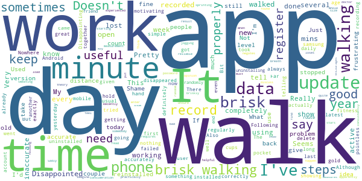

# One You Active 10 Walking Tracker
App version ``5.0.13``

Analyzed with [covid-apps-observer](http://github.com/covid-apps-observer) project, version ``0.1``

## App overview
| | |
|-------------------------|-------------------------| 
| **Name**                                          | One You Active 10 Walking Tracker |
| **Unique identifier** | uk.ac.shef.oak.pheactiveten |
| **Link to Google Play** | [https://play.google.com/store/apps/details?id=uk.ac.shef.oak.pheactiveten](https://play.google.com/store/apps/details?id=uk.ac.shef.oak.pheactiveten) |
| **Summary**  | Active 10 shows you when you are walking quickly enough to get health benefits. |
| **Privacy policy** | [https://www.nhs.uk/oneyou/privacy-policy#H6QQyKsRuuBpI7Dg.97](https://www.nhs.uk/oneyou/privacy-policy#H6QQyKsRuuBpI7Dg.97) |
| **Latest version** | 5.0.13 |
| **Last update** | 2021-02-01 19:03:16 |
| **Recent changes** | This release features an update to restore the missing data that some users experienced after a previous app update. The app will need to be open in order for the data to be restored. The process may take a few minutes so please keep your app open while it is processing in the background.  |
| **Installs**  | 100,000+ |
| **Category** | Health & Fitness |
| **First release** | Mar 3, 2017 |
| **Size**  | 18M |
| **Supported Android version**  | 5.1 and up |

### Description
> Active 10 is a free and easy to use walking app that tracks your walking and shows you how you can increase your intensity to benefit your health. The app is designed to support you every step of the way to increase your daily level of physical activity, with simple and achievable milestones and rewards along the way.
 Key features:
 * Tracks all your walking and how many minutes were brisk
 * Rewards every brisk minute achieved throughout the day, so perfect for those starting from low levels of activity
 * Promotes goal setting to help keep you motivated and help you progress
 * Store and view up to 12 months of your walking activity, to see how far you have come 
 * Discover loads of hints and tips on achieving a healthier lifestyle
 BRISK WALKING BENEFITS YOUR HEALTH
 We all know how important it is to be active. The good news is you don’t have to go to the gym or start expensive fitness programmes, walking counts too!
 Just ten minutes of brisk walking every day can get your heart pumping and can make you feel more energetic, as well as lowering your risk of serious illnesses like heart disease and type 2 diabetes. Going for a brisk walk is a great way to clear your head and improve your mood.
 Active 10s are simple to fit into your day. From taking the dog out to going for a lunchtime walk there are lots of opportunities to introduce brisk walking into your daily routine.
 This app relies on your phone’s inbuilt sensors to measure your activity so you may experience varying levels of accuracy especially in older devices/operating systems. To improve accuracy, keep your phone in a pocket close to your body rather than in a loose coat pocket or bag.
 If you have any feedback on how we can improve the app please send it to oneyou@phe.gov.uk.
 Frequently asked questions: https://www.nhs.uk/oneyou/active10/faqs

### User interface
The developers of the app provide the following screenshots in the Google play store.
| | | |
|:-------------------------:|:-------------------------:|:-------------------------:|
 |   |   |   | 
 |   |   |   | 

## Development team
In the following we report the main information provided by the development team in the Google play store.

| | |
|-------------------------|-------------------------|
| **Developer**  | Public Health England Digital |
| **Website**  | [http://www.nhs.uk/oneyou/active10](http://www.nhs.uk/oneyou/active10) |
| **Email** | oneyou@phe.gov.uk |
| **Physical address**  | - |
| **Other developed apps**  | [https://play.google.com/store/apps/developer?id=Public+Health+England+Digital](https://play.google.com/store/apps/developer?id=Public+Health+England+Digital) |

## Android support

| | |
|-------------------------|-------------------------|
| **Declared target Android version**  | Android10, version 10 (API level 29) |
| **Effective target Android version**  | Android10, version 10 (API level 29) |
| **Minimum supported Android version**  | Lollipop, version 5.1 (API level 22) |
| **Maximum target Android version**  | - |

The larger the difference between the minimum and maximum supported Android versions, the better. A larger difference means a wider audience. For example, old phones have a very low Android version, so a high minimum supported Android version means that the app cannot be used by users with old phones, thus leading to accessibility problems. 

## Requested permissions

In the following we report the complete list of the permissions requested by the app. 

| **Permission** | **Protection level** | **Description** | 
|-------------------------|-------------------------|-------------------------|
 **android.permission ACCESS_FINE_LOCATION** | :warning:**Dangerous** | Allows an app to access precise location. 
 **android.permission ACCESS_NETWORK_STATE** | Normal | Allows applications to access information about networks. 
 **android.permission ACCESS_WIFI_STATE** | Normal | Allows applications to access information about Wi-Fi networks. 
 **android.permission ACTIVITY_RECOGNITION** | :warning:**Dangerous** | Allows an application to recognize physical activity. 
 **android.permission INTERNET** | Normal | Allows applications to open network sockets. 
 **android.permission MODIFY_AUDIO_SETTINGS** | Normal | Allows an application to modify global audio settings. 
 **android.permission READ_EXTERNAL_STORAGE** | :warning:**Dangerous** | Allows an application to read from external storage. 
 **android.permission RECEIVE_BOOT_COMPLETED** | Normal | Allows an application to receive the Intent.ACTION_BOOT_COMPLETED that is broadcast after the system finishes booting. 
 **android.permission WAKE_LOCK** | Normal | Allows using PowerManager WakeLocks to keep processor from sleeping or screen from dimming. 
 **android.permission WRITE_EXTERNAL_STORAGE** | :warning:**Dangerous** | Allows an application to write to external storage. 
 **com.google.android.c2dm.permission RECEIVE** | - | - 
 **com.google.android.finsky.permission BIND_GET_INSTALL_REFERRER_SERVICE** | - | - 

## Mentioned servers

| **Server** | **Registrant** | **Registrant country** | **Creation date** | 
|-------------------------|-------------------------|-------------------------|-------------------------|
 | nhs.uk | Department of Health | - | 1996-08-01 00:00:00 |
 | googlesyndication.com | Google LLC | :us: US | 2003-01-21 06:17:24 |
 | google.com | Google LLC | :us: US | 1997-09-15 04:00:00 |
 | googleapis.com | Google LLC | :us: US | 2005-01-25 17:52:26 |
 | app-measurement.com | Google LLC | :us: US | 2015-06-19 20:13:31 |
 | instabug.com | - | :us: US | 2000-05-16 23:13:25 |
 | phedigital.co.uk | - | - | 2018-06-06 00:00:00 |
 | paragon-cc.co.uk | - | - | 2017-04-04 00:00:00 |
 | crashlytics.com | Google LLC | :us: US | 2011-01-21 15:30:40 |
 | googleadservices.com | Google LLC | :us: US | 2003-06-19 16:34:53 |

## Security analysis 

Below we report the main security warnings raised by our execution of the [Androwarn](https://github.com/maaaaz/androwarn) security analysis tool.

**Telephony identifiers leakage**
> - This application reads the numeric name (MCC+MNC) of current registered operator 
> - This application reads the operator name 

**Connection interfaces exfiltration**
> - This application reads details about the currently active data network 
> - This application tries to find out if the currently active data network is metered 

**Audio video eavesdropping**
> - This application records audio from the 'MIC' source  

**Suspicious connection establishment**
> - This application opens a Socket and connects it to the remote address 'La/b/a/a/a;->s(Ljava/lang/String;)Ljava/lang/StringBuilder;' on the 'N/A' port  
> - This application opens a Socket and connects it to the remote address 'Ljava/net/Proxy;->type()Ljava/net/Proxy$Type;' on the 'N/A' port  
> - This application opens a Socket and connects it to the remote address 'hostname == null ' on the 'N/A' port  
> - This application opens a Socket and connects it to the remote address 'timeout' on the 'N/A' port  

**Code execution**
> - This application loads a native library 
> - This application loads a native library: 'constant' 
> - This application executes a UNIX command 
> - This application executes a UNIX command containing this argument: '' 

## User ratings and reviews

Below we provide information about how end users are reacting to the app in terms of ratings and reviews in the Google Play store.

### Ratings

The One You Active 10 Walking Tracker app has been installed by more than **100000** times. At this time, **4309** rated the app and its average score is **3.983871**. Below we show the distribution of the ratings across the usual star-based rating of Google Play

:star::star::star::star::star:: 2275

:star::star::star::star:: 963

:star::star::star:: 327

:star::star:: 218

:star:: 526

### Reviews 

#### 5-star reviews

> This is easy to use and a good way to make sure I do at least a minimum amount of brisk walking each day.  :date: __2021-04-18 08:46:31__

> Useful ap. Efforrless to use.  :date: __2021-04-16 23:44:49__

> It gives encouragement and motivation to keep up the brisk walking.  :date: __2021-04-15 21:40:32__

> Love this App - I don't feel stressed to 'perform' and 10 minutes is easily achievable. Love the little reward emblems. Visually great, especially if your eyesight is not that good!  :date: __2021-04-14 11:59:29__

> Easy to set and use  :date: __2021-04-14 09:40:35__

> Simple measure of the time you are walking briskly. Highly recommended.  :date: __2021-04-13 09:07:30__

> Very easy to use and gives accurate times. Would be great if it was available as a watch app.  :date: __2021-04-12 15:56:04__

> This app is just excellent, show's clearly what I have done and challenges me to do more.  :date: __2021-04-12 11:37:26__

> This app greatly encouraged me to take a brisk walk everyday and it played a major role in helping me loose 6kg in weight. As a result I have progressed to Couch to 5k. Can hardly believe I've completed the 9 weeks and can run for 30 .minutes - almost 5k!  :date: __2021-04-11 17:45:29__

> That little reward display is so encouraging when you really don't want to exercise but know you must. It's only 10 mins but, because it is achievable, you find yourself doing 3 or 4 sets of 10 mins throughout the day.  :date: __2021-04-11 14:45:24__

#### 4-star reviews

> This app is good for counting how many minutes you have walked, however it doesn't always recognize when you have reached your goals.  :date: __2021-04-14 15:48:42__

> Very good at motivating me to walk briskly. Easy to use. Would like an average for the week to be given too It says my achievement is in line with Govt guidance and I can't see on the app what the Govt guidance is. A bit more background info would be helpful. But overall I like this app a lot.  :date: __2021-04-11 23:56:37__

> I love getting badges and there are a lot to achieve. The app is a bit slow to start counting but once it is going it works very well.  :date: __2021-04-11 10:46:40__

> Works effectively only when mobile phone is carried in trousers. When carried in jacket pocket hardly any of my brisk walking was recorded. Since these were substantial walks, I was highly disappointed.  :date: __2021-04-10 18:30:18__

> Simple enough. Works well. Needs to be in my pocket in order to register walking.  :date: __2021-04-10 14:26:44__

> How does it know? Is it GPS or something else? For example it seems to know if I'm walking uphill! Very clever.  :date: __2021-04-10 11:49:31__

> Very good app. I use it every day for walking.  :date: __2021-04-09 12:41:54__

> App is very helpful. Only request is to include hill climbing into the brisk activity. A nearby hills takes half an hour to walk. At the top I'm gasping for breath. The app measures 30 min of walking, of which a few are brisk!  :date: __2021-04-09 09:23:37__

> Great concept and decent execution, but frustrating tracking. It will sometimes decide you're not brisk walking, even though you most certainly are. Furthermore, the app takes at times a minute to actually load your walks, which isn't user friendly - especially if your internet connection is bad or unstable. It's a great idea, and it's helped me be healthy and encourage exercise, but those elements need fixing.  :date: __2021-04-06 23:22:35__

> It's quite good. It will punish you for stopping to talk to the neighbors and you really need to walk briskly to score points. Quite simple without too much surplus info.  :date: __2021-04-04 16:55:34__

#### 3-star reviews

> Would be nice to have a step counter and distance built in  :date: __2021-04-16 16:57:08__

> It started really well, and I would have scored higher, but for some reason over the past couple of weeks it is recording my car journeys too. ( And not showing up as brisk during this time😂) I've checked to see if there is anything I need to change in settings, but nothing. Shame asvi was really enjoying it, but can't rely on the data any more. So frustrating.  :date: __2021-04-15 15:07:55__

> stopped working, reinstalled twice, still not working, Have reinstall after a while. Working much better  :date: __2021-04-14 08:44:45__

> Moved to anew and in all othe respects reliable huawei p30 Pro. Suddenly the app is highly erratic in what it deems is an active pace and is under recording the same. I know by timing myself I am walking at 130 steps per minute, the app recognises I'm walking but does not record these as brisk minutes in a cases. I suspect its recording brisk for less than half the actual brisk walked  :date: __2021-04-13 21:26:39__

> The app is great to motivate to go out and do your challenge. The negative side is that many times I have gone for long walks and forgot to open the app and see the little man walking......and my over 60minwalks were not registered as brisk walk, even if was a more than brisk......I now giving up to challenge myself on this app.  :date: __2021-04-12 12:11:43__

> not sure if this app works properly. I'm a gardener and am active all day. according to the app one day I walked for 330 mins yet only 77 were classed as brisk..  :date: __2021-03-23 17:38:07__

> The app does not always record walks as brisk, when they definitely are, as measured by my speed and how out of breath I am.  :date: __2021-03-23 14:51:08__

> Gives you motivation  :date: __2021-03-22 21:21:41__

> Handy little App if you want to get moving.  :date: __2021-03-22 13:31:32__

> A bit hit and miss regarding recording brisk minutes  :date: __2021-03-20 11:28:34__

#### 2-star reviews

> Doesn't work properly. Very inaccurate at times.  :date: __2021-04-16 15:50:00__

> I can't get the app to work, my data has disappeared and won't load back on. I have uninstalled and reinstalled after a few days but still nothing  :date: __2021-04-11 13:13:15__

> Really good idea in theory but the measurement of brisk is not accurate in my opinion, which negates the whole idea of the app. Think I'd need to be practically sprinting for brisk to register.  :date: __2021-04-07 22:56:03__

> Not reliable, I do the same walk each week in the same time sometimes it records 100 brisk minutes other times like today 8 minutes  :date: __2021-03-18 17:45:18__

> It just doesn't register much of my brisk walking. Seems completely random, some days all is fine, other days only about 10% registers.  :date: __2021-03-06 17:09:46__

> Frustrating. App regularly loses all records. This did not use to happen  :date: __2021-03-06 11:41:19__

> My phone came with this app installed & I used it for years. Sadly it now requires me to enter a password for a samsung account which I don't have. My phone is quite old, & I imagine this is something which has come in since I got it. There seems to be no way through this, so I cannot use it any more & have lost my data. If not for this I would have given 4 stars. I found it very useful.  :date: __2021-02-16 19:39:53__

> Doesn't take into consideration somebody's starting fitness level or age. I went for a walk for 40 minutes in the snow came back sweating and out of breath. My doctor says that is a brisk walk and good for me the app size I did 5-minutes. I feel that you need to be jogging for it to say you're walking briskly. Not all bad it does tell you how long you've been walking for.  :date: __2021-02-10 17:04:25__

> Very disappointed that the app doesn't always count the brisk steps. If I put my phone in my pocket it counts steps but not brisk steps. I have to hold the phone in my hand for it to work properly. It took me a long while to work this out. It was helpful to read that other people had experienced the same problem and I tried holding it as a result. Nowhere on the app to discuss problems like this. When it does count accurately I find it very useful and motivating.  :date: __2021-02-10 13:31:15__

> A 20 minute walk is apparently 40 minutes. Unsure if this actually measures the time of the walk correctly however it definitely encourages you to be more active. I'd give it more if it was more accurate.  :date: __2021-02-06 21:27:37__

#### 1-star reviews

> Infuriating. I walk briskly for 30mins and it clocks up two cups and a few minutes, a couple of hours later I open the app up prior to walking and its reset to 1 cup and 1 minute. This has happened every day since I downloaded it (3 days) Seemed to settle down but suddenly keeps trying to load and says "we don't seem to be able to access your data"  :date: __2021-04-11 13:47:38__

> Another waste of time and space doesn't help at all  :date: __2021-04-05 01:16:21__

> This app used to be great but when I resumed this month after a break it simply doesn't work. Constantly trying to load data and never does. Downgraded from a 5 star review. Sort it please.  :date: __2021-03-31 09:46:06__

> Very hit and miss in the measurement of "brisk" walking, well basically random. Good idea but poorly developed.  :date: __2021-03-29 00:56:02__

> Not fit for purpose. Doesn't record anything.  :date: __2021-03-25 03:20:55__

> I loved this app when I first used it a couple of years ago but now it doesn't hold the data. It collects the day and by the next day it's gone.  :date: __2021-03-22 10:15:40__

> I used to think this app was good. Recently it never records anything at all, I uninstall and reinstall and it still does nothing. Ive now uninstalled it. No point  :date: __2021-03-18 20:18:41__

> I have been using this App for nearly two months now. I was very enthusiastic when I started, but I am very disheartened about it now. I only set myself a target of 10 mins a day, but constitently, the App is only recording a maximum of 60% of my walk as brisk. I know that I am walking far above the recommended rate for brisk walking. I have contacted Oneyou and given them my phone information. They passed this on to the developers and I am still waiting to hear back. Very disappointing.  :date: __2021-03-18 14:21:21__

> Very disappointed to find that the app doesn't record activities offline. Useless.  :date: __2021-03-07 09:02:45__

> This app still loses data even after the update to correct. Recorded my walk yesterday but when I opened the app an hour later to record data, it showed nothing for the day. No historic info is being kept for more than a few hours..  :date: __2021-03-05 18:15:16__

