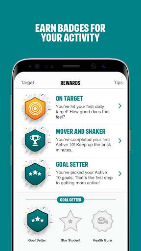

# One You Active 10 Walking Tracker
App version ``5.0.16``

Analyzed with [covid-apps-observer](http://github.com/covid-apps-observer) project, version ``0.1``

## App overview
| | |
|-------------------------|-------------------------| 
| **Name**&nbsp;&nbsp;&nbsp;&nbsp;&nbsp;&nbsp;&nbsp;&nbsp;&nbsp;&nbsp;&nbsp;&nbsp;&nbsp;&nbsp;&nbsp;&nbsp;&nbsp;&nbsp;&nbsp;&nbsp;&nbsp;&nbsp;&nbsp;&nbsp;&nbsp;&nbsp;&nbsp;&nbsp;&nbsp;&nbsp;&nbsp;&nbsp;&nbsp;&nbsp;&nbsp;&nbsp;&nbsp;&nbsp;&nbsp;&nbsp;  | One You Active 10 Walking Tracker |
| **Unique identifier** | uk.ac.shef.oak.pheactiveten |
| **Link to Google Play** | [https://play.google.com/store/apps/details?id=uk.ac.shef.oak.pheactiveten](https://play.google.com/store/apps/details?id=uk.ac.shef.oak.pheactiveten) |
| **Summary**  | Active 10 shows you when you are walking quickly enough to get health benefits. |
| **Privacy policy** | [https://www.nhs.uk/oneyou/privacy-policy#H6QQyKsRuuBpI7Dg.97](https://www.nhs.uk/oneyou/privacy-policy#H6QQyKsRuuBpI7Dg.97) |
| **Latest version** | 5.0.16 |
| **Last update** | 2021-04-15 18:54:13 |
| **Recent changes** | We release regular updates to the Active 10 app to fix issues and improve its performance.  This update contains IMPORTANT UPDATES to improve the app  integration with Google Fit and keep things working as expected.            |
| **Installs**  | 100,000+ |
| **Category** | Health & Fitness |
| **First release** | Mar 3, 2017 |
| **Size**  | 19M |
| **Supported Android version**  | 5.1 and up |

### Description
> Active 10 is a free and easy to use walking app that tracks your walking and shows you how you can increase your intensity to benefit your health. The app is designed to support you every step of the way to increase your daily level of physical activity, with simple and achievable milestones and rewards along the way.
 Key features:
 * Tracks all your walking and how many minutes were brisk
 * Rewards every brisk minute achieved throughout the day, so perfect for those starting from low levels of activity
 * Promotes goal setting to help keep you motivated and help you progress
 * Store and view up to 12 months of your walking activity, to see how far you have come 
 * Discover loads of hints and tips on achieving a healthier lifestyle
 BRISK WALKING BENEFITS YOUR HEALTH
 We all know how important it is to be active. The good news is you don’t have to go to the gym or start expensive fitness programmes, walking counts too!
 Just ten minutes of brisk walking every day can get your heart pumping and can make you feel more energetic, as well as lowering your risk of serious illnesses like heart disease and type 2 diabetes. Going for a brisk walk is a great way to clear your head and improve your mood.
 Active 10s are simple to fit into your day. From taking the dog out to going for a lunchtime walk there are lots of opportunities to introduce brisk walking into your daily routine.
 This app relies on your phone’s inbuilt sensors to measure your activity so you may experience varying levels of accuracy especially in older devices/operating systems. To improve accuracy, keep your phone in a pocket close to your body rather than in a loose coat pocket or bag.
 If you have any feedback on how we can improve the app please send it to oneyou@phe.gov.uk.
 Frequently asked questions: https://www.nhs.uk/oneyou/active10/faqs

### User interface
The developers of the app provide the following screenshots in the Google play store.
| | | |
|:-------------------------:|:-------------------------:|:-------------------------:|
 |   |   |   | 
 |   |   |   | 

## Development team
In the following we report the main information provided by the development team in the Google play store.

| | |
|-------------------------|-------------------------|
| **Developer**  | Public Health England Digital |
| **Website**  | [http://www.nhs.uk/oneyou/active10](http://www.nhs.uk/oneyou/active10) |
| **Email** | oneyou@phe.gov.uk |
| **Physical address**  | - |
| **Other developed apps**  | [https://play.google.com/store/apps/developer?id=Public+Health+England+Digital](https://play.google.com/store/apps/developer?id=Public+Health+England+Digital) |

## Android support

| | |
|-------------------------|-------------------------|
| **Declared target Android version**  | Android10, version 10 (API level 29) |
| **Effective target Android version**  | Android10, version 10 (API level 29) |
| **Minimum supported Android version**  | Lollipop, version 5.1 (API level 22) |
| **Maximum target Android version**  | - |

The larger the difference between the minimum and maximum supported Android versions, the better. A larger difference means a wider audience. For example, old phones have a very low Android version, so a high minimum supported Android version means that the app cannot be used by users with old phones, thus leading to accessibility problems. 

## Requested permissions

In the following we report the complete list of the permissions requested by the app. 

| **Permission** | **Protection level** | **Description** | 
|-------------------------|-------------------------|-------------------------|
 **android.permission ACCESS_FINE_LOCATION** | :warning:**Dangerous** | Allows an app to access precise location. 
 **android.permission ACCESS_NETWORK_STATE** | Normal | Allows applications to access information about networks. 
 **android.permission ACCESS_WIFI_STATE** | Normal | Allows applications to access information about Wi-Fi networks. 
 **android.permission ACTIVITY_RECOGNITION** | :warning:**Dangerous** | Allows an application to recognize physical activity. 
 **android.permission INTERNET** | Normal | Allows applications to open network sockets. 
 **android.permission MODIFY_AUDIO_SETTINGS** | Normal | Allows an application to modify global audio settings. 
 **android.permission READ_EXTERNAL_STORAGE** | :warning:**Dangerous** | Allows an application to read from external storage. 
 **android.permission RECEIVE_BOOT_COMPLETED** | Normal | Allows an application to receive the Intent.ACTION_BOOT_COMPLETED that is broadcast after the system finishes booting. 
 **android.permission WAKE_LOCK** | Normal | Allows using PowerManager WakeLocks to keep processor from sleeping or screen from dimming. 
 **android.permission WRITE_EXTERNAL_STORAGE** | :warning:**Dangerous** | Allows an application to write to external storage. 
 **com.google.android.c2dm.permission RECEIVE** | - | - 
 **com.google.android.finsky.permission BIND_GET_INSTALL_REFERRER_SERVICE** | - | - 

## Mentioned servers

| **Server** | **Registrant** | **Registrant country** | **Creation date** | 
|-------------------------|-------------------------|-------------------------|-------------------------|
 | nhs.uk | Department of Health | - | 1996-08-01 00:00:00 |
 | googlesyndication.com | Google LLC | :us: US | 2003-01-21 06:17:24 |
 | google.com | Google LLC | :us: US | 1997-09-15 04:00:00 |
 | googleapis.com | Google LLC | :us: US | 2005-01-25 17:52:26 |
 | app-measurement.com | Google LLC | :us: US | 2015-06-19 20:13:31 |
 | instabug.com | - | :us: US | 2000-05-16 23:13:25 |
 | phedigital.co.uk | - | - | 2018-06-06 00:00:00 |
 | paragon-cc.co.uk | - | - | 2017-04-04 00:00:00 |
 | crashlytics.com | Google LLC | :us: US | 2011-01-21 15:30:40 |
 | googleadservices.com | Google LLC | :us: US | 2003-06-19 16:34:53 |

## Security analysis 

Below we report the main security warnings raised by our execution of the [Androwarn](https://github.com/maaaaz/androwarn) security analysis tool.

**Telephony identifiers leakage**
> - This application reads the numeric name (MCC+MNC) of current registered operator 
> - This application reads the operator name 

**Connection interfaces exfiltration**
> - This application reads details about the currently active data network 
> - This application tries to find out if the currently active data network is metered 

**Audio video eavesdropping**
> - This application records audio from the 'MIC' source  

**Suspicious connection establishment**
> - This application opens a Socket and connects it to the remote address 'La/b/a/a/a;->s(Ljava/lang/String;)Ljava/lang/StringBuilder;' on the 'N/A' port  
> - This application opens a Socket and connects it to the remote address 'Ljava/net/Proxy;->type()Ljava/net/Proxy$Type;' on the 'N/A' port  
> - This application opens a Socket and connects it to the remote address 'hostname == null ' on the 'N/A' port  
> - This application opens a Socket and connects it to the remote address 'timeout' on the 'N/A' port  

**Code execution**
> - This application loads a native library 
> - This application loads a native library: 'constant' 
> - This application executes a UNIX command 
> - This application executes a UNIX command containing this argument: '' 

## User ratings and reviews

Below we provide information about how end users are reacting to the app in terms of ratings and reviews in the Google Play store.

### Ratings

The One You Active 10 Walking Tracker app has been installed by more than **100000** times. At this time, **4661** rated the app and its average score is **4.2532187**. Below we show the distribution of the ratings across the usual star-based rating of Google Play

:star::star::star::star::star:: 2701

:star::star::star::star:: 1120

:star::star::star:: 410

:star::star:: 180

:star:: 250

### Reviews 

#### 5-star reviews

> This app is really encouraging me to get out and walk every day, and I'm already feeling the benefits on my general health & wellbeing!  :date: __2021-06-06 08:18:57__

> Great to get a quick visual check on progress  :date: __2021-05-31 16:43:28__

> I've found it really helpful  :date: __2021-05-30 20:46:57__

> I only use it to measure brisk walking. Really useful for that. Has other features I can't comment on.  :date: __2021-05-29 11:23:31__

> Great!  :date: __2021-05-28 18:55:50__

> Easy to use and great as a beginner app to monitor progress. Would be great if it had a step count option so I didn't need to look for another app but at the moment it does what I need.  :date: __2021-05-28 12:57:13__

> Pushes you to achieve your set goals. App is easy to navigate and foof/calorie counter is a very good guide to reaching that goal.  :date: __2021-05-28 09:43:12__

> Very pleased with this app. Gives me total brisk walking and other walking. It is encouraging by giving rewards for targets achieved.  :date: __2021-05-26 19:15:37__

> I love the app! Automatic and a good motivator. I just wish I could up the pace which is considered "brisk" as I'm a fast walker.  :date: __2021-05-25 22:17:32__

> Great way to train yourself on brisk walking  :date: __2021-05-24 22:42:00__

#### 4-star reviews

> Shows the total length of my walk and how many 10 minutes worth were 'brisk' which counts towards getting a reward, shows 'hat tricks' for 3 x 10 minutes in a day, 100 - 3000 club shows you ow many minutes from the day you downloaded the app, you get a high five for how many days in 7 you have taken a brisk walk. It's helping me see how much I do or don't move in a day and for me I've got start somewhere.  :date: __2021-06-01 12:58:17__

> Useful little app. Spurs you on to do more.  :date: __2021-05-27 21:43:09__

> Perfect for those who only need to check they've had enough exercise day by day and track how they're progressing.  :date: __2021-05-26 08:32:34__

> Learning more about my eating habits. Quite an eye opening.  :date: __2021-05-18 14:03:13__

> I wanted to find an easy way to increase my activity and found this NHS sponsored app. It has really encouraged me to get out every day for at least 20 mins walk and after less than a month I am feeling the benefits.  :date: __2021-05-17 08:55:22__

> I loved this app at first it's very useful as I have fibromyalgia an need to phase my exercise slowly. However the app stopped registering my brisk steps and i kept pushing harder to get those brisk mins in, the result was I pushed to hard, then it stopped working. At times I walk quickly and it doesn't register other times I walk slowly and it registers. This has been demotivating. If these issue were fixed it would be a great tool for me  :date: __2021-05-09 13:52:48__

> The app is great 👍  :date: __2021-05-09 09:25:08__

> Good incentive to keep active walking  :date: __2021-05-06 21:53:22__

> Very easy to use and a great indicator of brisk v strolling walking  :date: __2021-05-03 09:46:27__

> Useful to track walking activity which counts towards exercise targets  :date: __2021-05-01 18:23:41__

#### 3-star reviews

> It stopped working  :date: __2021-06-04 13:57:28__

> Brisk walk is debatable. Sometimes you almost need to run to clock up minutes. I walk on the flat as going up hill is slower and does not register brisk minutes. I do like the rewards as trophies and these are a good motivator.  :date: __2021-05-30 17:39:05__

> Doing the same circuit in the same time (30 minutes) gives different minutes of brisk walks eg from 30 mins down to 22. That's the same distance in the same time give or take 20 seconds. Forces you to adopt an unhealthy posture in order to walk fast enough to register a brisk walk.  :date: __2021-05-30 01:28:05__

> No baseline assessment to measure whst is "brisk" for me. Makes you feel good when you notch up a chunk of brisk minutes, motivating to make me reach the next 10.  :date: __2021-05-03 11:17:55__

> This app is quite good, but only for mapping your walks. It would be good if it included other activities such as gardening, going to the gym, swimming etc.  :date: __2021-05-01 18:00:27__

> Wish it would show the miles I have walked. I'm sure it used too. Disappointing  :date: __2021-04-30 17:02:41__

> Not very accurate - when walking with someone else who uses the app, they have hugely different results! It's good for making you walk fast though  :date: __2021-04-25 17:59:26__

> Not sure how accurate the measurement of brisk walking is. But it certainly raises awareness.  :date: __2021-04-19 23:59:09__

> What is counted as brisk seems quite random. If I use it when I'm dancing, it will record 30 mins as brisk one day, then nothing the next even though I'm doing the same dances to the same tracks.  :date: __2021-04-18 22:35:47__

> Would be nice to have a step counter and distance built in  :date: __2021-04-16 16:57:08__

#### 2-star reviews

> It's ok  :date: __2021-05-30 15:42:56__

> The app counts cycling as walking... It's just not right. Hope it get fixed. Only useful for brisk, not hfor normal walk.  :date: __2021-05-25 16:49:12__

> It does not register brisk walking properly. I walk with my daughter both using active 10, mine shows very little brisk walking compared with hers. Rubbish.  :date: __2021-05-15 15:25:57__

> Doesn't always work  :date: __2021-05-10 20:48:27__

> Stopped tracking. Worked well 1st week but now doesn't track my walking at all. Annoying as I walk for an hour and half each day and am interested in seeing how I'm doing  :date: __2021-04-26 10:47:44__

> Generally good and has motivated me to get a faster pace and do that for me time. Some irritations, however. I would like to set a (much) higher target but 30 mins a day is the maximum. Also, totals seem very slow to update at times and you have to close the app and open again. E.g. Its Sunday and yet my Saturday walk was still not reflected in the weekly figurea until I shut the app. Updated, data for several days lost, so reducing rating to 2 stars.  :date: __2021-04-18 15:14:40__

> Doesn't work properly. Very inaccurate at times.  :date: __2021-04-16 15:50:00__

> I can't get the app to work, my data has disappeared and won't load back on. I have uninstalled and reinstalled after a few days but still nothing  :date: __2021-04-11 13:13:15__

> Really good idea in theory but the measurement of brisk is not accurate in my opinion, which negates the whole idea of the app. Think I'd need to be practically sprinting for brisk to register.  :date: __2021-04-07 22:56:03__

> Not reliable, I do the same walk each week in the same time sometimes it records 100 brisk minutes other times like today 8 minutes  :date: __2021-03-18 17:45:18__

#### 1-star reviews

> I loved this app when I first started using it, as it was an easy way to keep track of my progress, but like others, I'm finding that it keeps stripping out all of my stats, so starting to think I'll not bother using it anymore unless a fix is done very soon - such a shame I tried using the app again recently and it appears to have stopped working completely now, so not tracking any minutes at all, app needs updating!!  :date: __2021-05-25 08:16:26__

> Hopeless. Doesn't record minutes of walking accurately let alone minutes of brisk walking. Today I walked briskly for 30 minutes but only 24 minutes of walking was recorded and just 8 were recorded as "brisk". So I practically ran for 5 minutes, then walked briskly for another 5, to try and push the brisk minutes up. No additional minutes of walking, brisk or otherwise were recorded. It stuck at 24 and 8. It was fine for a couple of days but hasn't recorded accurately since then.  :date: __2021-05-09 18:22:31__

> Didn't find this app useful because what I felt was a brisk walk for me didn't register leaving me feeling disheartened. ☹️  :date: __2021-04-29 19:09:50__

> It has been working fine, then for the last month it has been awful! Not recording the correct time I'd been walking! Told me I'd walked one minute and I'd actually done 30 minutes!  :date: __2021-04-27 11:54:05__

> ever since new update in Feb the app cannot get my walking info or it says I'm missing data  :date: __2021-04-19 00:57:31__

> This was so simple, but now useless. It just stopped working; used to record approx. time walking and time spent brisk walking - now nothing! Latest version of Android, Pixel 3a  :date: __2021-04-18 18:32:21__

> Infuriating. I walk briskly for 30mins and it clocks up two cups and a few minutes, a couple of hours later I open the app up prior to walking and its reset to 1 cup and 1 minute. This has happened every day since I downloaded it (3 days) Seemed to settle down but suddenly keeps trying to load and says "we don't seem to be able to access your data"  :date: __2021-04-11 13:47:38__

> Another waste of time and space doesn't help at all  :date: __2021-04-05 01:16:21__

> This app used to be great but when I resumed this month after a break it simply doesn't work. Constantly trying to load data and never does. Downgraded from a 5 star review. Sort it please.  :date: __2021-03-31 09:46:06__

> Very hit and miss in the measurement of "brisk" walking, well basically random. Good idea but poorly developed.  :date: __2021-03-29 00:56:02__

