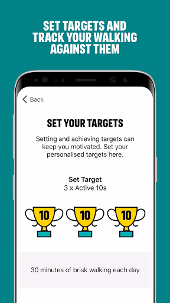
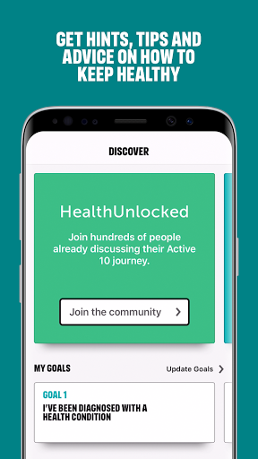
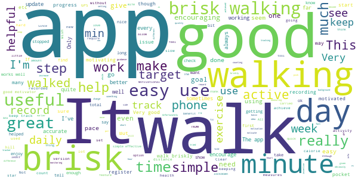
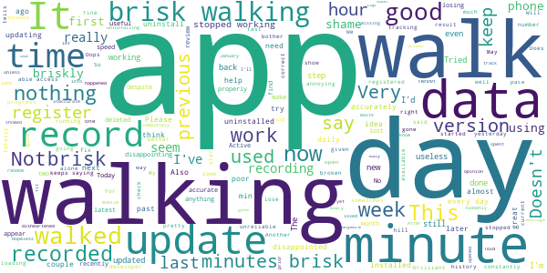

# One You Active 10 Walking Tracker
App version ``5.0.16``

Analyzed with [covid-apps-observer](http://github.com/covid-apps-observer) project, version ``0.1``

## App overview
| | |
|-------------------------|-------------------------| 
| **Name**&nbsp;&nbsp;&nbsp;&nbsp;&nbsp;&nbsp;&nbsp;&nbsp;&nbsp;&nbsp;&nbsp;&nbsp;&nbsp;&nbsp;&nbsp;&nbsp;&nbsp;&nbsp;&nbsp;&nbsp;&nbsp;&nbsp;&nbsp;&nbsp;&nbsp;&nbsp;&nbsp;&nbsp;&nbsp;&nbsp;&nbsp;&nbsp;&nbsp;&nbsp;&nbsp;&nbsp;&nbsp;&nbsp;&nbsp;&nbsp;  | One You Active 10 Walking Tracker |
| **Unique identifier** | uk.ac.shef.oak.pheactiveten |
| **Link to Google Play** | [https://play.google.com/store/apps/details?id=uk.ac.shef.oak.pheactiveten](https://play.google.com/store/apps/details?id=uk.ac.shef.oak.pheactiveten) |
| **Summary**  | Active 10 shows you when you are walking quickly enough to get health benefits. |
| **Privacy policy** | [https://www.nhs.uk/oneyou/privacy-policy#H6QQyKsRuuBpI7Dg.97](https://www.nhs.uk/oneyou/privacy-policy#H6QQyKsRuuBpI7Dg.97) |
| **Latest version** | 5.0.16 |
| **Last update** | 2021-04-15 18:54:13 |
| **Recent changes** | We release regular updates to the Active 10 app to fix issues and improve its performance.  This update contains IMPORTANT UPDATES to improve the app  integration with Google Fit and keep things working as expected.            |
| **Installs**  | 100,000+ |
| **Category** | Health & Fitness |
| **First release** | Mar 3, 2017 |
| **Size**  | 19M |
| **Supported Android version**  | 5.1 and up |

### Description
> Active 10 is a free and easy to use walking app that tracks your walking and shows you how you can increase your intensity to benefit your health. The app is designed to support you every step of the way to increase your daily level of physical activity, with simple and achievable milestones and rewards along the way.
 Key features:
 * Tracks all your walking and how many minutes were brisk
 * Rewards every brisk minute achieved throughout the day, so perfect for those starting from low levels of activity
 * Promotes goal setting to help keep you motivated and help you progress
 * Store and view up to 12 months of your walking activity, to see how far you have come 
 * Discover loads of hints and tips on achieving a healthier lifestyle
 BRISK WALKING BENEFITS YOUR HEALTH
 We all know how important it is to be active. The good news is you don’t have to go to the gym or start expensive fitness programmes, walking counts too!
 Just ten minutes of brisk walking every day can get your heart pumping and can make you feel more energetic, as well as lowering your risk of serious illnesses like heart disease and type 2 diabetes. Going for a brisk walk is a great way to clear your head and improve your mood.
 Active 10s are simple to fit into your day. From taking the dog out to going for a lunchtime walk there are lots of opportunities to introduce brisk walking into your daily routine.
 This app relies on your phone’s inbuilt sensors to measure your activity so you may experience varying levels of accuracy especially in older devices/operating systems. To improve accuracy, keep your phone in a pocket close to your body rather than in a loose coat pocket or bag.
 If you have any feedback on how we can improve the app please send it to oneyou@phe.gov.uk.
 Frequently asked questions: https://www.nhs.uk/oneyou/active10/faqs

### User interface
The developers of the app provide the following screenshots in the Google play store.
| | | |
|:-------------------------:|:-------------------------:|:-------------------------:|
 |   |   |   | 
 |   |   |   | 

## Development team
In the following we report the main information provided by the development team in the Google play store.

| | |
|-------------------------|-------------------------|
| **Developer**  | Public Health England Digital |
| **Website**  | [http://www.nhs.uk/oneyou/active10](http://www.nhs.uk/oneyou/active10) |
| **Email** | oneyou@phe.gov.uk |
| **Physical address**  | - |
| **Other developed apps**  | [https://play.google.com/store/apps/developer?id=Public+Health+England+Digital](https://play.google.com/store/apps/developer?id=Public+Health+England+Digital) |

## Android support

| | |
|-------------------------|-------------------------|
| **Declared target Android version**  | Android10, version 10 (API level 29) |
| **Effective target Android version**  | Android10, version 10 (API level 29) |
| **Minimum supported Android version**  | Lollipop, version 5.1 (API level 22) |
| **Maximum target Android version**  | - |

The larger the difference between the minimum and maximum supported Android versions, the better. A larger difference means a wider audience. For example, old phones have a very low Android version, so a high minimum supported Android version means that the app cannot be used by users with old phones, thus leading to accessibility problems. 

## Requested permissions

In the following we report the complete list of the permissions requested by the app. 

| **Permission** | **Protection level** | **Description** | 
|-------------------------|-------------------------|-------------------------|
 **android.permission ACCESS_FINE_LOCATION** | :warning:**Dangerous** | Allows an app to access precise location. 
 **android.permission ACCESS_NETWORK_STATE** | Normal | Allows applications to access information about networks. 
 **android.permission ACCESS_WIFI_STATE** | Normal | Allows applications to access information about Wi-Fi networks. 
 **android.permission ACTIVITY_RECOGNITION** | :warning:**Dangerous** | Allows an application to recognize physical activity. 
 **android.permission INTERNET** | Normal | Allows applications to open network sockets. 
 **android.permission MODIFY_AUDIO_SETTINGS** | Normal | Allows an application to modify global audio settings. 
 **android.permission READ_EXTERNAL_STORAGE** | :warning:**Dangerous** | Allows an application to read from external storage. 
 **android.permission RECEIVE_BOOT_COMPLETED** | Normal | Allows an application to receive the Intent.ACTION_BOOT_COMPLETED that is broadcast after the system finishes booting. 
 **android.permission WAKE_LOCK** | Normal | Allows using PowerManager WakeLocks to keep processor from sleeping or screen from dimming. 
 **android.permission WRITE_EXTERNAL_STORAGE** | :warning:**Dangerous** | Allows an application to write to external storage. 
 **com.google.android.c2dm.permission RECEIVE** | - | - 
 **com.google.android.finsky.permission BIND_GET_INSTALL_REFERRER_SERVICE** | - | - 

## Mentioned servers

| **Server** | **Registrant** | **Registrant country** | **Creation date** | 
|-------------------------|-------------------------|-------------------------|-------------------------|
 | nhs.uk | Department of Health | - | 1996-08-01 00:00:00 |
 | googlesyndication.com | Google LLC | :us: US | 2003-01-21 06:17:24 |
 | google.com | Google LLC | :us: US | 1997-09-15 04:00:00 |
 | googleapis.com | Google LLC | :us: US | 2005-01-25 17:52:26 |
 | app-measurement.com | Google LLC | :us: US | 2015-06-19 20:13:31 |
 | instabug.com | - | :us: US | 2000-05-16 23:13:25 |
 | phedigital.co.uk | - | - | 2018-06-06 00:00:00 |
 | paragon-cc.co.uk | - | - | 2017-04-04 00:00:00 |
 | crashlytics.com | Google LLC | :us: US | 2011-01-21 15:30:40 |
 | googleadservices.com | Google LLC | :us: US | 2003-06-19 16:34:53 |

## Security analysis 

Below we report the main security warnings raised by our execution of the [Androwarn](https://github.com/maaaaz/androwarn) security analysis tool.

**Telephony identifiers leakage**
> - This application reads the numeric name (MCC+MNC) of current registered operator 
> - This application reads the operator name 

**Connection interfaces exfiltration**
> - This application reads details about the currently active data network 
> - This application tries to find out if the currently active data network is metered 

**Audio video eavesdropping**
> - This application records audio from the 'MIC' source  

**Suspicious connection establishment**
> - This application opens a Socket and connects it to the remote address 'La/b/a/a/a;->s(Ljava/lang/String;)Ljava/lang/StringBuilder;' on the 'N/A' port  
> - This application opens a Socket and connects it to the remote address 'Ljava/net/Proxy;->type()Ljava/net/Proxy$Type;' on the 'N/A' port  
> - This application opens a Socket and connects it to the remote address 'hostname == null ' on the 'N/A' port  
> - This application opens a Socket and connects it to the remote address 'timeout' on the 'N/A' port  

**Code execution**
> - This application loads a native library 
> - This application loads a native library: 'constant' 
> - This application executes a UNIX command 
> - This application executes a UNIX command containing this argument: '' 

## User ratings and reviews

Below we provide information about how end users are reacting to the app in terms of ratings and reviews in the Google Play store.

### Ratings

The One You Active 10 Walking Tracker app has been installed by more than **100000** times. At this time, **4661** rated the app and its average score is **4.2532187**. Below we show the distribution of the ratings across the usual star-based rating of Google Play

:star::star::star::star::star:: 2701

:star::star::star::star:: 1120

:star::star::star:: 410

:star::star:: 180

:star:: 250

### Reviews 

#### 5-star reviews

> Easy to use and navigate. Actually got me brisk walking insteof walking leisurely leading to actual results  :date: __2021-05-01 15:36:15__

> A really easy app for monitoring not just your steps or time spent walking but the amount of really beneficial brisk walking. I use it almost every day.  :date: __2021-05-01 15:14:14__

> Very helpful  :date: __2021-04-30 15:23:16__

> Good app  :date: __2021-04-29 13:05:45__

> V good app it is helping me to loose weight thanks.  :date: __2021-04-28 12:33:29__

> Simple to use and gives good feedback on progress. It certainly makes you aware of what 'brisk' actually means!  :date: __2021-04-26 18:15:37__

> working again on Nokia 6.2  :date: __2021-04-26 13:21:04__

> It works better than expected. I also use, map my walk, and they both calculate the same amount time for brisk walking. This app helps keeping track for those times that I am just out and about doing regular daily activities.  :date: __2021-04-26 06:15:52__

> Really helps with motivating you to achieve brisk walking or activity as opposed to just waking. Helping me see the difference and obtaining virtual badges is great.  :date: __2021-04-25 09:32:07__

> Love this app ! If you enjoy setting small realistic goal this app is a winner. I have been able to overcome my exercise issue. When my mood is low in the past just leaving the house to exercise has been a challenge,. But because active 10 allows you to set such a low goal that you find yourself getting excited for achieving it and also the fact that you can do short intense brisk walks it just happens organically. Hope this helps !!  :date: __2021-04-24 20:20:54__

#### 4-star reviews

> Useful to track walking activity which counts towards exercise targets  :date: __2021-05-01 18:23:41__

> This is a good app  :date: __2021-05-01 14:37:10__

> Sometimes I walk fast and the tracker doesn't register it as brisk. I didn't realise the phone had to be on my person; not in a handbag.  :date: __2021-04-30 12:50:55__

> The first couple of minutes don't register however brisk you walk so it's best not to stop. Otherwise it's a good help to measuring your walks  :date: __2021-04-28 08:54:51__

> Simple and effective. Generally accurate on my brisk walks, but some long, slow walks with my wife show short brisk periods that I doubt happened. Not an issue though.  :date: __2021-04-27 09:50:06__

> Handy reminder especially the brisk challenges.easy to use.  :date: __2021-04-26 20:31:55__

> Good so far. Only area I would question is recording of brisk walking? Maybe I walk too briskly!  :date: __2021-04-26 17:55:53__

> Makes it easy to track your walks. I find I'm walking more to keep on track and beat my previous week score.  :date: __2021-04-26 09:16:07__

> Good app, but I have to work much harder to get my Active 10 than those I walk with. I also do a lot of Nordic Walking which is gives great fitness benefits, but lengthens the stride. The app doesn't pick this up so well. As long as you are aware of its limitations, and walk on the slower side when you first use the app, it is encouraging.  :date: __2021-04-22 13:25:37__

> I like the app, useful. I'm not sure if it's an option I haven't figured out how to change, but it used to show a chart of my monthly walks. Now I see the total hours of walks, which makes it difficult to see daily progress.  :date: __2021-04-22 04:34:31__

#### 3-star reviews

> This app is quite good, but only for mapping your walks. It would be good if it included other activities such as gardening, going to the gym, swimming etc.  :date: __2021-05-01 18:00:27__

> Wish it would show the miles I have walked. I'm sure it used too. Disappointing  :date: __2021-04-30 17:02:41__

> Not very accurate - when walking with someone else who uses the app, they have hugely different results! It's good for making you walk fast though  :date: __2021-04-25 17:59:26__

> Not sure how accurate the measurement of brisk walking is. But it certainly raises awareness.  :date: __2021-04-19 23:59:09__

> What is counted as brisk seems quite random. If I use it when I'm dancing, it will record 30 mins as brisk one day, then nothing the next even though I'm doing the same dances to the same tracks.  :date: __2021-04-18 22:35:47__

> Would be nice to have a step counter and distance built in  :date: __2021-04-16 16:57:08__

> It started really well, and I would have scored higher, but for some reason over the past couple of weeks it is recording my car journeys too. ( And not showing up as brisk during this time😂) I've checked to see if there is anything I need to change in settings, but nothing. Shame asvi was really enjoying it, but can't rely on the data any more. So frustrating.  :date: __2021-04-15 15:07:55__

> stopped working, reinstalled twice, still not working, Have reinstall after a while. Working much better  :date: __2021-04-14 08:44:45__

> Moved to anew and in all othe respects reliable huawei p30 Pro. Suddenly the app is highly erratic in what it deems is an active pace and is under recording the same. I know by timing myself I am walking at 130 steps per minute, the app recognises I'm walking but does not record these as brisk minutes in a cases. I suspect its recording brisk for less than half the actual brisk walked  :date: __2021-04-13 21:26:39__

> The app is great to motivate to go out and do your challenge. The negative side is that many times I have gone for long walks and forgot to open the app and see the little man walking......and my over 60minwalks were not registered as brisk walk, even if was a more than brisk......I now giving up to challenge myself on this app.  :date: __2021-04-12 12:11:43__

#### 2-star reviews

> Stopped tracking. Worked well 1st week but now doesn't track my walking at all. Annoying as I walk for an hour and half each day and am interested in seeing how I'm doing  :date: __2021-04-26 10:47:44__

> Generally good and has motivated me to get a faster pace and do that for me time. Some irritations, however. I would like to set a (much) higher target but 30 mins a day is the maximum. Also, totals seem very slow to update at times and you have to close the app and open again. E.g. Its Sunday and yet my Saturday walk was still not reflected in the weekly figurea until I shut the app. Updated, data for several days lost, so reducing rating to 2 stars.  :date: __2021-04-18 15:14:40__

> Doesn't work properly. Very inaccurate at times.  :date: __2021-04-16 15:50:00__

> I can't get the app to work, my data has disappeared and won't load back on. I have uninstalled and reinstalled after a few days but still nothing  :date: __2021-04-11 13:13:15__

> Really good idea in theory but the measurement of brisk is not accurate in my opinion, which negates the whole idea of the app. Think I'd need to be practically sprinting for brisk to register.  :date: __2021-04-07 22:56:03__

> Not reliable, I do the same walk each week in the same time sometimes it records 100 brisk minutes other times like today 8 minutes  :date: __2021-03-18 17:45:18__

> It just doesn't register much of my brisk walking. Seems completely random, some days all is fine, other days only about 10% registers.  :date: __2021-03-06 17:09:46__

> Frustrating. App regularly loses all records. This did not use to happen  :date: __2021-03-06 11:41:19__

> My phone came with this app installed & I used it for years. Sadly it now requires me to enter a password for a samsung account which I don't have. My phone is quite old, & I imagine this is something which has come in since I got it. There seems to be no way through this, so I cannot use it any more & have lost my data. If not for this I would have given 4 stars. I found it very useful.  :date: __2021-02-16 19:39:53__

> Doesn't take into consideration somebody's starting fitness level or age. I went for a walk for 40 minutes in the snow came back sweating and out of breath. My doctor says that is a brisk walk and good for me the app size I did 5-minutes. I feel that you need to be jogging for it to say you're walking briskly. Not all bad it does tell you how long you've been walking for.  :date: __2021-02-10 17:04:25__

#### 1-star reviews

> Didn't find this app useful because what I felt was a brisk walk for me didn't register leaving me feeling disheartened. ☹️  :date: __2021-04-29 19:09:50__

> It has been working fine, then for the last month it has been awful! Not recording the correct time I'd been walking! Told me I'd walked one minute and I'd actually done 30 minutes!  :date: __2021-04-27 11:54:05__

> ever since new update in Feb the app cannot get my walking info or it says I'm missing data  :date: __2021-04-19 00:57:31__

> This was so simple, but now useless. It just stopped working; used to record approx. time walking and time spent brisk walking - now nothing! Latest version of Android, Pixel 3a  :date: __2021-04-18 18:32:21__

> Infuriating. I walk briskly for 30mins and it clocks up two cups and a few minutes, a couple of hours later I open the app up prior to walking and its reset to 1 cup and 1 minute. This has happened every day since I downloaded it (3 days) Seemed to settle down but suddenly keeps trying to load and says "we don't seem to be able to access your data"  :date: __2021-04-11 13:47:38__

> Another waste of time and space doesn't help at all  :date: __2021-04-05 01:16:21__

> This app used to be great but when I resumed this month after a break it simply doesn't work. Constantly trying to load data and never does. Downgraded from a 5 star review. Sort it please.  :date: __2021-03-31 09:46:06__

> Very hit and miss in the measurement of "brisk" walking, well basically random. Good idea but poorly developed.  :date: __2021-03-29 00:56:02__

> Not fit for purpose. Doesn't record anything.  :date: __2021-03-25 03:20:55__

> I loved this app when I first used it a couple of years ago but now it doesn't hold the data. It collects the day and by the next day it's gone.  :date: __2021-03-22 10:15:40__

