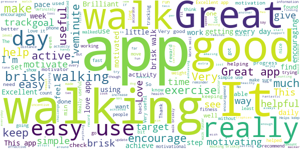
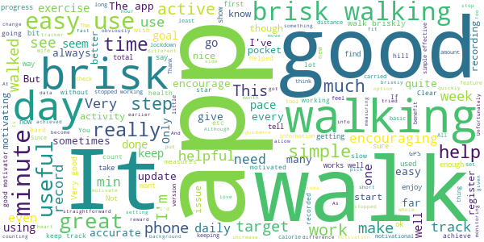
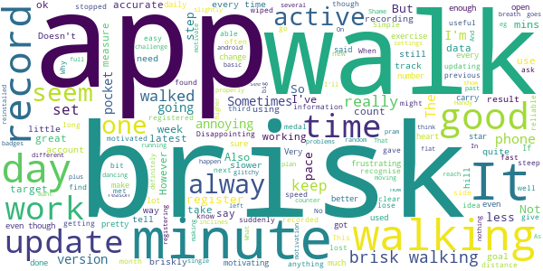
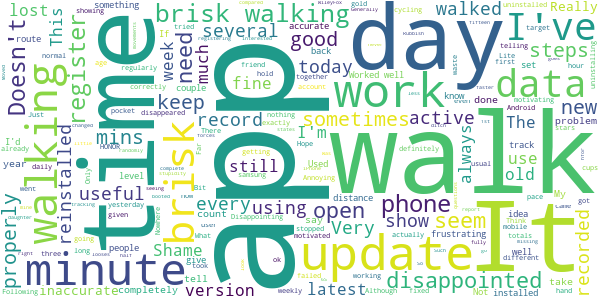
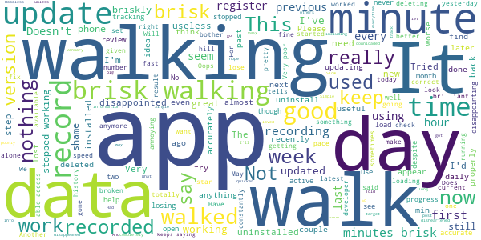

# One You Active 10 Walking Tracker
App version ``5.0.17``

Analyzed with [covid-apps-observer](http://github.com/covid-apps-observer) project, version ``0.1``

## App overview
| | |
|-------------------------|-------------------------| 
| **Name**&nbsp;&nbsp;&nbsp;&nbsp;&nbsp;&nbsp;&nbsp;&nbsp;&nbsp;&nbsp;&nbsp;&nbsp;&nbsp;&nbsp;&nbsp;&nbsp;&nbsp;&nbsp;&nbsp;&nbsp;&nbsp;&nbsp;&nbsp;&nbsp;&nbsp;&nbsp;&nbsp;&nbsp;&nbsp;&nbsp;&nbsp;&nbsp;&nbsp;&nbsp;&nbsp;&nbsp;&nbsp;&nbsp;&nbsp;&nbsp;  | One You Active 10 Walking Tracker |
| **Unique identifier** | uk.ac.shef.oak.pheactiveten |
| **Link to Google Play** | [https://play.google.com/store/apps/details?id=uk.ac.shef.oak.pheactiveten](https://play.google.com/store/apps/details?id=uk.ac.shef.oak.pheactiveten) |
| **Summary**  | Active 10 shows you when you are walking quickly enough to get health benefits. |
| **Privacy policy** | [https://www.nhs.uk/oneyou/privacy-policy#H6QQyKsRuuBpI7Dg.97](https://www.nhs.uk/oneyou/privacy-policy#H6QQyKsRuuBpI7Dg.97) |
| **Latest version** | 5.0.17 |
| **Last update** | 2021-06-07 10:17:52 |
| **Recent changes** | We are continuing to monitor and make improvement on the apps performance and stability. This update contains some important bug fixes and accessibility improvements to make it easier for everyone to navigate through the app. |
| **Installs**  | 100,000+ |
| **Category** | Health & Fitness |
| **First release** | Mar 3, 2017 |
| **Size**  | 20M |
| **Supported Android version**  | 5.1 and up |

### Description
> Active 10 is a free and easy to use walking app that tracks your walking and shows you how you can increase your intensity to benefit your health. The app is designed to support you every step of the way to increase your daily level of physical activity, with simple and achievable milestones and rewards along the way.
 Key features:
 * Tracks all your walking and how many minutes were brisk
 * Rewards every brisk minute achieved throughout the day, so perfect for those starting from low levels of activity
 * Promotes goal setting to help keep you motivated and help you progress
 * Store and view up to 12 months of your walking activity, to see how far you have come 
 * Discover loads of hints and tips on achieving a healthier lifestyle
 BRISK WALKING BENEFITS YOUR HEALTH
 We all know how important it is to be active. The good news is you don’t have to go to the gym or start expensive fitness programmes, walking counts too!
 Just ten minutes of brisk walking every day can get your heart pumping and can make you feel more energetic, as well as lowering your risk of serious illnesses like heart disease and type 2 diabetes. Going for a brisk walk is a great way to clear your head and improve your mood.
 Active 10s are simple to fit into your day. From taking the dog out to going for a lunchtime walk there are lots of opportunities to introduce brisk walking into your daily routine.
 This app relies on your phone’s inbuilt sensors to measure your activity so you may experience varying levels of accuracy especially in older devices/operating systems. To improve accuracy, keep your phone in a pocket close to your body rather than in a loose coat pocket or bag.
 If you have any feedback on how we can improve the app please send it to oneyou@phe.gov.uk.
 Frequently asked questions: https://www.nhs.uk/oneyou/active10/faqs

### User interface
The developers of the app provide the following screenshots in the Google play store.
| | | |
|:-------------------------:|:-------------------------:|:-------------------------:|
 |   |   |   | 
 |   |   |   | 

## Development team
In the following we report the main information provided by the development team in the Google play store.

| | |
|-------------------------|-------------------------|
| **Developer**  | Public Health England Digital |
| **Website**  | [http://www.nhs.uk/oneyou/active10](http://www.nhs.uk/oneyou/active10) |
| **Email** | oneyou@phe.gov.uk |
| **Physical address**  | - |
| **Other developed apps**  | [https://play.google.com/store/apps/developer?id=Public+Health+England+Digital](https://play.google.com/store/apps/developer?id=Public+Health+England+Digital) |

## Android support

| | |
|-------------------------|-------------------------|
| **Declared target Android version**  | Android10, version 10 (API level 29) |
| **Effective target Android version**  | Android10, version 10 (API level 29) |
| **Minimum supported Android version**  | Lollipop, version 5.1 (API level 22) |
| **Maximum target Android version**  | - |

The larger the difference between the minimum and maximum supported Android versions, the better. A larger difference means a wider audience. For example, old phones have a very low Android version, so a high minimum supported Android version means that the app cannot be used by users with old phones, thus leading to accessibility problems. 

## Requested permissions

In the following we report the complete list of the permissions requested by the app. 

| **Permission** | **Protection level** | **Description** | 
|-------------------------|-------------------------|-------------------------|
 **android.permission ACCESS_FINE_LOCATION** | :warning:**Dangerous** | Allows an app to access precise location. 
 **android.permission ACCESS_NETWORK_STATE** | Normal | Allows applications to access information about networks. 
 **android.permission ACCESS_WIFI_STATE** | Normal | Allows applications to access information about Wi-Fi networks. 
 **android.permission ACTIVITY_RECOGNITION** | :warning:**Dangerous** | Allows an application to recognize physical activity. 
 **android.permission INTERNET** | Normal | Allows applications to open network sockets. 
 **android.permission MODIFY_AUDIO_SETTINGS** | Normal | Allows an application to modify global audio settings. 
 **android.permission READ_EXTERNAL_STORAGE** | :warning:**Dangerous** | Allows an application to read from external storage. 
 **android.permission RECEIVE_BOOT_COMPLETED** | Normal | Allows an application to receive the Intent.ACTION_BOOT_COMPLETED that is broadcast after the system finishes booting. 
 **android.permission WAKE_LOCK** | Normal | Allows using PowerManager WakeLocks to keep processor from sleeping or screen from dimming. 
 **android.permission WRITE_EXTERNAL_STORAGE** | :warning:**Dangerous** | Allows an application to write to external storage. 
 **com.google.android.c2dm.permission RECEIVE** | - | - 
 **com.google.android.finsky.permission BIND_GET_INSTALL_REFERRER_SERVICE** | - | - 

## Mentioned servers

| **Server** | **Registrant** | **Registrant country** | **Creation date** | 
|-------------------------|-------------------------|-------------------------|-------------------------|
 | nhs.uk | Department of Health | - | 1996-08-01 00:00:00 |
 | googlesyndication.com | Google LLC | :us: US | 2003-01-21 06:17:24 |
 | google.com | Google LLC | :us: US | 1997-09-15 04:00:00 |
 | googleapis.com | Google LLC | :us: US | 2005-01-25 17:52:26 |
 | app-measurement.com | Google LLC | :us: US | 2015-06-19 20:13:31 |
 | instabug.com | - | :us: US | 2000-05-16 23:13:25 |
 | phedigital.co.uk | - | - | 2018-06-06 00:00:00 |
 | paragon-cc.co.uk | - | - | 2017-04-04 00:00:00 |
 | crashlytics.com | Google LLC | :us: US | 2011-01-21 15:30:40 |
 | googleadservices.com | Google LLC | :us: US | 2003-06-19 16:34:53 |

## Security analysis 

Below we report the main security warnings raised by our execution of the [Androwarn](https://github.com/maaaaz/androwarn) security analysis tool.

**Telephony identifiers leakage**
> - This application reads the numeric name (MCC+MNC) of current registered operator 
> - This application reads the operator name 

**Connection interfaces exfiltration**
> - This application reads details about the currently active data network 
> - This application tries to find out if the currently active data network is metered 

**Audio video eavesdropping**
> - This application records audio from the 'MIC' source  

**Suspicious connection establishment**
> - This application opens a Socket and connects it to the remote address 'Lb/b/a/a/a;->v(Ljava/lang/String;)Ljava/lang/StringBuilder;' on the 'N/A' port  
> - This application opens a Socket and connects it to the remote address 'Ljava/net/Proxy;->type()Ljava/net/Proxy$Type;' on the 'N/A' port  
> - This application opens a Socket and connects it to the remote address 'hostname == null ' on the 'N/A' port  
> - This application opens a Socket and connects it to the remote address 'timeout' on the 'N/A' port  

**Code execution**
> - This application loads a native library 
> - This application loads a native library: 'constant' 
> - This application executes a UNIX command 
> - This application executes a UNIX command containing this argument: '' 

## User ratings and reviews

Below we provide information about how end users are reacting to the app in terms of ratings and reviews in the Google Play store.

### Ratings

The One You Active 10 Walking Tracker app has been installed by more than **100000** times. At this time, **4833** rated the app and its average score is **4.3251534**. Below we show the distribution of the ratings across the usual star-based rating of Google Play

:star::star::star::star::star:: 2956

:star::star::star::star:: 1117

:star::star::star:: 375

:star::star:: 148

:star:: 237

### Reviews 

#### 5-star reviews

> This App is very good, it motivates me to do walking everyday, every 10 minutes of brisk walking you will get a rewards which is very exciting. I recommend this App to everyone.  :date: __2021-07-14 14:48:09__

> love this  :date: __2021-07-11 16:00:09__

> GREAT  :date: __2021-07-09 00:29:59__

> excellent app really motivated me to walk as much I can given my injured state  :date: __2021-07-04 13:29:22__

> Its fine apps showing correct briskwalk.  :date: __2021-07-04 07:28:59__

> Motivational  :date: __2021-07-03 12:39:56__

> Really gets you up and walking, briskly!  :date: __2021-06-26 06:43:07__

> Very useful app and is more helpful to me than 10,000 steps. I just do not have the time to do that.  :date: __2021-06-20 17:09:21__

> Great  :date: __2021-06-17 21:42:23__

> Really helpful  :date: __2021-06-15 13:10:44__

#### 4-star reviews

> it's good would be nice to have how many steps you've done as well  :date: __2021-07-11 14:07:33__

> Not yet used Sent me  :date: __2021-06-22 17:00:51__

> Straightforward to use Good to be able to look back at previous activity  :date: __2021-06-19 20:26:34__

> Good for basic activity information. You know when you need to be more active.  :date: __2021-06-19 15:15:30__

> Pity there isn't a place to list sekf-isolating or recent operations!!  :date: __2021-06-18 12:02:43__

> Loved using this to track my walking. Had 6 months or so before it's stopped working.  :date: __2021-06-15 12:44:40__

> Very easy to use. Surprisingly motivational  :date: __2021-06-14 12:21:58__

> Very easy to use app. Would be lovely if app covered cycling too  :date: __2021-06-09 15:06:33__

> It's a good app but it doesn't always refresh so I'm not surexwhstcI have completed, sometimes it calculates on the wrong day, that said when it works its great  :date: __2021-06-08 21:39:07__

> It's a friendly app, nudging you now and again to step up and get your heart going. It needs something though, I can't put my finger on it but it definitely needs an extra whatever to really motivate you.  :date: __2021-06-07 08:20:55__

#### 3-star reviews

> At the moment the app is making me go through set up every time I open it up. It still remembers my walk history, but it's quite annoying having to set up the permissions every time  :date: __2021-07-11 00:41:59__

> Disappointed with latest update...it goes through the set up every single time I use it. I've using this for several years and it keeps me motivated to do my daily power walk but fed up it goes through the set up questions every time! Using an android OnePlus5T  :date: __2021-07-01 18:57:14__

> Loads quicker than the earlier version, but otherwise inferior. Needs to allow more than 30 minutes as a target, also appears to under-record brisk walking. Since then it's got worse, seriously under recording active walking. And why does it demand an internet connection?  :date: __2021-06-26 01:41:52__

> Would like it if it linked to android or apple devices when not wanting to take your phone out for a walk  :date: __2021-06-25 00:13:14__

> Really surprised there is no settings to account for I'll be pushing a pram!!! Breathlessness will happen at slower speed.  :date: __2021-06-14 01:14:58__

> Generally good but does not accurately record walking times, always less than I have actually done which is annoying.  :date: __2021-06-08 10:41:15__

> It stopped working  :date: __2021-06-04 13:57:28__

> Brisk walk is debatable. Sometimes you almost need to run to clock up minutes. I walk on the flat as going up hill is slower and does not register brisk minutes. I do like the rewards as trophies and these are a good motivator.  :date: __2021-05-30 17:39:05__

> Doing the same circuit in the same time (30 minutes) gives different minutes of brisk walks eg from 30 mins down to 22. That's the same distance in the same time give or take 20 seconds. Forces you to adopt an unhealthy posture in order to walk fast enough to register a brisk walk.  :date: __2021-05-30 01:28:05__

> No baseline assessment to measure whst is "brisk" for me. Makes you feel good when you notch up a chunk of brisk minutes, motivating to make me reach the next 10.  :date: __2021-05-03 11:17:55__

#### 2-star reviews

> Latest update forces you to complete the set-up every time you use the app. This needs to be changed I don't need to waste my time on such stupidity  :date: __2021-07-15 00:22:42__

> Moved app to a new phone and it goes through the set up questions every time I open it. It also seems to under report Active steps. The old app on my old phone worked so well. Such a shame.  :date: __2021-07-08 00:42:00__

> Was a good app, but since the update it does not always register the walks and walks randomly go missing. Think it is time to ditch the app and look for something else.  :date: __2021-07-02 15:09:48__

> Doesn't seem to track your movements fully or it looses data? Shame...  :date: __2021-06-27 19:17:21__

> Today it has stopped registering any walks. I have the latest version, and it's been fine until today.  :date: __2021-06-15 20:58:08__

> Worked very well with iPhone 6S, since installed on a new HONOR 20 Lite - it never registers brisk walk and walking the same route which takes about an hour sometimes states less than fifteen minutes normal walking. Reinstalled and booted three times no different. Very disappointed! UPDATE 11.06.21 I've reinstalled three times, does not register brisk walks. Works well on WileyFox phone, but problems with Honor 20 lite. So disappointed!  :date: __2021-06-11 09:28:01__

> It's ok  :date: __2021-05-30 15:42:56__

> The app counts cycling as walking... It's just not right. Hope it get fixed. Only useful for brisk, not hfor normal walk.  :date: __2021-05-25 16:49:12__

> It does not register brisk walking properly. I walk with my daughter both using active 10, mine shows very little brisk walking compared with hers. Rubbish.  :date: __2021-05-15 15:25:57__

> Doesn't always work  :date: __2021-05-10 20:48:27__

#### 1-star reviews

> Keeps needing to be setup everytime I use it. Have now uninstalled it. It used to be good.  :date: __2021-07-01 21:55:08__

> Terrible worked the first 2 walks I did then nothing. Really disappointed won't be using it again  :date: __2021-06-26 18:49:51__

> Slow to load, slow to start up, misses many brisk walks. Good in concept but poorly implemented. Stopped using it.  :date: __2021-06-24 17:35:35__

> Doesn't work. Simple as that. What more can I say?  :date: __2021-06-24 16:53:02__

> Had a glitch after first few weeks when first downloaded but had been working really well since and it's an app I find really useful. Recently though (since last update) every time I open it I have to go through the whole set up including consents (including a prepopulated decision that I want to set my own goals, I don't). Every. Single. Tme. Held off deleting in hope bug would be fixed but I really can't be bothered with the hassle anymore so will be deleting after this post.  :date: __2021-06-24 11:46:13__

> Great overall though tracking distance covered would be good too. Since lost most of my data so now unimpressed by the app. Now it's asking me to agree to terms and conditions everytime I use it! Why?  :date: __2021-06-20 11:17:42__

> I loved this app when I first started using it, as it was an easy way to keep track of my progress, but like others, I'm finding that it keeps stripping out all of my stats, so starting to think I'll not bother using it anymore unless a fix is done very soon - such a shame I tried using the app again recently and it appears to have stopped working completely now, so not tracking any minutes at all, app needs updating!! App updated on 14.06.21 & it's still not working properly, disappointing.  :date: __2021-06-15 08:20:28__

> This app was great from January till May, and then it stopped tracking my minutes of brisk walking. Needs fixing big time..  :date: __2021-06-07 21:31:27__

> Hopeless. Doesn't record minutes of walking accurately let alone minutes of brisk walking. Today I walked briskly for 30 minutes but only 24 minutes of walking was recorded and just 8 were recorded as "brisk". So I practically ran for 5 minutes, then walked briskly for another 5, to try and push the brisk minutes up. No additional minutes of walking, brisk or otherwise were recorded. It stuck at 24 and 8. It was fine for a couple of days but hasn't recorded accurately since then.  :date: __2021-05-09 18:22:31__

> Didn't find this app useful because what I felt was a brisk walk for me didn't register leaving me feeling disheartened. ☹️  :date: __2021-04-29 19:09:50__

