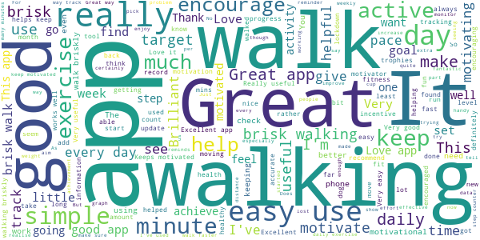
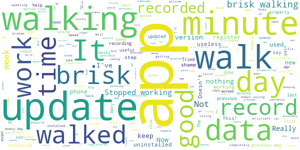

# One You Active 10 Walking Tracker
App version ``5.0.5``

Analyzed with [covid-apps-observer](http://github.com/covid-apps-observer) project, version ``0.1``

## App overview
| | |
|-------------------------|-------------------------| 
| **Name**&nbsp;&nbsp;&nbsp;&nbsp;&nbsp;&nbsp;&nbsp;&nbsp;&nbsp;&nbsp;&nbsp;&nbsp;&nbsp;&nbsp;&nbsp;&nbsp;&nbsp;&nbsp;&nbsp;&nbsp;&nbsp;&nbsp;&nbsp;&nbsp;&nbsp;&nbsp;&nbsp;&nbsp;&nbsp;&nbsp;&nbsp;&nbsp;&nbsp;&nbsp;&nbsp;&nbsp;&nbsp;&nbsp;&nbsp;&nbsp;  | One You Active 10 Walking Tracker |
| **Unique identifier** | uk.ac.shef.oak.pheactiveten |
| **Link to Google Play** | [https://play.google.com/store/apps/details?id=uk.ac.shef.oak.pheactiveten](https://play.google.com/store/apps/details?id=uk.ac.shef.oak.pheactiveten) |
| **Summary**  | Active 10 shows you when you are walking quickly enough to get health benefits. |
| **Privacy policy** | [https://www.nhs.uk/oneyou/privacy-policy#H6QQyKsRuuBpI7Dg.97](https://www.nhs.uk/oneyou/privacy-policy#H6QQyKsRuuBpI7Dg.97) |
| **Latest version** | 5.0.5 |
| **Last update** | 2021-01-15 18:49:30 |
| **Recent changes** | Important update: This release includes a fix to resolve issues with walking data being lost by some users.  We&#39;ll also be following up with a future update in the next couple of days to return any missing data to your walking history. |
| **Installs**  | 100,000+ |
| **Category** | Health & Fitness |
| **First release** | Mar 3, 2017 |
| **Size**  | 18M |
| **Supported Android version**  | 5.1 and up |

### Description
> Active 10 is a free and easy to use walking app that tracks your walking and shows you how you can increase your intensity to benefit your health. The app is designed to support you every step of the way to increase your daily level of physical activity, with simple and achievable milestones and rewards along the way.
 Key features:
 * Tracks all your walking and how many minutes were brisk
 * Rewards every brisk minute achieved throughout the day, so perfect for those starting from low levels of activity
 * Promotes goal setting to help keep you motivated and help you progress
 * Store and view up to 12 months of your walking activity, to see how far you have come 
 * Discover loads of hints and tips on achieving a healthier lifestyle
 BRISK WALKING BENEFITS YOUR HEALTH
 We all know how important it is to be active. The good news is you don’t have to go to the gym or start expensive fitness programmes, walking counts too!
 Just ten minutes of brisk walking every day can get your heart pumping and can make you feel more energetic, as well as lowering your risk of serious illnesses like heart disease and type 2 diabetes. Going for a brisk walk is a great way to clear your head and improve your mood.
 Active 10s are simple to fit into your day. From taking the dog out to going for a lunchtime walk there are lots of opportunities to introduce brisk walking into your daily routine.
 This app relies on your phone’s inbuilt sensors to measure your activity so you may experience varying levels of accuracy especially in older devices/operating systems. To improve accuracy, keep your phone in a pocket close to your body rather than in a loose coat pocket or bag.
 If you have any feedback on how we can improve the app please send it to oneyou@phe.gov.uk.
 Frequently asked questions: https://www.nhs.uk/oneyou/active10/faqs

### User interface
The developers of the app provide the following screenshots in the Google play store.
| | | |
|:-------------------------:|:-------------------------:|:-------------------------:|
 |   |   |   | 
 |   |   |   | 

## Development team
In the following we report the main information provided by the development team in the Google play store.

| | |
|-------------------------|-------------------------|
| **Developer**  | Public Health England Digital |
| **Website**  | [http://www.nhs.uk/oneyou/active10](http://www.nhs.uk/oneyou/active10) |
| **Email** | oneyou@phe.gov.uk |
| **Physical address**  | - |
| **Other developed apps**  | [https://play.google.com/store/apps/developer?id=Public+Health+England+Digital](https://play.google.com/store/apps/developer?id=Public+Health+England+Digital) |

## Android support

| | |
|-------------------------|-------------------------|
| **Declared target Android version**  | Android10, version 10 (API level 29) |
| **Effective target Android version**  | Android10, version 10 (API level 29) |
| **Minimum supported Android version**  | Lollipop, version 5.1 (API level 22) |
| **Maximum target Android version**  | - |

The larger the difference between the minimum and maximum supported Android versions, the better. A larger difference means a wider audience. For example, old phones have a very low Android version, so a high minimum supported Android version means that the app cannot be used by users with old phones, thus leading to accessibility problems. 

## Requested permissions

In the following we report the complete list of the permissions requested by the app. 

| **Permission** | **Protection level** | **Description** | 
|-------------------------|-------------------------|-------------------------|
 **android.permission ACCESS_FINE_LOCATION** | :warning:**Dangerous** | Allows an app to access precise location. 
 **android.permission ACCESS_NETWORK_STATE** | Normal | Allows applications to access information about networks. 
 **android.permission ACCESS_WIFI_STATE** | Normal | Allows applications to access information about Wi-Fi networks. 
 **android.permission ACTIVITY_RECOGNITION** | :warning:**Dangerous** | Allows an application to recognize physical activity. 
 **android.permission INTERNET** | Normal | Allows applications to open network sockets. 
 **android.permission MODIFY_AUDIO_SETTINGS** | Normal | Allows an application to modify global audio settings. 
 **android.permission READ_EXTERNAL_STORAGE** | :warning:**Dangerous** | Allows an application to read from external storage. 
 **android.permission RECEIVE_BOOT_COMPLETED** | Normal | Allows an application to receive the Intent.ACTION_BOOT_COMPLETED that is broadcast after the system finishes booting. 
 **android.permission WAKE_LOCK** | Normal | Allows using PowerManager WakeLocks to keep processor from sleeping or screen from dimming. 
 **android.permission WRITE_EXTERNAL_STORAGE** | :warning:**Dangerous** | Allows an application to write to external storage. 
 **com.google.android.c2dm.permission RECEIVE** | - | - 
 **com.google.android.finsky.permission BIND_GET_INSTALL_REFERRER_SERVICE** | - | - 

## Mentioned servers

| **Server** | **Registrant** | **Registrant country** | **Creation date** | 
|-------------------------|-------------------------|-------------------------|-------------------------|
 | nhs.uk | Department of Health | - | 1996-08-01 00:00:00 |
 | googlesyndication.com | Google LLC | :us: US | 2003-01-21 06:17:24 |
 | google.com | Google LLC | :us: US | 1997-09-15 04:00:00 |
 | googleapis.com | Google LLC | :us: US | 2005-01-25 17:52:26 |
 | app-measurement.com | Google LLC | :us: US | 2015-06-19 20:13:31 |
 | instabug.com | - | :us: US | 2000-05-16 23:13:25 |
 | phedigital.co.uk | - | - | 2018-06-06 00:00:00 |
 | paragon-cc.co.uk | - | - | 2017-04-04 00:00:00 |
 | crashlytics.com | Google LLC | :us: US | 2011-01-21 15:30:40 |
 | googleadservices.com | Google LLC | :us: US | 2003-06-19 16:34:53 |

## Security analysis 

Below we report the main security warnings raised by our execution of the [Androwarn](https://github.com/maaaaz/androwarn) security analysis tool.

**Telephony identifiers leakage**
> - This application reads the numeric name (MCC+MNC) of current registered operator 
> - This application reads the operator name 

**Connection interfaces exfiltration**
> - This application reads details about the currently active data network 
> - This application tries to find out if the currently active data network is metered 

**Audio video eavesdropping**
> - This application records audio from the 'MIC' source  

**Suspicious connection establishment**
> - This application opens a Socket and connects it to the remote address 'La/b/a/a/a;->s(Ljava/lang/String;)Ljava/lang/StringBuilder;' on the 'N/A' port  
> - This application opens a Socket and connects it to the remote address 'Ljava/net/Proxy;->type()Ljava/net/Proxy$Type;' on the 'N/A' port  
> - This application opens a Socket and connects it to the remote address 'hostname == null ' on the 'N/A' port  
> - This application opens a Socket and connects it to the remote address 'timeout' on the 'N/A' port  

**Code execution**
> - This application loads a native library 
> - This application loads a native library: 'constant' 
> - This application executes a UNIX command 
> - This application executes a UNIX command containing this argument: '' 

## User ratings and reviews

Below we provide information about how end users are reacting to the app in terms of ratings and reviews in the Google Play store.

### Ratings

The One You Active 10 Walking Tracker app has been installed by more than **100000** times. At this time, **4241** rated the app and its average score is **3.9556074**. Below we show the distribution of the ratings across the usual star-based rating of Google Play

:star::star::star::star::star:: 2200

:star::star::star::star:: 961

:star::star::star:: 327

:star::star:: 198

:star:: 555

### Reviews 

#### 5-star reviews

> Started slow,as have arthritis,but have built up my brisk walking with the dog over the last 3 days.This app spurs me on & gives me confidence to keep trying.  :date: __2021-01-22 21:38:30__

> Love this app. V simple. V motivating. V good for me.  :date: __2021-01-22 21:05:39__

> This is so useful .When you think you are walking fast you really aren't!!  :date: __2021-01-22 20:06:18__

> Love it. I'm to overweight & old to run but I can do 10 a day no problem while walking the dog.  :date: __2021-01-22 11:47:27__

> Great app.  :date: __2021-01-22 02:33:38__

> Great App  :date: __2021-01-21 15:11:04__

> I find this app encourages me to walk more especially during COVID. I'm nearly 80 so cant go too far but feel better for a brisk walk however short.  :date: __2021-01-21 13:05:03__

> Great motivator.  :date: __2021-01-19 18:40:40__

> Found the app easy to use and helped me be more active every day. I would recommend it and I am going to continue to use it.  :date: __2021-01-18 18:43:37__

> Works well, good information...  :date: __2021-01-18 09:34:35__

#### 4-star reviews

> Returned to app to ensure I was doung enoygh, so it's good to know enough of my steps are "brisk".  :date: __2021-01-23 11:11:42__

> Clear and simple. Stays on constantly so no need to remember to activate it.  :date: __2021-01-23 09:03:50__

> Updated review, Jan 2021, reinstalled the app again and it is working again, as before, when it's working, I really enjoy this app, I like setting myself targets and it encourages me to complete an extra 10 minutes if I have just gone over. June2020: This started out great, used it at start of lockdown to make sure I brisk walked for my daily exercise. Then one day it randomly stopped working. tried uninstalling and reinstalling, no good, a shame I enjoyed it whilst it lasted.  :date: __2021-01-22 20:04:24__

> I wish there was a calorie tracker and the option to up your goals but its really motivated me to start walking! And I'm loving it.  :date: __2021-01-20 12:20:47__

> It's great to be reminded just how active you really are! So you can up your game.  :date: __2021-01-19 20:14:49__

> After the update I eventually got the app to work by repeatedly re- downloading, but after 3 days it has failed again. We should be given the option of using the original app, which worked well. My phone is a Samsung Galaxy S6.  :date: __2021-01-16 12:39:05__

> I really like this app. Clear and easy to use, it helps me keep track of puppy walking! But since updating, I have no record of my walks since 12th Jan which is annoying. I hope u can fix it.  :date: __2021-01-16 09:25:59__

> Easy to use and mildly addictive!But it has stopped working after the update and hasn't recorded my walks this week; very demotivating.  :date: __2021-01-15 21:37:26__

> Very Good & Easy to use At least it was until it stopped recording  :date: __2021-01-15 14:43:36__

> It's very useful app. It's encouraging me to walk  :date: __2021-01-15 13:00:00__

#### 3-star reviews

> Not been using for long. But clear and concise  :date: __2021-01-22 13:38:54__

> It's an ok app. As long as you have your phone in your pocket it records the time you are moving and how much of it was brisk. It does seem to lose the information from one day to another though, which is a bit annoying as you could compare your movements over the last week or months - pointless if it doesn't save continuously. The app does have information, or rather links to other areas, ie healthy eating.  :date: __2021-01-20 12:57:15__

> OK when it works but very frustrating when it doesn't record a walk even when the phone is being carried in exactly the same way as it always is. Is now claiming that I haven't opened the app for 39 days when I used it the preceding day. Missed recordings have happened so often now that I'm looking for an alternative.  :date: __2021-01-17 15:54:18__

> Found it really motivating but appear to have 'lost' a weeks walking!  :date: __2021-01-17 12:12:38__

> Not consistent. The same walk everyday. The faster the walk often results in less time recognised as brisk walking!  :date: __2021-01-17 10:49:13__

> I like the idea of this app. But it seems to have wiped all my walks this week telling me it needs to update.  :date: __2021-01-14 09:12:49__

> I really liked this but since updating it has lost a number of days which defeats the object. I'd rather have an accurate record than badges!  :date: __2021-01-14 07:53:37__

> I really like this app as it is an excellent way of keeping track of brisk minutes and seeing progress. Unfortunately I have also found since updating yesterday it keeps deleting my daily walks. Very frustrating and I really hope it gets fixed soon.  :date: __2021-01-13 18:03:39__

> All going great until your update wiped out all hard earned stats!! Not very good for motivation😣  :date: __2021-01-13 17:52:50__

> 80 heart points in Google Fit but this app doesn't get the brisk element so no goals met. It syncs but doesn't seem to get full data somehow. I just updated it. I opened it the app told me there was an update and brought me back here I don't understand how it concludes that I have met goals. One day had 76 brisk minutes out of 191walking minutes but told I hadn't met my goal of 2 x Active 10s but other days have less brisk minutes but does meet goal. It seems a bit random. What's it measuring?  :date: __2021-01-13 17:28:40__

#### 2-star reviews

> Regularly does not track my brisk walking unless I hold the phone in my hand while I walk.  :date: __2021-01-23 10:53:20__

> I walked, and my walks were measured and I got a badge , great! Then walks disappeared😐uninstalled and re installed.. same thing🤷👎 Good idea, but its not working properly  :date: __2021-01-17 15:35:42__

> Works fine on IOS but poor on Android - keeps stopping - can't adjust the target. I uninstalled and reinstalled but still same. All my other apps work fine.  :date: __2021-01-17 02:54:31__

> Really liked it for first 2 days but now day 4 it only shows first days walking and hasn't recorded that I walked at all today. It doesn't open properly but takes me back to Google Play to open it from there. I had high hopes for this and recommended it to friends but I'm now disappointed.  :date: __2021-01-16 01:10:29__

> Stopped working on 3rd day saying it couldn't retrieve my walk data🤔  :date: __2021-01-15 19:50:33__

> Lost previous days walk data at the start of every new day. Pretty frustrating.  :date: __2021-01-15 08:57:10__

> Used this app really successfully until this week when it's not storing daily levels so can't compare any more. What's happened? Disappointed  :date: __2021-01-14 15:51:31__

> Disappointed. Following update several days walks not recorded or have disappeared. If this continues will research another app.  :date: __2021-01-13 21:54:12__

> Definitely loved the app but doesn't work following update. I've logged 3 days walking this week which subsequently disappears and doesn't update weekly or monthly summary. It's not working at all. Disappointed.  :date: __2021-01-13 17:14:31__

> Always Only show 8 minutes of brisk walking even though I have done 44mins.  :date: __2020-12-30 16:24:28__

#### 1-star reviews

> Installed first time and registered brisk walk, next few days nothing. Unistalled the Installed again and still not registering brisk walks or steps. A good idea but not working. Now unable to register as will not accept my Post Code / email address.  :date: __2021-01-23 09:01:21__

> This use to work, it's broken now  :date: __2021-01-19 16:37:53__

> A good app for raising blood pressure, not so good for encouraging walking. It seems to forget data despite the update. For instance on the day it says 20 minutes, look at your history and it's only 5.  :date: __2021-01-19 13:36:30__

> Loses walking data within 24 hours which is really annoying despite the update on 15th January.  :date: __2021-01-19 13:33:18__

> Broken since last update!  :date: __2021-01-18 07:40:26__

> Hopeless. Now worse. Keeps saying I might lose data as I need to log in every 30 days. I am actually logging in every day and it tells me this every day. And data does keep disappearing but only temporarily. Update-not so temporary- Thu and Sat have disappeared though I walked about 4 miles each day  :date: __2021-01-17 15:43:39__

> Worked for first day then said update now does not keep record of each days walking not good 😒  :date: __2021-01-17 11:47:28__

> Update has killed it 😓 nothing saved and nothing to see other than a few random badges, shame as I did like it before - uninstalled  :date: __2021-01-17 01:27:00__

> I loved this app when I first started using it, as it was an easy way to keep track of my progress, but like others, I'm finding that it keeps stripping out all of my stats, so starting to think I'll not bother using it anymore unless a fix is done very soon - such a shame  :date: __2021-01-16 21:47:54__

> Walks keep disappearing from my history so pretty useless to track my progress.uninstalling  :date: __2021-01-16 15:21:44__

