# NHS Active 10 Walking Tracker
App version ``5.3.2``

Analyzed with [covid-apps-observer](http://github.com/covid-apps-observer) project, version ``0.1``

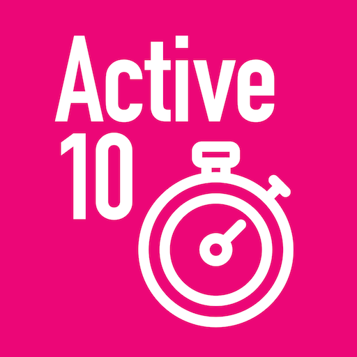

## App overview
| | |
|-------------------------|-------------------------| 
| **Name**&nbsp;&nbsp;&nbsp;&nbsp;&nbsp;&nbsp;&nbsp;&nbsp;&nbsp;&nbsp;&nbsp;&nbsp;&nbsp;&nbsp;&nbsp;&nbsp;&nbsp;&nbsp;&nbsp;&nbsp;&nbsp;&nbsp;&nbsp;&nbsp;&nbsp;&nbsp;&nbsp;&nbsp;&nbsp;&nbsp;&nbsp;&nbsp;&nbsp;&nbsp;&nbsp;&nbsp;&nbsp;&nbsp;&nbsp;&nbsp;  | NHS Active 10 Walking Tracker |
| **Unique identifier** | uk.ac.shef.oak.pheactiveten |
| **Link to Google Play** | [https://play.google.com/store/apps/details?id=uk.ac.shef.oak.pheactiveten](https://play.google.com/store/apps/details?id=uk.ac.shef.oak.pheactiveten) |
| **Summary**  | Active 10 shows you when you are walking quickly enough to get health benefits. |
| **Privacy policy** | [https://www.nhs.uk/oneyou/privacy-policy#H6QQyKsRuuBpI7Dg.97](https://www.nhs.uk/oneyou/privacy-policy#H6QQyKsRuuBpI7Dg.97) |
| **Latest version** | 5.3.2 |
| **Last update** | 2021-07-29 13:46:53 |
| **Recent changes** | This release fixes issues  around some users being repeatedly taken back through the initial app set-up. |
| **Installs**  | 100,000+ |
| **Category** | Health & Fitness |
| **First release** | Mar 3, 2017 |
| **Size**  | 28M |
| **Supported Android version**  | 5.1 and up |

### Description
> Healthy changes start with little changes. Whether you want to lose weight, get more active or improve your mood, Better Health and Active 10 will be here to support you reach your health goals.
 There has never been a better time to kickstart your health.
 KEY FEATURES:
 • Tracks all your walking and how many minutes were brisk
 • Rewards every brisk minute achieved throughout the day, so perfect for those starting from low levels of activity
 • Promotes goal setting to help keep you motivated and help you progress
 • Store and view up to 12 months of your walking activity, to see how far you have come
 • Discover loads of hints and tips on achieving a healthier lifestyle
 BRISK WALKING BENEFITS YOUR HEALTH
 We all know how important it is to be active. The good news is you don’t have to go to the gym or start expensive fitness programmes, walking briskly counts too!
 Just ten minutes of brisk walking every day can get your heart pumping and can make you feel more energetic, as well as lowering your risk of serious illnesses like heart disease and type 2 diabetes. Going for a brisk walk is a great way to clear your head and improve your mood.
 Active 10's are simple to fit into your day, from taking the dog out to going for a lunchtime walk there are lot of opportunities to include brisk walking into your daily routine.
 This app relies on your phone’s inbuilt sensors to measure your activity so you may experience varying levels of accuracy especially in older devices/operating systems. To improve accuracy, we recommend keeping your phone in a pocket close to your body rather than in a loose coat pocket or bag.
 If you have any feedback on how we can improve the app please send it to BetterHealth 

### User interface
The developers of the app provide the following screenshots in the Google play store.
| | | |
|:-------------------------:|:-------------------------:|:-------------------------:|
 | 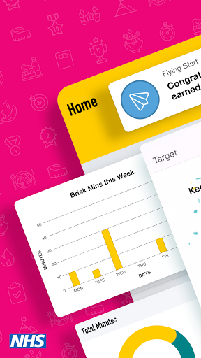  | 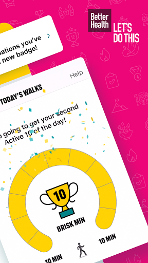  | 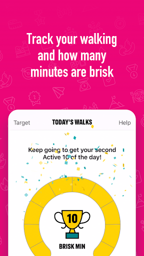  | 
 | 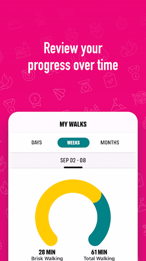  | 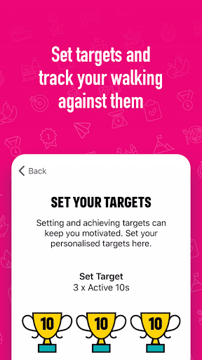  | 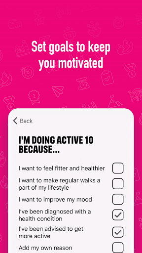  | 
 |   | 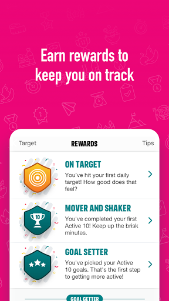 

## Development team
In the following we report the main information provided by the development team in the Google play store.

| | |
|-------------------------|-------------------------|
| **Developer**  | Public Health England Digital |
| **Website**  | [http://www.nhs.uk/oneyou/active10](http://www.nhs.uk/oneyou/active10) |
| **Email** | oneyou@phe.gov.uk |
| **Physical address**  | - |
| **Other developed apps**  | [https://play.google.com/store/apps/developer?id=Public+Health+England+Digital](https://play.google.com/store/apps/developer?id=Public+Health+England+Digital) |

## Android support

| | |
|-------------------------|-------------------------|
| **Declared target Android version**  | Android10, version 10 (API level 29) |
| **Effective target Android version**  | Android10, version 10 (API level 29) |
| **Minimum supported Android version**  | Lollipop, version 5.1 (API level 22) |
| **Maximum target Android version**  | - |

The larger the difference between the minimum and maximum supported Android versions, the better. A larger difference means a wider audience. For example, old phones have a very low Android version, so a high minimum supported Android version means that the app cannot be used by users with old phones, thus leading to accessibility problems. 

## Requested permissions

In the following we report the complete list of the permissions requested by the app. 

| **Permission** | **Protection level** | **Description** | 
|-------------------------|-------------------------|-------------------------|
 **android.permission ACCESS_FINE_LOCATION** | :warning:**Dangerous** | Allows an app to access precise location. 
 **android.permission ACCESS_NETWORK_STATE** | Normal | Allows applications to access information about networks. 
 **android.permission ACCESS_WIFI_STATE** | Normal | Allows applications to access information about Wi-Fi networks. 
 **android.permission ACTIVITY_RECOGNITION** | :warning:**Dangerous** | Allows an application to recognize physical activity. 
 **android.permission FOREGROUND_SERVICE** | Normal | Allows a regular application to use Service.startForeground. 
 **android.permission INTERNET** | Normal | Allows applications to open network sockets. 
 **android.permission MODIFY_AUDIO_SETTINGS** | Normal | Allows an application to modify global audio settings. 
 **android.permission READ_EXTERNAL_STORAGE** | :warning:**Dangerous** | Allows an application to read from external storage. 
 **android.permission RECEIVE_BOOT_COMPLETED** | Normal | Allows an application to receive the Intent.ACTION_BOOT_COMPLETED that is broadcast after the system finishes booting. 
 **android.permission WAKE_LOCK** | Normal | Allows using PowerManager WakeLocks to keep processor from sleeping or screen from dimming. 
 **android.permission WRITE_EXTERNAL_STORAGE** | :warning:**Dangerous** | Allows an application to write to external storage. 
 **com.google.android.c2dm.permission RECEIVE** | - | - 
 **com.google.android.finsky.permission BIND_GET_INSTALL_REFERRER_SERVICE** | - | - 
 **com.google.android.providers.gsf.permission READ_GSERVICES** | - | - 

## Mentioned servers

| **Server** | **Registrant** | **Registrant country** | **Creation date** | 
|-------------------------|-------------------------|-------------------------|-------------------------|
 | nhs.uk | Department of Health | - | 1996-08-01 00:00:00 |
 | googlesyndication.com | Google LLC | :us: US | 2003-01-21 06:17:24 |
 | google.com | Google LLC | :us: US | 1997-09-15 04:00:00 |
 | googleapis.com | Google LLC | :us: US | 2005-01-25 17:52:26 |
 | app-measurement.com | Google LLC | :us: US | 2015-06-19 20:13:31 |
 | googleapis.com | Google LLC | :us: US | 2005-01-25 17:52:26 |
 | instabug.com | - | :us: US | 2000-05-16 23:13:25 |
 | phedigital.co.uk | - | - | 2018-06-06 00:00:00 |
 | paragon-cc.co.uk | - | - | 2017-04-04 00:00:00 |
 | crashlytics.com | Google LLC | :us: US | 2011-01-21 15:30:40 |
 | googleadservices.com | Google LLC | :us: US | 2003-06-19 16:34:53 |

## Security analysis 

Below we report the main security warnings raised by our execution of the [Androwarn](https://github.com/maaaaz/androwarn) security analysis tool.

**Telephony identifiers leakage**
> - This application reads the numeric name (MCC+MNC) of current registered operator 
> - This application reads the operator name 

**Connection interfaces exfiltration**
> - This application reads details about the currently active data network 
> - This application tries to find out if the currently active data network is metered 

**Audio video eavesdropping**
> - This application records audio from the 'MIC' source  

**Suspicious connection establishment**
> - This application opens a Socket and connects it to the remote address 'Lb/b/a/a/a;->C(Ljava/lang/String;)Ljava/lang/StringBuilder;' on the 'N/A' port  
> - This application opens a Socket and connects it to the remote address 'Ljava/net/Proxy;->type()Ljava/net/Proxy$Type;' on the 'N/A' port  
> - This application opens a Socket and connects it to the remote address 'hostname == null ' on the 'N/A' port  
> - This application opens a Socket and connects it to the remote address 'timeout' on the 'N/A' port  

**Code execution**
> - This application loads a native library 
> - This application loads a native library: 'constant' 
> - This application executes a UNIX command 
> - This application executes a UNIX command containing this argument: '' 

## User ratings and reviews

Below we provide information about how end users are reacting to the app in terms of ratings and reviews in the Google Play store.

### Ratings

The NHS Active 10 Walking Tracker app has been installed by more than **100000** times. At this time, **5081** rated the app and its average score is **4.273622**. Below we show the distribution of the ratings across the usual star-based rating of Google Play

:star::star::star::star::star:: 3081

:star::star::star::star:: 1140

:star::star::star:: 340

:star::star:: 210

:star:: 310

### Reviews 

#### 5-star reviews

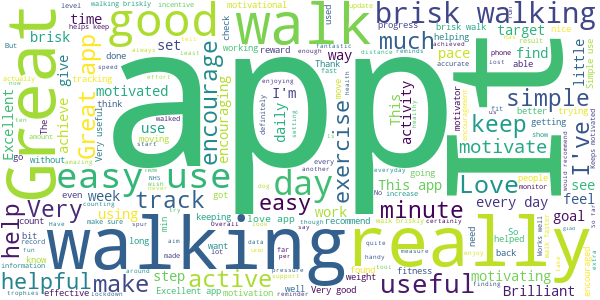

> fantastic  :date: __2021-07-30 14:59:48__

> A very useful app. Found it helpful, will be setting a high brisk walking time!  :date: __2021-07-26 18:30:53__

> appears accurate and work s for me  :date: __2021-07-21 09:36:19__

> This App is very good, it motivates me to do walking everyday, every 10 minutes of brisk walking you will get a rewards which is very exciting. I recommend this App to everyone.  :date: __2021-07-14 14:48:09__

> love this  :date: __2021-07-11 16:00:09__

> GREAT  :date: __2021-07-09 00:29:59__

> excellent app really motivated me to walk as much I can given my injured state  :date: __2021-07-04 13:29:22__

> Its fine apps showing correct briskwalk.  :date: __2021-07-04 07:28:59__

> Motivational  :date: __2021-07-03 12:39:56__

> Really gets you up and walking, briskly!  :date: __2021-06-26 06:43:07__

#### 4-star reviews

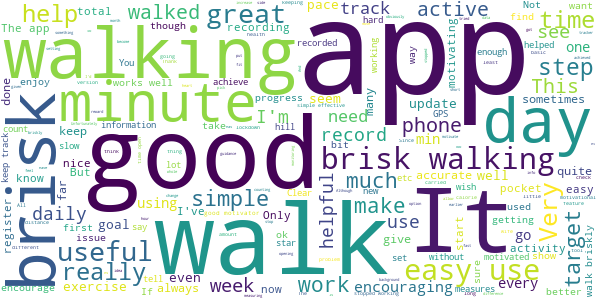

> Have been using it for around 6 weeks with a 30 min daily target. The 10 min blocks and weekly total help to make up if you miss the daily target. 29 July 21. Same problem as other users below. Have to go through set up every time I open it. Has this problem been fixed yet. If so, what do I do to update?  :date: __2021-07-29 11:03:16__

> I have to enter all the information each time I open the app. Very irritating!  :date: __2021-07-26 18:26:18__

> Great app that's easy to use and understand. Very helpful in keeping me on target in my old age. July 2021. What's happened? Different opening page & have to answer the same questions every time I open the app now!  :date: __2021-07-26 10:25:07__

> it's good would be nice to have how many steps you've done as well  :date: __2021-07-11 14:07:33__

> Not yet used Sent me  :date: __2021-06-22 17:00:51__

> Straightforward to use Good to be able to look back at previous activity  :date: __2021-06-19 20:26:34__

> Good for basic activity information. You know when you need to be more active.  :date: __2021-06-19 15:15:30__

> Pity there isn't a place to list sekf-isolating or recent operations!!  :date: __2021-06-18 12:02:43__

> Loved using this to track my walking. Had 6 months or so before it's stopped working.  :date: __2021-06-15 12:44:40__

> Very easy to use. Surprisingly motivational  :date: __2021-06-14 12:21:58__

#### 3-star reviews

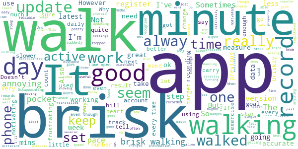

> Do I really need a picture of the fat lady at startup? Please, at least allow the possibility to go directly to the next section showing minutes walked directly.  :date: __2021-07-29 22:32:39__

> Latest update nuked all my previous rewards.  :date: __2021-07-29 19:59:50__

> not pleased with the pink colour scheme and photo of lady at the start. And why the set up questions each time you open the app?  :date: __2021-07-27 23:48:30__

> Opened it up today and it's all changed and had to fill up questions again and all my rewards that I worked hard for has gone Why the change disappointed  :date: __2021-07-27 16:21:50__

> Despite the recent update, the app is making me go through set up every time I open it up. It still remembers my walk history, but it's quite annoying having to set up the permissions every time  :date: __2021-07-25 19:50:34__

> Disappointed with latest update...it goes through the set up every single time I use it. I've using this for several years and it keeps me motivated to do my daily power walk but fed up it goes through the set up questions every time! Using an android OnePlus5T  :date: __2021-07-01 18:57:14__

> Would like it if it linked to android or apple devices when not wanting to take your phone out for a walk  :date: __2021-06-25 00:13:14__

> Really surprised there is no settings to account for I'll be pushing a pram!!! Breathlessness will happen at slower speed.  :date: __2021-06-14 01:14:58__

> Generally good but does not accurately record walking times, always less than I have actually done which is annoying.  :date: __2021-06-08 10:41:15__

> It stopped working  :date: __2021-06-04 13:57:28__

#### 2-star reviews

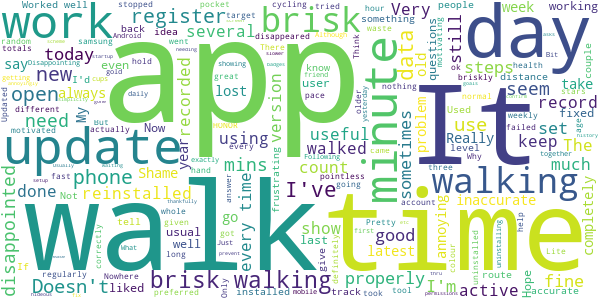

> I liked this app for its simplicity and ease of use. Updated today and it has a new slower startup screen, then I had to go through the whole setup again as if I was a new user - thankfully my brisk minute history is still there but all my badges are gone. It was working fine for me before - when will this be fixed?  :date: __2021-07-30 16:21:29__

> New colour scheme is hideous! But even more annoyingly, every time I open the app it asks me to confirm permissions, goals etc  :date: __2021-07-29 17:24:03__

> Usually a great app but still waiting for a fix to prevent needing to go thru set up questions each time. Pretty annoying bug.  :date: __2021-07-29 12:42:36__

> Last update is very strange. The app count my usual walk as brisk walking. I'm walking fast, but not so fast as the exercise demands.  :date: __2021-07-28 21:30:34__

> Much preferred the older version Easier to use. Hope you can resolve the issue of having to set up app each time before use.  :date: __2021-07-28 13:28:50__

> Fine at measuring brisk walking, but super annoying that you have to answer 83 questions every time you open the app. Why can't you just remember my answers from last time?  :date: __2021-07-27 17:09:16__

> Ruined with a pointless update. I liked this because I have a health condition for which I'm advised to walk briskly for 30 mins a day and this gave me a tool to help. Now I have to go through the set up each time I use it. It's also now a dreadful colour and includes a daft picture of a random woman. Why have you done this?  :date: __2021-07-27 10:32:41__

> Latest update forces you to complete the set-up every time you use the app. This needs to be changed I don't need to waste my time on such stupidity  :date: __2021-07-15 00:22:42__

> Moved app to a new phone and it goes through the set up questions every time I open it. It also seems to under report Active steps. The old app on my old phone worked so well. Such a shame.  :date: __2021-07-08 00:42:00__

> Was a good app, but since the update it does not always register the walks and walks randomly go missing. Think it is time to ditch the app and look for something else.  :date: __2021-07-02 15:09:48__

#### 1-star reviews

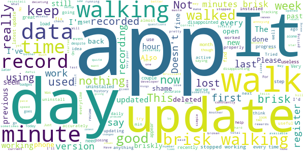

> App was fine but latest update deleted all my badges and progress  :date: __2021-07-30 12:28:16__

> The last update has lost all my past data, I really liked the app until then.  :date: __2021-07-29 20:06:21__

> Today,29July, an update fixed some issues, but has not restored badges that we worked hard for. We used to use this every day and enjoyed having it, but these updates have made things worse.  :date: __2021-07-29 15:52:04__

> How to downgrade? Every time I launch the app, it starts like first time. UPD: nothing has changed!  :date: __2021-07-29 11:42:19__

> Lost all progress and rewards in the most recent update.  :date: __2021-07-28 22:41:27__

> Great overall though tracking distance covered would be good too. Since lost most of my data so now unimpressed by the app. Now it's asking me to agree to terms and conditions everytime I use it! Why? Just had to reinstall yet again.....keeps asking me questions as if new user when been using it for months! Still giving it a low mark as had to reinstall because of above problem so lost the monthly total....so now it's saying I have walked only 3 days this month when I have done eveyday.  :date: __2021-07-28 22:19:09__

> Just found out the app has had an update. Now have to re-enter my details every time I open the app. Awful and unusable so will not be using the app again. Now uninstalling.  :date: __2021-07-28 20:55:12__

> Same as other users... I've lost all of my history and now have to set up from scratch each time.... Please fix it asap as I love this app - it really motivates me to get out and walk!  :date: __2021-07-28 11:43:20__

> Love this app but after the latest update it deleted my progress this week. It's only a couple of days but it's quite demoralising! Please look into ways of fixing this.  :date: __2021-07-28 09:58:13__

> Latest update lost all the badges. Not to mention needing to go through set up questions again...  :date: __2021-07-28 04:35:20__

