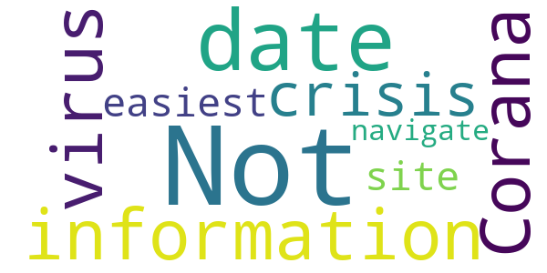

# NHS Ayrshire & Arran
App version ``3.2.1``

Analyzed with [covid-apps-observer](http://github.com/covid-apps-observer) project, version ``0.1``

## App overview
| | |
|-------------------------|-------------------------| 
| **Name**                                          | NHS Ayrshire & Arran |
| **Unique identifier** | uk.nhs.ayrshirearran |
| **Link to Google Play** | [https://play.google.com/store/apps/details?id=uk.nhs.ayrshirearran](https://play.google.com/store/apps/details?id=uk.nhs.ayrshirearran) |
| **Summary**  | Regional information about healthcare services in Scotland |
| **Privacy policy** | [https://www.piota.co.uk/privacy-cookies-policy-piota-app/](https://www.piota.co.uk/privacy-cookies-policy-piota-app/) |
| **Latest version** | 3.2.1 |
| **Last update** | 2021-02-03 17:17:26 |
| **Recent changes** | Grouped or stacked notifications are now supported. PDF attachment support is improved. Images in articles are displayed more effectively. You can press return in a text field to start a new line. We fixed an issue where alerts could display as unread, despite having been read. We also fixed an issue where logos used in the app home page might not refresh automatically. Lastly we improved support for special characters such as emoji’s in content and Unicode characters in notifications. |
| **Installs**  | 1,000+ |
| **Category** | Medical |
| **First release** | Apr 6, 2020 |
| **Size**  | 63M |
| **Supported Android version**  | 6.0 and up |

### Description
> The NHS Ayrshire & Arran app consists of information about healthcare services maintained by the NHS Ayrshire & Arran regional NHS Board in Scotland. The app is published by NHS Ayrshire & Arran regional NHS Board.
 Each provided service contains a rich mix of authoritative information about your condition, lifestyle pointers, local and national resources you can access, contacts information, clinic schedules and emergency information should you get into trouble. Browse these whenever you need.
 In addition each service can, if you allow it, message you via targeted push notifications, saving time and cost for the NHS and delivering a better more relevant service to you.
 Simply type your healthcare service name into the search box, open the app and select the push notifications relevant for you in the Settings section.
 You can select, interact and receive notifications from more than one of our services in our app.

### User interface
The developers of the app provide the following screenshots in the Google play store.
| | | |
|:-------------------------:|:-------------------------:|:-------------------------:|
 |   |  

## Development team
In the following we report the main information provided by the development team in the Google play store.

| | |
|-------------------------|-------------------------|
| **Developer**  | NHS Ayrshire & Arran |
| **Website**  | [https://www.nhsaaa.net/](https://www.nhsaaa.net/) |
| **Email** | support@piota.co.uk |
| **Physical address**  | - |
| **Other developed apps**  | [https://play.google.com/store/apps/developer?id=NHS+Ayrshire+%26+Arran](https://play.google.com/store/apps/developer?id=NHS+Ayrshire+%26+Arran) |

## Android support

| | |
|-------------------------|-------------------------|
| **Declared target Android version**  | Android10, version 10 (API level 29) |
| **Effective target Android version**  | Android10, version 10 (API level 29) |
| **Minimum supported Android version**  | Marshmallow, version 6.0 (API level 23) |
| **Maximum target Android version**  | - |

The larger the difference between the minimum and maximum supported Android versions, the better. A larger difference means a wider audience. For example, old phones have a very low Android version, so a high minimum supported Android version means that the app cannot be used by users with old phones, thus leading to accessibility problems. 

## Requested permissions

In the following we report the complete list of the permissions requested by the app. 

| **Permission** | **Protection level** | **Description** | 
|-------------------------|-------------------------|-------------------------|
 **android.permission ACCESS_NETWORK_STATE** | Normal | Allows applications to access information about networks. 
 **android.permission INTERNET** | Normal | Allows applications to open network sockets. 
 **android.permission WAKE_LOCK** | Normal | Allows using PowerManager WakeLocks to keep processor from sleeping or screen from dimming. 
 **com.google.android.c2dm.permission RECEIVE** | - | - 
 **com.google.android.finsky.permission BIND_GET_INSTALL_REFERRER_SERVICE** | - | - 

## Mentioned servers

| **Server** | **Registrant** | **Registrant country** | **Creation date** | 
|-------------------------|-------------------------|-------------------------|-------------------------|
 | googlesyndication.com | Google LLC | :us: US | 2003-01-21 06:17:24 |
 | google.com | Google LLC | :us: US | 1997-09-15 04:00:00 |
 | app-measurement.com | Google LLC | :us: US | 2015-06-19 20:13:31 |
 | googleadservices.com | Google LLC | :us: US | 2003-06-19 16:34:53 |

## Security analysis 

Below we report the main security warnings raised by our execution of the [Androwarn](https://github.com/maaaaz/androwarn) security analysis tool.

**Connection interfaces exfiltration**
> - This application reads details about the currently active data network 

**Pim data leakage**
> - This application accesses data stored in the clipboard 

**Code execution**
> - This application loads a native library: 'flutter' 

## User ratings and reviews

Below we provide information about how end users are reacting to the app in terms of ratings and reviews in the Google Play store.

### Ratings

The NHS Ayrshire & Arran app has been installed by more than **1000** times. At this time, **-** rated the app and its average score is **0.0**. Below we show the distribution of the ratings across the usual star-based rating of Google Play

:star::star::star::star::star:: 0

:star::star::star::star:: 0

:star::star::star:: 0

:star::star:: 0

:star:: 0

### Reviews 

#### 5-star reviews

> Love it  :date: __2021-01-05 00:10:17__

#### 4-star reviews

No recent reviews available with 4 stars.

#### 3-star reviews

No recent reviews available with 3 stars.

#### 2-star reviews

> Not very up to date with information during the Corana virus crisis. Not the easiest site to navigate  :date: __2020-09-17 17:41:27__

#### 1-star reviews

No recent reviews available with 1 stars.
