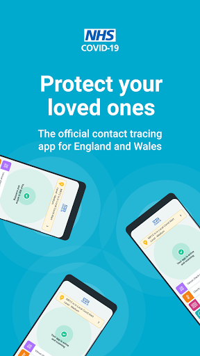
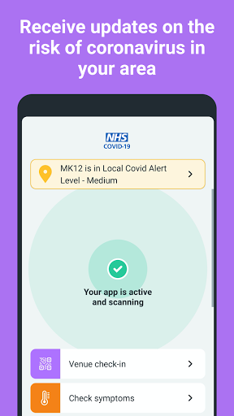
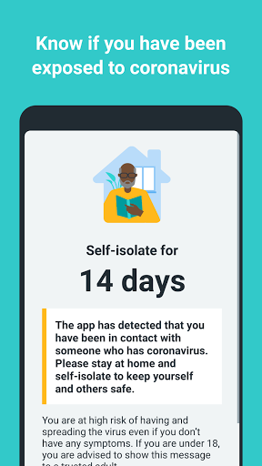
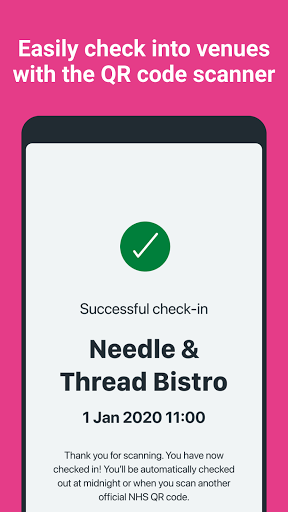
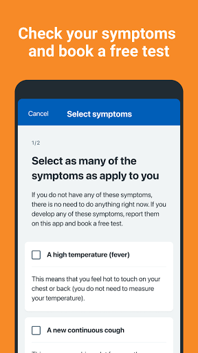
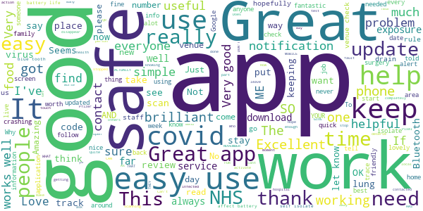
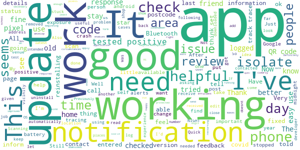
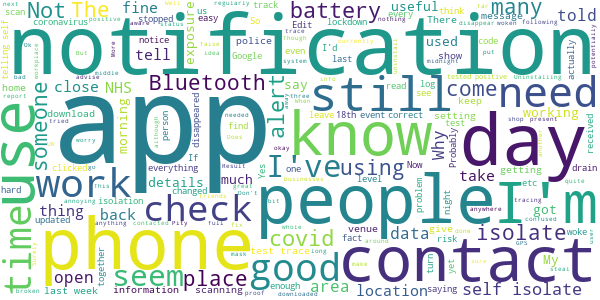
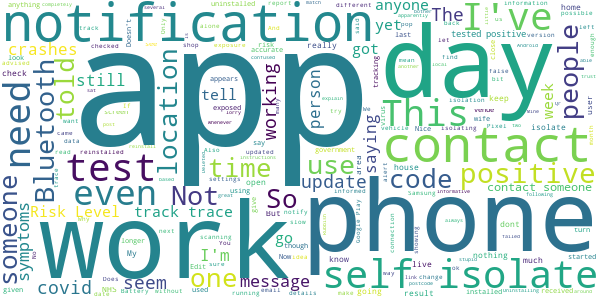
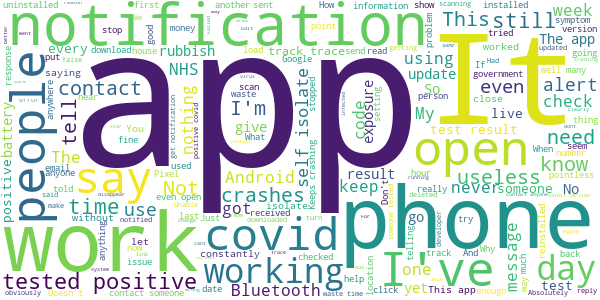

# NHS COVID-19
App version ``3.10 (100)``

Analyzed with [covid-apps-observer](http://github.com/covid-apps-observer) project, version ``0.1``

## App overview
| | |
|-------------------------|-------------------------| 
| **Name**&nbsp;&nbsp;&nbsp;&nbsp;&nbsp;&nbsp;&nbsp;&nbsp;&nbsp;&nbsp;&nbsp;&nbsp;&nbsp;&nbsp;&nbsp;&nbsp;&nbsp;&nbsp;&nbsp;&nbsp;&nbsp;&nbsp;&nbsp;&nbsp;&nbsp;&nbsp;&nbsp;&nbsp;&nbsp;&nbsp;&nbsp;&nbsp;&nbsp;&nbsp;&nbsp;&nbsp;&nbsp;&nbsp;&nbsp;&nbsp;  | NHS COVID-19 |
| **Unique identifier** | uk.nhs.covid19.production |
| **Link to Google Play** | [https://play.google.com/store/apps/details?id=uk.nhs.covid19.production](https://play.google.com/store/apps/details?id=uk.nhs.covid19.production) |
| **Summary**  | Protect your loved ones with the NHS contact tracing app for England and Wales. |
| **Privacy policy** | [https://covid19.nhs.uk/our-policies.html](https://covid19.nhs.uk/our-policies.html) |
| **Latest version** | 3.10 (100) |
| **Last update** | 2020-11-05 22:05:26 |
| **Recent changes** | App can be used across UK borders in England, Wales, Scotland, Northern Ireland, Jersey and Gibraltar, detecting all relevant contact tracing app users (regardless of them using different official apps), alerting them if they have been in contact with coronavirus. Alerts users to new versions of the app when available to ensure access to the latest features, guidance, new tier information and advice. Feature enhancements when ordering a test. Overall UI, language and accessibility optimisations. |
| **Installs**  | 5,000,000+ |
| **Category** | Medical |
| **First release** | Aug 12, 2020 |
| **Size**  | 8.0M |
| **Supported Android version**  | 6.0 and up |

### Description
> The new NHS COVID-19 app is the Official NHS contact tracing app for England and Wales. 
 It is the fastest way of knowing when you’re at risk from Coronavirus. The quicker you know, the quicker you can alert your loved ones, and your community. 
 The more of us that use it, the better we can control coronavirus. 
 The app runs on proven software developed by Apple and Google, designed so that nobody will know who or where you are. And you can delete your data, or the app, at any time.
 It has a number of features: 
 - Trace: Find out when you’ve been near other app users who have tested positive for coronavirus
 - Alert: Lets you know the level of coronavirus risk in your postcode district. 
 - Check-in: Get alerted if you have visited a venue where you may have come into contact with coronavirus, using a simple QR code scanner. No more form filling. 
 - Symptoms: Check if you have coronavirus symptoms and see if you need to order a test. 
 - Test: Helps you order a test if you need to.
 - Isolate: Keep track of your self-isolation countdown and access relevant advice.
 Available in English, Arabic (Modern Standard), Bengali, Chinese (Simplified), Gujarati, Polish, Punjabi (Gurmukhi script), Romanian, Somali, Turkish, Urdu and Welsh.
 The app has been built in collaboration with some of the most innovative organisations in the world. We have worked with medical experts, privacy groups, at-risk communities and we’ve shared knowledge with the teams working on similar apps in many countries.
 Protect your loved ones. Please download the app. 
 The App is CE marked as a class I medical device in the United Kingdom and developed in compliance with European Commission Directive 93/42/EEC for class I devices.

### User interface
The developers of the app provide the following screenshots in the Google play store.
| | | |
|:-------------------------:|:-------------------------:|:-------------------------:|
 |   |   |   | 
 |   |  

## Development team
In the following we report the main information provided by the development team in the Google play store.

| | |
|-------------------------|-------------------------|
| **Developer**  | Department of Health and Social Care |
| **Website**  | [https://covid19.nhs.uk/](https://covid19.nhs.uk/) |
| **Email** | NHSCovid-19AppStoreSupport@nhsbsa.nhs.uk |
| **Physical address**  | - |
| **Other developed apps**  | [https://play.google.com/store/apps/developer?id=Department+of+Health+and+Social+Care](https://play.google.com/store/apps/developer?id=Department+of+Health+and+Social+Care) |

## Android support

| | |
|-------------------------|-------------------------|
| **Declared target Android version**  | Android10, version 10 (API level 29) |
| **Effective target Android version**  | Android10, version 10 (API level 29) |
| **Minimum supported Android version**  | Marshmallow, version 6.0 (API level 23) |
| **Maximum target Android version**  | - |

The larger the difference between the minimum and maximum supported Android versions, the better. A larger difference means a wider audience. For example, old phones have a very low Android version, so a high minimum supported Android version means that the app cannot be used by users with old phones, thus leading to accessibility problems. 

## Requested permissions

In the following we report the complete list of the permissions requested by the app. 

| **Permission** | **Protection level** | **Description** | 
|-------------------------|-------------------------|-------------------------|
 **android.permission ACCESS_NETWORK_STATE** | Normal | Allows applications to access information about networks. 
 **android.permission BLUETOOTH** | Normal | Allows applications to connect to paired bluetooth devices. 
 **android.permission CAMERA** | :warning:**Dangerous** | Required to be able to access the camera device. 
 **android.permission FOREGROUND_SERVICE** | Normal | Allows a regular application to use Service.startForeground. 
 **android.permission INTERNET** | Normal | Allows applications to open network sockets. 
 **android.permission RECEIVE_BOOT_COMPLETED** | Normal | Allows an application to receive the Intent.ACTION_BOOT_COMPLETED that is broadcast after the system finishes booting. 
 **android.permission WAKE_LOCK** | Normal | Allows using PowerManager WakeLocks to keep processor from sleeping or screen from dimming. 

## Mentioned servers

| **Server** | **Registrant** | **Registrant country** | **Creation date** | 
|-------------------------|-------------------------|-------------------------|-------------------------|
 | google.com | Google LLC | :us: US | 1997-09-15 04:00:00 |
 | ietf.org | IETF Trust | :us: US | 1995-03-11 05:00:00 |
 | googleapis.com | Google LLC | :us: US | 2005-01-25 17:52:26 |
 | apache.org | The Apache Software Foundation | :us: US | 1995-04-11 04:00:00 |

## Security analysis 

Below we report the main security warnings raised by our execution of the [Androwarn](https://github.com/maaaaz/androwarn) security analysis tool.

**Connection interfaces exfiltration**
> - This application reads details about the currently active data network 
> - This application tries to find out if the currently active data network is metered 

**Suspicious connection establishment**
> - This application opens a Socket and connects it to the remote address ' returned no addresses for  ; port is out of range' on the 'N/A' port  
> - This application opens a Socket and connects it to the remote address '' on the 'N/A' port  
> - This application opens a Socket and connects it to the remote address 'Ljava/lang/StringBuilder;->toString()Ljava/lang/String;' on the 'N/A' port  
> - This application opens a Socket and connects it to the remote address 'Ljava/net/Proxy;->type()Ljava/net/Proxy$Type;' on the 'N/A' port  
> - This application opens a Socket and connects it to the remote address 'timeout' on the 'N/A' port  

**Code execution**
> - This application loads a native library 
> - This application loads a native library: 'Ljava/lang/String;->valueOf(Ljava/lang/Object;)Ljava/lang/String;' 

## User ratings and reviews

Below we provide information about how end users are reacting to the app in terms of ratings and reviews in the Google Play store.

### Ratings

The NHS COVID-19 app has been installed by more than **5000000** times. At this time, **89069** rated the app and its average score is **4.0075464**. Below we show the distribution of the ratings across the usual star-based rating of Google Play

:star::star::star::star::star:: 53168

:star::star::star::star:: 12694

:star::star::star:: 6894

:star::star:: 3341

:star:: 12972

### Reviews 

#### 5-star reviews

> Love getting my updates 💗  :date: __2020-11-16 08:48:30__

> Excellent app just not sure how to activate the notifications part if you've been in contact with anyone who may have got it n not now that . highly. recommend this app to everyone at the moment. To help protect yourself n your loved ones n others excellent app  :date: __2020-11-16 03:15:30__

> The app is OK but it has had its down falls in the past. Hope the track and trace is working OK now) thanks to our Google network working to along side the NHS. Thank you so much to you both. And keep up the good work in keeping family's safe from covid 19)and our health services safe to  :date: __2020-11-16 02:44:48__

> Amazing app love it so much  :date: __2020-11-16 00:17:25__

> Does what it says on the tin.  :date: __2020-11-15 22:51:10__

> Very simple to use and having read many reviews (including those of the Which? Consumer organisation) I have no doubt that my data is entirely anonymous. Will this make a huge difference in fighting covid-19? Who knows but I am sure it will help and therefore I am sure that everyone with a smart phone really ought to be using it. Your fellow citizens deserve it.  :date: __2020-11-15 20:12:22__

> Amazing 👏 🙀  :date: __2020-11-15 14:05:16__

> This app helps you out  :date: __2020-11-15 12:09:06__

> Very handy to see  :date: __2020-11-14 22:57:26__

> Nothing to say which I could print, as none of it would be accepted. Just a pity that various things could not have been done before now. No one's fault, we can all be wise after any event.  :date: __2020-11-14 17:29:25__

#### 4-star reviews

> I've been working on a hospital ward which now has covid cases should I self isolate as I've been in there rooms before they tested positive??  :date: __2020-11-16 08:12:41__

> Helpful  :date: __2020-11-15 22:13:51__

> Good app  :date: __2020-11-15 11:42:10__

> A peace of mind good reminder  :date: __2020-11-14 12:58:24__

> Need improving you can't stay logged in location if you receive a phone call it automatically log you out.  :date: __2020-11-14 10:26:26__

> Thanks it was helpful  :date: __2020-11-14 09:35:16__

> Having to put Bluetooth on my phone all time, it kills the battery so u can't use it all time otherwise its a very helpful and let's u know when to isolate, like my neighbor..  :date: __2020-11-14 08:06:21__

> I have downloaded this but not been contacted so far. I think it's a bad idea to call people from 0345 numbers. Many of us deliberately avoid such calls as they may be cold callers.  :date: __2020-11-13 17:24:55__

> Overall, does it's job. I have moved to a new area and I can't figure out how to update my address as it's stuck on my old one.  :date: __2020-11-13 13:32:37__

> It looks like it's working, I've not had any notifications about isolating. The only downside is it doesn't have a check out so if you scan a qr code it leaves you logged in to that area until you either scan another qr code or until midnight. You might only be popping the shop for a pint of milk at 8am before going home for the day so your logged in as at the shop for 16 hours. I'd like to be able to check out even if I have to enter details manually.  :date: __2020-11-13 03:09:35__

#### 3-star reviews

> Kept telling me to put Bluetooth on, it was and still wouldn't work  :date: __2020-11-16 06:43:56__

> Why is it for people aged more than 16 Those under 16 are free-coronavirus ?!  :date: __2020-11-15 20:05:03__

> Ok the app  :date: __2020-11-15 15:01:54__

> I've had a notification to self isolate for 8 days this morning, but it didn't tell me where it was that I had been in contact with which is a bit crazy, because I have no idea who I was with at the time in order to notify them about it. Why doesn't it tell you where it was that you may have been in contact, surely its not that hard to do.......  :date: __2020-11-15 11:06:06__

> Don't think the close control exposure works when you're close to someone with covid19 as we have a positive result back from our house hold and my phone hasn't picked it up yet  :date: __2020-11-15 09:32:11__

> Edit: Absolutely slaughters your battery. I thought my phone was broken, down to 67% charge from 100% by 9am. Uninstalled and the next day my battery was still at 47% by 10pm! The sort of person who is selfish enough not to self isolate when needed to isn't likely to of bothered with downloading and using this app. Quite then why you've revealed that you'll share info with the police is beyond me. All you've done is hurt the success of the app and give the tin foil hat wearers an energy boost.  :date: __2020-11-15 07:42:42__

> Has not done for me since installation  :date: __2020-11-14 19:44:36__

> still confused cos I'm deaf ...  :date: __2020-11-14 09:34:44__

> Not a problem but still waiting for the virus notice to come up so I can only give it 3*  :date: __2020-11-13 22:36:50__

> Helpfull quicker than signing in.  :date: __2020-11-13 14:21:21__

#### 2-star reviews

> This is so unclear to use  :date: __2020-11-16 10:54:35__

> Worked fine for a bit, but now crashes whenever I try to open it. Uninstalling and reinstalling has no effect. EDIT: So instead of improving the app to prevent crashes, I'm advised to update iOS to 14.2. On the Google Play store.  :date: __2020-11-16 09:38:32__

> I live with someone who tested positive for coronavirus but the app didn't notify me. I received an email from test and trace to tell me to isolate.  :date: __2020-11-16 01:40:43__

> I have been self isolate by test and trace for 10 days and if I get again exposed will be losing my job no thank you I have unstalled the app.  :date: __2020-11-15 23:50:57__

> Only wish there was a section to notify that my neighbours are having parties  :date: __2020-11-14 16:20:47__

> This app now keeps crashing (and my Pixel came up with a warning message saying it's constantly crashing). Can't currently even open the app. When it did previously work it was reasonable but the notifications are terrible. Please add a notification history section because it sends notifications and then you tap on them and see nothing but the normal screen in the app. It would be useful to be able to check Covid rates in other parts of the country, not just the area you've set as your home.  :date: __2020-11-14 10:36:16__

> The app on my Samsung S10 + has failed to update that I should self isolate after a household member has been tested positive?  :date: __2020-11-13 18:04:08__

> I can't really give it more. I have checked in all the places I go and then I get a little shield pop up on top of my screen but then it doesn't show me anything. Does this mean I've been safe all these months and trust it will pop up with full information of where I was if I did go near a stranger who has symptoms ? Also does this only work if the person/persons fills out the form properly because surely the app isn't that smart to predict who has the virus or at least showing symptoms ?  :date: __2020-11-13 16:12:54__

> I've not had any problems with the app technically. But going by how badly Test and Trace is going, there doesn't seem much point having the app. I do use it though, and I hope it will keep getting better. Edit: Thank you for your response. Although I don't find the app 'useful', it's something else to worry about. Its more that I just use it.  :date: __2020-11-13 16:02:54__

> Garbage, i travel the length of the uk working at service stations, staying in hotels, eating at restaurants and have been in contact with thousands of people in 7/8 months, and it has only notified me when i was at home one day saying someone nearby has symptoms, not being funny but that only appeared after my wife had a test (it was negative)  :date: __2020-11-13 11:34:04__

#### 1-star reviews

> Stopped working about 2 weeks ago...have tried uninstalling and reinstalling but still doesn't work. Crashes when trying to open the app.  :date: __2020-11-16 10:56:16__

> Went to check the app and had to agree to T&C's again..then told there was 3 days left of my isolation. So missed 7 days. My girlfriands app won't even open. Utterly useless.  :date: __2020-11-16 10:14:51__

> app wont open. everytime i click on it nothing happens  :date: __2020-11-16 08:12:37__

> Utterly pointless I don't know anyone who is using this app. Every place I've ever gone to noone use using the app. So if it's only being used by a small small minority it makes it utterly pointless.  :date: __2020-11-16 06:12:18__

> Wouldn't use, doesn't work in all cases and can give false positives causing people to potentially be isolated against their will. Avoid!  :date: __2020-11-16 02:16:14__

> It doesnt work. A family member in my house has tested positive. My husbands phone picked it up, my phone hasn't.Doesnt give me much confidence in the app.  :date: __2020-11-16 01:51:16__

> It's a shame for kids because it's only for 16 year olds  :date: __2020-11-16 00:45:45__

> App on my Samsung note 10+ and girlfriends Samsung S9 stopped checking for exposure on the 28th October (both same date) only checked this as have been in contact with a covid positive person. Reinstalled app and its checking again. Im assuming id of got a notification which is now gone.  :date: __2020-11-16 00:23:12__

> I think that I get indications of notifications, a number appears on the app icon, then it disappears. How do I read these notifications? If I can't I might as well uninstall the app!  :date: __2020-11-16 00:12:04__

> App won't load  :date: __2020-11-15 23:57:03__

