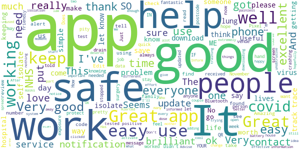

# NHS COVID-19
App version ``3.10 (100)``

Analyzed with [covid-apps-observer](http://github.com/covid-apps-observer) project, version ``0.1``

## App overview
| | |
|-------------------------|-------------------------| 
| **Name**                                          | NHS COVID-19 |
| **Unique identifier** | uk.nhs.covid19.production |
| **Link to Google Play** | [https://play.google.com/store/apps/details?id=uk.nhs.covid19.production](https://play.google.com/store/apps/details?id=uk.nhs.covid19.production) |
| **Summary**  | Protect your loved ones with the NHS contact tracing app for England and Wales. |
| **Privacy policy** | [https://covid19.nhs.uk/our-policies.html](https://covid19.nhs.uk/our-policies.html) |
| **Latest version** | 3.10 (100) |
| **Last update** | 2020-11-05 22:05:26 |
| **Recent changes** | App can be used across UK borders in England, Wales, Scotland, Northern Ireland, Jersey and Gibraltar, detecting all relevant contact tracing app users (regardless of them using different official apps), alerting them if they have been in contact with coronavirus. Alerts users to new versions of the app when available to ensure access to the latest features, guidance, new tier information and advice. Feature enhancements when ordering a test. Overall UI, language and accessibility optimisations. |
| **Installs**  | 5,000,000+ |
| **Category** | Medical |
| **First release** | Aug 12, 2020 |
| **Size**  | 8.0M |
| **Supported Android version**  | 6.0 and up |

### Description
> The new NHS COVID-19 app is the Official NHS contact tracing app for England and Wales. 
 It is the fastest way of knowing when you’re at risk from Coronavirus. The quicker you know, the quicker you can alert your loved ones, and your community. 
 The more of us that use it, the better we can control coronavirus. 
 The app runs on proven software developed by Apple and Google, designed so that nobody will know who or where you are. And you can delete your data, or the app, at any time.
 It has a number of features: 
 - Trace: Find out when you’ve been near other app users who have tested positive for coronavirus
 - Alert: Lets you know the level of coronavirus risk in your postcode district. 
 - Check-in: Get alerted if you have visited a venue where you may have come into contact with coronavirus, using a simple QR code scanner. No more form filling. 
 - Symptoms: Check if you have coronavirus symptoms and see if you need to order a test. 
 - Test: Helps you order a test if you need to.
 - Isolate: Keep track of your self-isolation countdown and access relevant advice.
 Available in English, Arabic (Modern Standard), Bengali, Chinese (Simplified), Gujarati, Polish, Punjabi (Gurmukhi script), Romanian, Somali, Turkish, Urdu and Welsh.
 The app has been built in collaboration with some of the most innovative organisations in the world. We have worked with medical experts, privacy groups, at-risk communities and we’ve shared knowledge with the teams working on similar apps in many countries.
 Protect your loved ones. Please download the app. 
 The App is CE marked as a class I medical device in the United Kingdom and developed in compliance with European Commission Directive 93/42/EEC for class I devices.

### User interface
The developers of the app provide the following screenshots in the Google play store.
| | | |
|:-------------------------:|:-------------------------:|:-------------------------:|
 |   |   |   | 
 |   |  

## Development team
In the following we report the main information provided by the development team in the Google play store.

| | |
|-------------------------|-------------------------|
| **Developer**  | Department of Health and Social Care |
| **Website**  | [https://covid19.nhs.uk/](https://covid19.nhs.uk/) |
| **Email** | NHSCovid-19AppStoreSupport@nhsbsa.nhs.uk |
| **Physical address**  | - |
| **Other developed apps**  | [https://play.google.com/store/apps/developer?id=Department+of+Health+and+Social+Care](https://play.google.com/store/apps/developer?id=Department+of+Health+and+Social+Care) |

## Android support

| | |
|-------------------------|-------------------------|
| **Declared target Android version**  | Android10, version 10 (API level 29) |
| **Effective target Android version**  | Android10, version 10 (API level 29) |
| **Minimum supported Android version**  | Marshmallow, version 6.0 (API level 23) |
| **Maximum target Android version**  | - |

The larger the difference between the minimum and maximum supported Android versions, the better. A larger difference means a wider audience. For example, old phones have a very low Android version, so a high minimum supported Android version means that the app cannot be used by users with old phones, thus leading to accessibility problems. 

## Requested permissions

In the following we report the complete list of the permissions requested by the app. 

| **Permission** | **Protection level** | **Description** | 
|-------------------------|-------------------------|-------------------------|
 **android.permission ACCESS_NETWORK_STATE** | Normal | Allows applications to access information about networks. 
 **android.permission BLUETOOTH** | Normal | Allows applications to connect to paired bluetooth devices. 
 **android.permission CAMERA** | :warning:**Dangerous** | Required to be able to access the camera device. 
 **android.permission FOREGROUND_SERVICE** | Normal | Allows a regular application to use Service.startForeground. 
 **android.permission INTERNET** | Normal | Allows applications to open network sockets. 
 **android.permission RECEIVE_BOOT_COMPLETED** | Normal | Allows an application to receive the Intent.ACTION_BOOT_COMPLETED that is broadcast after the system finishes booting. 
 **android.permission WAKE_LOCK** | Normal | Allows using PowerManager WakeLocks to keep processor from sleeping or screen from dimming. 

## Mentioned servers

| **Server** | **Registrant** | **Registrant country** | **Creation date** | 
|-------------------------|-------------------------|-------------------------|-------------------------|
 | google.com | Google LLC | :us: US | 1997-09-15 04:00:00 |
 | ietf.org | IETF Trust | :us: US | 1995-03-11 05:00:00 |
 | googleapis.com | Google LLC | :us: US | 2005-01-25 17:52:26 |
 | apache.org | The Apache Software Foundation | :us: US | 1995-04-11 04:00:00 |

## Security analysis 

Below we report the main security warnings raised by our execution of the [Androwarn](https://github.com/maaaaz/androwarn) security analysis tool.

**Connection interfaces exfiltration**
> - This application reads details about the currently active data network 
> - This application tries to find out if the currently active data network is metered 

**Suspicious connection establishment**
> - This application opens a Socket and connects it to the remote address ' returned no addresses for  ; port is out of range' on the 'N/A' port  
> - This application opens a Socket and connects it to the remote address '' on the 'N/A' port  
> - This application opens a Socket and connects it to the remote address 'Ljava/lang/StringBuilder;->toString()Ljava/lang/String;' on the 'N/A' port  
> - This application opens a Socket and connects it to the remote address 'Ljava/net/Proxy;->type()Ljava/net/Proxy$Type;' on the 'N/A' port  
> - This application opens a Socket and connects it to the remote address 'timeout' on the 'N/A' port  

**Code execution**
> - This application loads a native library 
> - This application loads a native library: 'Ljava/lang/String;->valueOf(Ljava/lang/Object;)Ljava/lang/String;' 

## User ratings and reviews

Below we provide information about how end users are reacting to the app in terms of ratings and reviews in the Google Play store.

### Ratings

The NHS COVID-19 app has been installed by more than **5000000** times. At this time, **89069** rated the app and its average score is **4.0075464**. Below we show the distribution of the ratings across the usual star-based rating of Google Play

:star::star::star::star::star:: 53168

:star::star::star::star:: 12694

:star::star::star:: 6894

:star::star:: 3341

:star:: 12972

### Reviews 

#### 5-star reviews

> This was very useful sometins didnt really help  :date: __2020-11-23 09:24:18__

> Worksreakky well  :date: __2020-11-22 19:13:42__

> Easy and accurate  :date: __2020-11-22 17:05:55__

> app working well  :date: __2020-11-22 14:19:45__

> Alerted me to self isolate also How do you obtain a reference number to confirm the message was genuine. I wasn't able to claim the 500 pound support payment because the message came through the app.  :date: __2020-11-22 10:15:02__

> Very good  :date: __2020-11-21 21:08:04__

> We are all in this together. And it's extremely important for everyone in the UK, and worldwide too. And I will do all I can to help 😇  :date: __2020-11-21 20:47:19__

> really helpfull  :date: __2020-11-21 13:10:03__

> C x  :date: __2020-11-21 10:12:18__

> Very good service  :date: __2020-11-21 07:32:51__

#### 4-star reviews

> Won't take picture of QR code so app not working. Now working.  :date: __2020-11-22 21:27:08__

> It's cool  :date: __2020-11-22 08:01:31__

> Very good  :date: __2020-11-21 15:35:35__

> I've had no issues other than when I had covid, track n trace called 3 or 4 times a day, each person I had been in contact with meant they created numerous 'accounts' for me and so they were forever trying to update all the accounts, they need to find a way to just have one cos it's not ideal ...but better they ring 10 times than not at all I guess  :date: __2020-11-21 11:46:06__

> Check in works well but rumours are that it remains checked-in until you check-in somewhere else or at midnight you're automatically checked out. Is this true?  :date: __2020-11-21 09:21:17__

> Was hoping that this app would be useful (I've not given up and hope that I receive a response to this review). I have installed the app, entered my details, confirmed my email address and entered the code following that. I then come to the page asking me to accept the conditions of use but the page (apart from the heading) is blank and I cannot get any further than that. I tried going back to the previous page but the app closed. I successfully logged in to the app again but stuck same spot.  :date: __2020-11-21 03:00:20__

> So far so good. Husband had report when his best friend tested positive (although friend told us) very quickly and we isolated for his 14 day countdown clock. Unfortunately, the other friend who was with them all evening was never contacted but we would all inform each other in our village. This would have been a big error in an Urban area. So more needs to be done on this app.  :date: __2020-11-20 23:54:32__

> It would be nice to be able to change the postcode. I've recently returned to the UK and entered the postcode of where I was staying for quarantine, but now I am unable to edit the postcode to reflect where I am currently living, which is a bit annoying. Particularly if we move back to the tiered system.  :date: __2020-11-20 20:03:04__

> Doing an excellent job keep it up and stay safe everyone  :date: __2020-11-20 11:50:45__

> Classy  :date: __2020-11-20 09:28:00__

#### 3-star reviews

> Was working fine initially but the last week its stopped scanning when I'm out. Yes I have all the correct settings on.. Contact tracing, location, data etc. There's no logs of phone /key communication at all whilst being out.  :date: __2020-11-22 04:42:59__

> I've had a few of the false 'possible covid exposure' notices and a self-isolation alert for an anonymous user but now that a work colleague has actually tested positive for coronavirus, the app isn't telling me to self-isolate. We lunch outside together every day so I know we've been less than 2m away for more than 15 mins many, many times in the last 14 days. Both of us had the apps on, so why no notification?  :date: __2020-11-21 18:45:04__

> So I've just literally downloaded this about 20 minutes ago and it's still activating . It takes so long  :date: __2020-11-19 20:36:31__

> Changed phones. Now won't re- download. I have had the wheel of death for three days saying "PENDING ".Tried deleting and reinstalling. Nothing.  :date: __2020-11-19 16:29:31__

> Didn't get to use the app for being under 16. Feel like it would be good for young people to have access to the app as well because of children typically bring asymptomatic carriers of COVID  :date: __2020-11-19 14:52:06__

> Seems to want to track me while at home, I don't leave my GPS and Bluetooth on 247 which makes the app kind of flawed.  :date: __2020-11-19 14:42:28__

> Now seems to work, after quite a bit of messing about clearing various caches  :date: __2020-11-18 22:27:12__

> When traveling to different areas the app dosent update the area alert level  :date: __2020-11-18 17:58:15__

> Woke up to an exposure notification that disappeared when I clicked on it to yo open the app. Useless, get it together! Wow, yes, the thing uses Google and apple notifications to let us know! Great, now how is that useful information? Are the notifications true? Ridiculous  :date: __2020-11-18 16:30:19__

> Not bad but every time i turn my Bluetooth on it turns on my hifi to which can be very annoying it has to sorted  :date: __2020-11-17 12:23:44__

#### 2-star reviews

> Easy enough to use, but notifications are awful - "You were with someone with covid but you are fine and we will not tell you anything else" would be a more accurate notification. Could be VERY scary for someone in a high risk group. About the standard of TalkTalk internet. Dido Harding should resign. Edit: Used a custom home screen to change the app icon to the "not helth" meme. A much more accurate icon!  :date: __2020-11-22 15:44:46__

> See  :date: __2020-11-22 14:53:53__

> In glad ut has started to work however on my Samsung device I'm experiencing "fake exposure notifications on my phone" and when I go on the app nothing appears its quite annoying not gonna lie. This needs to be fixed ASAP  :date: __2020-11-22 11:56:24__

> Often crashes on Pixel 3, won't stay running, so basically not fit for purpose for me.  :date: __2020-11-22 10:26:45__

> App doesn't seem to allow update. Stuck on the September version, even though a November update is apparently available. Won't accept reference provided by the test center and won't allow skipping of the question. So app is stuck in 'self isolate' state even though government email confirmed I have the 'all clear'. Seems a waste of taxpayer money that this app is still so poor.  :date: __2020-11-21 17:02:12__

> I'm not sure how long the app takes to notify you if you have come into contact with a covid positive person. I did this morning, they have the app that states they are positive. I've had no notification yet. 🤨  :date: __2020-11-20 18:28:24__

> Told me to self isolate for 14 days.. I live on my own in a 1 bed flat and have not left the house. Perhaps I got infected through the walls... Doesn't make sense to me! Turn the tracking off when your at home or driving  :date: __2020-11-20 14:08:42__

> Asks for your postcode and then reports the risk level based on your local authority. Postcodes are a fairly arbitrary geo-tagging mechanism used by the post office and have little connection to most authorities. Mine is not even in the right county! So far from being informative, it's misleading. It appears that the isolation instructions given in the app are DIFFERENT to those given by the NHS. Sadly, this is just one of several contradictions in advice and instructions given.  :date: __2020-11-20 10:12:58__

> Would be worth seeing a map based on ones location and those who are using the app around me  :date: __2020-11-19 20:49:58__

> They told us it didn't require location tracking, but it does. And the implementation in general has been a shambles. EDIT - The Department of Health and Social Care say below that the app doesn't access our location. And I completely understand why it doesn't need to to do its job (that's why I installed it). But as someone who never has location tracking enabled on my phone, the app very clearly tells me that it can't work unless I turn location tracking on. Try it yourself. Why is this?  :date: __2020-11-19 18:09:09__

#### 1-star reviews

> Doesn't work properly... stops working without you realising so if you don't go on the app it stops scanning... mine wasn't scanning for 2 weeks without me realising!!!! Also when it does work it sends out 'possible exposure' notifications and then gives no more information causing a great deal of worry.  :date: __2020-11-23 10:05:30__

> My son came back positive, now the codes we were sent do not work in the app!!  :date: __2020-11-23 09:35:27__

> I live with another app user, we put her positive covid result in her app 2 nights ago, I've checked the app is running, checked our Bluetooth is working, but about 36 hours later I've still not had any notification to self isolate... Doesn't seem to work.  :date: __2020-11-23 09:34:30__

> Ran battery down  :date: __2020-11-23 08:07:40__

> This app takes up data. Seldom works perfectly and it corrupts your phone  :date: __2020-11-23 06:42:31__

> My wife tested positive for Covid this morning and we're currently in the same room so surely the app should be notifying me??  :date: __2020-11-23 00:01:23__

> Just what is the point if this app.? It doesn't track me anywhere apart from in my house. So bad my daughter who is a nurse and unfortunately caught Covid at work wasn't contacted and the app didn't ping her partner. Absolutely doesn't do what it says on the tin. Very very 😥 😞 😥  :date: __2020-11-22 23:46:50__

> This app is bs it requires bluetooth but then crashes my phone when try to turn it on this needs sorting.  :date: __2020-11-22 23:43:01__

> Unfortunately disappointing app. Just recently three people in my office were tested positive covid, I had not received any notifications about this.  :date: __2020-11-22 22:13:09__

> Bloody useless  :date: __2020-11-22 21:44:23__

